### 浅谈Keil-MDK创建项目&编译过程---Code-data,RO-data,RW-data,ZI-data

- 一、编译过程
- 二、MDK 编译工具

- (1）创建一个新的工程
- (2）添加 startup（启动文件，由汇编编写）
- (3) 初识工程常见一串错误分析
- (4) 看看编译过程输出显示的信息

- 三、Code-data,RO-data,RW-data,ZI-data 介绍
- 四、最后附带一张图，了解哈工程文件的简单含义

## 一、编译过程

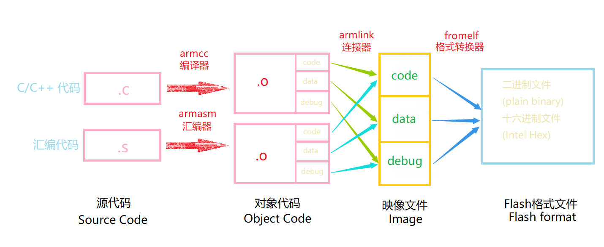

> > (1) 编译，MDK 软件使用的编译器是 armcc 和 armasm，它们根据每个 c/c++和汇编源文件编译成对应的以“.o”为后缀名的对象文件(Object Code，也称目标文件)，其内容主要是从源文件编译得到的机器码，包含了代码、数据以及调试使用的信息
> > (2) 链接，链接器 armlink 把各个.o 文件及库文件链接成一个映像文件“.axf”或“.elf”
> > (3) 格式转换，一般来说 Windows 或 Linux 系统使用链接器直接生成可执行映像文件 elf后，内核根据该文件的信息加载后，就可以运行程序了，但在单片机平台上，需要把该文件的内容加载到芯片上，所以还需要对链接器生成的 elf 映像文件利用格式转换器fromelf 转换成“.bin”或“.hex”文件，交给下载器下载到芯片的 FLASH 或 ROM 中

### (1）创建一个新的工程

> 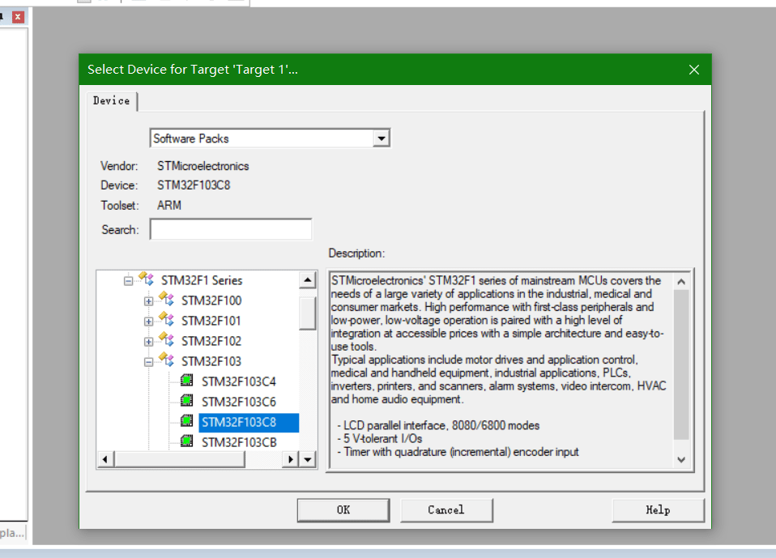

### (2）添加 startup（启动文件，由汇编编写）

> > 启动文件顾名知义，也就是当STM32上电启动后第一个执行的汇编程序
> > 
> > > 启动文件主要功能：
> > > 
> > > > · 初始化堆栈指针 SP =\_initial\_sp
> > > > · 初始化程序计数器指正 PC = Reset_Handler
> > > > · 设置堆、栈的大小
> > > > · 初始化中断向量表
> > > > · 配置外部 SRAM 作为数据存储器（此项有用户根据自己用的开发板的实际情况做配置）
> > > > · 调用 SystemIni() 函数配置 STM32 的系统时钟
> > > > · 调用 C 库函数_main 初始化用户堆栈，从而最终调用 main 函数去到 C 的世界
> > > > 启动文件的具体代码不作详细分析感兴趣可以去查阅相关的资料，还是比较全的
> 
> 由于官方提供的启动文件分了不同 型号，如果你不知道你用的芯片改选择哪一种型号的启动文件，不要慌张，Keil-MDK IDE 提供有这个功能，在你选择完STM32 型号后(当然在这之前你的导入芯片的 package， 比如你可以这样操作:点击去这里瞧瞧)，点击OK，会弹出一个框按下图操作即可，得到启动文件
> 
> > 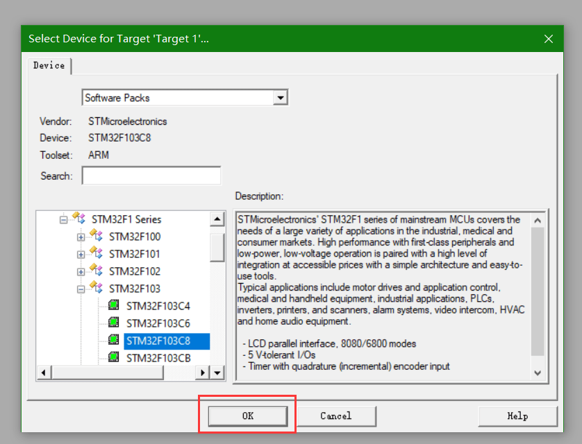
> > 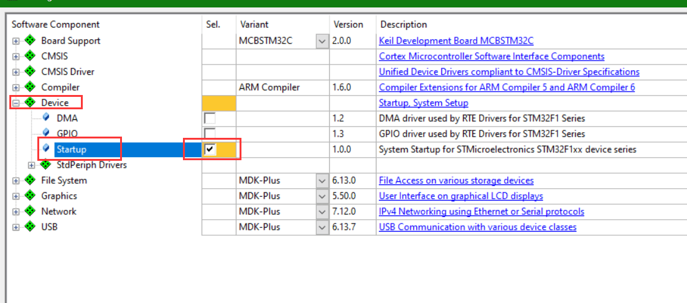
> > **工程建好后为了让工程看起来比较美观，你还可以做如下操作：**
> > 
> > > 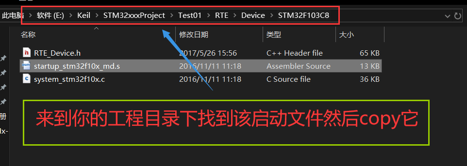
> > > 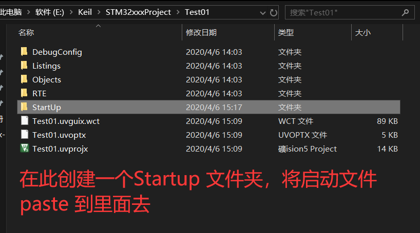
> > > 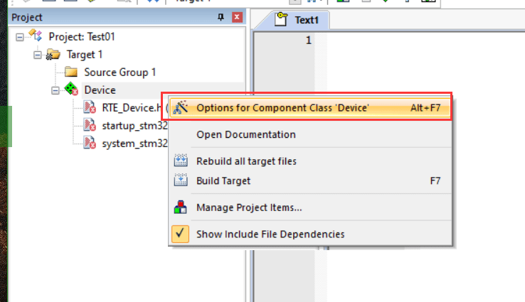
> > > 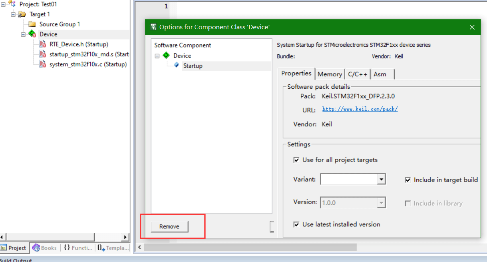
> > > 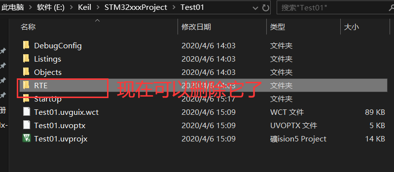
> > > 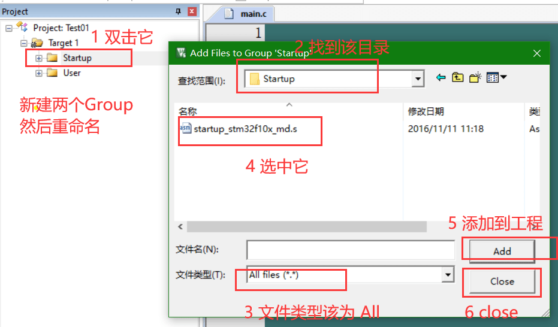
> 
> > 当然就是 keil 5 的操作，如果是 keil 4, 他会弹出来一个 copy 选项，问你是否 copy 启动文件到工程，你选择了，他就会自动给你 copy 进来并创建相应的目录
> 
> > 另外你也可以自己通官方提供的启动文件，自己 copy 到工程目录下然后导入到工程，这得需要你自己来确定用什么类型的启动文件（就不用MDK 来帮你确定使用什么型号的启动文件了）， 那么选型见下表：
> > 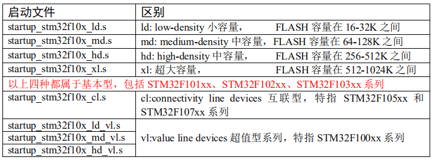
> 
> \*\* 到这儿工程搭建好，现在就差 C 的世界了**
> · 完成 C 世界的创建
> 
> > 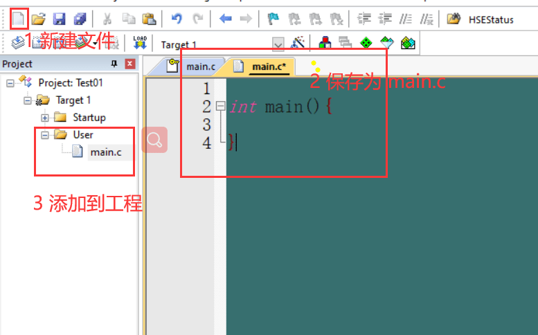
> 
> **一个简单的工程创建就到此完成了**

### (3) 初识工程常见一串错误分析

**既然前面工程已经搭建完美，首先我们来编译一下**

> > 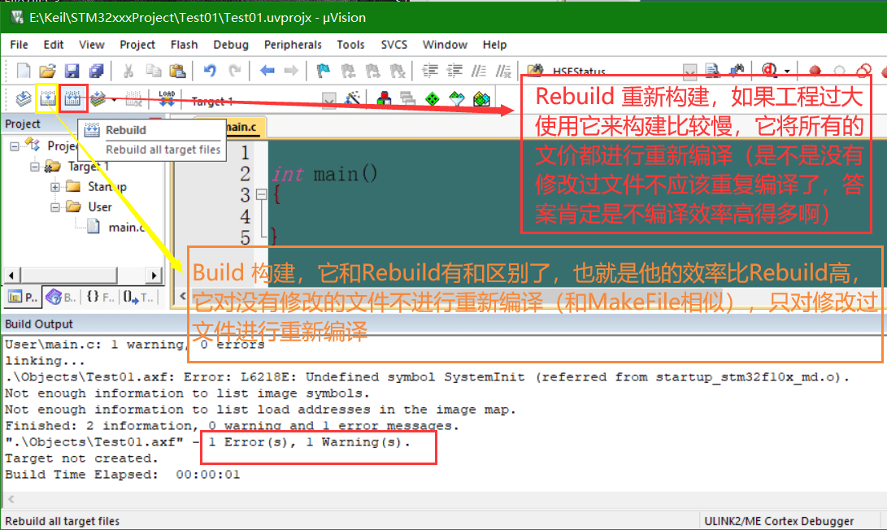

> > 哈，出现了一个 1 Error(s), 1 Warning(s)一个错误一个警告，不慌，我们看看它是什么
> 
> > Error: L6218E: Undefined symbol SystemInit (referred from startup\_stm32f10x\_md.o)
> > 这句话说得是 startup\_stm32f10x\_md.c文件中出现了未定义符号 SystemInit, 我们去看看
> > 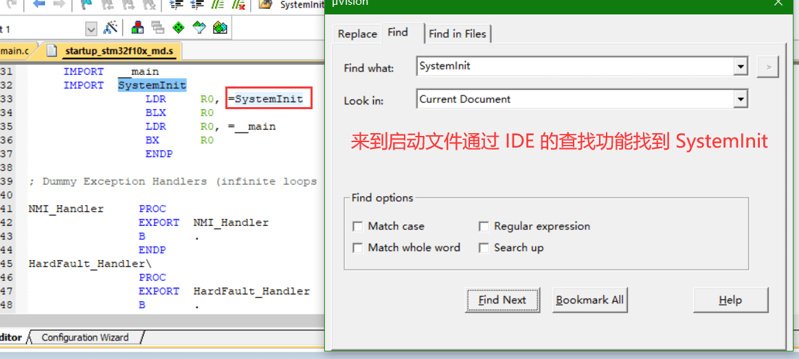
> > 这里IMPORT SystemInit表示SystemInit来时外部文件（IMPORT：表示该标号来自外部文件，跟 C 语言中的 EXTERN 关键字类似）
> > 前面说过 启动文件需要调用 SystemInit 来设置系统时钟，故这里的 SystemInit 函数需要在外部实现，这里不做具体的配置（具体如何配置可以查阅STM32的用户手册进行相应的配置），为了让编译器不报错可以加如下代码：
> > 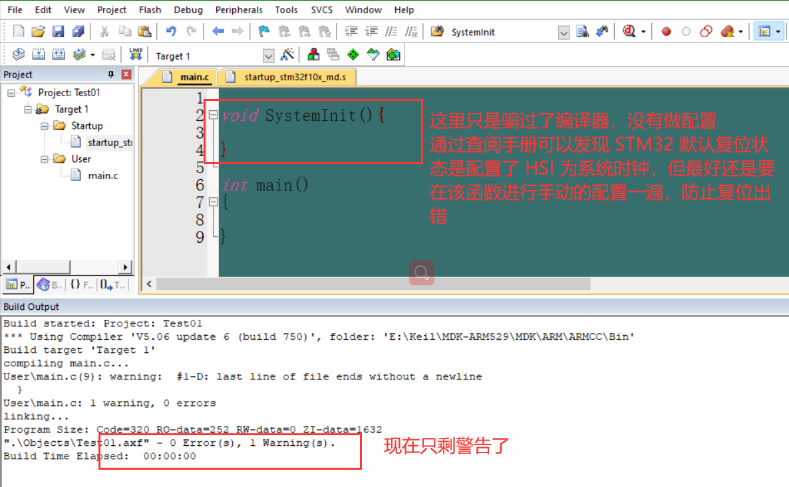

> > **Error 处理完毕，现在分析 Warning**
> > warning: #1-D: last line of file ends without a newline
> > 说文件最后一行没有换行结束，这是为什么了？ 这里是keil 5 这样规定的没有为什么，记住行的文件最后一定要加上空行表示文件结束就可以了
> > 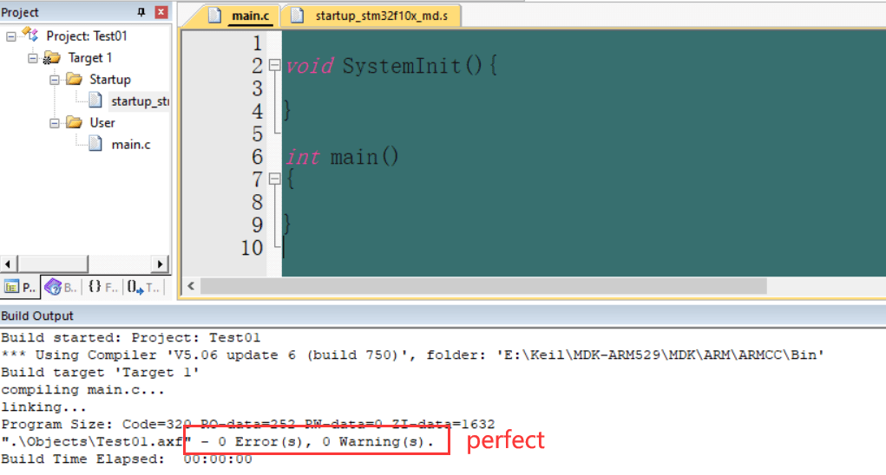
> 
> * * *
> 
> **到此项目错误警告全部解决 OK， 你可以根据自己的工程功能要求写逻辑实现代码了**

### (4) 看看编译过程输出显示的信息

> 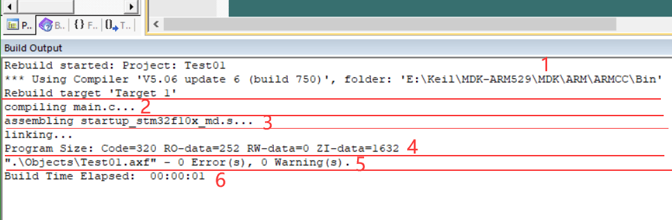
> (1)提示信息的第一部分说明构建过程调用的编译器。图中的编译器名字是“V5.06(build 750)”，后面附带了该编译器所在的文件夹。在电脑上打开该路径，可看到该编译器包括下图中的各个编译工具，如 armar、armasm、armcc、armlink 及 fromelf，后面四个工具已在上面的编译过程已经讲解，而 armar 是用于把.o 文件打包成 lib 文件的。
> 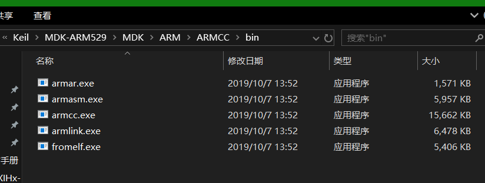
> (2) 使用 armcc 编译 c/c++文件。编译后每个 c/c++源文件都对应有一个独立的.o 文件
> (3) 使用 armasm 编译汇编文件。编译后每个汇编源文件都对应有一个独立的.o 文件
> (4) 使用 armlink 链接对象文件，根据程序的调用把各个.o 文件的内容链接起来，最后生成程序的 axf 映像文件，并附带程序各个域大小的说明，包括 Code、RO-data、RW-data及 ZI-data 的大小。
> (5) 使用 fromelf 生成下载格式文件，它根据 axf 映像文件转化成 hex 文件，并列出编译过程出现的错误(Error)和警告(Warning)数量。
> (6) 最后一段提示给出了整个构建过程消耗的时间
> 
> * * *
> 
> **当然了最后工程目录下Listings、OBjects下可以找到生成的各种文件：
> 每个 C 源文件都对应生成了.o、.d 及.crf 后缀的文件，还有一些额外的.dep、.hex、.axf、.htm、
> .lnp、.sct、.lst 及.map 文件**
> 每个文件的详细信息就不做解释了，感兴趣查阅哈资料即可
> 
> > 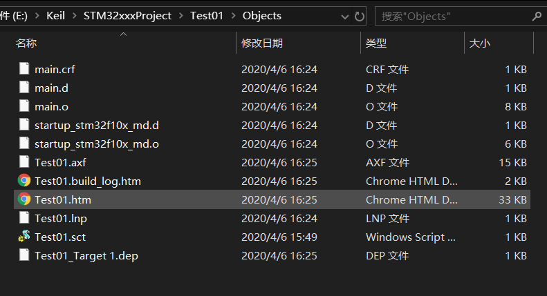
> > 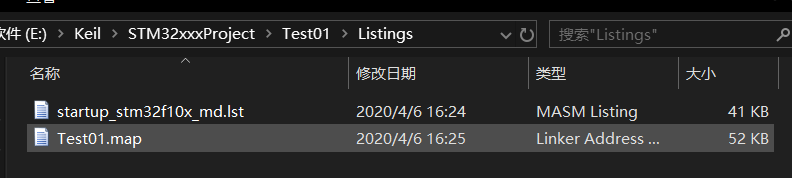

## 三、Code-data,RO-data,RW-data,ZI-data 介绍

> 查看数输出信息发现了这么一串Program Size: Code=320 RO-data=252 RW-data=0 ZI-data=1632他们分别是什么了？接下来进行讲解演示：
> 
> **点击到这里来详细解释**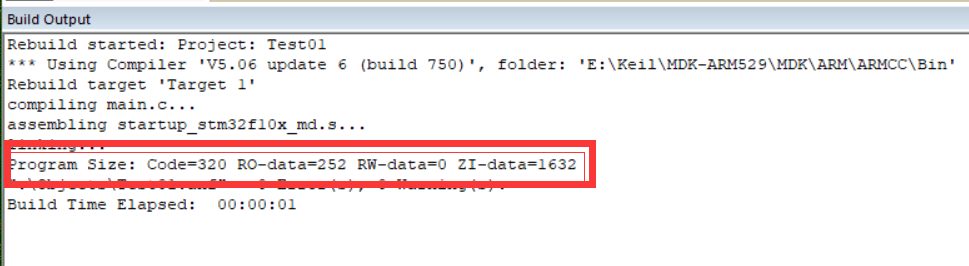

## 四、最后附带一张图，了解哈工程文件的简单含义

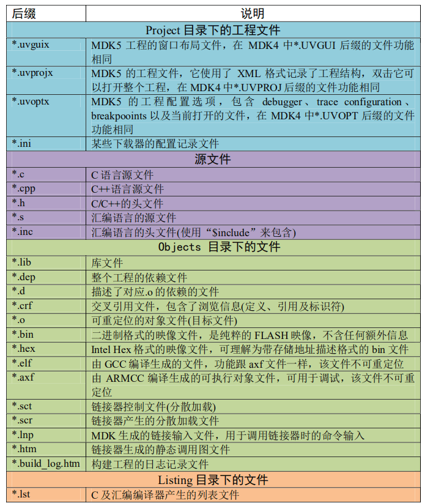
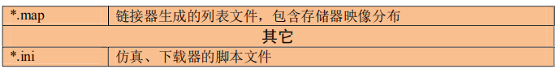