[toc]

# 轻松学透Markdown的终极教程 #2：Markdown编辑器软件

远怀学堂 2020-03-02 13:10:26

> 工欲善其事必先利其器，一款好的Markdown编辑器软件让你的文字工作变得更加高效、顺畅

Markdown格式的文档是**纯文本格式**的文档，只不过这些纯文本中含有一些用于简单的排版控制的标记语法。

按道理来说任何可以编辑纯文本的软件（包括最简单的记事本软件），都可以用来编辑Markdown格式的文档，但是我们推荐大家尽量使用专门的Markdown编辑器软件或者带有Markdown功能的软件去处理Markdown格式的文档，因为这类软件对Markdown做了更好的支持，使用起来更加的便捷高效。

## 2.1 Markdown编辑器软件存在的价值

同样的一篇Markdown格式的文档，我们先不使用专门的Markdown编辑器打开，而是使用普通的类似于记事本的纯文本编辑器打开看下：

  

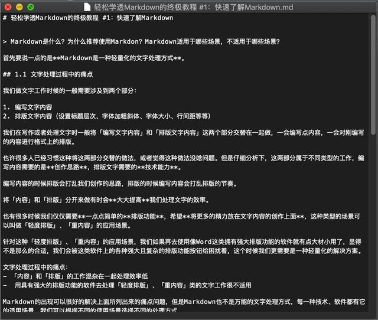

图1 使用记事本类的软件打开Markdown格式的文档效果

有没有觉得太“素”了，甚至有点觉得杂乱。

同样的文档，我们再使用随便一款专门的Markdown编辑器打开看看：

  

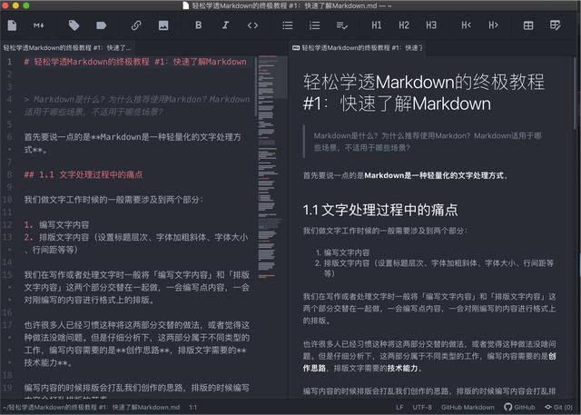

图2 Atom编辑器 + Markdown插件打开Markdown格式的文档效果

使用专门的Markdown编辑器或者带有Markdown功能打开Markdown文档的效果给人很“漂亮”的感觉。

左侧为Markdown文档的编辑区域，右侧为最终的效果预览区域，左侧编辑区域的标记语法高亮显示，让标记语法和内容分得很清楚，右侧可以对左侧的编辑内容实时的更新显示出最终预览效果。

这些都只是我们面上看到的功能，其实这些专门的软件还有很多其他的功能，像变换最终的预览样式、快捷键快速插入标记语法、图床的支持等等。

### 2.2.1 Markdown编辑器软件做了些什么

上面我们看到了普通的纯文本编辑器和专门的Markdown编辑器的使用区别，我们来简单了解下Markdown编辑器究竟在背后做了些什么工作。

  

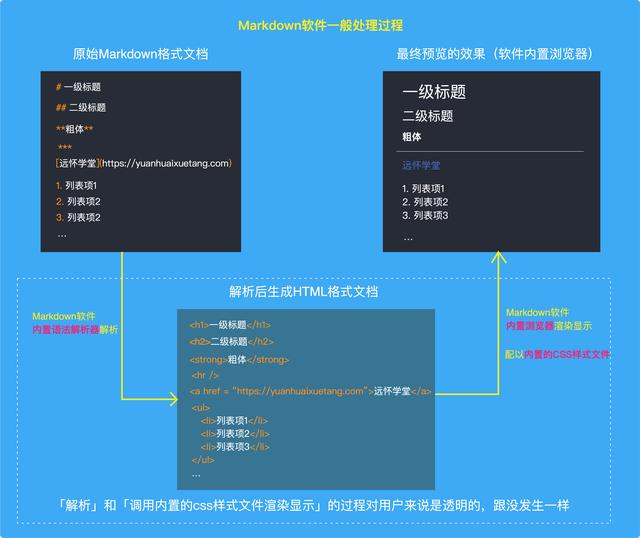

图3 Markdown软件一般处理过程

Markdown软件的一般处理过程是：Markdown编辑器软件会使用软件「**内置的Markdown语法解析器**」对Markdown文档进行「解析」，解析成HTML格式的文档，然后再将解析后的HTML格式的文档交给软件「**内置的浏览器**」进行「渲染显示」，渲染显示的时候Markdown软件会调用软件内置的CSS样式文件来控制最终显示的样式效果。

> CSS样式文件用于控制HTML文档中的字体大小、行间距、字间距、段落间距、字体颜色、链接样式等各种HTML标记的最终的显示样式效果。

## 2.2 Markdown编辑器软件推荐

市场上有很多非常优秀的Markdown编辑器软件，我们这里给大家挑选整理出其中的一部分，选择一款合适的软件开始你的Markdown之旅吧。

### 2.2.1 简单易用型

**Ulysses**

  

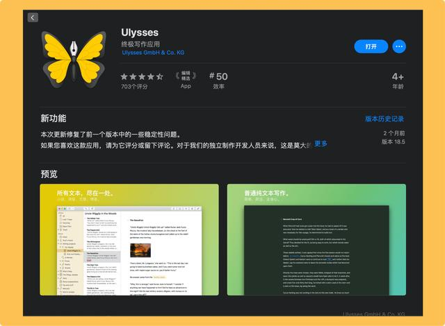

只支持苹果平台：MacOS、iPadOS、iOS，暂不支持其他平台，收费软件，好的东西是值得付费的，**推荐Mac用户使用这款软件**，使用体验非常的好。

  

**iA Writer**

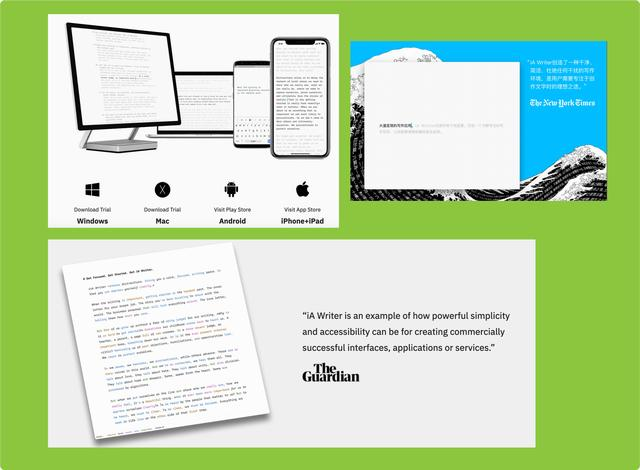

全平台支持：Windows、MacOS、iPadOS、iOS、Android，收费软件，很简洁清爽。

  

**MacDown**

  

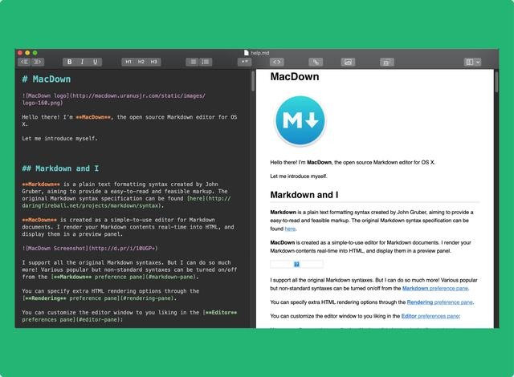

只支持MacOS，开源免费，适合初学者上手练习之用。

  

**MarkdownPad**

  

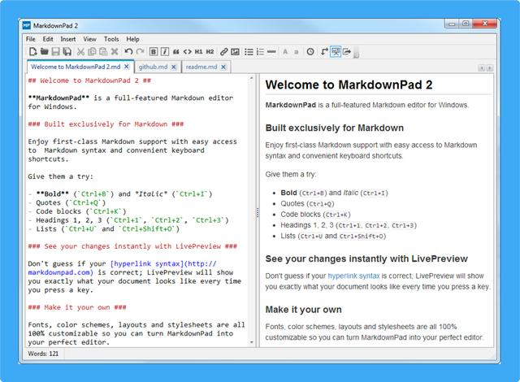

Windows专用Markdown编辑器，只支持Windows系统，推荐Windows用户使用，口碑很好，基础版软件免费，高级专业版需要付费。

  

**ReText**

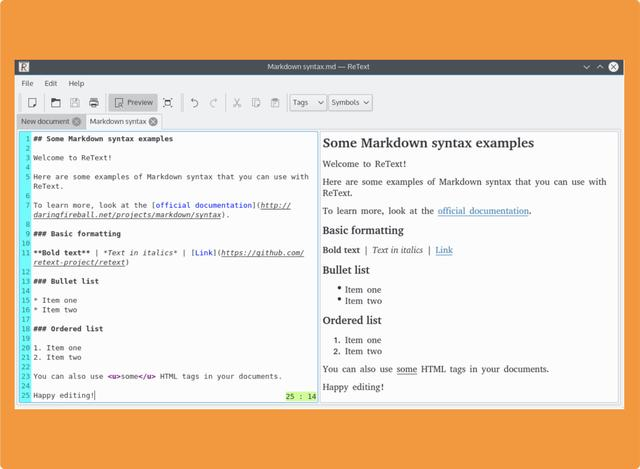

Linux专属Markdown编辑器，支持Linux系统及POSIX兼容的系统，免费开源。

  

**Typora**

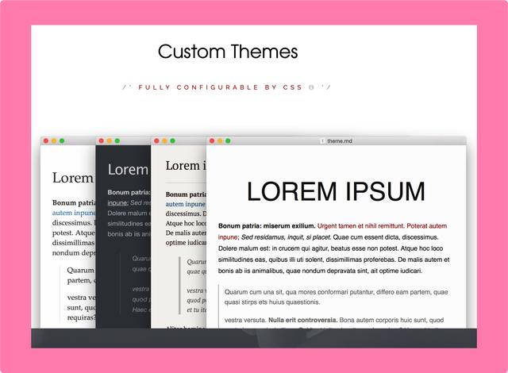

支持Windows、MacOS、Linux系统，目前官网上说是beta版免费，不一样的Markdown编辑器，编辑的时候会自动隐藏掉Markdown的标记语法，挺有意思的一款Markdown编辑器。

  

**MWeb**

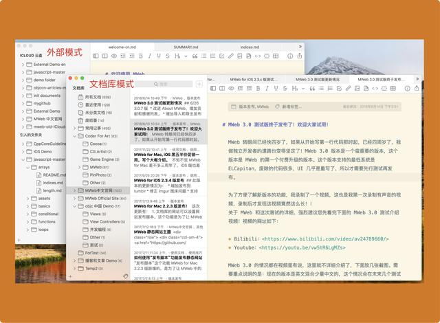

只支持苹果平台：MacOS、iPadOS、iOS，暂不支持其他平台，收费软件，国人独立开发者做出来的一款Markdown编辑器。

  

**Boost Note**

Boost Note.png

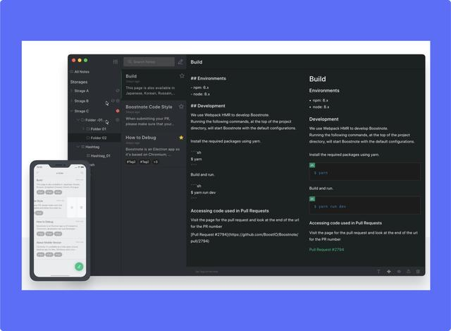

支持Windows、MacOS、Linux系统、支持浏览器操作、手机端APP很快发布，开源软件，基础版不收费，高级版收费，据说这款软件对程序员朋友很友好哦，在文档中可以轻松混合文字和代码。

  

**Quiver**

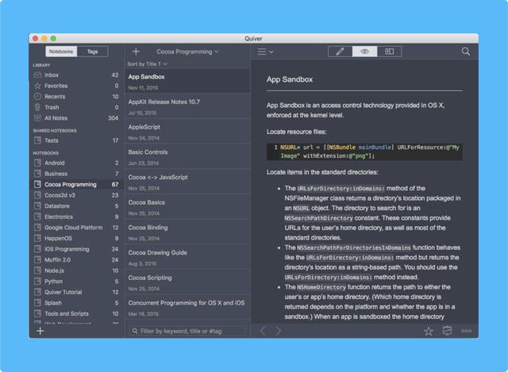

支持MacOS、iOS，这款Markdown编辑器对程序员朋友也很友好哦，方便记录代码和文字，很适合于技术写作者。

还有许许多多的**笔记类软件**很好的支持Markdown，像**印象笔记**、**有道云笔记**、**为知笔记**等等都对Markdown有很强大的支持。

这种笔记类软件一般都是提供全平台的软件和APP的，同时他们对Markdown中的痛点问题图片图床提供了更加简单高效的支持，也有强大的文档云同步的功能，也十分推荐大家去尝试这种类型的软件去使用到Markdown。

  

**在线的Markdown编辑器**

只需打开浏览器就可以快速的感受到Markdown，轻便、跨平台、免费。

**Cmd Markdown、马克飞象等等**

  

### 2.2.2 geek爱折腾型

如果你是个极客geek，喜欢自己折腾，动手能力强大，你可以试试一些「代码神器」：ATOM、Sublime、VSCode。

这些「代码神器」都是非常优秀的代码编辑器，擅长于纯文本编辑，将这些「代码神器」应用于Markdown的编辑时，需要在这些软件里**下载并加载一些支持Markdown的插件**。

**ATOM**

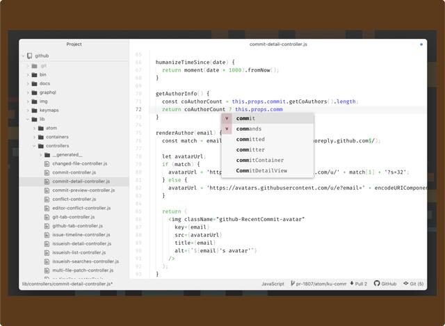

支持Windows、MacOS、Linux平台，开源免费。

该软件推荐安装的Markdown插件：

编辑增强插件：markdown-writer、tool-bar-markdown-writer

预览插件：markdown-preview-enhanced、markdown-preview-plus

还可以通过软件自带的安装插件功能搜索安装更多的Markdown插件

Tips: 如果安装了多个**相同类型的插件**，使用时可能会出现冲突，需要人为手动去禁用一些有冲突的插件。

  

**VSCode**

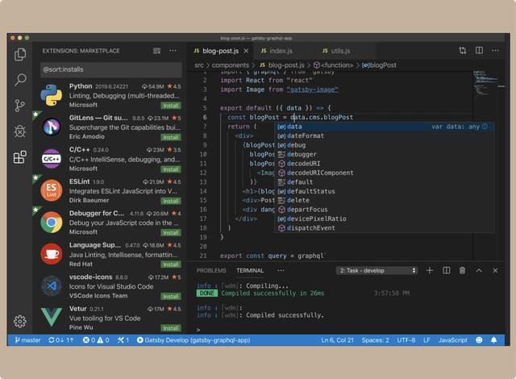

支持Windows、MacOS、Linux平台，开源免费。

该软件推荐安装的Markdown插件：

编辑增强插件：markdown-all-in-one、markdown toc

预览插件：Markdown Preview Enhanced

还可以通过软件自带的安装插件功能搜索安装更多的Markdown插件

Tips: 如果安装了多个**相同类型的插件**，使用时可能会出现冲突，需要人为手动去禁用一些有冲突的插件。

  

**Sublime Text**

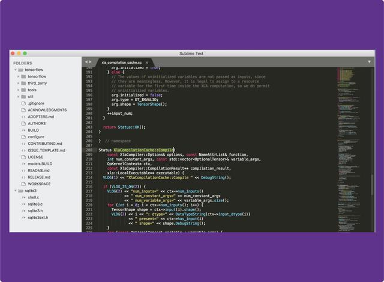

支持Windows、MacOS、Linux平台，Sublime Text是收费软件，但是可以无限试用，未得到有效授权的软件会经常有弹窗提示，但不影响使用。

该软件推荐安装的Markdown插件：

编辑增强插件：MarkDown Editing

预览插件：MarkdownLivePreview 、OmniMarkupPreviewer

还可以通过软件自带的安装插件功能搜索安装更多的Markdown插件

Tips: 如果安装了多个**相同类型的插件**，使用时可能会出现冲突，需要人为手动去禁用一些有冲突的插件。

除了上面我们介绍的那些软件外，市场上还有非常多其他优秀的Markdown编辑器软件，大家可以自行再去搜索查找，我们这里就不再给大家做过多的介绍了。

## 2.3 Markdown编辑器软件具有的一般功能特性总结

纵观市场上的各种优秀的Markdown软件，它们所提供的功能都大同小异，我们这里也简单总结下这些软件所具有的一般功能特性：

1.  编辑区域标记语法高亮显示
2.  最终呈现的效果预览
3.  支持快捷键快速输入标记语法
4.  插入图片的图床支持
5.  导出成HTML、Word、PDF、markdown文本、ePub等各种格式的文件
6.  文件的云端存储、同步功能
7.  多文档管理

每款软件有这些一般的特性外，还有各自的独特的一些功能支持，比如字数统计、文件一键发布至WordPress、分享文章等等。

