

首发于[余知兮的专栏](https://zhuanlan.zhihu.com/ericxixi)

# 印象笔记从入门到精通：10个最常见用法

[余知兮](https://www.zhihu.com/people/ericake)

### 效率工具、SaaS企业服务、投资笔记

用 Evernote 5年多了，从一个小白用户到现在有一万多条笔记，我把自己在学习，生活和工作中的点滴积累全都存放在里面。大约也是5年前，我第一次在知乎回答问题，慢慢成为知乎 [Evernote 话题](https://www.zhihu.com/topic/19703613)下的最佳回答者，收到了很多知乎朋友的点赞。

每天会有很多人在知乎上分享他们的知识和经验，我喜欢看知乎，在这里收获了成长，也非常愿意将我使用 Evernote 过程中总结的方法在这里分享给大家。下面是 10 个印象笔记最常见用法。如果你曾听说过印象笔记，但没有真正用起来。或者你也是一个深度用户，想推荐一些印象笔记入门教程给身边的朋友，可以继续往下看。

*   印象笔记 ( Evernote ) 是什么？

“Evernote 是一款跨平台，有免费和付费版本，帮助你整理归档的云笔记软件，公司总部位于硅谷红木城。” 这是维基百科上 [Evernote](https://link.zhihu.com/?target=https%3A//en.wikipedia.org/wiki/Evernote) 词条解释的第一句话。

补充信息：Evernote 2012年进入中国，取名印象笔记，并在中国设立独立的域名和服务。由于众所周知的原因，我在2013年也把 Evernote 国际版帐户里的笔记迁移到了国内印象笔记。目前 Evernoe 在全球有 2 亿用户，中国有2000万用户。

## **一 随时随地，记录一切**

相比普通的手机备忘录或日记软件，在印象笔记中写笔记除了新建文本，还可以添加任意附件，复选框，项目和数字编号，相册照片，拍照或扫描，录音，所有类型的文件信息都可以放在一条笔记中，并且附件Word和Excel打开是可以直接编辑同步的。

  

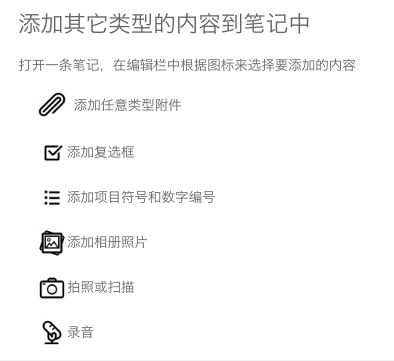

**比如**：在开会的时候，你可以在一条笔记中记下所有信息：一边打字，一边同时录音，拍照，并插入会议相关的 PDF，Excel 附件和勾选框代办事项。

视频教程 一

[1-随时随地记录一切-印象笔记快速入门_腾讯视频 v.qq.com视频](https://v.qq.com/x/cover/f0526r8sp8w/f0526r8sp8w.html)

  

## **二、收藏微信文章和聊天记录**

微信收藏只能在手机上查看，很不方便。有时要找聊天记录中一个非常重要的图片和附件会显示碎片看不到。印象笔记可以很方便地收藏微信朋友圈文章和聊天记录，并同步到你的手机和电脑印象笔记。我的印象笔记中有3000多条通过微信保存的笔记，平时在微信里看到有用和有意思的东西，随手存到印象笔记，之后在手机和电脑上都可以随时查看和编辑。

  

*   关注微信公众号“我的印象笔记” （扫描下面的二维码），按提示绑定印象笔记帐户  
    [http://weixin.qq.com/q/nHW28QbmaAYRxjK_s13Y](https://link.zhihu.com/?target=http%3A//weixin.qq.com/q/nHW28QbmaAYRxjK_s13Y) (二维码自动识别)
*   收藏微信网页文章  
    在微信中打开文章，点击右上角三个点，向左滑到，找到大象图标  
    

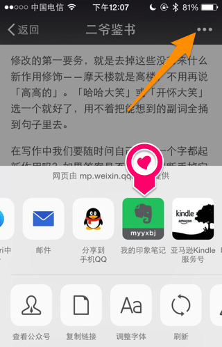

  

*   收藏微信聊天记录  
    长按消息，选“更多”，之后勾选所有你要保存的消息，再点右下角的【•••】，选大象图标，就会永久保存，再也不同担心微信清缓存了。

参考：[微信朋友圈文章和聊天记录如何保存到印象笔记？ \- 余知兮的回答](https://www.zhihu.com/question/20636154/answer/22663902)

  

  

[微信干货永久珍藏-印象笔记快速入门-02_腾讯视频 v.qq.com视频](https://v.qq.com/x/cover/o0526732zy8/o0526732zy8.html)

  

## **三、一键保存网页**

  

手机和电脑浏览器都可以用印象笔记剪藏插件一键保存完整网页到印象笔记。

*   手机浏览器支持iPhone，iPad和安卓手机浏览器  
    （手机上安装[印象笔记app](https://link.zhihu.com/?target=https%3A//www.yinxiang.com/%3Futm_source%3Dzhihuzhuanlan%26utm_medium%3D20698338%26utm_campaign%3Dhome_zhihu)后，按照下面的步骤就可以开启剪藏）  
    

  

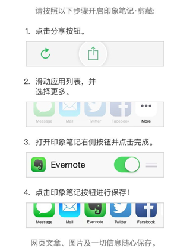

  

*   电脑浏览器剪藏功能更强大，可以一键去广告，智能保存有用的内容。  
    [下载剪藏插件 Web Clipper](https://link.zhihu.com/?target=https%3A//www.yinxiang.com/webclipper/install/%3Futm_source%3Dzhuanlan%26utm_medium%3D20698338%26utm_campaign%3Dclipper_zhihu) （支持Chrome，IE，Firefox，Safari，QQ，猎豹, 360极速/安全浏览器）

参考：[如何下载印象笔记剪藏浏览器插件 Evernote Web Clipper ？ - 余知兮的回答](https://www.zhihu.com/question/24402222/answer/27804319)

  

[网页资料快速保存-印象笔记快速入门指南-3_腾讯视频 v.qq.com视频](https://v.qq.com/x/cover/m0526e8za41/m0526e8za41.html)

  

## **四、保存邮件**

邮箱需要联网才能搜索，且邮件附件不能搜索。把重要的邮件转发邮件到你的印象笔记私有邮箱地址 (类似 &lt;username&gt;.xxxxx@m.yinxiang.com） 就可以保存完整邮件到印象笔记，离线查看和编辑。

查看印象笔记帐户的私有邮箱地址方法：

*   网页版：[设置---帐户一览](https://link.zhihu.com/?target=https%3A//app.yinxiang.com/Settings.action) 最下面  
    

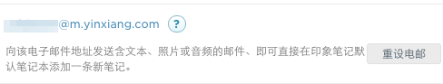

  

*   Windows: 菜单栏>工具>帐户信息;
*   Mac: 主界面左上方点击用户名，进入帐户信息;
*   Android: 设置>帐户信息>私有邮箱地址;
*   iPhone, iPad 点击主界面左上角用户名>通用设置>私有邮箱地址;

  

其他高级用法：在邮件标题后面使用@ 和 # 可以保存邮件到指定的笔记本并添加标签

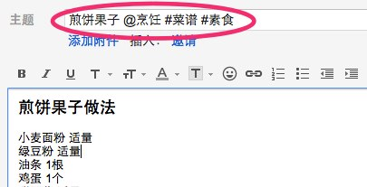

例如，邮件标题：**煎饼果子 @烹饪 #菜谱 #素食。**邮件会保存到烹饪笔记本，标题为煎饼果子，并加上标签菜谱和素食。**（注意：这个方法只能添加印象笔记账号中已有标签和笔记本）**

参考：[如何保存邮件到印象笔记 Evernote？ - 余知兮的回答](https://www.zhihu.com/question/24455868/answer/27856132)

  

  

[重要邮件一键归档-印象笔记快速入门-5_腾讯视频 v.qq.com视频](https://v.qq.com/x/cover/q0526jjo9b4/q0526jjo9b4.html)

  

## **五、多设备同步**

我在自己的手机，家里电脑，公司电脑还有Apple Watch上都安装和登录了印象笔记，工作中很少用Office文档，我都是直接写在印象笔记里面，微信聊天记录里面的图片文件，还有电脑桌面上重要的附件也会存到印象笔记。

因为我所有的手机和电脑上印象笔记都是随时同步的，上下班路上包里也不用背电脑。在公司公用的测试电脑上可以登录网页版即时同步，重要的笔记本在手机上会设置成离线笔记本，即使在地铁上网络不好，也可以随时查看编辑笔记，真的是随时随地移动办公。

印象笔记支持几乎所有我用过和没用过的设备：  

*   手机：苹果，安卓，Windows Phone, Blackberry
*   电脑：Windows, Mac OS X, Linux  
    
*   手表：Apple Watch，Pebble, Android Watch.  
    

  

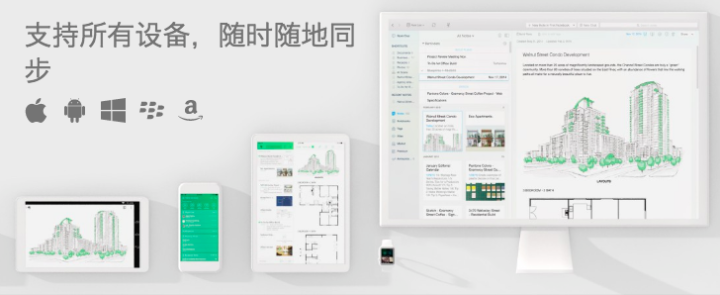

## **六、强大的全局搜索 （文字，图片，附件）**

印象笔记可以搜索到图片和附件里面的文字，因为 Evernote 团队最开始是靠给苹果做图片 OCR 文字识别起家的一个外包公司，目前国内只有印象笔记有这个技术，国内其他云笔记和云盘都做不到。除此之外印象笔记还可以通过高级搜索语法来根据创建日期、所含附件文件类型（音频、图片等）、创建的地点搜索笔记。

**1\. 图片搜索**  
印象笔记可以搜索图片中文字，包括印刷体，中英文手写。比如下面这张照片是看《日瓦戈医生》时手边没有纸和笔，用手机直接拍照存到印象笔记，拍照可以做读书笔记因为可以照片中文字在印象笔记中可以搜索到。（汉字印刷体识别率很高）

  

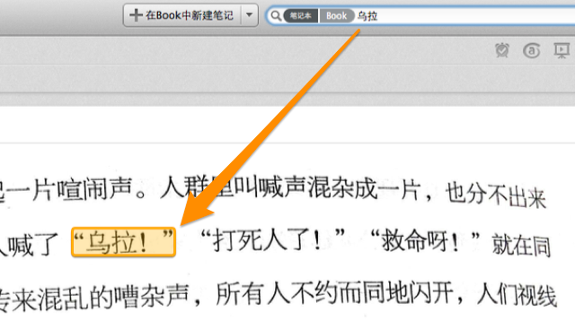

手写文字也支持搜索

（汉字手写工整的话识别率还可以，草书不行。英文和数字手写识别率非常高）

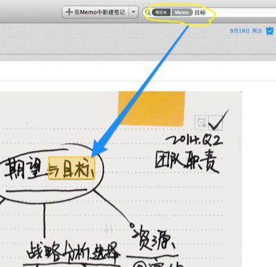

**2\. 附件文档搜索**

  

印象笔记可以搜索附件文件，如 Word、Excel、PDF 文档保存到印象笔记后，就再也不用在电脑的各个子文件夹中点来点去寻找一个文档。

  

**3\. 相关搜索：**

电脑浏览器安装剪藏插件后，在百度和Google搜索的时候可以同时显示你的印象笔记搜索结果的前三条笔记。

  

**4\. 高级搜索语法和搜索快捷键**

  

Mac 上强烈推荐使用 Cmd +J 搜索快捷键，非常好用。

  

另外还有一些高级搜索语法，我自己常用的比较有意思的几个：

1.  intitle:咖啡 可以搜索标题中含有“咖啡”的笔记。  
    
2.  encryption: 搜索所有包含文本加密的笔记，快速找到笔记里的小秘密并解密
3.  source:mobile* 搜索所有我在手机上创建的笔记  
    
4.  resource:audio/* 搜索所有含有录音文件的笔记  
    
5.  todo:* 将搜索包含复选框的所有笔记  
    
6.  created:day-30 筛选出最近一个月的笔记  
    
7.  created:20131013 找到去年今天你记了什么笔记  
    
8.  -tag:* 筛选出 所有未加标签的笔记

  

更多高级搜索语法可以参考：：[印象笔记有哪些高级搜索用法？搜索语法和图片附件搜索怎么用？ \- 余知兮的回答](https://www.zhihu.com/question/28069416/answer/39257332)

  

[深入搜索找到一切-印象笔记快速入门-9_腾讯视频 v.qq.com视频](https://v.qq.com/x/cover/q0526uvdt78/q0526uvdt78.html)

  

## 七、代办事项和提醒

* 代办事项

在印象笔记手机和电脑客户端编辑栏中都有一个勾选框，插入到笔记中就可以制作工作项目中代办事项，旅行物品清单。比如每次出行的前一天晚上复制一个清单模板笔记，把勾一个个都打完勾了就知道自己东西都带齐了。

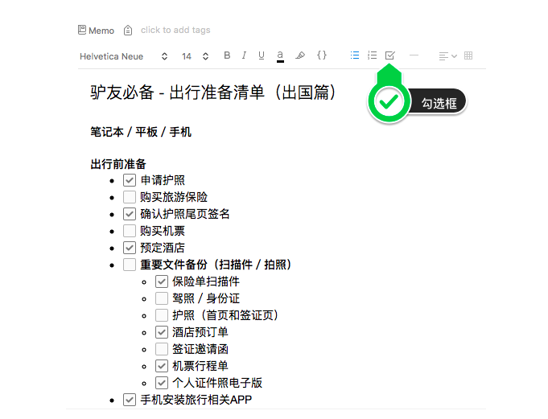

* 笔记提醒

每一条笔记都可以设置一个提醒时间，重要的笔记给自己设置一个提醒时间到期会弹出提醒，还可以开启邮件提醒，共享笔记本设置提醒，对方印象笔记也会收到提醒。另外印象笔记提醒还可以和Outlook日历绑定同步。

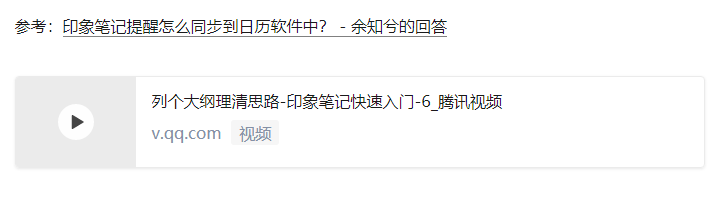

## 八、标注图片，网页和PDF

原先售价 $ 19.99 的瑞士军刀级的 Mac 图片编辑器 Skitch 圈点 在2011年被 Evernote 收购以后免费了，后来被慢慢被整合到 Evernote 的笔记软件中。现在不用下载 Skitch 在印象笔记中就可以标注图片，网页和PDF。

标注时可以添加箭头，涂鸦，高亮，文本，圈圈，框框，图章，马赛克，旋转，裁剪调整大小，选择颜色和线条粗细。所有的这些功能在印象笔记手机或电脑客户端中打开笔记中图片和PDF，点击 @ 标注按钮或右键---标注图片都可以操作。使用电脑浏览器印象笔记剪藏插件时选择截图模式还可以直接标注网页。

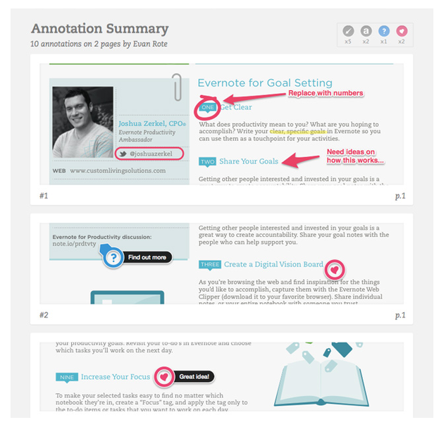

## 九、共享笔记

印象笔记可以共享单条笔记，和笔记本。权限可以设置为仅查看，仅编辑，编辑和邀请。

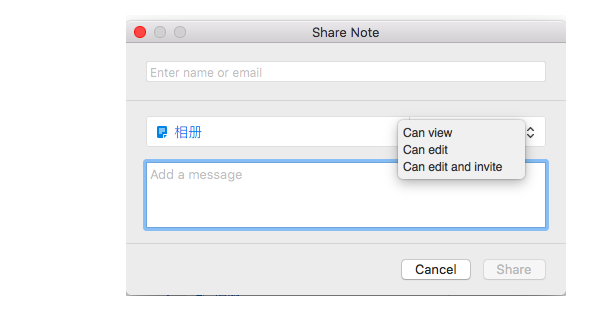

## 十、笔记模板

推荐下面两个印象笔记官方的模板和清单大全，打开点击右上角可以保存到自己的印象笔记。

*   [印象笔记模板大全](https://link.zhihu.com/?target=https%3A//list.yinxiang.com/moban/%3Futm_source%3Dzhulan%26utm_medium%3D20698338%26utm_campaign%3Dlist_zhihu)
*   [印象笔记清单大全](https://link.zhihu.com/?target=https%3A//list.yinxiang.com/qingdan/%3Futm_source%3Dzhuanlan%26utm_medium%3D20698338%26utm_campaign%3Dlist_zhihu)

  

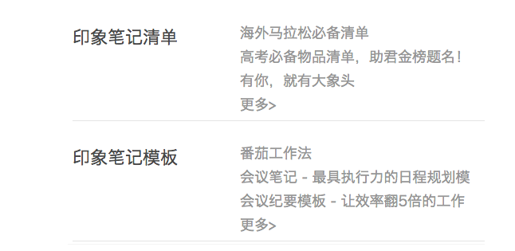

更多模板和共享笔记本参考：[有哪些不错的 Evernote 或者印象笔记的共享笔记本？ - 余知兮的回答](https://www.zhihu.com/question/20646954/answer/23619148)

  

  

[实用模板轻松获取-印象笔记快速入门-4_腾讯视频 v.qq.com视频](https://v.qq.com/x/cover/g0526owaoho/g0526owaoho.html)

  

写完了第一篇印象笔记从入门到精通文章，准备去睡觉了。。。

文章中视频出自印象笔记官方微信 [印象笔记](https://link.zhihu.com/?target=https%3A//mp.weixin.qq.com/mp/homepage%3F__biz%3DMjM5OTA3MjUwMA%3D%3D%26hid%3D6%26sn%3Dfd5a0f51f22c82f0d6491335c37a81be%26devicetype%3DiOS10.3.3%26version%3D16050e20%26lang%3Dzh_CN%26nettype%3DWIFI%26ascene%3D7%26fontScale%3D100%26scene%3D21%23wechat_redirect) [Evernote](https://link.zhihu.com/?target=https%3A//mp.weixin.qq.com/mp/homepage%3F__biz%3DMjM5OTA3MjUwMA%3D%3D%26hid%3D6%26sn%3Dfd5a0f51f22c82f0d6491335c37a81be%26devicetype%3DiOS10.3.3%26version%3D16050e20%26lang%3Dzh_CN%26nettype%3DWIFI%26ascene%3D7%26fontScale%3D100%26scene%3D21%23wechat_redirect) [新手入门手册](https://link.zhihu.com/?target=https%3A//mp.weixin.qq.com/mp/homepage%3F__biz%3DMjM5OTA3MjUwMA%3D%3D%26hid%3D6%26sn%3Dfd5a0f51f22c82f0d6491335c37a81be%26devicetype%3DiOS10.3.3%26version%3D16050e20%26lang%3Dzh_CN%26nettype%3DWIFI%26ascene%3D7%26fontScale%3D100%26scene%3D21%23wechat_redirect)

  
