## 竞品分析报告：有道云笔记&印象笔记

文章结构图

## 一、概览

#### 1\. 竞品选择：  

产品名称：有道云笔记     产品版本：6.6.3  v（来源：百度图片）

产品名称：印象笔记    产品版本：9.2.1（来源：百度图片）   

**选择原因：**

笔记类软件以其特有的方式同时聚合了邮件处理、文件共享、文件编辑、任务提醒、知识管理、时间管理、共享协助等功能，更符合互联网时代需求，发展前景较好。

两个APP的主要功能都是让用户方便记笔记，在记事本/备忘录行业排名靠前，且两者差距较小。

有道云笔记隶属于网易旗下的有道公司，因此品牌影响力不容小觑；印象笔记是国外Evernote公司引进，该公司从2012年在国内上线至今，拥有良好的口碑和众多忠实用户。

**分析目的：**

了解目前记事本市场现状，从用户最基本需求出发，了解两款产品的设计思路。

#### 2. **体验环境：**  

体验机型：iphone 8

操作系统：iOS 11.4.1（15G77）

#### **1.领域分析：**  

2018年01月商务办公领域现状分析（图片来源：易观千帆）

根据易观千帆发布的2018年1月的移动APP商务办公领域现状分析显示，商务办公领域主要由邮箱，云盘，OFFICE，记事本/备忘录及翻译工具组成。其中记事本/备忘录的活跃人数为3523.8万，活跃人数在全网的渗透率仅为3.6%，在商务办公领域活跃用户数排名第四，与排名第一的邮箱相差约3696.2人。由此可见记事本/备忘录行业并不乐观，但发展空间较大。

#### **2.行业分析：**  

 2017-2018记事本/备忘行业活跃用户数与行业平均值比较（图片来源：易观千帆）

根据易观千帆数据显示，从2017年第一季度到2018年第一季度的一年间记事本/备忘 行业活跃用户数始终低于行业平均值，但是该行业活跃用户数与行业平均值差距逐渐缩小：由2017年第一季度差值2454.19到18年第一季度差值1546.66。产生上述现象的原因主要有两点：（1）记事本/备忘功能较为单一，一般作为某个app的一部分（如腾讯微云，百度阅读）或者手机自带功能（如苹果手机自带功能：备忘录）。因此单独下载一个记事本的用户数较少。（2）信息时代日常生活和工作中需要传递的信息量都变的异常巨大，每个人对信息筛选、整理、记录和获取的能力都需要提高。信息记录的方式必须多媒体化，不再单单只是文字。

#### **3.竞品分析：**

2018年01月 有道云笔记和印象笔记APP现状分析

#### **1\. 产品定位：**

有道云笔记和印象笔记产品定位

####   
**2\. 盈利模式：**

有道云笔记和印象笔记盈利模式分析

有道云笔记盈利页面：

有道云笔记收费页面

印象笔记盈利页面：

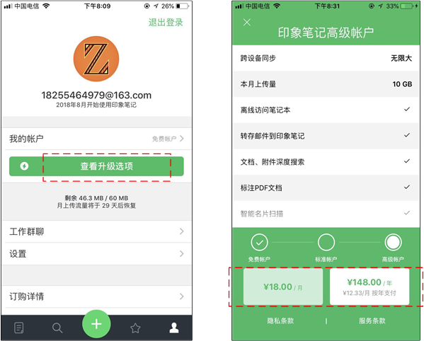

印象笔记收费页面

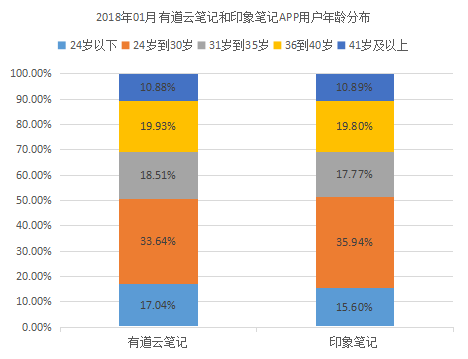

2018年01月 有道云笔记和印象笔记APP用户年龄分布（数据来源易观千帆）

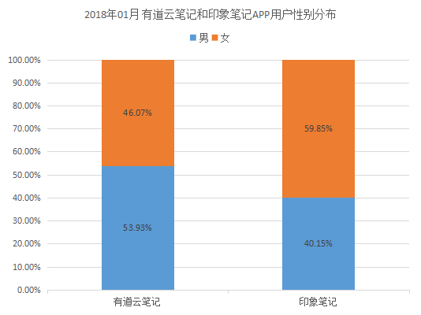

2018年01月 有道云笔记和印象笔记APP用户性别分布（数据来源易观千帆）

从使用人群用户年龄分布上来看，两者的主要的年龄段均是24-30岁，约占总人数的35%左右；从使用人群用户性别分布上来看，男性和女性用户分布几乎相同。

**用户需求分析：**

随时建立并记录笔记，提高效率。

分类整理笔记，可随时随地打开浏览学习并标记或修改。

操作简单，可将笔记分享给其他人。

#### 1. **竞品结构图**

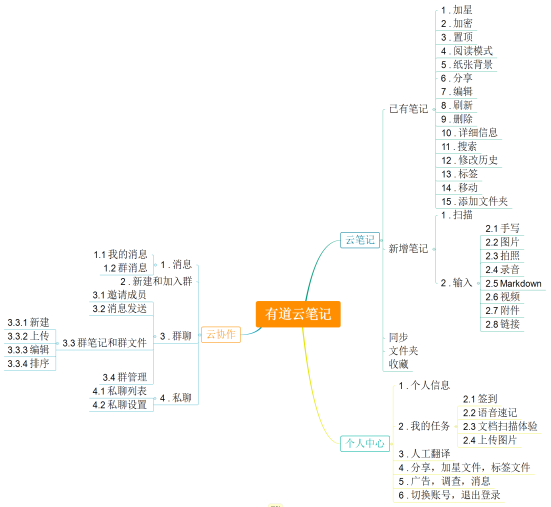

有道云笔记竞品结构图

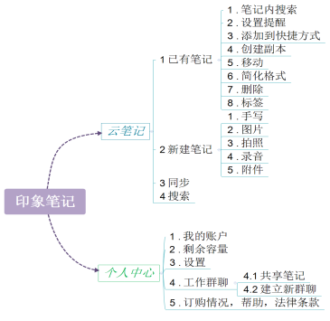

印象笔记竞品结构图

由竞品结构图可以看出有道云笔记和印象笔记的一级导航均有云笔记以及个人中心模块。相比之下，有道云笔记多出了云协作模块。

#### **2.核心功能分析**

**2.1信息输入**

两款笔记在信息输入上都较为便捷，均可通过点击中间“+”号进入输入页面。

有道云笔记进入编辑页面后需要先选择输入类型才可以进一步编辑；印象笔记则可直接进行编辑。

如果想要想要输入其他类型内容，印象笔记可随时点击“+”选择添加内容的类型。而有道云笔记则只有进入“新建笔记”时才可以选择其他内容类型。

总而言之，有道云笔记页面更简洁，更有引导性，方便用户快速操作，但是在同一文件并存多种内容形式方面，印象笔记更胜一筹。

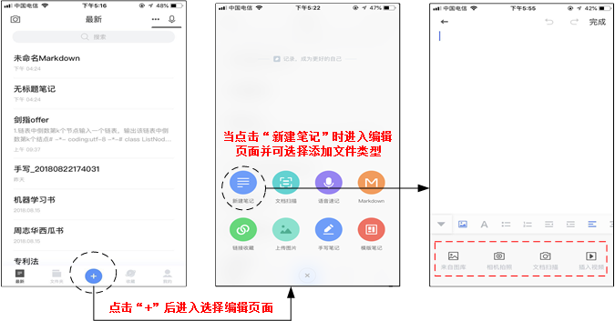

有道云笔记首页以及进入编辑页面

印象笔记首页以及进入编辑页面

####   
**2.2管理功能**

在笔记本的管理上，两者都支持笔记本重命名，移动，删除，添加标签等基本功能，有道云笔记还支持“加密”功能。如今大家都比较注重隐私，而且在工作中，有的信息比较敏感需要保密，加密无疑是一项比较实用的功能。

两者的笔记管理方式都相同，可以设置笔记本为笔记分类，也能为单个笔记添加标签。

有道云笔记比较注重用户阅读体验，比如功能：阅读模式，纸张背景；而印象笔记比较注重阅读的便捷性，比如功能：笔记内搜索，创建文件副本。如果将两者相结合会更好。

####   
**3.非核心功能分析**

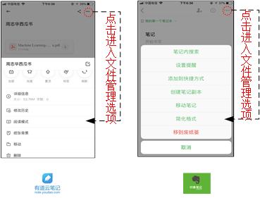

有道云笔记&印象笔记文件管理页面

**3.1笔记分享**

有道云笔记支持将笔记分享到微信，朋友圈，网易邮箱，QQ，微博多平台，而印象笔记弱化了社交属性，更突出工作场景下应用，如打印，打开方式等，相比下有道云笔记共享性更好。

另外，有道云笔记也可以生成长图，二维码等形式。更多的分享形式意味着可能吸引大批的潜在用户，因此在笔记分享上，印象笔记需改进。

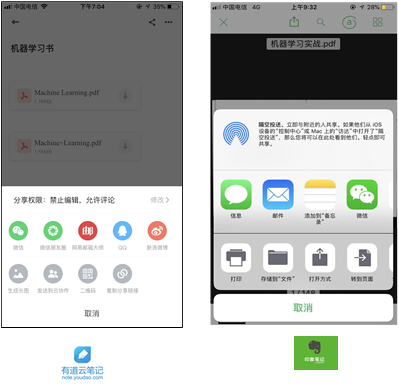

有道云笔记&印象笔记文件分享页面

**3.2云端容量**

印象笔记每月给免费用户容量只有60M，有道云笔记初始容量为3G，每天签到以及观看广告等还能领取额外容量。相比于有道云笔记，印象笔记的容量限制压力明显较大。因此，印象笔记也应该有相应的活动激励用户领取容量，否则为了赚取容量费将失去很多普通用户，得不偿失。

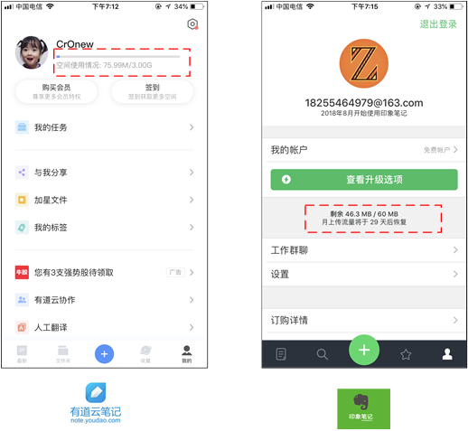

有道云笔记&印象笔记云端容量页面

**3.3 登录界面**

有道云笔记不仅支持账号密码登录，同时支持QQ，微信，微博等多平台登录，符合目前绝大多数APP登录模式，节省了输入时间，一键登录更简洁。而印象笔记仅支持邮箱及用户名登录，增加了操作时间。相比来看，有道云笔记更便捷。

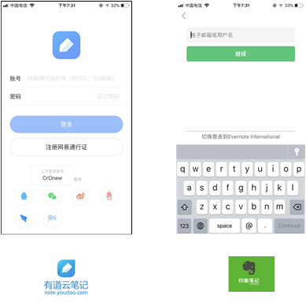

有道云笔记&印象笔记登录页面

**4.特色功能分析**

**4.1 有道云笔记的云协作&印象笔记的工作群聊**

功能位置：云协作和工作群聊都在有道云笔记和印象笔记的个人中心位置，但是点击有道云协作后自动跳转到应用商城app store 需下载单独APP “有道云协作”，而印象笔记直接在APP内进入群聊页面，相比于需同时下载两个APP的有道来说,印象笔记更能节省手机内存。

创建群组：有道云笔记创建群组很方便，简单的群组信息输入后即创建完毕，之后在群组管理界面（类似微信群组）输入对方昵称或账号后可直接邀请其他成员加入，印象笔记则较为麻烦，创建时需输入其他成员的电子邮件地址并向其发送邮件，待对方同意后（至少一人）群组才能创建成功，较为麻烦。但是有道云协作需缴纳年费才能建群，这将使一大部分普通用户被“拒之门外”。

文件管理：有道云笔记群组内文件可进行删除（每个成员都有权限），印象笔记则不支持。

群聊形式：有道云笔记与印象笔记群内都能发送文字信息，除此有道云笔记还支持图片发送。

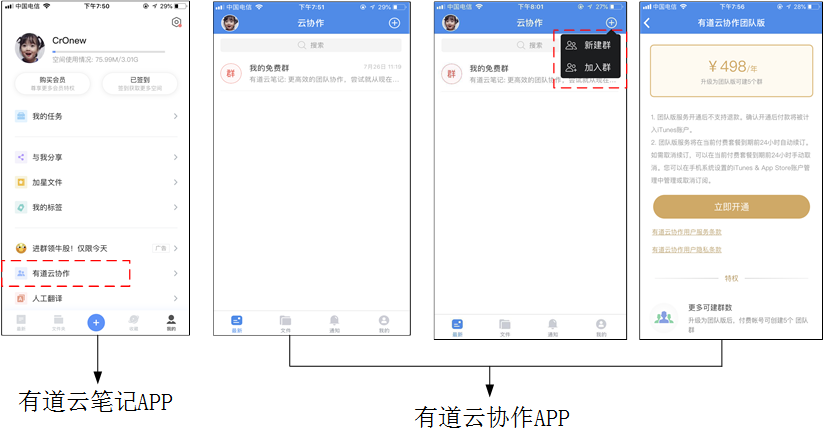

有道云笔记云协作页面

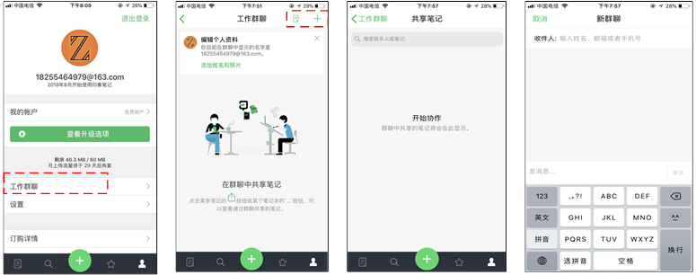

有印象笔记工作群聊页面

#### **六、总结与建议  
**

#### **1.总结**

**有道云笔记：**

**主要用户特点：**

用户大多是高知工作用户或者在校学生，追求效率，对知识信息有着较强的管理意识，通常用笔记管理自己学习生活上的知识以及在工作中帮助自己更好处理工作上的事务。

**优势：**

界面直观简单，降低用户熟悉APP时间。针对笔记本的初级用户，能让用户快速上手，大多数笔记内容以文字为主；

大部分功能均适用免费用户，更能吸引像大学生之类的普通用户；

作为网易公司旗下公司，有一定的品牌影响力，相比其他笔记类产品，更容易让用户优先选择。

**劣势：**

在体验该APP时发现，查看笔记时，不能点击使文件放大；

缺少其他打开方式以及打印功能，即缺少在工作场景下的应用。

**印象笔记：**

**主要用户特点：**

用户想要快速储存信息，并且在需要的时候快速获取信息。

**优势：**

针对中高级用户，此类用户对笔记本依赖程度更深，除了简单记录笔记外，还需要提醒，群聊等功能。

印象笔记源于国外的Evernote，在产品中更突出功能的丰富性；

兼有打印，工作群聊等功能，更面向工作场景下的高级用户。

**劣势：**

没有保密功能，缺乏安全性；

分配容量太少，不能满足大部分免费用户需求；

登录以及分享方式单一。

**如果我是PM**

**有道云笔记：**

增加工作场景下的应用功能，如：查看时放大文件，打印功能，其他方式打开文件等；

编辑时增加文字设置功能，如：字体，颜色，大小等。阅读时增加备注功能，如：高亮，下划线，手写笔等。将记录与阅读更好的结合程一个整体，提高用户体验。

**印象笔记：**

增强社交属性，如增加分享途径，增加登录途径（QQ，微信，微博等）；

增加推广活动，比如与“扇贝单词”，“牛客网”等学习网站合作，吸引更多普通用户。