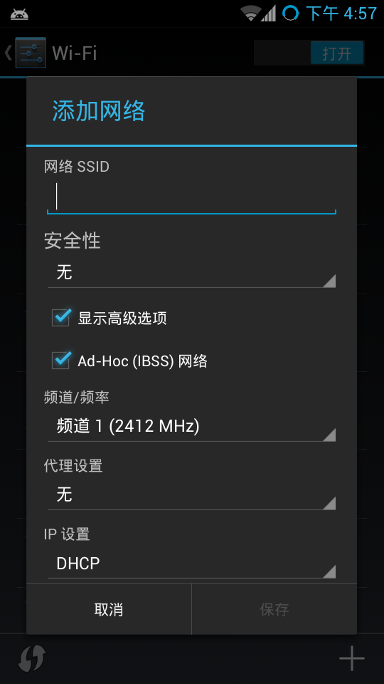

# MoKee OpenSource _ Android Community

##  Rom
MoKee OpenSource今日将更新新的正式版本
6 条回复
本次更新列表中的机型有：
Google Nexus 4
Google Galaxy Nexus （maguro,toro,toroplus）
LG Optimus 2X
LG Optimus 4X HD
LG Optimus Black
Motorola Droid RAZR/RAZR Maxx （sypder,umts_spyder）
Samsung Galaxy Note II
Samsung Galaxy S II
本条目发布于 2013 年 5 月 12 日。属于 新闻 分类。作者是 martincz。
Mokee OpenSource 源码同步常见问题
发表回复
一.首先说一下同步
关于 详细的同步方法主页教程里已经说了同步及编译教程，这里做一下细节补充，当你按照教程设置配置玩环境，装了java，装了各种依赖后会 下来就是安装repo 这点对于教程贴做个补充，方便从来没有搞过的却有探索精神的同学 方法如下：
a.建立目录

```
$ mkdir -p ~/bin
$ mkdir -p ~/android/system
b.安装repo
$ curl https://dl-ssl.google.com/dl/googlesource/git-repo/repo < ~/bin/repo
$ chmod a+x ~/bin/repo
```

c.将~/bin加到你的path
```
$ export PATH=${PATH}:~/bin
```
在这里设置完了就可以cd your source directory 下载源码了，方法教程中有。
二.同步中的问题
```
A.Fetching projects: 100% (249/249), done.
Syncing work tree: 95% (237/249) fatal: cannot create directory
File "/home/benjamin/cyanogenmod/system/.repo/repo/main.py", line 385, in
_Main(sys.argv[1:])
File "/home/benjamin/cyanogenmod/system/.repo/repo/main.py", line 365, in _Main
result = repo._Run(argv) or 0
File "/home/benjamin/cyanogenmod/system/.repo/repo/main.py", line 137, in _Run
result = cmd.Execute(copts, cargs)
File "/home/benjamin/cyanogenmod/system/.repo/repo/subcmds/sync.py", line 467, in Execute
project.Sync_LocalHalf(syncbuf)
File "/home/benjamin/cyanogenmod/system/.repo/repo/project.py", line 1027, in Sync_LocalHalf
self._InitWorkTree()
File "/home/benjamin/cyanogenmod/system/.repo/repo/project.py", line 1814, in _InitWorkTree
raise GitError("cannot initialize work tree")
error.GitError: cannot initialize work tree
```
首先保证在你的磁盘空间充足前提下，然后解决办法就是 repo sync -j1 然后如果还报错 再repo sync
这个问题的解决办法可能我有多种 ，这里提供的我自己的解决办法，而且这个有好多种错误。视情况而定
B.   配置ssh的问题。配置不当将导致同步出现 Permission denied(publickey)错误
首先确保你的home/yourname/ 下没有.SSh文件夹有的话备份后删掉。然后配置用于链接mokee 项目的SSH
第一步
```
ssh-keygen -t rsa -C "your_email@example.com"
```
特别说明这里的邮箱是你注册review.mfunz.com时候用的邮箱地址。 并且输入命令的时候邮箱两边 有”"
第二步
进入.ssh 目录下找到 id_rsa.pub 文件打开复制里面所以内容 ps：是id_rsa.pub 而不是id_rsa文件
第三步
进入项目地址review.mfunz.com 登陆后点击右上角setting 进入设置界面
在SSH Public Keys输入刚才id_rsa.pub 复制的内容 然后点击add
第四步
git 的初始化在终端输入
```
git config –global user.name [username]
git config –global user.email [email]
eg：
git config –global user.name qingliu
git config –global user.email shuiqingliu14@gmail.com
```
!!!一定要注意这里的name 和email   name是你注册项目时候的username  不是full name  邮箱当然就是你google 或者yahoo邮箱了。另外注意你自己的电脑用户名也应该和username 保持一致防止出现权限问题  example： qingliu@Mokee：~$我把自己计算机用户名设置为username相同
完成这写设置后reboot your system 然后就可以进入同步环节了
C.当你第一同步源码的时候很有可能遇到Fetching projects:  99%（382/388）(数字不确定)就不动了，卡住，这个问题也较常见，比如我自己。
解决办法就是关掉终端，重新repo sync ，反复尝试。如过还不行，在你睡觉的时候repo sync 让它卡着，醒来好了的话那就是他没卡够时间。（囧）。还不行就再反复。还不行那几乎不可能了。
ps:同步的时候很有可能中间断了，或者卡住，网络不通等可以关闭终端重新再来，支持断点续传。 或者CTRL+Z 停止再来（好多人CTRL+C貌似我不行囧……）
这篇文章只是稍稍提了下我碰到的问题。以后如果有新问题我会加进来，如果大家有同步的问题也欢迎回复。共同解决完善该文章。
本条目发布于 2013 年 5 月 11 日。属于 教程 分类，被贴了 repo 标签。作者是 qingliu。
MoKee OpenSource新增支持机型-P880
2 条回复
今夜,魔趣每夜版将加入P880的编译队列,P880的机油们可以准备下载啦~
本条目发布于 2013 年 5 月 9 日。属于 新闻 分类。作者是 martincz。
MoKee OpenSource项目聊天室启用
发表回复
MoKee OpenSource项目聊天室启用啦~
http://webchat.freenode.net/?channels=MoKee大家可以访问这里和MoKee OpenSource的成员进行对话
本条目发布于 2013 年 5 月 7 日。属于 新闻 分类。作者是 martincz。
MoKee OpenSource新增支持机型-I9100
发表回复
今夜,魔趣每夜版将加入I9100的编译队列,I9100的机油们可以准备下载啦~
本条目发布于 2013 年 5 月 6 日。属于 新闻 分类。作者是 martincz。
MoKee OpenSource 2013年5月1日更新新版本啦！
1 条回复
新版本中，我们更新了一下内容：
本土化APN设置
部分汉化补全
修正快捷任务界面的一处逻辑问题并提高性能
XT912重启问题修复
GPS本地化修改
修正摩托系列手电筒快捷控件不可用问题
修正网络速度显示位置
新增应用权限管理功能
桌面支持预览和快速修改页面
合并至最新5月1日CyanogenMod代码
快来体验吧～
本条目发布于 2013 年 5 月 1 日。属于 新闻 分类。作者是 martincz。
MoKee Permission Manager
发表回复


本条目发布于 2013 年 4 月 29 日。属于 新闻 分类。作者是 martincz。
新的内核以及提交到代码库并完成基础测试。
8 条回复
今天晚上的MoKee OpenSoource For Galaxy Nexus、Razr、 Nexus 4都采用的是全新的内核，前两款是3.0.73，后一款是3.4.40，想尝鲜的机油稍后可以刷正在陆续编译出的每夜版本。
本条目发布于 2013 年 4 月 16 日。属于 新闻 分类。作者是 martincz。
德仪没人疼啊，只好自己疼啊~
2 条回复





本条目发布于 2013 年 4 月 14 日。属于 新闻 分类。作者是 martincz。
即将发布的MoKee OpenSource新版中PIE功能的演示
18 条回复
本条目发布于 2013 年 4 月 11 日。属于 新闻 分类。作者是 martincz。
文章导航
← 早期文章
Search
