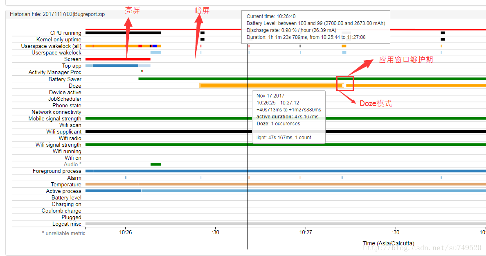
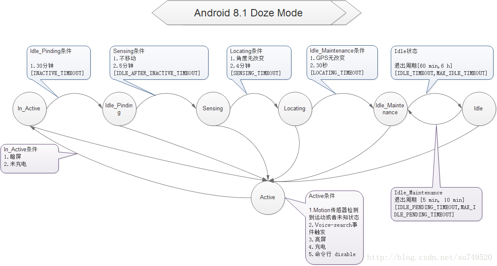

# Doze模式的状态Android-O移动开发

### 以下是BugReport日志  



```
STATE_ACTIVE
2,006: 11-17 10:24:59.876137   900   900 I DeviceIdleController: updateChargingLocked: charging=true 
2,007: 11-17 10:24:59.876244   900   900 I DeviceIdleController: becomeActiveLocked, reason = charging 
2,258: 11-17 10:25:35.586856   900  1037 D DeviceIdleController: handleMessage(7) 
2,285: 11-17 10:25:35.629342   900  1037 D DeviceIdleController: handleMessage(7) 
2,663: 11-17 10:26:04.366455   900   900 I DeviceIdleController: updateChargingLocked: charging=false 
3,823: 11-17 10:26:08.494908   900   900 D DeviceIdleController: updateDisplayLocked: screenOn=false 


STATE_ACTIVE to STATE_INACTIVE 
条件：
暗屏，不充电即可
3,824: 11-17 10:26:08.495002   900   900 D DeviceIdleController: becomeInactiveIfAppropriateLocked() 
3,825: 11-17 10:26:08.495032   900   900 D DeviceIdleController: Moved from STATE_ACTIVE to STATE_INACTIVE 
3,826: 11-17 10:26:08.495209   900   900 D DeviceIdleController: stopMonitoringMotionLocked() 

3,827: 11-17 10:26:08.495311   900   900 D DeviceIdleController: scheduleAlarmLocked(180000, false) 
3,829: 11-17 10:26:08.495907   900   900 D DeviceIdleController: Moved from LIGHT_STATE_ACTIVE to LIGHT_STATE_INACTIVE 

3,830: 11-17 10:26:08.495967   900   900 D DeviceIdleController: scheduleLightAlarmLocked(15000) 
3,831: 11-17 10:26:08.498412   900   900 V AlarmManager: APP set with listener(DeviceIdleController.light) : type=2 triggerAtTime=3649013 win=-1 tElapsed=3649013 maxElapsed=3660261 interval=0 flags=0x8 


3,987: 11-17 10:26:25.015547   900  1064 D AlarmManager: wakeup alarm = Alarm{2ef114b type 2 when 3649013 android}; listener package = DeviceIdleController.lightneedGrouping = false 
/** Device is inactive (screen off) and we are waiting to for the first light idle. */

3,988: 11-17 10:26:25.015989   900  1037 D DeviceIdleController: stepLightIdleStateLocked: mLightState=1 

3,990: 11-17 10:26:25.016176   900  1037 D DeviceIdleController: scheduleLightAlarmLocked(15000) 
3,992: 11-17 10:26:25.017253   900  1037 V AlarmManager: APP set with listener(DeviceIdleController.light) : type=2 triggerAtTime=3665533 win=-1 tElapsed=3665533 maxElapsed=3676782 interval=0 flags=0x8 

/** Device is in the light idle state, trying to stay asleep as much as possible. */

3,994: 11-17 10:26:25.017778   900  1037 D DeviceIdleController: Moved to LIGHT_STATE_IDLE. 

3,996: 11-17 10:26:25.018157   900  1037 D DeviceIdleController: handleMessage(3) 


4,786: 11-17 10:26:41.010752   900  1064 D AlarmManager: wakeup alarm = Alarm{fc74c41 type 2 when 3665533 android}; listener package = DeviceIdleController.lightneedGrouping = false 
4,790: 11-17 10:26:41.017345   900  1037 D DeviceIdleController: stepLightIdleStateLocked: mLightState=4 
4,791: 11-17 10:26:41.017503   900  1037 D DeviceIdleController: scheduleLightAlarmLocked(30000) 
4,792: 11-17 10:26:41.017854   900  1037 V AlarmManager: APP set with listener(DeviceIdleController.light) : type=2 triggerAtTime=3696534 win=-1 tElapsed=3696534 maxElapsed=3719033 interval=0 flags=0x8 


/** Device is in the light idle state, we want to go in to idle maintenance but are
* waiting for network connectivity before doing so. */

4,793: 11-17 10:26:41.018638   900  1037 D DeviceIdleController: Moved to LIGHT_WAITING_FOR_NETWORK. 


4,868: 11-17 10:27:12.026656   900  1064 D AlarmManager: wakeup alarm = Alarm{aedfc2c type 2 when 3696534 android}; listener package = DeviceIdleController.lightneedGrouping = false 

4,870: 11-17 10:27:12.027149   900  1037 D DeviceIdleController: stepLightIdleStateLocked: mLightState=5 

4,872: 11-17 10:27:12.028098   900  1037 D DeviceIdleController: scheduleLightAlarmLocked(15000) 
4,873: 11-17 10:27:12.028447   900  1037 V AlarmManager: APP set with listener(DeviceIdleController.light) : type=2 triggerAtTime=3712545 win=-1 tElapsed=3712545 maxElapsed=3723795 interval=0 flags=0x8 


4,876: 11-17 10:27:12.028905   900  1037 D DeviceIdleController: Moved from LIGHT_STATE_IDLE to LIGHT_STATE_IDLE_MAINTENANCE. 

4,879: 11-17 10:27:12.032376   900  1037 D DeviceIdleController: handleMessage(4) 

5,620: 11-17 10:27:12.509524   900  1037 D DeviceIdleController: handleMessage(7) 
5,651: 11-17 10:27:12.516501   900  1037 D DeviceIdleController: handleMessage(7) 

5,652: 11-17 10:27:13.517743   900  1037 D DeviceIdleController: handleMessage(8) 
5,653: 11-17 10:27:13.517875   900  1037 D DeviceIdleController: Exit: start=+1h1m37s545ms now=+1h1m39s35ms 
/** Device is in the idle state, but temporarily out of idle to do regular maintenance. */

5,654: 11-17 10:27:13.517936   900  1037 D DeviceIdleController: stepLightIdleStateLocked: mLightState=6 
5,655: 11-17 10:27:13.518107   900  1037 D DeviceIdleController: scheduleLightAlarmLocked(30000) 
5,656: 11-17 10:27:13.518371   900  1037 V AlarmManager: APP set with listener(DeviceIdleController.light) : type=2 triggerAtTime=3729035 win=-1 tElapsed=3729035 maxElapsed=3751535 interval=0 flags=0x8 


5,661: 11-17 10:27:13.523054   900  1037 D DeviceIdleController: Moved to LIGHT_STATE_IDLE. 
5,663: 11-17 10:27:13.523870   900  1037 D DeviceIdleController: handleMessage(3) 
```

```
package com.android.server;

/**
 * Keeps track of device idleness and drives low power mode based on that.
 */
public class DeviceIdleController extends SystemService
        implements AnyMotionDetector.DeviceIdleCallback {

    private static final boolean DEBUG = true;

    private static final boolean COMPRESS_TIME = true;


    private void updateConstants() {
            synchronized (DeviceIdleController.this) {
                try {
                    mParser.setString(Settings.Global.getString(mResolver,
                            mHasWatch ? Settings.Global.DEVICE_IDLE_CONSTANTS_WATCH
                                      : Settings.Global.DEVICE_IDLE_CONSTANTS));
                } catch (IllegalArgumentException e) {
                    
                    
                    Slog.e(TAG, "Bad device idle settings", e);
                }

                
                LIGHT_IDLE_AFTER_INACTIVE_TIMEOUT = mParser.getLong(
                        KEY_LIGHT_IDLE_AFTER_INACTIVE_TIMEOUT,
                        !COMPRESS_TIME ? 5 * 60 * 1000L : 15 * 1000L);

                
                LIGHT_PRE_IDLE_TIMEOUT = mParser.getLong(KEY_LIGHT_PRE_IDLE_TIMEOUT,
                        !COMPRESS_TIME ? 10 * 60 * 1000L : 30 * 1000L);

                
                LIGHT_IDLE_TIMEOUT = mParser.getLong(KEY_LIGHT_IDLE_TIMEOUT,
                        !COMPRESS_TIME ? 5 * 60 * 1000L : 15 * 1000L);
                LIGHT_IDLE_FACTOR = mParser.getFloat(KEY_LIGHT_IDLE_FACTOR,
                        2f);

                
                LIGHT_MAX_IDLE_TIMEOUT = mParser.getLong(KEY_LIGHT_MAX_IDLE_TIMEOUT,
                        !COMPRESS_TIME ? 15 * 60 * 1000L : 60 * 1000L);

                
                LIGHT_IDLE_MAINTENANCE_MIN_BUDGET = mParser.getLong(
                        KEY_LIGHT_IDLE_MAINTENANCE_MIN_BUDGET,
                        !COMPRESS_TIME ? 1 * 60 * 1000L : 15 * 1000L);

                
                LIGHT_IDLE_MAINTENANCE_MAX_BUDGET = mParser.getLong(
                        KEY_LIGHT_IDLE_MAINTENANCE_MAX_BUDGET,
                        !COMPRESS_TIME ? 5 * 60 * 1000L : 30 * 1000L);

                
                MIN_LIGHT_MAINTENANCE_TIME = mParser.getLong(
                        KEY_MIN_LIGHT_MAINTENANCE_TIME,
                        !COMPRESS_TIME ? 5 * 1000L : 1 * 1000L);

                
                MIN_DEEP_MAINTENANCE_TIME = mParser.getLong(
                        KEY_MIN_DEEP_MAINTENANCE_TIME,
                        !COMPRESS_TIME ? 30 * 1000L : 5 * 1000L);
                long inactiveTimeoutDefault = (mHasWatch ? 15 : 30) * 60 * 1000L;

                
                INACTIVE_TIMEOUT = mParser.getLong(KEY_INACTIVE_TIMEOUT,
                        !COMPRESS_TIME ? inactiveTimeoutDefault : (inactiveTimeoutDefault / 10));

                
                SENSING_TIMEOUT = mParser.getLong(KEY_SENSING_TIMEOUT,
                        !DEBUG ? 4 * 60 * 1000L : 60 * 1000L);
                
                LOCATING_TIMEOUT = mParser.getLong(KEY_LOCATING_TIMEOUT,
                        !DEBUG ? 30 * 1000L : 15 * 1000L);
                LOCATION_ACCURACY = mParser.getFloat(KEY_LOCATION_ACCURACY, 20);

                
                MOTION_INACTIVE_TIMEOUT = mParser.getLong(KEY_MOTION_INACTIVE_TIMEOUT,
                        !COMPRESS_TIME ? 10 * 60 * 1000L : 60 * 1000L);
                long idleAfterInactiveTimeout = (mHasWatch ? 15 : 30) * 60 * 1000L;

                
                IDLE_AFTER_INACTIVE_TIMEOUT = mParser.getLong(KEY_IDLE_AFTER_INACTIVE_TIMEOUT,
                        !COMPRESS_TIME ? idleAfterInactiveTimeout
                                       : (idleAfterInactiveTimeout / 10));

                
                IDLE_PENDING_TIMEOUT = mParser.getLong(KEY_IDLE_PENDING_TIMEOUT,
                        !COMPRESS_TIME ? 5 * 60 * 1000L : 30 * 1000L);

                
                MAX_IDLE_PENDING_TIMEOUT = mParser.getLong(KEY_MAX_IDLE_PENDING_TIMEOUT,
                        !COMPRESS_TIME ? 10 * 60 * 1000L : 60 * 1000L);
                IDLE_PENDING_FACTOR = mParser.getFloat(KEY_IDLE_PENDING_FACTOR,
                        2f);

                
                IDLE_TIMEOUT = mParser.getLong(KEY_IDLE_TIMEOUT,
                        !COMPRESS_TIME ? 60 * 60 * 1000L : 6 * 60 * 1000L);

                
                MAX_IDLE_TIMEOUT = mParser.getLong(KEY_MAX_IDLE_TIMEOUT,
                        !COMPRESS_TIME ? 6 * 60 * 60 * 1000L : 30 * 60 * 1000L);
                IDLE_FACTOR = mParser.getFloat(KEY_IDLE_FACTOR,
                        2f);

                
                MIN_TIME_TO_ALARM = mParser.getLong(KEY_MIN_TIME_TO_ALARM,
                        !COMPRESS_TIME ? 60 * 60 * 1000L : 6 * 60 * 1000L);

                MAX_TEMP_APP_WHITELIST_DURATION = mParser.getLong(
                        KEY_MAX_TEMP_APP_WHITELIST_DURATION, 5 * 60 * 1000L);
                MMS_TEMP_APP_WHITELIST_DURATION = mParser.getLong(
                        KEY_MMS_TEMP_APP_WHITELIST_DURATION, 60 * 1000L);
                SMS_TEMP_APP_WHITELIST_DURATION = mParser.getLong(
                        KEY_SMS_TEMP_APP_WHITELIST_DURATION, 20 * 1000L);
                NOTIFICATION_WHITELIST_DURATION = mParser.getLong(
                        KEY_NOTIFICATION_WHITELIST_DURATION, 30 * 1000L);
            }
        }

```

我截取的日志，只有以下状态  
ACTIVE  
INACTIVE  
IDLE：doze 省电模式，应用的特性将受到抑制  
IDLE_MAINTENANCE:应用窗口期，间隔退出doze模式让应用数据刷新

## <a id="t4"></a><a id="t4"></a>STATE_ACTIVE

以下任一条件  
1.Motion传感器检测到运动或者未知状态  
2.Voice-search事件触发  
3.亮屏  
4.充电  
5.命令行 disable

### <a id="t5"></a><a id="t5"></a>Motion传感器检测到运动或者未知状态

```
    /** Device is currently active. */
    private static final int STATE_ACTIVE = 0;

    void handleMotionDetectedLocked(long timeout, String type) {
        ....
        mState = STATE_ACTIVE;
        ...
    }
```

### <a id="t6"></a><a id="t6"></a>亮屏或亮屏

```

    void becomeActiveLocked(String activeReason, int activeUid) {
        ....
        mState = STATE_ACTIVE;
        ...
    }

    查看调用关系
    void exitForceIdleLocked() {
        if (mForceIdle) {
            mForceIdle = false;
            if (mScreenOn || mCharging) {
                becomeActiveLocked("exit-force", Process.myUid());
            }
        }
    }

    void updateDisplayLocked() {
        mCurDisplay = mDisplayManager.getDisplay(Display.DEFAULT_DISPLAY);
        
        
        
        boolean screenOn = mCurDisplay.getState() == Display.STATE_ON;
        if (DEBUG) Slog.d(TAG, "updateDisplayLocked: screenOn=" + screenOn);
        if (!screenOn && mScreenOn) {
            mScreenOn = false;
            if (!mForceIdle) {
                becomeInactiveIfAppropriateLocked();
            }
        } else if (screenOn) {
            mScreenOn = true;
            if (!mForceIdle) {
                becomeActiveLocked("screen", Process.myUid());
            }
        }
    }

    void updateChargingLocked(boolean charging) {
        if (DEBUG) Slog.i(TAG, "updateChargingLocked: charging=" + charging);
        if (!charging && mCharging) {
            mCharging = false;
            if (!mForceIdle) {
                becomeInactiveIfAppropriateLocked();
            }
        } else if (charging) {
            mCharging = charging;
            if (!mForceIdle) {
                becomeActiveLocked("charging", Process.myUid());
            }
        }
    }
```

### <a id="t7"></a><a id="t7"></a>命令行 disable

```
    void becomeActiveLocked(String activeReason, int activeUid) {
        ....
        mState = STATE_ACTIVE;
        ...
    }

    查看调用关系
                    if (becomeActive) {
                        becomeActiveLocked((arg == null ? "all" : arg) + "-disabled",
                                Process.myUid());
                    }
```

### <a id="t8"></a><a id="t8"></a>Voice-search

```
    public void exitIdleInternal(String reason) {
        synchronized (this) {
            becomeActiveLocked(reason, Binder.getCallingUid());
        }
    }

          @Override public void exitIdle(String reason) {
            getContext().enforceCallingOrSelfPermission(Manifest.permission.DEVICE_POWER,
                    null);
            long ident = Binder.clearCallingIdentity();
            try {
                exitIdleInternal(reason);
            } finally {
                Binder.restoreCallingIdentity(ident);
            }
        }

SourceInsight的搜索结果，为voice-search
DeviceIdleController.java (base\services\core\java\com\android\server):        @Override public void exitIdle(String reason) {
IDeviceIdleController.aidl (base\core\java\android\os):    void exitIdle(String reason);
PhoneWindowManager.java (base\services\core\java\com\android\server\policy):                            dic.exitIdle("voice-search");
PhoneWindowManager.java (base\services\core\java\com\android\server\policy): 
```

## <a id="t9"></a><a id="t9"></a>STATE\_ACTIVE to STATE\_INACTIVE

同时满足条件：  
暗屏，不充电即可

```
    /** Device is inactive (screen off, no motion) and we are waiting to for idle. */
    private static final int STATE_INACTIVE = 1;

        void becomeInactiveIfAppropriateLocked() {
        if (DEBUG) Slog.d(TAG, "becomeInactiveIfAppropriateLocked()");
        if ((!mScreenOn && !mCharging) || mForceIdle) {
            
            
            if (mState == STATE_ACTIVE && mDeepEnabled) {
                mState = STATE_INACTIVE;
                if (DEBUG) Slog.d(TAG, "Moved from STATE_ACTIVE to STATE_INACTIVE");
                resetIdleManagementLocked();
                scheduleAlarmLocked(mInactiveTimeout, false);
                EventLogTags.writeDeviceIdle(mState, "no activity");
            }
            if (mLightState == LIGHT_STATE_ACTIVE && mLightEnabled) {
                mLightState = LIGHT_STATE_INACTIVE;
                if (DEBUG) Slog.d(TAG, "Moved from LIGHT_STATE_ACTIVE to LIGHT_STATE_INACTIVE");
                resetLightIdleManagementLocked();
                scheduleLightAlarmLocked(mConstants.LIGHT_IDLE_AFTER_INACTIVE_TIMEOUT);
                EventLogTags.writeDeviceIdleLight(mLightState, "no activity");
            }
        }
    }

    
    mInactiveTimeout = mConstants.INACTIVE_TIMEOUT;

    
                    long inactiveTimeoutDefault = (mHasWatch ? 15 : 30) * 60 * 1000L;
                INACTIVE_TIMEOUT = mParser.getLong(KEY_INACTIVE_TIMEOUT,
                        !COMPRESS_TIME ? inactiveTimeoutDefault : (inactiveTimeoutDefault / 10));
```

## <a id="t10"></a><a id="t10"></a>Moved to LIGHT\_STATE\_IDLE

该模式下应用特性会被限制

日志

3,994: 11-17 10:26:25.017778 900 1037 D DeviceIdleController: Moved to LIGHT\_STATE\_IDLE.

```
===============================================================
/** Device is in the light idle state, trying to stay asleep as much as possible. */


===============================================================
case LIGHT_STATE_IDLE: return "IDLE";

            case LIGHT_STATE_PRE_IDLE:
            case LIGHT_STATE_IDLE_MAINTENANCE:
                if (mMaintenanceStartTime != 0) {
                    long duration = SystemClock.elapsedRealtime() - mMaintenanceStartTime;
                    if (duration < mConstants.LIGHT_IDLE_MAINTENANCE_MIN_BUDGET) {
                        
                        mCurIdleBudget += (mConstants.LIGHT_IDLE_MAINTENANCE_MIN_BUDGET-duration);
                    } else {
                        
                        mCurIdleBudget -= (duration-mConstants.LIGHT_IDLE_MAINTENANCE_MIN_BUDGET);
                    }
                }
                mMaintenanceStartTime = 0;
                scheduleLightAlarmLocked(mNextLightIdleDelay);
                mNextLightIdleDelay = Math.min(mConstants.LIGHT_MAX_IDLE_TIMEOUT,
                        (long)(mNextLightIdleDelay * mConstants.LIGHT_IDLE_FACTOR));
                if (mNextLightIdleDelay < mConstants.LIGHT_IDLE_TIMEOUT) {
                    mNextLightIdleDelay = mConstants.LIGHT_IDLE_TIMEOUT;
                }
                if (DEBUG) Slog.d(TAG, "Moved to LIGHT_STATE_IDLE.");
                mLightState = LIGHT_STATE_IDLE;
                EventLogTags.writeDeviceIdleLight(mLightState, reason);
                addEvent(EVENT_LIGHT_IDLE);
                mGoingIdleWakeLock.acquire();
                mHandler.sendEmptyMessage(MSG_REPORT_IDLE_ON_LIGHT);
                break;

===============================================================

    /** Device is about to go idle for the first time, wait for current work to complete. */
    private static final int LIGHT_STATE_PRE_IDLE = 3;
    /** Device is in the light idle state, but temporarily out of idle to do regular maintenance. */
    private static final int LIGHT_STATE_IDLE_MAINTENANCE = 6;

===============================================================    
                    LIGHT_PRE_IDLE_TIMEOUT = mParser.getLong(KEY_LIGHT_PRE_IDLE_TIMEOUT,
                        !COMPRESS_TIME ? 10 * 60 * 1000L : 30 * 1000L);
```

## <a id="t11"></a><a id="t11"></a>Moved to LIGHT\_WAITING\_FOR_NETWORK 本质还是IDLE

4,793: 11-17 10:26:41.018638 900 1037 D DeviceIdleController: Moved to LIGHT\_WAITING\_FOR_NETWORK.

```
===============================================================

            case LIGHT_STATE_IDLE:
            case LIGHT_STATE_WAITING_FOR_NETWORK:
            if (mNetworkConnected || mLightState == LIGHT_STATE_WAITING_FOR_NETWORK) {
                    
                    ..........
            } else {
                    
                    
                    
                    scheduleLightAlarmLocked(mNextLightIdleDelay);
                    if (DEBUG) Slog.d(TAG, "Moved to LIGHT_WAITING_FOR_NETWORK.");
                    mLightState = LIGHT_STATE_WAITING_FOR_NETWORK;
                    EventLogTags.writeDeviceIdleLight(mLightState, reason);
                }
                break;
===============================================================
    /** Device is in the light idle state, trying to stay asleep as much as possible. */
    private static final int LIGHT_STATE_IDLE = 4;
    /** Device is in the light idle state, we want to go in to idle maintenance but are
     * waiting for network connectivity before doing so. */
    private static final int LIGHT_STATE_WAITING_FOR_NETWORK = 5;

```

## <a id="t12"></a><a id="t12"></a>LIGHT\_STATE\_IDLE to LIGHT\_STATE\_IDLE_MAINTENANCE

```
            case LIGHT_STATE_IDLE:
            case LIGHT_STATE_WAITING_FOR_NETWORK:
                if (mNetworkConnected || mLightState == LIGHT_STATE_WAITING_FOR_NETWORK) {
                    // We have been idling long enough, now it is time to do some work.
                    mActiveIdleOpCount = 1;
                    mActiveIdleWakeLock.acquire();
                    mMaintenanceStartTime = SystemClock.elapsedRealtime();
                    if (mCurIdleBudget < mConstants.LIGHT_IDLE_MAINTENANCE_MIN_BUDGET) {
                        mCurIdleBudget = mConstants.LIGHT_IDLE_MAINTENANCE_MIN_BUDGET;
                    } else if (mCurIdleBudget > mConstants.LIGHT_IDLE_MAINTENANCE_MAX_BUDGET) {
                        mCurIdleBudget = mConstants.LIGHT_IDLE_MAINTENANCE_MAX_BUDGET;
                    }
                    scheduleLightAlarmLocked(mCurIdleBudget);
                    if (DEBUG) Slog.d(TAG,
                            "Moved from LIGHT_STATE_IDLE to LIGHT_STATE_IDLE_MAINTENANCE.");
                    mLightState = LIGHT_STATE_IDLE_MAINTENANCE;
                    EventLogTags.writeDeviceIdleLight(mLightState, reason);
                    addEvent(EVENT_LIGHT_MAINTENANCE);
                    mHandler.sendEmptyMessage(MSG_REPORT_IDLE_OFF);
```



具体解释看源码

```
   void stepIdleStateLocked(String reason) {
        if (DEBUG) Slog.d(TAG, "stepIdleStateLocked: mState=" + mState);
        EventLogTags.writeDeviceIdleStep();

        final long now = SystemClock.elapsedRealtime();
        if ((now+mConstants.MIN_TIME_TO_ALARM) > mAlarmManager.getNextWakeFromIdleTime()) {
            
            if (mState != STATE_ACTIVE) {
                becomeActiveLocked("alarm", Process.myUid());
                becomeInactiveIfAppropriateLocked();
            }
            return;
        }

        switch (mState) {
            case STATE_INACTIVE:
                
                
                startMonitoringMotionLocked();
            
                scheduleAlarmLocked(mConstants.IDLE_AFTER_INACTIVE_TIMEOUT, false);
                
                
                mNextIdlePendingDelay = mConstants.IDLE_PENDING_TIMEOUT;
                mNextIdleDelay = mConstants.IDLE_TIMEOUT;
                
                mState = STATE_IDLE_PENDING;
                if (DEBUG) Slog.d(TAG, "Moved from STATE_INACTIVE to STATE_IDLE_PENDING.");
                EventLogTags.writeDeviceIdle(mState, reason);
                break;
            case STATE_IDLE_PENDING:
            
            
                mState = STATE_SENSING;
                if (DEBUG) Slog.d(TAG, "Moved from STATE_IDLE_PENDING to STATE_SENSING.");
                EventLogTags.writeDeviceIdle(mState, reason);
                
                scheduleSensingTimeoutAlarmLocked(mConstants.SENSING_TIMEOUT);
                cancelLocatingLocked();
                mNotMoving = false;
                mLocated = false;
                mLastGenericLocation = null;
                mLastGpsLocation = null;
                mAnyMotionDetector.checkForAnyMotion();
                break;
            case STATE_SENSING:
                cancelSensingTimeoutAlarmLocked();
                
            

                mState = STATE_LOCATING;
                if (DEBUG) Slog.d(TAG, "Moved from STATE_SENSING to STATE_LOCATING.");
                EventLogTags.writeDeviceIdle(mState, reason);
                
                scheduleAlarmLocked(mConstants.LOCATING_TIMEOUT, false);
                if (mLocationManager != null
                        && mLocationManager.getProvider(LocationManager.NETWORK_PROVIDER) != null) {
                    mLocationManager.requestLocationUpdates(mLocationRequest,
                            mGenericLocationListener, mHandler.getLooper());
                    mLocating = true;
                } else {
                    mHasNetworkLocation = false;
                }
                if (mLocationManager != null
                        && mLocationManager.getProvider(LocationManager.GPS_PROVIDER) != null) {
                    mHasGps = true;
                    mLocationManager.requestLocationUpdates(LocationManager.GPS_PROVIDER, 1000, 5,
                            mGpsLocationListener, mHandler.getLooper());
                    mLocating = true;
                } else {
                    mHasGps = false;
                }
                
                
                if (mLocating) {
                    break;
                }

                
            case STATE_LOCATING:
            
                

                cancelAlarmLocked();
                cancelLocatingLocked();
                mAnyMotionDetector.stop();

            case STATE_IDLE_MAINTENANCE:
             
                

                scheduleAlarmLocked(mNextIdleDelay, true);
                if (DEBUG) Slog.d(TAG, "Moved to STATE_IDLE. Next alarm in " + mNextIdleDelay +
                        " ms.");
                mNextIdleDelay = (long)(mNextIdleDelay * mConstants.IDLE_FACTOR);
                if (DEBUG) Slog.d(TAG, "Setting mNextIdleDelay = " + mNextIdleDelay);
                mNextIdleDelay = Math.min(mNextIdleDelay, mConstants.MAX_IDLE_TIMEOUT);
                if (mNextIdleDelay < mConstants.IDLE_TIMEOUT) {
                    mNextIdleDelay = mConstants.IDLE_TIMEOUT;
                }
                mState = STATE_IDLE;
                if (mLightState != LIGHT_STATE_OVERRIDE) {
                    mLightState = LIGHT_STATE_OVERRIDE;
                    cancelLightAlarmLocked();
                }
                EventLogTags.writeDeviceIdle(mState, reason);
                addEvent(EVENT_DEEP_IDLE);
                mGoingIdleWakeLock.acquire();
                mHandler.sendEmptyMessage(MSG_REPORT_IDLE_ON);
                break;
            case STATE_IDLE:
            
                
                mActiveIdleOpCount = 1;
                mActiveIdleWakeLock.acquire();
                scheduleAlarmLocked(mNextIdlePendingDelay, false);
                if (DEBUG) Slog.d(TAG, "Moved from STATE_IDLE to STATE_IDLE_MAINTENANCE. " +
                        "Next alarm in " + mNextIdlePendingDelay + " ms.");
                mMaintenanceStartTime = SystemClock.elapsedRealtime();
                mNextIdlePendingDelay = Math.min(mConstants.MAX_IDLE_PENDING_TIMEOUT,
                        (long)(mNextIdlePendingDelay * mConstants.IDLE_PENDING_FACTOR));
                if (mNextIdlePendingDelay < mConstants.IDLE_PENDING_TIMEOUT) {
                    mNextIdlePendingDelay = mConstants.IDLE_PENDING_TIMEOUT;
                }
                mState = STATE_IDLE_MAINTENANCE;
                EventLogTags.writeDeviceIdle(mState, reason);
                addEvent(EVENT_DEEP_MAINTENANCE);
                mHandler.sendEmptyMessage(MSG_REPORT_IDLE_OFF);
                break;
        }
    }

```

Doze模式的省电效果毋庸置疑，我们关注这个模式切换的好处，就是能否借鉴这个思路，进行精确的空闲模式识别。新增一些静默重启的操作，来解决android 系统过于内存碎片化，或者准确识别夜间模式，而不是通过时间进行考量。