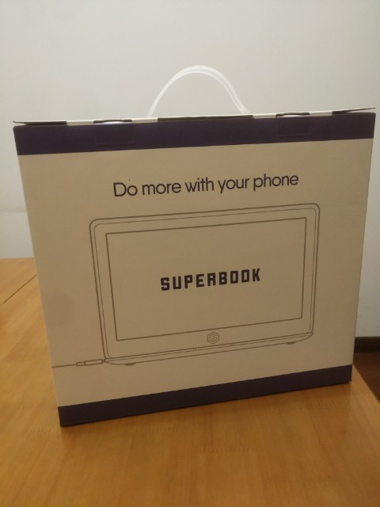
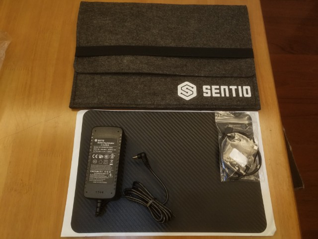
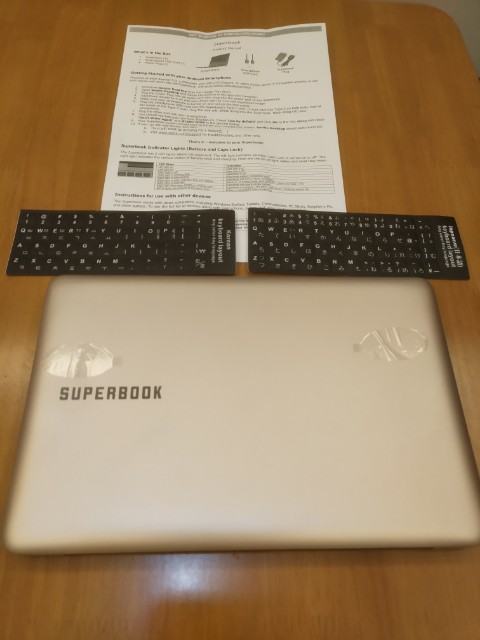
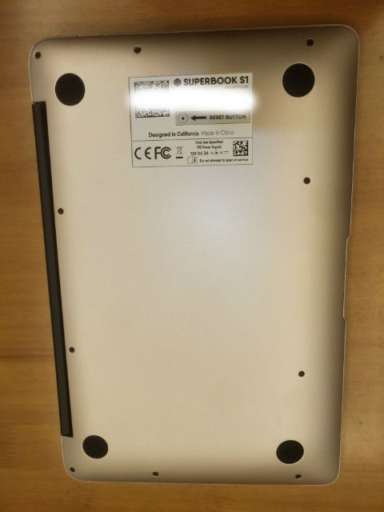
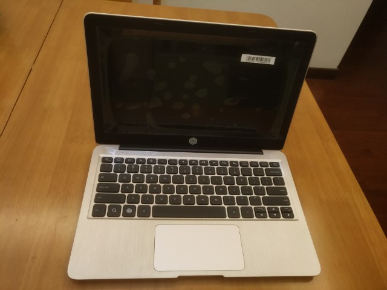
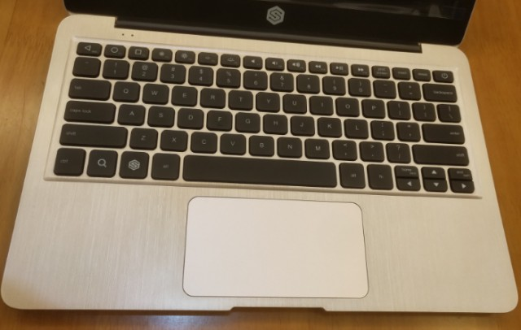
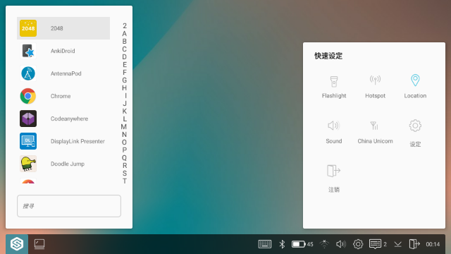
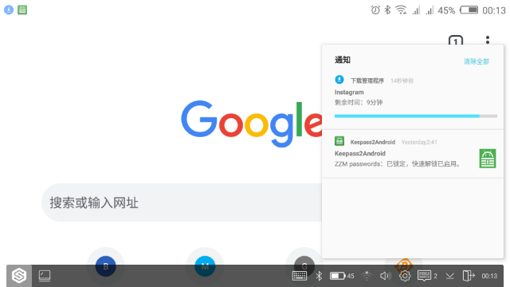
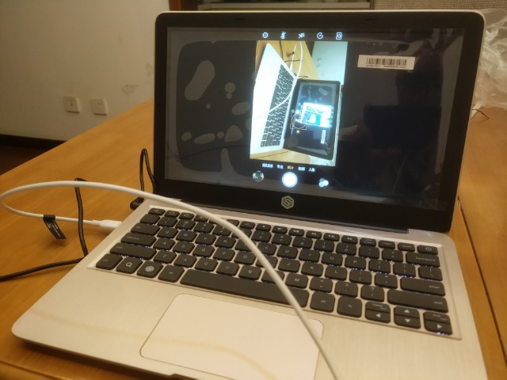

## 关于 Sentio Superbook

2016 年的时候我写了篇 [使用DisplayLink显卡组装Android Superbook](https://zohead.com/archives/displaylink_superbook/) 的文章，介绍如何使用 Motorola Lapdock 扩展坞和 DisplayLink USB 显卡实现手机扩展笔记本的效果。差不多 9 月份我就下单支持了 Kickstarter 上 [Sentio](http://www.sentio.com/) 团队推出的 [Superbook](https://www.kickstarter.com/projects/andromium/the-superbook-turn-your-smartphone-into-a-laptop-f) 项目，并花了 154 美元选择了 1080p 屏幕的高配版本（99 美元基础费用 + 30 美元升级费用 + 25 美元运费）。

比较坑的是 Superbook 项目众筹达到目标之后，Sentio 团队中间一拖再拖，不断出现供应商及硬件固件相关的问题，导致我的 Superbook 等了两年多直到 2019 年 1 月份才从香港发到我手上。此处需要额外吐槽的是联邦快递，即使 Superbook 价格里已经包含了关税，联邦无视 Sentio 提供的价格单仍然主动报关，导致到手时我还是另外付了 100 人民币左右的关税。

## 开箱及外观

毕竟只是廉价众筹的产品，Superbook 的外包装也挺简单：

众筹版本额外赠送了 Superbook 笔记本保护套及一张 A 面贴纸，自带的电源适配器则是 12V 3A 的：

包装里只附带了一张 A4 纸的简单使用说明，先看看主机正面，金色机身正面也只有 Superbook 字样，和我的 Acer Chromebook 14 比起来还是很小巧的：

整个机身只有左侧的一个 USB Type-A 扩展接口（可外接其它 USB 设备）以及和手机连接的 USB Type-C 接口。
从 D 面可以看到具体型号是 Superbook S1，由于没有处理器之类的不需要散热孔，D 面也只有一个重置按钮：

B 面和 C 面如下，打开时感觉转轴稍微有点生硬，11 寸的 1080p IPS 屏幕下面就是 Sentio 的图标，C 面做了点磨砂处理，键盘上方只有电池和工作状态指示灯：

主要关注下键盘，可以看到 Superbook 主要就是为 Android 专门设计的：

键盘上最上面一排开始就是 返回、主页及切换窗口按键，接着是常用的屏幕亮度和音量控制键等，最下面增加了搜索键和专门的 Sentio 按键（实现一些 Superbook 设备自身的功能）；支持多点触摸的触控板用起来手感也只能说是中规中矩。

## 初步使用

由于 2016 年我预订的时候用的还是华硕 Zenfone2 手机，选的配件还是官方的 USB Type-C 转 Micro-USB 线，还好现在换的 Nubia Z17 手机也是 USB OTG 功能的，只是需要自己购置 USB Type-C 转 Type-C 的线咯。

按照官方 [Sentio Wiki](http://sentio.wikia.com/) 页面上的说明，连接 Android 手机之前，手机上需要安装 [DisplayLink Presenter](https://play.google.com/store/apps/details?id=com.displaylink.presenter) 和 [Sentio Desktop](https://play.google.com/store/apps/details?id=com.sentio.desktop) 这两个 App。

DisplayLink Presenter 相当于 Superbook 自带 DisplayLink USB 显卡的 Android 驱动程序（只负责镜像手机屏幕）；Sentio Desktop 就是一个应用启动器，运行之后会启动一个类似桌面环境，用户可以在 Sentio Desktop 中运行手机里的其它 App。

我的 Nubia Z17 上 DisplayLink Presenter 工作倒是没问题，但 Sentio Desktop 始终卡在要求 Android 多窗口支持这一步上，我的手机虽然运行的是 Android 7.1.1 系统，但是 Nubia 官方系统把这个重要特性给阉割了（有过 Nubia 手机使用经验的同学们估计也知道 Nubia 的系统有多坑）。

一番搜索之后，我在 Sentio Wiki 上的 [Troubleshooting/Getting Started](http://sentio.wikia.com/wiki/Troubleshooting/Getting_Started) 页面上找到解决办法，通过 adb 运行下面两个命令并重启手机（第一条命令用于开启 Android 多窗口支持）：

settings put global enable_freeform_support 1
pm grant com.sentio.desktop android.permission.WRITE_SECURE_SETTINGS
这样 Sentio Desktop 程序好歹能在我的 Nubia Z17 手机上运行起来了：

Sentio Desktop 桌面环境看起来也是比较简洁的，左下角的启动图标可以弹出搜索运行 App，右下角通知区域则包含常用的功能开关，蓝牙、WLAN、音量都可以直接控制，设置图标弹出的 **快速设定** 界面略显简单。

手机屏幕实际投射到 Superbook 上我才发现 Nubia Z17 即使通过 adb 命令开启了多窗口支持，Sentio Desktop 桌面环境里还是只能同时显示一个 App，并不能实现自由调整窗口大小更别说多窗口运行 App 了。

Sentio Desktop 初步使用起来，手机上的 Chrome 浏览器、视频播放器等支持横屏的 App 经过放大投射到 Superbook 上显示效果还是不错的，只是播放高清网络视频和玩一些游戏的时候会略有些卡顿。Superbook 的键盘和触控板也能直接控制手机，Android 通知栏也能点击通知图标弹出来：

不过对于不支持横屏显示的 App，例如 Nubia 自带相机这种投射到 Superbook 上效果就很一般了：

这个问题还是多窗口支持被阉割了导致 App 无法以单独窗口形式运行导致的，暂时只能让 Nubia Z17 手机系统来背锅了，后续我可以换像一加这种使用类原生系统的手机来测试咯，毕竟这样会使 Sentio Desktop 桌面环境的使用体验大打折扣。

## 问题

部分使用 USB Type-C 接口的手机例如我的 Nubia Z17 连接 Superbook 之后，Superbook 为手机充电的功能并不能工作，而且 USB 连接也不太稳定，需要通过 Fn + P 键关闭 Superbook USB 充电功能之后才能正常使用，不太确定是否与我购买的 USB Type-C 数据线有关。

另外我在测试 Android 电视棒的时候还是发现有些问题，我用的是之前买的 [MK809IV](https://zohead.com/archives/mk809iv-1080p/) Android 电视棒，由于 Android 电视棒一般只支持通过自带的 HDMI 接口进行输出，我的住处也没有 HDMI 显示器或者电视，导致 Android 电视棒接上 Superbook 之后也没有任何反应无法使用。

即便对于我买的这种可以自由安装 App 的 Android 电视棒，也会因为电视棒 Android 4.4 版本太低而无法使用 Sentio Desktop App，更别说很多厂商提供的电视棒还无法自行安装卸载 App 那就更加不可行了。

因此 Sentio Superbook 的限制就是所连接的设备必须支持 DisplayLink USB 显卡，我曾经在项目众筹阶段向发起人提议做成像 Motorola Lapdock 那样，将屏幕的 HDMI 输入开放一个接口可以让外部设备连接，并增加硬件开关切换 HDMI 输入和显卡通过 USB Hub 显示，不过这样硬件做起来比较复杂也就没被采纳。

## 总结

接着我还找了 Chromebook、Windows 10 笔记本等设备分别接到 Superbook 上，由于 Chrome OS 和 Windows 10 系统都自带了 DisplayLink USB 显卡驱动，接上之后都能自动识别并扩展屏幕到 Superbook，做为外接显示器来用体验还是比较满意的。

经过这段时间的使用，Superbook 还是能解决我的某些需求的，只是由于 Nubia Z17 手机的各种限制体验会受些影响。目前 Superbook 基本被我由于之前买的一个老款 Intel Computer Stick，这类 PC stick 设备升级到 Windows 10 系统之后接上 Superbook 就可以做主屏幕显示了，不用额外接显示器和键盘鼠标当成一台 Windows 备用机来用还是不错咯。