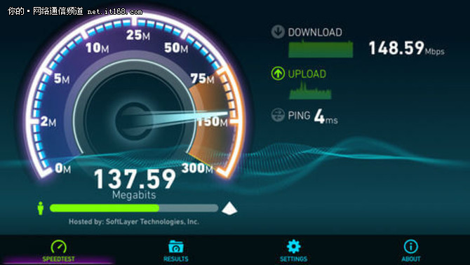
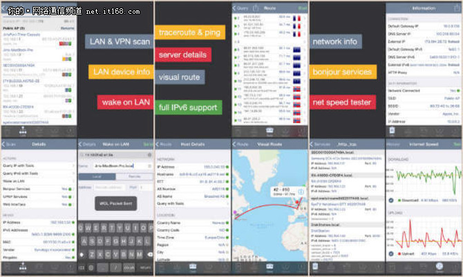
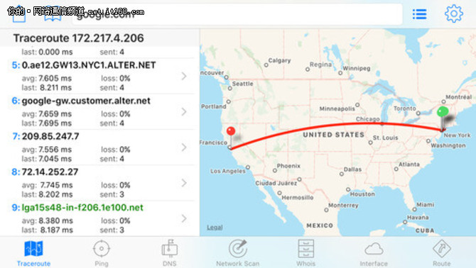
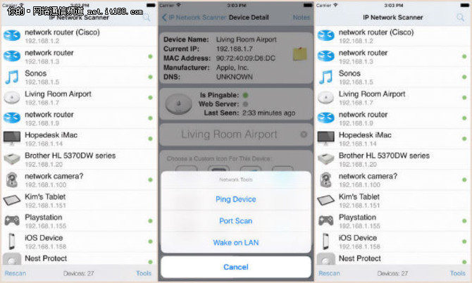
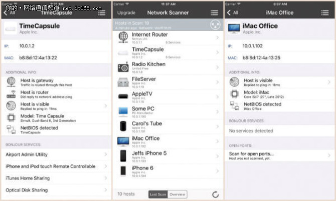
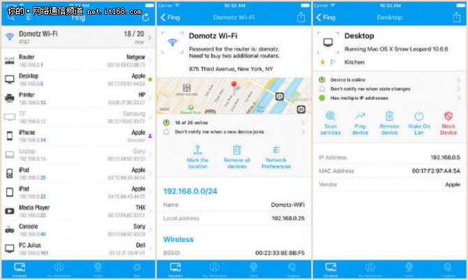
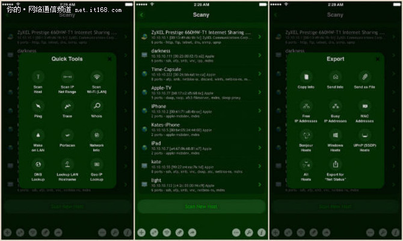
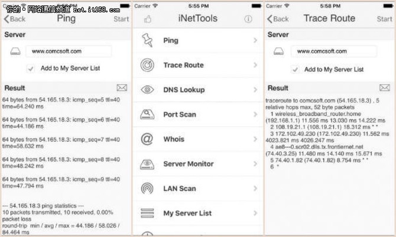
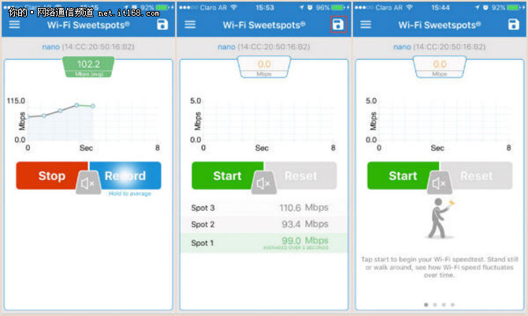

　【IT168 技术】作为一个优秀的网工没有必要依靠电脑来分析网络和测试互联网速度，现在有iOS专用应用程序可帮助您分析WiFi网络、扫描WiFi通道以及分析网络等。这些iPhone WiFI工具还可作为WiFi通道扫描器，实时提供对网络访问的总览。WiFi网络分析器应用程序可分析通道，让您选择最不拥堵的通道来连接设备，以获得最佳性能。

　　您可以测试测试智能手机的WiFi信号强度，除了WiFI提供的功能外，最受欢迎的是随时可访问的互联网连接。WiFi查找器应用程序可在本地区域搜索以及找到免费的可用WiFi，让您免费使用网络服务。目前，并没有媒介可物理上评估是什么让WiFi信号下降和变慢。然而，下面这些WiFi扫描仪和WiFi网络分析仪可帮助检查网络速度和范围。

　　**适用于iPhone的Wi-Fi速度测试器**
　　当你想要快速测试你的家庭WiFi速度或者数据计划速度，这些互联网速度测试器非常好用，而且不需要打开手机上的任何浏览器。
　**　1. Ookla的互联网速度测试**

　　WiF速度测试：是| WiFi扫描仪/网络分析仪：否| WiFi 扫描仪/网络通道扫描仪：否|网络诊断工具：否| WiFi信号强度：否| **下载**： [(L)](https://itunes.apple.com/us/app/speedtest-by-ookla/id300704847?mt=8&ign-mpt=uo=8)[iTunes](https://itunes.apple.com/us/app/speedtest-by-ookla/id300704847?mt=8&ign-mpt=uo=8)

▲Speedtest
　　当您想要测试WiFi连接或者3G/4G网络的互联网速度，这个互联网很有效。
　　这个iOS工具不仅可用于速度测试，您还可以使用它进行上传速度和ping测试。这个互联网速度测试工具有很好的界面，还可存储信息以供稍后比对。
　　**适用于iPhone的Wi-Fi扫描器和网络分析器**

　　如果你想要搜索本地区域可用WiFi，WiFi扫描仪可派上用场。除了网络质量和ping速度测试，这些应用程序可更新可用的WiFi和移动网络。下面是针对iPhone和iPad的几款WiFi分析应用程序。

　**　2.Network Analyzer**

　　WiF速度测试：是| WiFi扫描仪/网络分析仪：是| WiFi 扫描仪/网络通道扫描仪：是|网络诊断工具：是| WiFi信号强度：是| **下载：**  [(L)](https://itunes.apple.com/us/app/network-analyzer-wifi-scanner-speed-test-tools/id557405467?mt=8&ign-mpt=uo=8)[iTunes](https://itunes.apple.com/us/app/network-analyzer-wifi-scanner-speed-test-tools/id557405467?mt=8&ign-mpt=uo=8)

　　这是一款优秀的WiFi分析仪，可帮助您评估封闭的受防火墙保护的开放端口。Network Analyzer让您可测试WiFi信号强度，并在不同位置进行网络速度测试。该应用程序可不断更新当前蜂窝和WiFi连接。

▲Network Analyzer - wifi scanner, speed test, tools

　　您还可使用地点的地理位置数据获取WiFi的可视化跟踪路线图，以及通过原生iOS用户界面快速检测早期问题。它可兼容IPv4和IPv6，您还可以扫描连接到您个人热点的设备。

　　**3. IT Tools–网络分析仪**

　　WiF速度测试：是| WiFi扫描仪/网络分析仪：是| WiFi 扫描仪/网络通道扫描仪：是|网络诊断工具：是| WiFi信号强度：是| [下载： iTunes](https://itunes.apple.com/us/app/it-tools-network-analyzer/id324054954?mt=8&ign-mpt=uo=8)

　　IT Tools–Network Analyzer可帮助您确认所有使用您网络的设备，当发生错误以及响应时，您可为该应用程序选择合适的接口和可选声音。所有网络统计数据都会实时提供，并会查找国际域名。

▲**IT Tools - Network Analyzer**

　　通过NetBIOS发现正在运行的设备。该WiFI扫描仪工具还可在长时间ping会话中防止屏幕进入睡眠状态。您可选择使用现有系统DNS服务器或者自己提供，它通过邮件和消息发送结果信息。

　　**WiFi扫描器/网络通道扫描仪**

　　当您所在的区域挤满了各种网络，您可将网络通道更改为不太拥挤的通道。这些iOS网络通道扫描仪可帮助您分析所有可用的WiFi路由器通道，并在您选择开放WiFi之前检查质量。

**　　4. IP Scanner**

　　WiF速度测试：是| WiFi扫描仪/网络分析仪：是| WiFi 扫描仪/网络通道扫描仪：是|网络诊断工具：是| WiFi信号强度：是| [下载： iTunes](https://itunes.apple.com/us/app/ip-network-scanner/id335517657?mt=8&ign-mpt=uo=8)

　　IP Scanner是高速WiFi扫描仪，可在几秒钟将结果显示在您面前。并且，结果数据是可定制化的，并会将您个性化名称分配给连接或发现的设备。这款应用程序的设计很简洁，各个方面都给人以专业的感觉。

▲**IP Network Scanner**

　　它通过电子邮件或者bonjour导入和导出扫描结果，您可保存以及查看所有过去的扫描结果。您还可保存并导入自定义设备列表或同步到iCloud或DropBox。iPhone和ipad中还有几个内置工具可快速使用。

　　**5. iNet –网络扫描仪**

　　WiF速度测试：是| WiFi扫描仪/网络分析仪：是| WiFi 扫描仪/网络通道扫描仪：是|网络诊断工具：是| WiFi信号强度：是| [下载： iTunes](https://itunes.apple.com/in/app/inet-network-scanner/id340793353?mt=8&ign-mpt=uo=8)

　　iNet网络扫描仪可探索您的网络，并了解涉及的安全风险。这个WiFi网络分析仪可在低级别进行扫描，并显示隐藏的设备。最近十次扫描会自动存储在应用程序中，它可让您可在稍后检查。

▲**iNet - Network Scanner**

　　该应用程序可以轻松地概述计算机网络情况，即使是没有经验的用户也可使用。您还可通过该应用程序远程唤醒以及设置收藏夹列表，还可重新启动Mac设备。所连接设备的附加信息让您可了解机型、主机可视性等详细信息。

　　**iPhone网络诊断工具和IP扫描仪**

　　网络诊断工具是iPhone中必备工具，它可检查连接到您网络的设备、网络质量，并当有人连接到家庭网络时提醒您。这个iPhone网络工具可帮助您避免任何入侵者攻击，如果有人加入网络可及时通知。

　**　6. Fing**

　　WiF速度测试：是| WiFi扫描仪/网络分析仪：是| WiFi 扫描仪/网络通道扫描仪：是|网络诊断工具：是| WiFi信号强度：是| [下载： iTunes](https://itunes.apple.com/in/app/fing-network-scanner/id430921107?mt=8&ign-mpt=uo=8)

　　Fing是一款伟大的WiFi分析仪和WiFi通道扫描仪，可帮助您对网络进行详细的审核。当您打开该应用程序时，它会自动要求您扫描网络。同时，它会使用Wake on LAN功能ping设备以及将其唤醒。当新设备加入网络时，它会立即发出警报，并检查其WiFi强度。

▲fing
　　它还可通过连接网络的IP支持设备识别。Fing是很好的必备应用程序，它是完全免费的网络实用程序，并且使用大胆的颜色，让每个功能都清晰可见。
　　**7. Scany**

　　WiF速度测试：是| WiFi扫描仪/网络分析仪：是| WiFi 扫描仪/网络通道扫描仪：是|网络诊断工具：是| WiFi信号强度：是| [下载： iTunes](https://itunes.apple.com/us/app/scany-network-scanner/id328077901?mt=8&uo=8&at=10lryA)

　　Scany是一款可用于iOS设备的WiFi网络分析仪，它可发现开放端口以及存在的漏洞。它包含超快速智能算法，并对巨大网络进行了优化。您可即时查找LAN主机名，并配有多模式以及多路径跳数检测。

▲**Scany**

　　该WiFi分析仪可支持所有顶级域名和WHOIS跟踪支持。该应用程序让您可轻松地扫描LAN，并查找所需要的任何DNS。这一款可靠的有用的应用程序，可帮助管理员和用户保护其本地网络。

　　**iPhone网络诊断工具**

　　对于网络专业人士来说，这些是功能最强大的iOS工具，它可扫描网络端口、跟踪路由、DNS查找等。这些iPhone应用程序可监控连接到网络的服务器，并列出清单供以后参考。

　　**8. iNetTools Pro –网络诊断工具**

　　WiF速度测试：是| WiFi扫描仪/网络分析仪：是| WiFi 扫描仪/网络通道扫描仪：是|网络诊断工具：是| WiFi信号强度：是| [下载： iTunes](https://itunes.apple.com/us/app/inettools-pro-network-diagnose-tools/id592322129?mt=8&ign-mpt=uo=8)

　　iNetToolsPro是专业版iNetTools，它可用于在iPhone和ipad等设备上进行网络诊断。该应用程序是通用的，支持大多数iOS设备。您只需购买一次，即可将它用于所有其他iOS设备。该应用程序的简单界面让iphone和ipad设备的网络问题诊断变得非常简单。

▲**iNetTools Pro - Network Diagnose Tools**
　　它还提供无限的电子邮件技术支持，可帮助您处理问题以及查询。通过服务器列表，您可以快速了解并访问常用服务器。
　　**9. Wi-Fi SweetSpots**

　　WiF速度测试：是| WiFi扫描仪/网络分析仪：是| WiFi 扫描仪/网络通道扫描仪：是|网络诊断工具：是| WiFi信号强度：是| [下载： iTunes](https://itunes.apple.com/in/app/wi-fi-sweetspots/id855457383?mt=8&ign-mpt=uo=8)

　　通过Wi-Fi SweetSpots，您可了解WiFi连接速度随着时间的变化。这是一款优秀的WiFi分析仪应用程序，它可根据速度找到WiFi热点。这些热点根据WiFi信号强度来分类，以找出最快和最慢的信号。该应用程序还可帮助优化网络性能。

▲**Wi-Fi SweetSpots**
　　Wi-Fi SweetSpots还可指示用户让其了解在什么位置或地点可获得最大速度。在下载巨大文件之前，您还可以知道网络是否具备所需的速度和信号强度。

　　WiFi连接缓慢对于很多人来说就像是地狱。通过这些WiFi分析仪工具，您可快速了解WiFi信号强度、通道信号强度、ping速度甚至是当前的WiFi速度。您可通过WiFi网络分析仪应用程序和WiFi通道扫描仪快速提高网络连接以及信号强度。

3