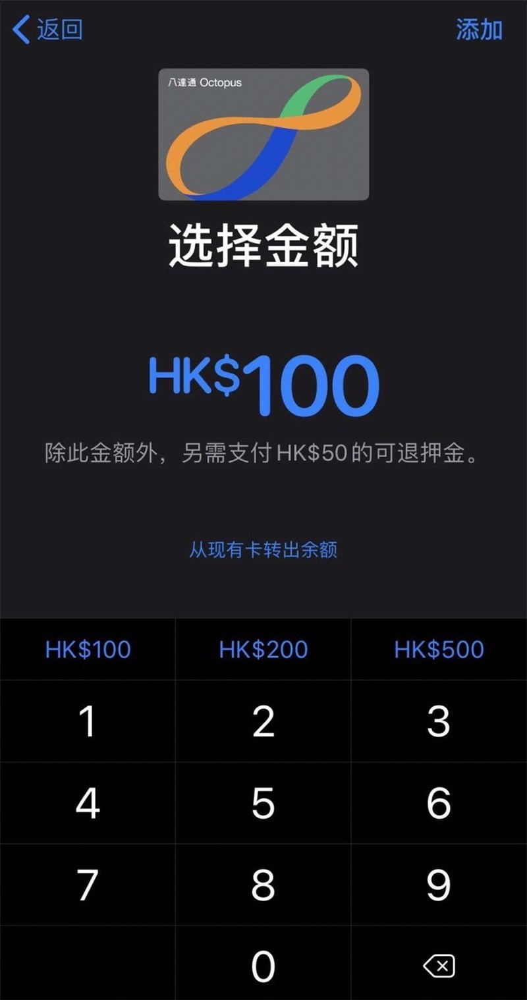
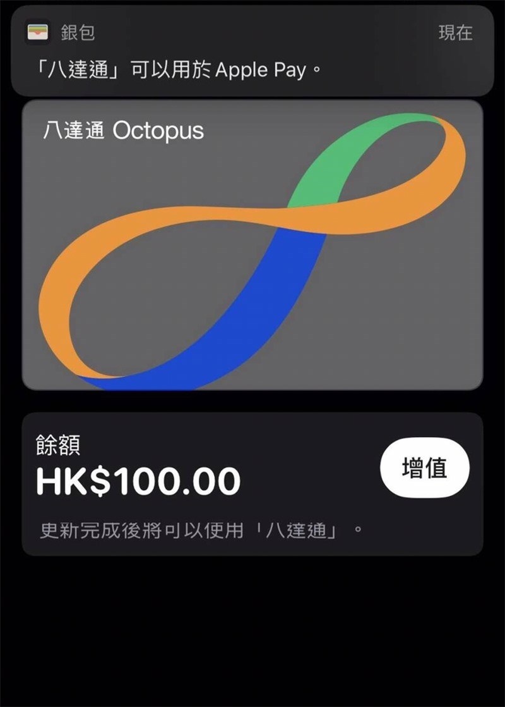
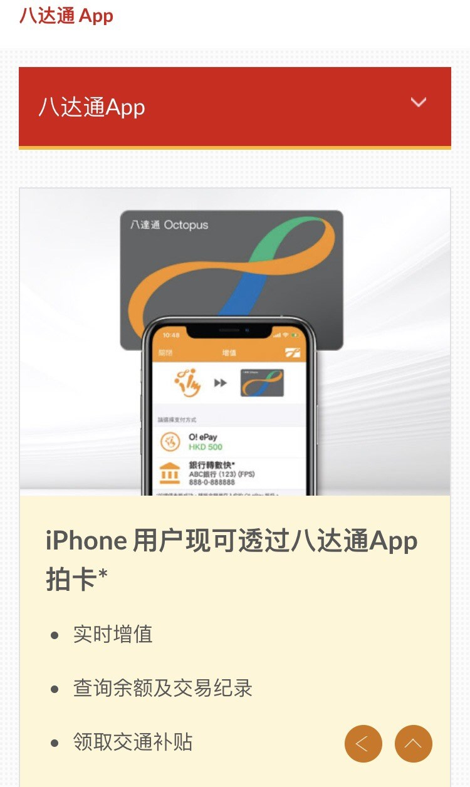

# Apple Pay 正式支持香港八达通 Octopus 公交卡

刚刚

67

来源：[IT 之家](https://www.ithome.com/)

今天，苹果 iPhone Apple Pay 正式上线支持香港八达通卡。香港八达通官方介绍，iPhone 用户现可透过八达通 App 拍卡，支持实时增值、查询余额及交易记录、领取交通补贴等。

  

  

八达通 App 拍卡功能现已登陆 iPhone！无论 Android 还是 iPhone 用家，只要成为八达通 App 的登记用户，便可简易轻松享用八达通的全方位服务 *，让你随时随地在手机上管理八达通卡及 O! ePay 账户：

  

  

**增值八达通卡**

  

使用 O! ePay 账户内的结余或透过转数快随时随地增值八达通卡。

  

**查询八达通卡**

  

查阅八达通卡余额及消费纪录，以及过往三个月的消费纪录分类。

  

**领取公共交通费用补贴**

  

领取补贴、查阅公共交通开支记录、补贴金额及指定车船票的登记状况。

  

**购买巴士及渡轮月票、缴付账单**

  

随时随地购买巴士及渡轮月票，以及缴付账单。

  

**其他功能**

  

启动八达通自动增值服务或实时提升自动增值至 $500

  

报失个人八达通或附有自动增值的八达通

  

登记及启动八达通日日赏会籍，查阅八达通日日赏 $ 余额

  

享用商户提供的精选优惠

  

**备注：**

  

\* 八达通拍卡功能适用于：

  

Android - 具备近场通讯功能 (NFC)

  

iOS - iPhone 7 或之后型号，并已安装 iOS 13 或以上，或已连接八达通流动读写器

  

八达通拍卡功能只适用于号码为 9 位数字的八达通卡 (即 8 个数字加括号内的 1 个数字)。如你持有第一代租用版八达通卡（卡上的号码最后数字并无括号），可到位于指定港铁站及商场内的八达通服务站免费换卡。

  

  

图文来自 IT 之家，如有侵权请联系删除

标签： [Apple](https://www.i4.cn/Apple.html "Apple")

