

# 安装MAC OS系统看完后能让你马上用上最新苹果系统

搜易老刘 2020-03-01 06:45:50

对于像我一样从接触电脑就使用windows系统的用户来说MAC OS可能好奇性远大于需求，面对白苹果动辄万元起步的价格在看看干瘪的钱包，如果仅仅是想体验下苹果系统的魅力的话黑苹果就成了不错的选择。疫情期间呆在家中也是对战疫的一种支持。所以有了这次的黑苹果装机之旅

目前也是跟着教程一步一步完成安装目前显卡、USB、睡眠等驱动均能正常识别。这里推荐黑果小兵、黑苹果屋、以及B站在这三个地方可以找到非常详细、系统的安装配置教程。文本以安装黑果小兵最新镜像为例，并插入了我在安装中遇到的问题及解决方法分享给大家。

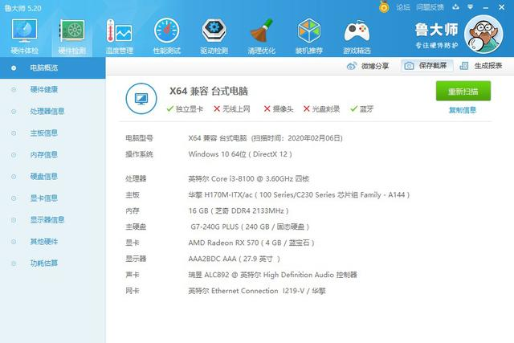

  

**安装需要：**

l intelCPU.64位Windows操作系统（我使用的是windows10）

l 实际内存8G以上的U盘一个(建议使用USB3.0U盘，否则会很耗时间)

**资源清单：所有物料在黑果小兵网站均能找到下载地址**

l balenaetcher（制作系统U盘软件）

l DiskGenius（磁盘深度操作工具）

l EasyUEFI（配置开机引导项的软件）

l macOS Catalina 10.15.3 .dmg（写入Colover的Mac最新系统镜像文件）

**开始安装一、为Mac系统分配磁盘空间**

1.首先在开始菜单处右键单击，在弹出的长列表中选择‘磁盘管理’

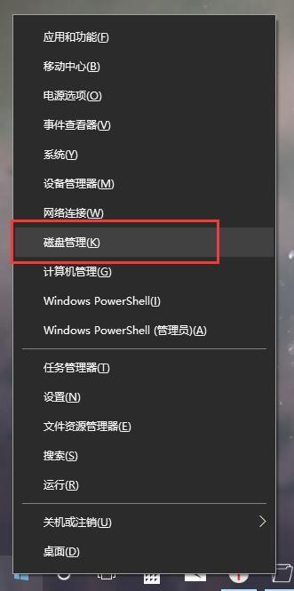

  

2.选择一个空闲空间较大的磁盘右键单击，选择‘压缩卷 ’

  

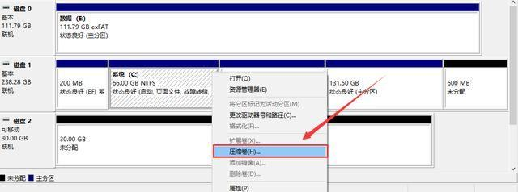

  

3.在弹出窗口中输入你打算为Mac系统预留的空间，建议40G以上(40960),然后点击下方‘压缩’

  

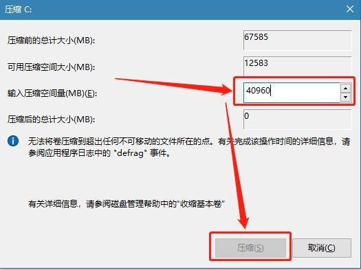

  

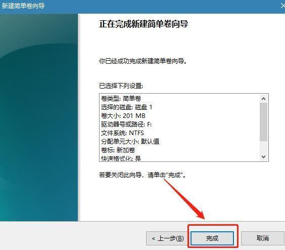

  

**二、制作Mac系统U盘**

1.下载balenaetcher并安装，下载macOS Catalina 10.15.3.dmg

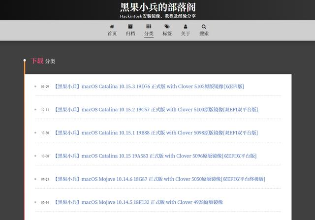

  

PS:双EFI版的好处是既能实现黑苹果安装引导同时还支持weiPE引导两种模式引导，遇到因为启动引导没选对导致的黑屏无法进入等情况可以通过weiPE修复引导来解决。

2.插入U盘

3.打开balenaetcher，点击Select image蓝色图标，在弹出窗口中选择下载好的macOS Catalina 10.15.3.dmg

  

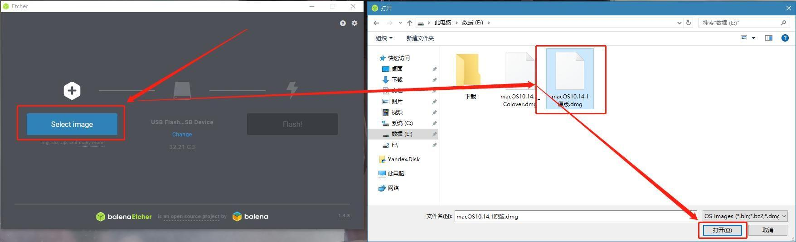

  

4.如果你已经插入了U盘，这时候会直接跳到第三个Flash图标，点击即可，软件会自动将dmg镜像文件写入U盘

  

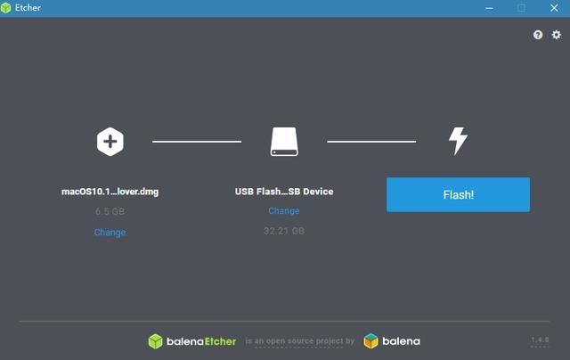

  

然后是漫长的等待 ，因为USB2.0写入时间会比较长，建议选择USB3.0的U盘进行写盘或者点写盘以后去忙会其他的。

  

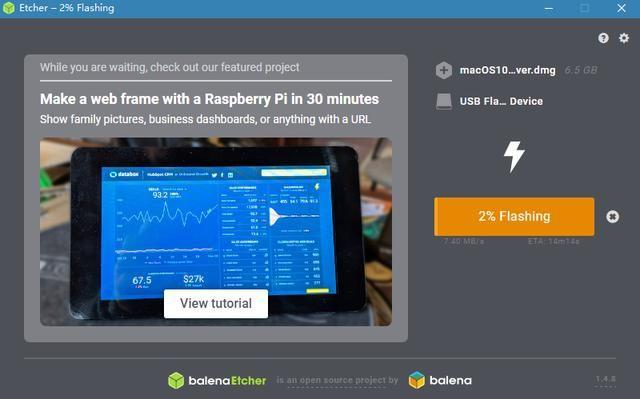

  

**三、Mac系统安装**

1.写完盘后就可以开始安装系统了。重启电脑并在开机后一直按下对应你电脑品牌的快捷键，出现选项列表后选择你的U盘。

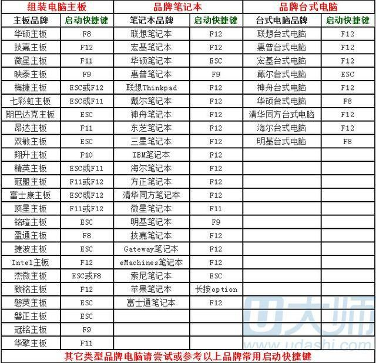

  

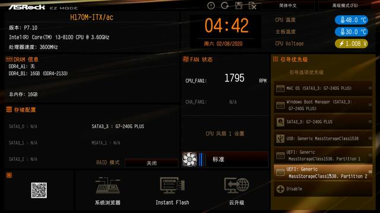

  

以我的华擎主板为例按下F2进入引导选择，这里UEFI Generic 为我的U盘，pareition1是黑苹果安装引导，pareition2为WEI PE引导。

2.选择pareition1保存并退出引导界面重启。

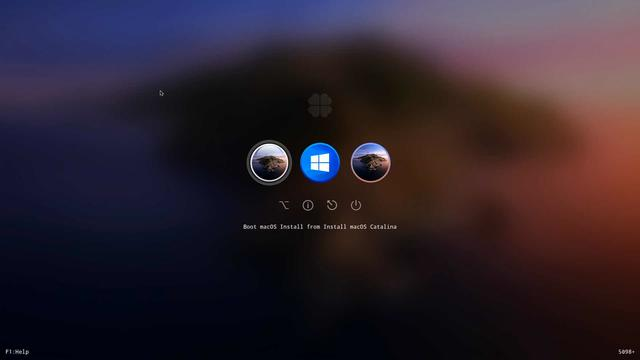

  

启动以后显示上面的画面。

boot macos install from install macos catalina 从U盘安装黑苹果系统

boot microsoft efi boot from efi 启动到windows10系统

boot macos from mac 启动到黑苹果系统

（ 我的已经装好了所以有这个，你的没还完成安装所以会没有。）可能你的开机界面不一样，是因为主题不同所以导致的后续可以修改，现在先以安装成功黑苹果系统为首要目标。对照上面的底部的英文先选择安装。

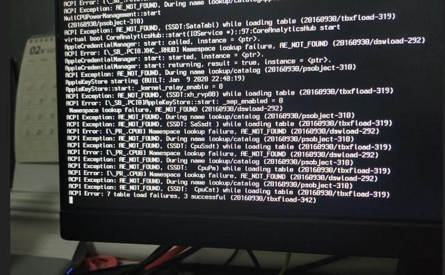

  

如果先启动黑屏++++++++++++++++或者跑代码以后卡住情况懂代码的大佬可以可以查看代码排除问题，小白的处理方法基本上将它归纳为conflg.clist配置文件不对导致。

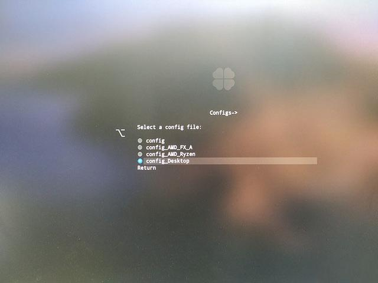

  

我的解决办法是通果尝试替换配置文件来解决。替换conflg.clist配置文件路径为：options——configs里选择不同的配置文件进行尝试启动。

然后在启动U盘安装黑苹果接下来的加载时间可能会很长，耐心等待就好，没有意外的话会进入到系统安装界面。如果不能成功进入系统安装界面，继续替换conflg.clist配置文件进行安装。

  

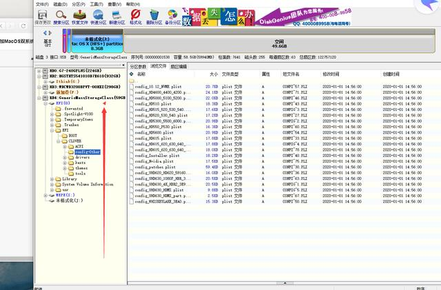

  

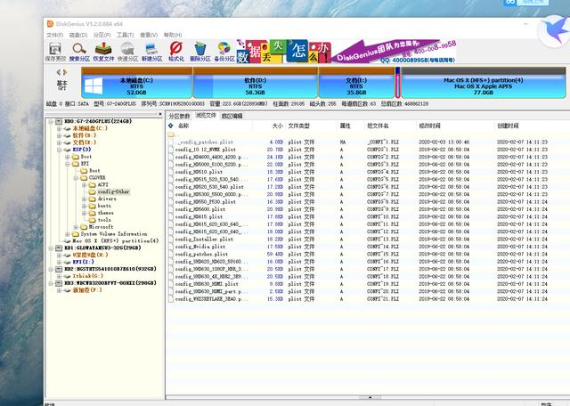

  

如果还是行的话可以从U盘内EEI——clover——config-other 寻找更多的配置文件进行更换。

3.U盘正常启动成功，选择语言

  

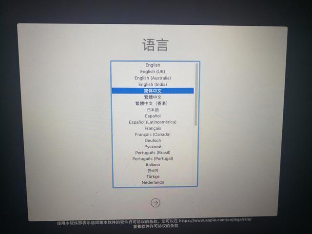

  

选择‘磁盘工具’，点击继续

  

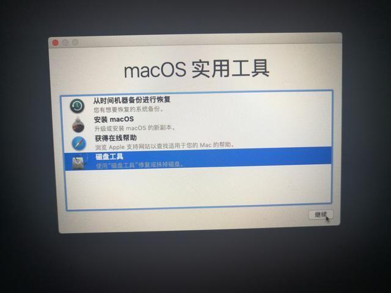

  

在左侧侧栏选择你之前为Mac系统预留的磁盘，然后点击窗口上方的'抹掉'

  

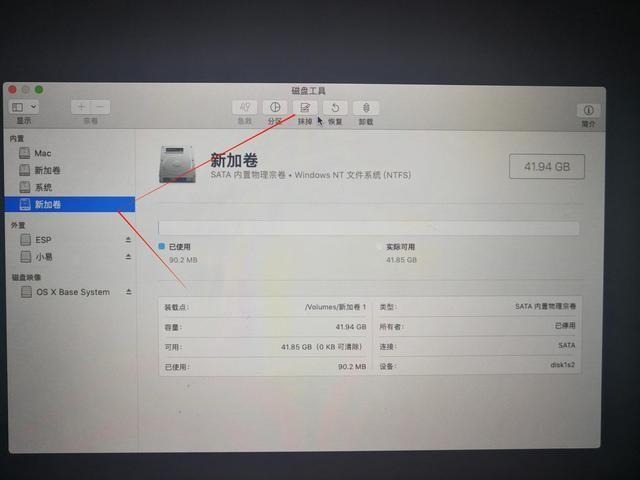

  

在这步的时候有时候可能会入法找到你所要安装的硬盘。这里我建议先将电脑重启回到windows系统或者PE模式下。

  

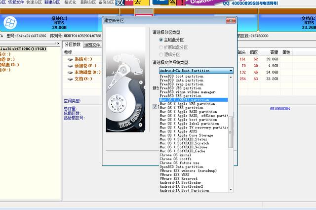

  

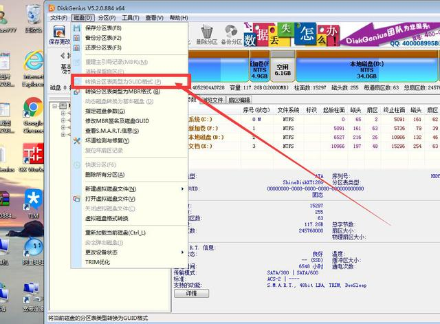

  

进入diskgenius界面后，查看硬盘是否为GPT分区如果不是选择要进行GPT分区的硬盘，选择【硬盘】栏目下“转换分区表类型为GUID格式”，鼠标点击【保存更改】将为苹果系统选择安装的分区设置为HFS+后在重启回到黑苹果安装界面,就能看到我所要安装的MAC盘了在进行抹除操作即可。

  

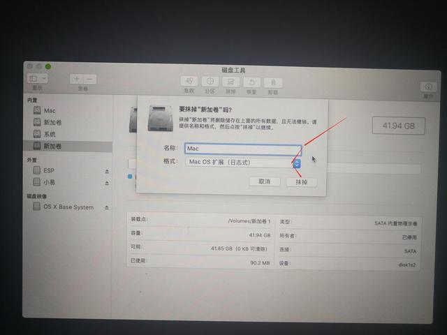

  

为磁盘取一个名字 ，再下方的下拉菜单栏选择’Mac OS扩展(日志式)‘,点击抹掉

  

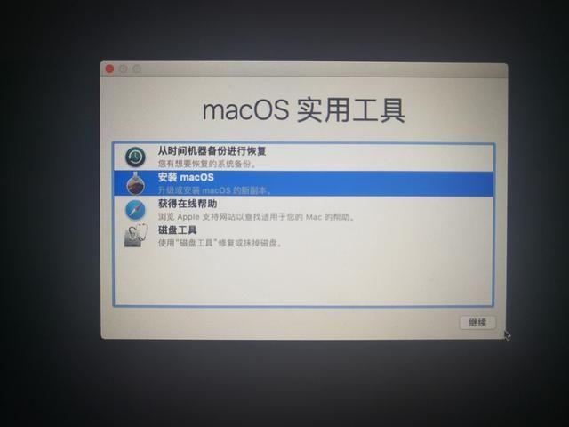

  

读条完成后点击窗口左上角退出磁盘工具，选择'安装mac OS'，点击继续

  

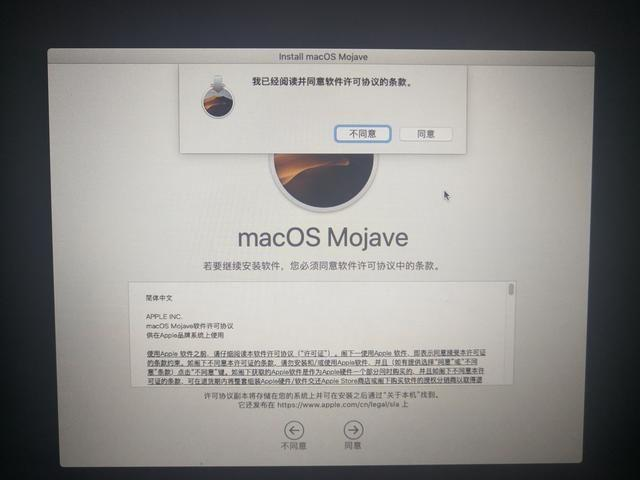

  

同意许可协议

  

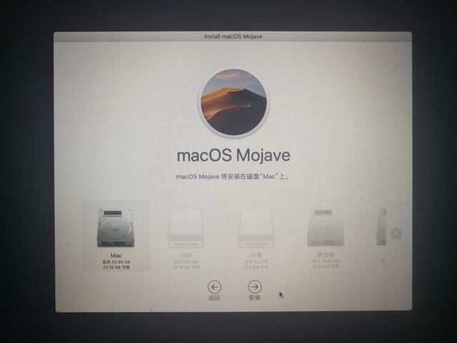

  

选择你刚刚操作的磁盘，点击安装。

  

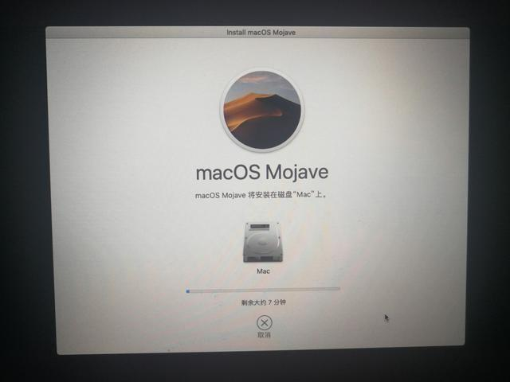

  

安装需要几分钟的时间，等待就好。安装完成后会自动重启，接下来只需要按照文字提示即可自行完成MacOS的安装。

  

  

安装的过程中建议拔掉网线。全程处于非联网状态下。因为最后一步的时候好像有个苹果的联网验证。

这期间可能会重启一次，这时候界面上正常应就会出现boot macos from mac 启动到黑苹果系统这个选项。

**划重点：现在我们只是正常的将系统装到分区中还没对EFI中的conflg.clist文件进行修改，所以这里还是需要手动选择到能够正常启动的配置文件进行启动。**

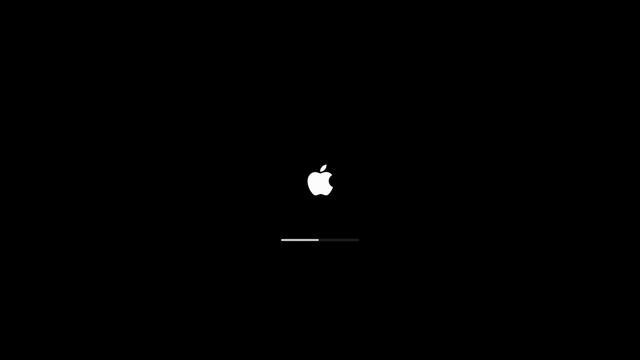

  

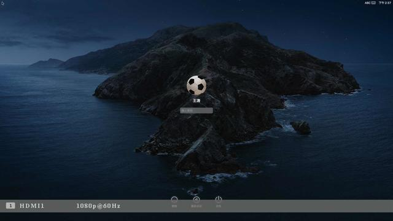

  

至此黑苹果系统就安装在了我们的电脑。剩下的就是实现双系统之间的流畅切换不在需要手动选择配置文件。

  

**三、修改EFI文件**

  

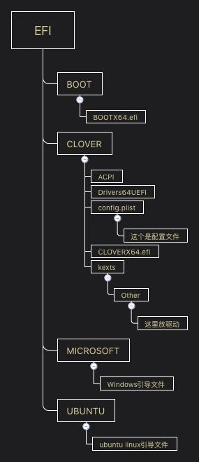

  

为了成功安装黑苹果我也很混迹与各大活跃黑苹果QQ群内，遇到的最多的新手装黑苹果大多都是晒配置图、求EFI或者上来问就我电脑能装黑苹果吗？

其实能不能安装成功只有试了才知道，还有很多人并不知道EFI是啥只是盲目的要！要！

我个人的理解:

efi的主要作用就是能够帮我们正确的引导启动系统，并为我们加载合适我们电脑的配置以及驱动。首先我们要确能够加载适合我们的配置文件conflg.clist,黑果小兵系统中帮我们集成了多个不同硬件的conflg.clist配置文件。

l 如果你已经找到跟你电脑配置一样的EFI文件，可以直接将U盘ESP分区中的EFI文件夹替换掉。笔记本类电脑一般硬件比较固定直接百度搜索下就可以找到合适的EFI。

l 以下操作也可以用DiskGenius工具在windows下或者PE系统下进行。

1.按照第一步的方法打开磁盘管理，找到你的U盘列表，在ESP分区右键，复制clover 文件到桌面，在将clover拷贝到自字盘ESP分区下的EFI目录内。

  

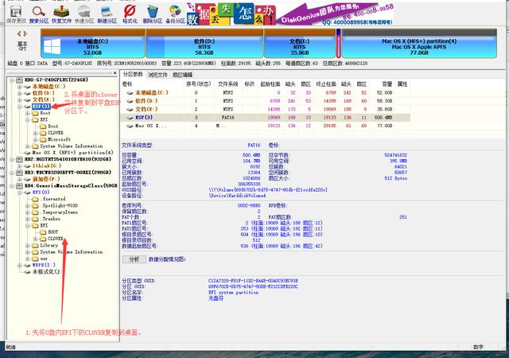

  

l **更换config.plist**

打开磁盘中的\\EFI\\CLOVER，将刚才能够正常启动苹果系统的配置文件名改为config.plist替换掉原本的config.plist即可。

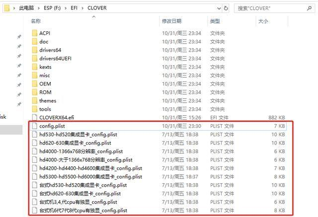

  

**config.plist是colover的配置文件，大部分安装失败都是因为config.plist文件配置不适用自身电脑硬件，如果想自己配置config.plist需要在Mac系统中使用Clover编辑器，在网盘中有提供最新的pkg软件包。**

**Win系统环境下也可以在下方网站进行配置：**

http://cloudclovereditor.altervista.org/cce/index.php

l **kexts**（Mac驱动文件）

\\EFI\\CLOVER\\kexts\\Other文件夹中存放的是Mac系统驱动文件，如果系统能够正常启动个别硬件比如无线网卡、蓝牙‘声卡等问题可以通过添加驱动的方法来解决。

  

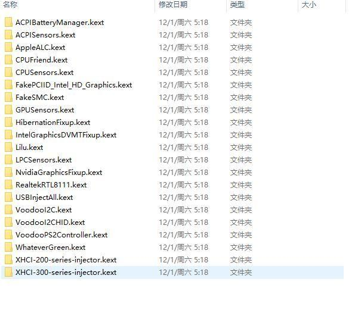

  

**五、添加UEFI引导项**

以上安装成功后想要进入Mac系统还需要U盘来引导Mac系统，想要直接从电脑硬盘中引导还需要为电脑添加MacOS的UEFI启动项。

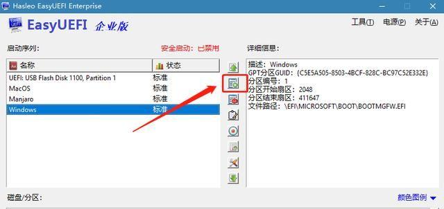

  

打开easyUEFI软件，点击中间第二个带加号的图标。

  

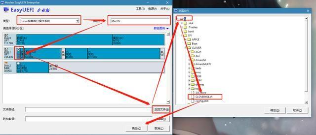

  

在类型中选择‘Linux或其他操作系统’，在描述框中输入一个名字，在下方磁盘列表中选择你刚刚把COLOVR文件夹复制到的那个磁盘。最后在右下角点击'浏览文件'，并在弹出框中选择EFI/COLOVER/COLOVER×64.efi

  

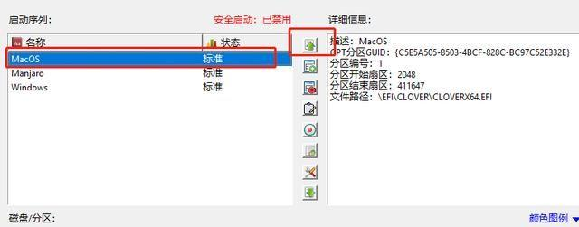

  

左侧选择你刚刚建立的启动项，点击中间带有向上图标的按钮将MacOS移到第一位，或根据你的具体需要选择顺序，第一位就是开机时默认启动的引导项。

  

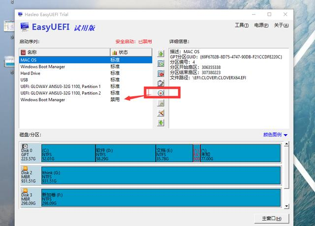

  

如果在这里如果想屏蔽其他的引导的话可以选择圆圈禁用

  

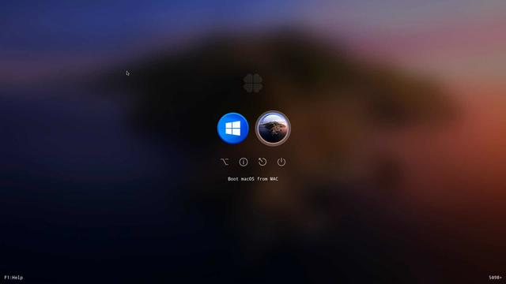

  

到这里此次的黑苹果安装教程就结束啦，重启电脑以后就可以在windows跟MAC系统之间自由切换了。

**PS：虽然花费了几天时间才吃上这口苹果，但是没花钱就让我体验到了MacOS系统可以说是香。如果你也跟你一样一直使用windows系统目前有仅限于想体验下MacOS系统的话黑苹果可以说是不错的选择。如果看了这篇分享也你想开始尝试自己安装黑苹果的话在遇到的问题的时候可以在这里留言。我会第一时间回复大家。**

