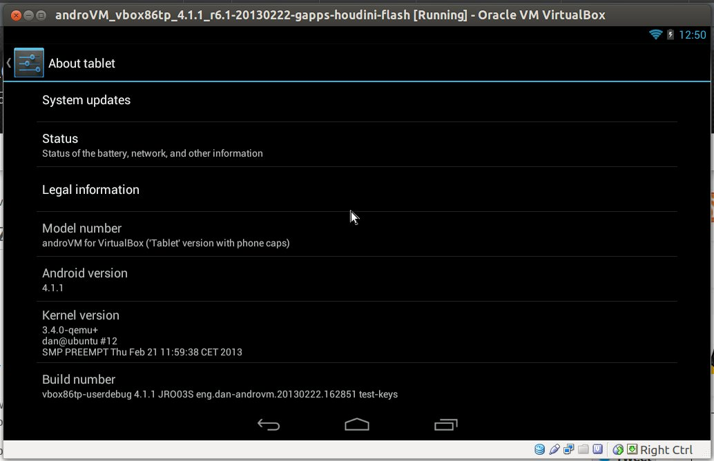
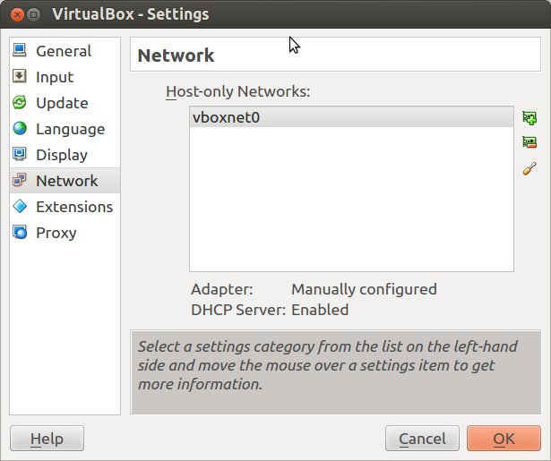
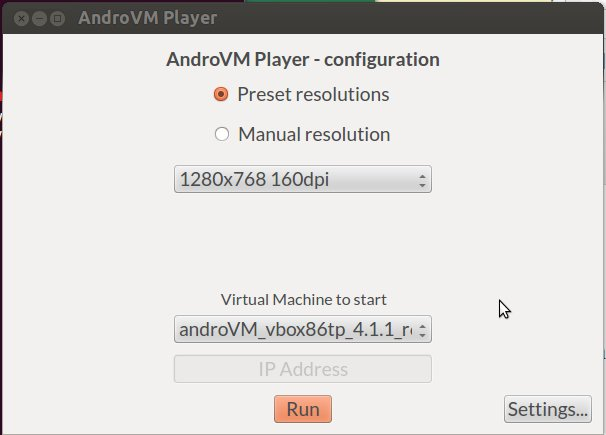

# How to Run Android Apps in Linux with AndroVM

You may want to run some Android applications in your computer. If you’re using Windows, there’s already a decent option with Bluestacks. If you’re using Linux, you could always install the Android SDK and run the emulator, but I don’t really like this option because of the user interface, and for people who don’t need to use the SDK it’s not really the simplest thing to install.
The way to run Android apps in Linux is probably to run an x86 Android virtual machine in VirtualBox. Yesterday, I tried the latest development version of Android x86 4.2, but for some reasons I could not control the mouse, and had to perform all tasks with the keyboard. What I’m going to use today instead is AndroVM, an Android VM for x86 processor, that is even more easy to use than the Android x86 image. The instructions has been performed in a machine running Ubuntu 12.04 LTS 64-bit.
If it’s not installed already, you’ll first need to download and install VirtualBox for your Linux distribution. You could also install it with apt-get or yum, but downloading from VirtualBox.org ensures you have the very latest version.
Now download Android 4.1.1 AndroVM image.
wget http://androvm.org/Download/androVM_vbox86tp_4.1.1_r6.1-20130222-gapps-houdini-flash.ova
Start Virtual Box, and in the top menu, click on File->Import Appliance, and click on Open Appliance to select androVM_vbox86tp_4.1.1_r6.1-20130222-gapps-houdini-flash.ova file and import it.
A new virtual machine should now show up in Oracle VM VirtualBox Manager

Click on Start, the Android windows should appear in a few seconds, asking your language, to login with your existing Google Account or create a new one, and once the setup is all complete you should be able access the Android Home Screen, install apps via Google Play, and run them as you would one a tablet.

I’ve tried to install several applications such as Facebook, Bloomberg for Tablet, Antutu, Quadrant, Angry Birds Star Wars, Subway Surfers, etc.. and the installation process works fine. Apps that do not require 3D GPU power work just fine, and if you’re only planning to use this type of apps, you don’t need to do anything else.
However, none of the games will start, but this can (partially) be solved as AndroVM can support OpenGL. It’s just a bit more complicated to setup:
Open a terminal to download and extract AndroVMPlayer.
wget http://androvm.org/Download/AndroVMplayer-Linux64-20130208.tgz
tar xzvf AndroVMplayer-Linux64-20130208.tgz
cd AndroVMplayer-Linux64/
Enable “Host Only” network adapter in VirtualBox
Click on File->Preferences->Network, and click on the green board (“+”) icon to add a network (e.g. vboxnet0)

Setup AndroVM to use “Host-only” network adapter
Click on AndroVM (now powered off), and click on the Settings button, access Network menu, and make changes to Adapter 1 to configure it to use an Host-only adapter. You should see the two fields below set to:
Click OK.
Attached-to: Host-only adapter
Name: vboxnet0
Start AndroVM, click on “androVM Configuration” app, enable “Hardware OpenGL”, and click “Save” to reboot the device.
Back to the terminal to run ./AndroVMPlayer, select the resolution and virtual machine, and click on Run

A new Android window with OpenGL acceleration should now start. Bear in mind that you must click “Run” before Android fully boots in VirtualBox. If it has already booted, stopped the Virtual Machine, restart it, and click on “Run” again in AndroVmPlayer.
Angry Birds is now playable, although not quite as smooth as on tablet, and audio is not working properly on my system. However, Subway Surfers won’t start at all, and Antutu and Quadrant benchmarks fail when running 2D/3D benchmark tests. Bloomberg for Tablet still runs, but the font is now much bigger, and it’s basically unusable. So it looks like OpenGL support is still very much work in progress, or my (low-end) Nvidia graphics card is not up to the job.
Finally, if you plan to use Android daily in your Linux PC, you may want to autostart AndroVM when Linux boots. I haven’t tried it myself (yet), but instructions to auto-start VirtualBox VM are available here.

Read more: http://www.cnx-software.com/2013/03/01/how-to-run-android-apps-in-linux-with-androvm/#ixzz2g8EAMMkl