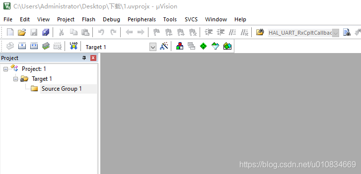
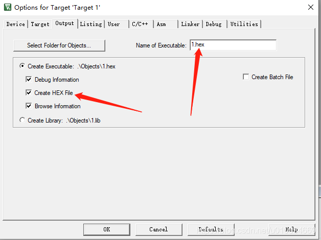
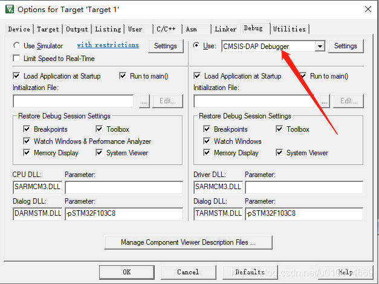
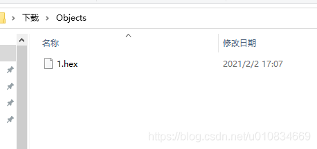
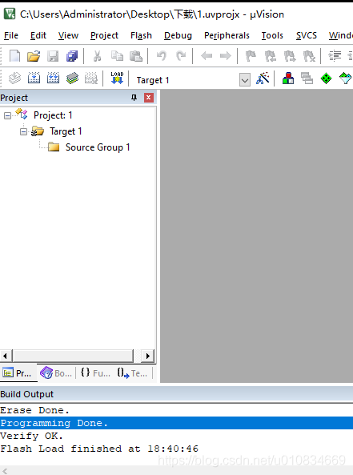

# STM32用Keil烧录已有的hex文件

> 供应商提供了STM32F103的Hex文件，没有源程序。STM32的烧录方法一般有两种，一是设置BOOT引脚用串口烧录，利用flymcu或者mcuISP或者ST官方提供的flashloader。二是用SWD接口烧录，可以用相关工具，本文使用KEIL μ[Visio](https://so.csdn.net/so/search?q=Visio)n5下载。

# 1\. 新建一个Project

打开KEIL，Project-New μVision Project，命名并保存到某个文件夹，比如我命名为1

# 2\. 设置Output

打开Options for Target

Name of Excutable设置的名称和已有的Hex文件名称相同。

# 3\. 设置Debug选项

设置Debug方式，我这里选择CMSIS

# 4\. 把HEX复制到Objects文件夹下

打开工程文件夹，找到Objects，把现有的HEX命名修改为1.hex后复制进去，这里HEX文件的命名就和第二步Name of Excutable的命名相同，同时存放路径和第二步中Create Exectuable的路径相同。

# 5.下载

回到KEIL软件中，不用编译，直接下载即可。

