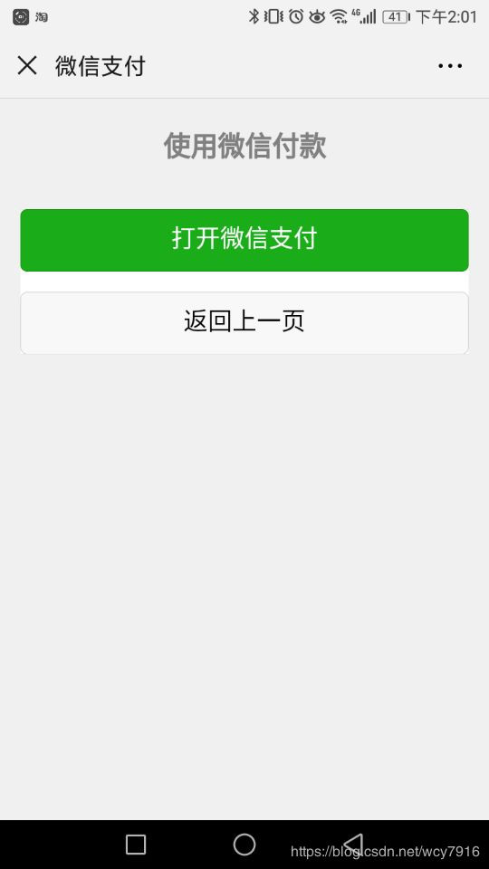

2019年07月10日 14:16:05 [wcy7916](https://me.csdn.net/wcy7916) 阅读数 1206 文章标签： [小程序](https://so.csdn.net/so/search/s.do?q=%E5%B0%8F%E7%A8%8B%E5%BA%8F&t=blog)[webview](https://so.csdn.net/so/search/s.do?q=webview&t=blog)[web](https://so.csdn.net/so/search/s.do?q=web&t=blog) 更多

分类专栏： [vue](https://blog.csdn.net/wcy7916/article/category/7636259) [小程序](https://blog.csdn.net/wcy7916/article/category/7756109)

版权声明：本文为博主原创文章，遵循[ CC 4.0 BY-SA ](http://creativecommons.org/licenses/by-sa/4.0/)版权协议，转载请附上原文出处链接和本声明。

本文链接：https://blog.csdn.net/wcy7916/article/details/90263039
**前言：**

想把app内的精听课本模块的网页内嵌到新开发的微信小程序里面，之前已经放在了公众号里，现在也要支持在小程序里购买，阅读。既然支持购买，小程序就得有注册登录的功能、支付的功能。支付不能用微信自带的支付，因为不支持，（就算在开发者工具里支持，体验版和正式版也不支持），所以需要调用小程序的支付功能。

**实现：**
小程序中内嵌H5网页是这样的：

<template> 
 //courseUrl 就是网页入口地址 <web-view :src="courseUrl" bindmessage="bindmessage"/> 

</template>

要在小程序中实现支付，先在在H5网页的项目中设置支付跳转：（以下是**微信公众号支付和跳转微信小程序支付相结合的完整代码**，@ViewBag.wx_signature这种字段是后台提供的值，是c#语法）

@{ Layout = null; } <!DOCTYPE html> <html> <head> <meta charset="UTF-8"> <meta name="viewport" content="width=device-width,initial-scale=1,user-scalable=0">

 <link rel="stylesheet" href="https://res.wx.qq.com/open/libs/weui/1.1.2/weui.min.css" />

<title>微信支付</title>

</head> <body ontouchstart>

 
 
 <h1 class="page__title">使用微信付款</h1> 
 
 
 <a href="javascript:;" class="weui-btn weui-btn_primary" id="btn-open-wx-payment">打开微信支付</a> <a href="javascript:;" class="weui-btn weui-btn_default" id="btn-goback">返回上一页</a> 
 
 
 </body> </html>

这是以上代码对应的付款前的过渡H5页面

在小程序项目中新建一个支付页：pay.vue

<template> <!-- 该页面只是为了收到webview网页的支付参数 --> 

 </template>  

**tip:**
webview网页在小程序里的调试是，将鼠标放在h5网页上，右击，会出现“调试”选项。
webview网页的域名以及网页内部的其他域名要在微信公众平台=》开发设置=》业务域名中添加，且域名是https://的。否则网页打不开，像酱紫：

**bug:**
如果支付失败，注意检查openid和package的值是否正确，大部分问题就出在这两个参数值上面。

参考地址：[微信小程序开发之webview组件内网页实现微信原生支付](https://juejin.im/post/5a4f5280f265da3e2b16393c)