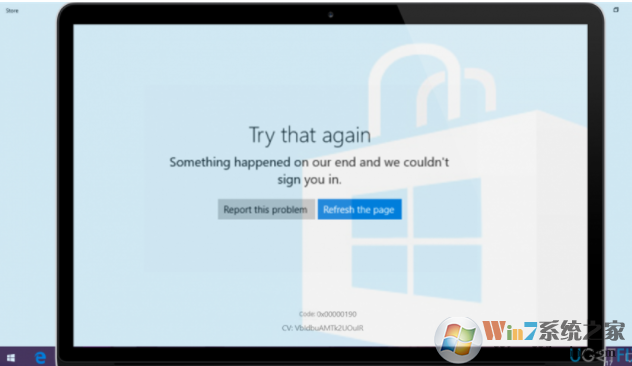
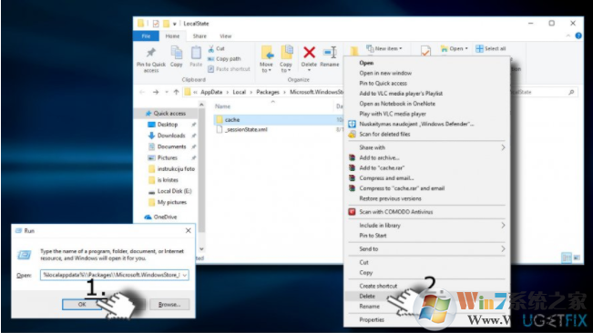
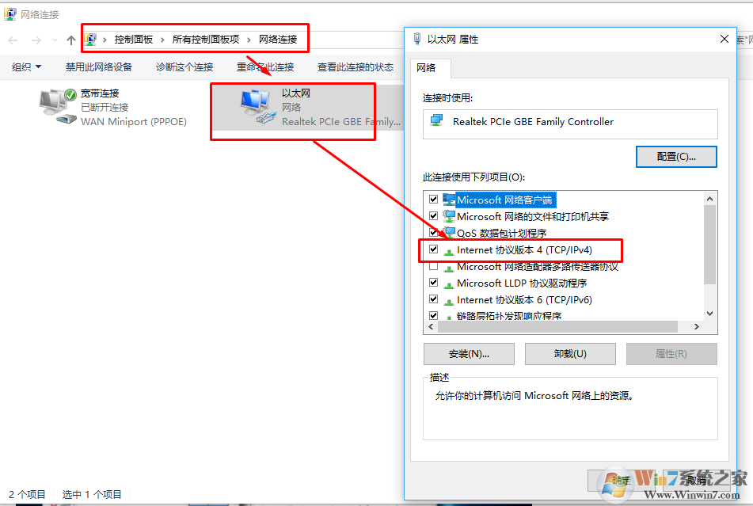
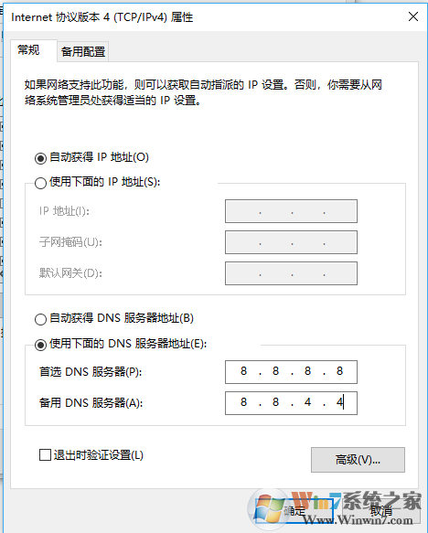
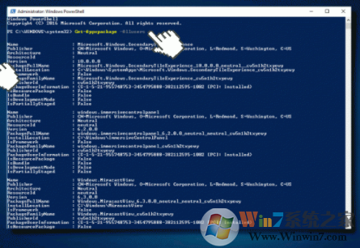
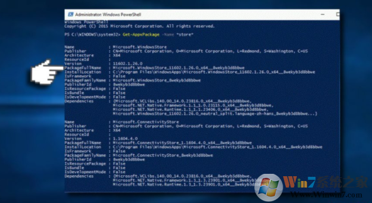

[toc]
### 1.Microsoft Store 代码: 0x80131500 错误解决办法
分类：电脑网络
2019-02-24 12:27 阅读(87)评论(0)
在某博客看到的方法，供参考，可以尝试一下，我的也是这么解决的
1、打开“运行”输入 inetcpl.cpl （“WINDOWS”+“R”键，输入 inetcpl.cpl亦可）
2、点开高级往下拉，勾上"使用TLS 1.2"选项，或者点还原高级设置。

亲测有用。
### 2.win10 应用商店存储错误代码0x00000190的解决方法
目前，人们不断报告Windows应用商店错误代码0x00000190，这会阻止应用程序打开。人们得到以下错误信息：
再试一次。我们的事情发生了一些事情。等待一下可能会有帮助。错误代码：0x00000190。
即使人们正在攻击微软官方的支持页面，其中有关于存储错误0x00000190的问题，该公司的技术人员还没有回应，让Windows 10用户不知道可能的修复。

     不幸的是，至今还没有一个正式的解决方案，让它正常的工作。不过，有几种方法可以应用于修复任何Windows应用商店错误，小编强烈建议您尝试使用它们。
 
Windows应用商店是Windows 10的“必备工作”应用程序，因为它提供了Windows更新和兼容的应用程序。Windows平板电脑和其他触摸输入设备的新接口[1]的迅速发展，Windows商店在保持与改进的步伐中发挥着至关重要的作用。
不仅触摸屏设备需要Windows应用商店。运行Windows 10操作系统的电脑和笔记本电脑需要Windows Store应用程序顺利运行。不幸的是，该应用程序经常无法在Windows更新，[2]缓存系统或损坏的Windows应用程序本身的安装失败后运行。
首先，你应该检查系统的恶意软件。这是因为恶意应用程序可能会阻止应用程序正常运行。。
如果不是病毒感染[3]，则应重置Windows Store缓存（在搜索中键入wsreset命令，右键单击该文件，然后选择以管理员身份运行），然后运行内置的Windows应用商店应用程序故障排除程序。后者可以通过设置应用程序（设置 - >更新和安全 - >疑难解答 - > Windows商店应用程序 - >运行疑难解答）打开。
如果这些简单的步骤不起作用，请尝试以下操作：
### 方法1.删除本地缓存
按Windows键+ R打开运行。
复制％localappdata％\\\\ Packages \\\\ Microsoft.WindowsStore_8wekyb3d8bbwe \\\\ LocalState命令并将其粘贴到运行中。
点击OK打开目录。
找到缓存文件夹，并在其上单击鼠标右键，并删除所有文件和文件夹里面。

### 方法2.修改DNS地址
打开控制面板，然后点击网络和共享中心。
选择更改适配器设置，然后右键单击连接图标（本地连接或无线网络连接）。
选择属性并标记Internet协议版本4（TCP / IPv4）。

再次选择属性并打开常规选项卡。
选择自动获取DNS服务器地址，然后单击确定。
如果自动获取DNS服务器地址已被标记，请选择使用下面的DNS服务器地址代替选项。

现在输入以下服务器地址，然后单击确定：
首选DNS服务器：8.8.8.8
备用DNS服务器：8.8.4.4
最后，尝试打开W​​indows应用商店。
方法3.重新注册Windows Store
打开搜索并键入PowerShell。

右键单击PowerShell条目并选择以管理员身份运行。
复制并粘贴以下命令：
Get-AppXPackage -AllUsers | Foreach {Add-AppxPackage -DisableDevelopmentMode -Register“$（$ _。InstallLocation）AppXManifest.xml”}
按Enter执行它并等待过程完成。
方法4.重新安装Windows应用商店
点击Windows+s键，输入powershell，然后按Enter键。
右键单击PowerShell选项并选择以管理员身份运行。
键入GET-Appxpackage -Allusers，然后按Enter键。

查找Windows Store条目并复制其packagefullname。
现在复制并粘贴Add-AppxPackage -register“C：\\ Program Files \\ WindowsApps \\”-DisableDevelopmentMode命令。
重要提示：将“PackageFullName”替换为Windows应用商店packagefullname。另外，如果需要，用你系统的根驱动替换C：驱动。
之后，关闭PowerShell并使用管理权限重新打开它，如1-2步骤中所述。

复制并粘贴Add-AppxPackage -register“C：\\ Program Files \\ WindowsApps \\”-DisableDevelopmentMode
按Enter执行它。
最后，重新引导系统执行所有更改。

总结：以上就是win10 应用商店存储错误代码0x00000190的解决方法了，希望对大家有帮助。