

[苏羽](https://www.zhihu.com/people/shijiayu)
专注科技

> 本文约980字 +18张图，预计阅读时长：5分钟。作于：2018-12-12 · 清晨

一直以来都认为Office365才是办公终极解决方案，不仅有无限速的Onedrive云盘，还可享受最新版Office全平台安装，拥有Office365即可满足整个家庭的使用需求。其主要优势如下：

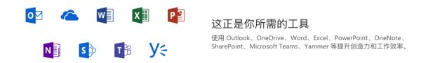

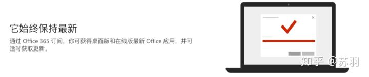

## 什么是 Office365 A1 Plus？

Office365种类繁多，主要有以下几类（有的不靠谱类型就不多说了）：

- **●****个人/家庭版订阅** （区别：个人版支持设备数仅为1，也相对便宜。日常价几百不等）
- **●****E3 MSDN版**（功能、API全面，目前市场基本缺货，据行内玩家表示：已几乎绝版。因E3之前是给VS开发者订阅户的权益，据官方答复是永久，民间成品售价几百上千不等）

企业版E3 MSDN开发人员版

- **●****教育版A1子账户**，Office只能用Web在线网页版，无本地桌面版可用（不推荐）
- **●**教育版A1 Plus子账户，享受最新Office全平台安装及5TB的OneDrive云盘，共支持10台设备运行（安装后显示为365专业增强订阅版，含2019专业版所有功能，完美自用系列）
- **●****E5-E1/K1(F1) Symphony版**、小型企业版 特指续费0.00元/年（基本不靠谱）

## 接下来介绍下 Office365 A1 Plus 安装步骤：

- 首先，进入官网，登录全新子账户：
- Office 365 Login | Microsoft Office
- 登录全新账户时，会有更新密码的步骤：

-

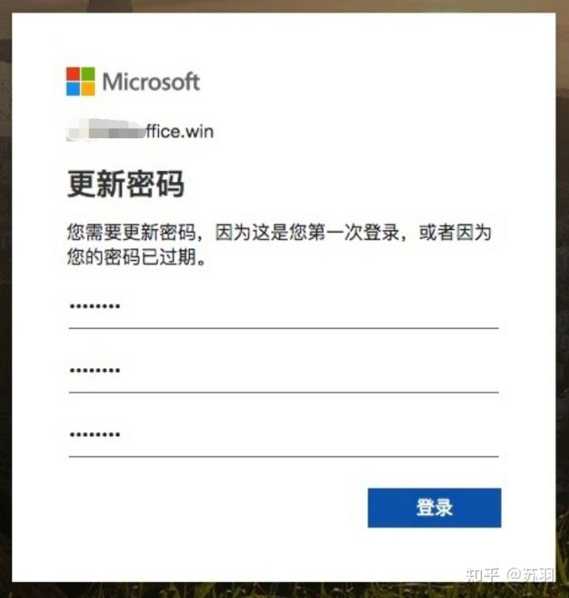

- 登录后的下载安装页面：

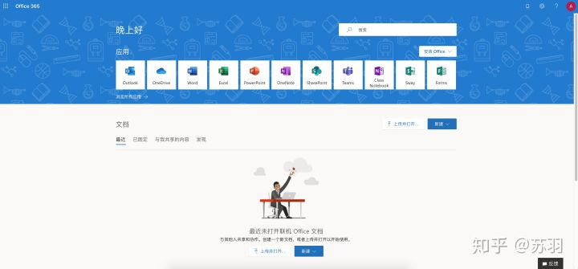

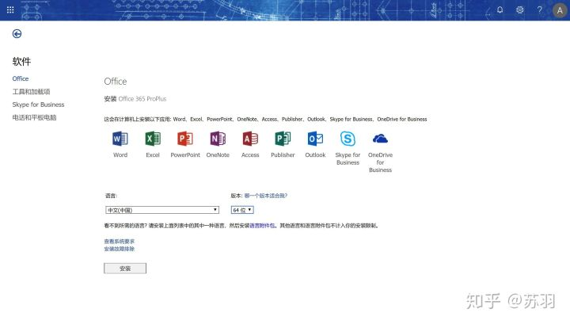

选择语言、安装位数等配置

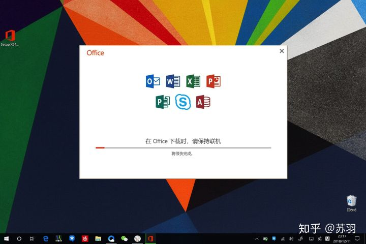

自动安装中（默认C盘，建议预留足够空间），网速良好基本不到半小时完成。

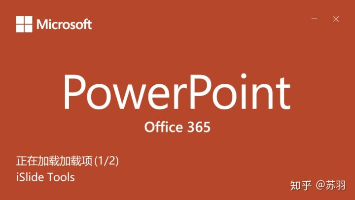

安装好后打开运行，加载显示：Office 365

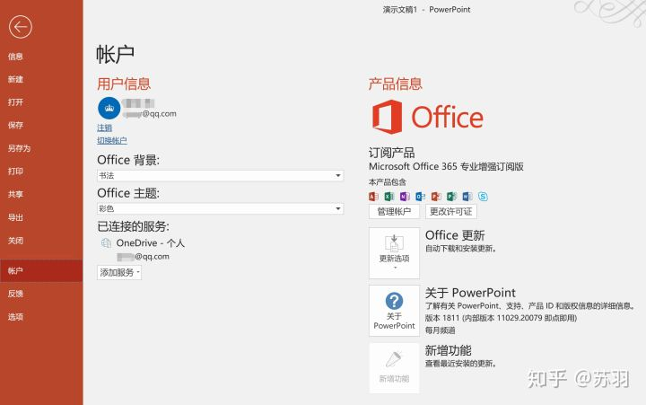

产品信息显示：365专业增强订阅版，享受今后最新版本

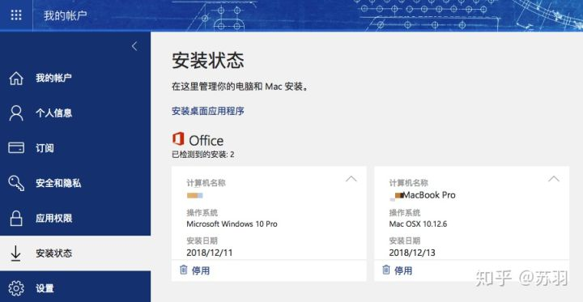可自行管理的安装状态，一览无余

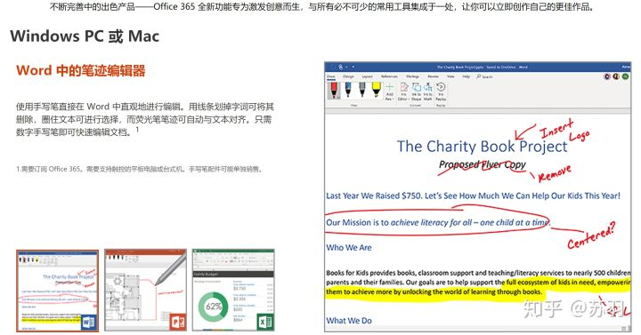

最新的Office，设计更趋于扁平化，界面更简洁明了，平板触屏手写体验更佳

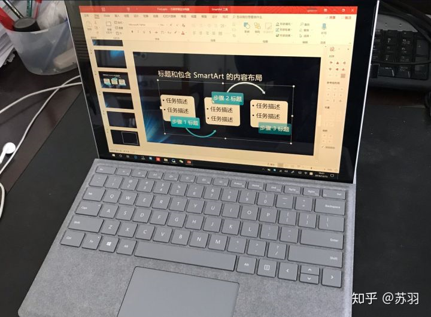
自家的生产力工具Surface Pro5果断卸了原来的2016换上最新Office，信仰满满，真香
========== FAQ ==========
*Q：Office365和Office2019功能上的区别何在？*
1. 1.Office365不仅支持桌面PC，还支持平板/手机端，全平台通用
2. 2.拥有Office365，无需Office 2019便已经获得最新版的所有功能
3. 3.Office365定期升级新功能（月度更新），同时免费享受官方支持
4. 4.Office365享有OneDrive云盘 + Outlook高级服务（高级安全性、无广告、50G邮箱空间）
5. 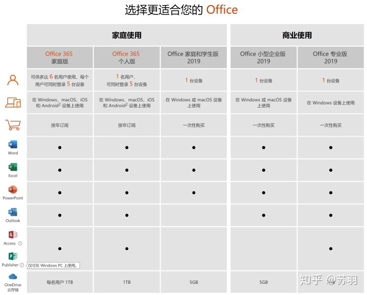
可看出office只是365的子集

*Q：之前的Office是KMS软件激活的，卸载后如何完全清除KMS残留信息？*
首先，关闭所有office应用，用管理员方式（←说三遍）打开CMD（命令行）

- 输入查看信息命令：

cscript "C:\Program Files\Microsoft Office\Office16\OSPP.VBS" /dstatus
你会看到显示的激活信息及之前KMS用的key：XXXXX

- 然后是清除命令：

cscript "C:\Program Files\Microsoft Office\Office16\ospp.vbs" /unpkey:XXXXX
后5位自己输入对应上面的XXXXX即可。最后重启电脑，在office重登账户即可完美激活
*Q：最后截图为何是Office专业增强订阅版？不该显示A1 Plus么？想了解更多？*
首先，要搞清——计划名与版本是两码事
诸如教育系列A1/A1P，企业E1/E3/E5等等都是计划名，可以有很多ABCDEFXYZ计划......
A1 Plus真正安装的是——最新Office专业增强版
可把计划=套餐，Office专业版则是其中之一商品，不同套餐所搭配的商品不一样
**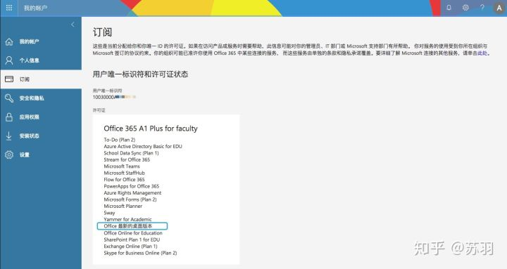**
Office365A1 Plus计划的全家桶，其实很多，我们通常用最多的office只是其中之一的套件
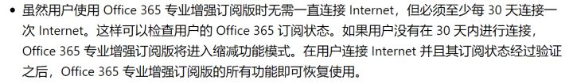
搬运的一些官网文档说明

*Q：貌似Office365无OneNote桌面版？（OneNote重度使用者请注意此条，重要说3遍）*
是的，A1 Plus里只含OneNote网页版，不过对我这种不用OneNote的来说问题不大
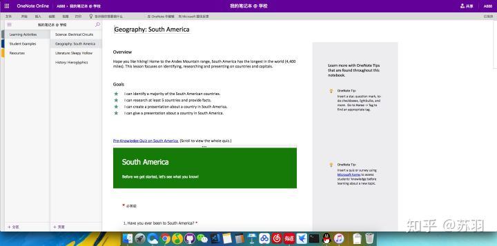
网页Online版大概长这样，感觉也还不错的样子
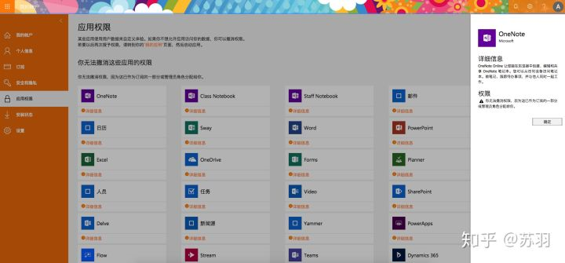
应用权限里显示：仅有OL版
官网的个人/家庭版365也是不带OneNote的，看清楚：
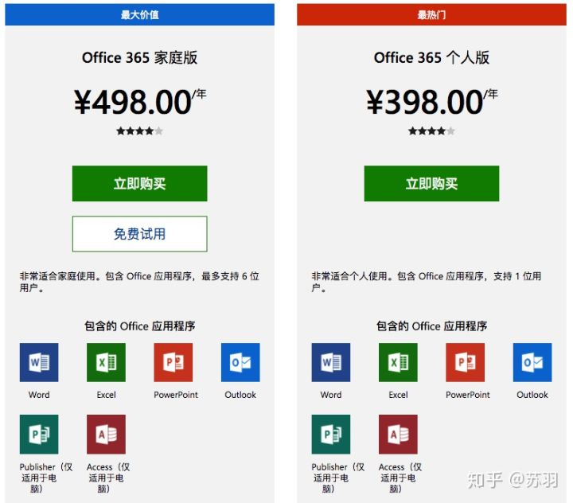
为何如此？因为OneNote现已被踢出365全家桶，微软要放弃桌面版，主推uwp版
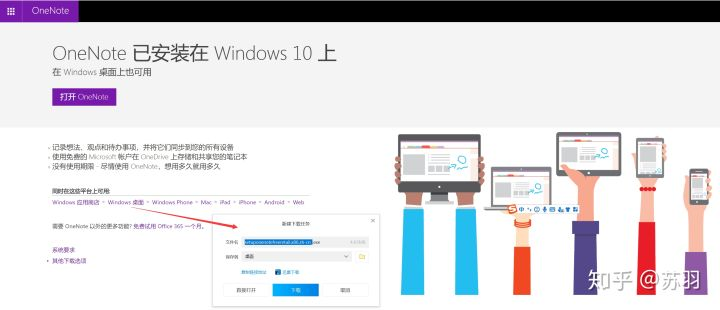
OneNote从此独立，以后作为OneNote uwp单独发展

*Q：Office365的OneDrive如何使用？*
可参考以下文章：[OneDrive——值得拥有的高效能同步协作云办公利器](https://zhuanlan.zhihu.com/p/53372580)
*Q：Office最新版究竟多好多强大？有何新特性？*
可参考以下文章：[Office2019 深度评测](https://zhuanlan.zhihu.com/p/33881412)

PS. 最近获得了很多收藏，我一向认为，收藏是比点赞更具有价值的，在此感谢各位支持的知友认可。关于Office365，其实还有很多不错的功能，在此一一述说不现实。之后有空会再更新些有实用价值的文章，若想知晓最新动态，欢迎关注！