在周年更新之后，你可以在Win10中使用Linux子系统，虽然该子系统非常实用，不过对于一些用户来说，只有命令行未免太乏味了。
那么今天，IT之家就和各位分享，如何在Win10的Linux子系统中运行图形化程序，不吊大家胃口，先放截图：

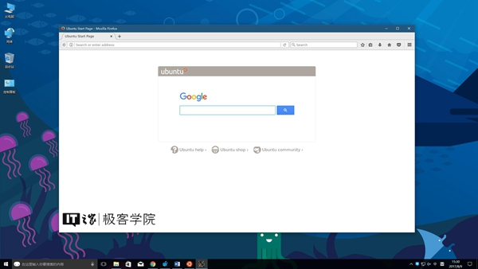

▲Linux版火狐浏览器
在这次教程中，小编将以在Win10的Ubuntu子系统中运行GIMP做演示，下面我们开始。
在开始之前，请确保你的Win10中已经安装了Linux子系统，你可以在控制面板-程序-启用或关闭Windows功能中安装Ubuntu子系统，

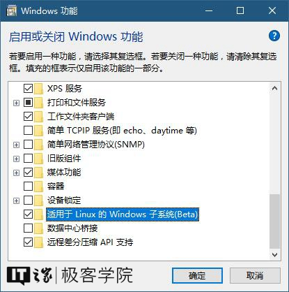

也可以在应用商店里安装SUSE Linux或者Open SUSE子系统。

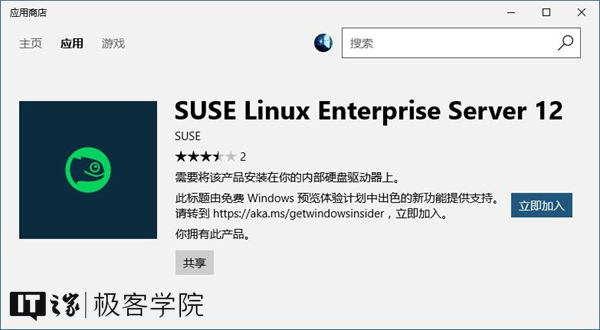

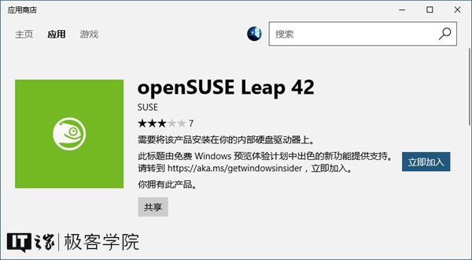

要运行GIMP，那么首先我们要在Linux子系统中安装它，安装的方法非常简单，只需执行两行命令：
sudo apt-get update
作用：更新源

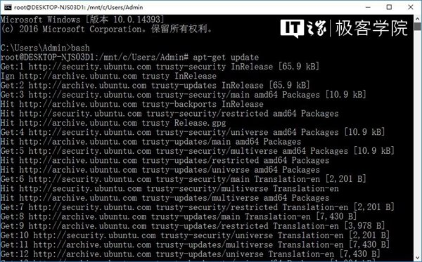

sudo apt-get install gimp
作用：安装GIMP

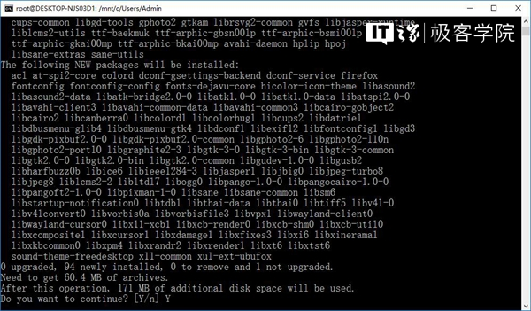

如果在更新源或者安装程序的过程中遇到如下提问：
Do you want to continue? [Y/n]
请输入Y并回车，就像这样：

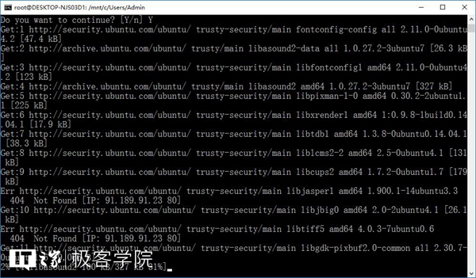

由于小编使用的是Ubuntu的默认源，下载和安装的速度可能比较慢，需要耐心等待，如果你有更快的源，尽管可以替换。
当GIMP安装完成，你就可以使用它了。
不过在使用之前，你需要一款名叫Xming的软件，多亏这个软件，GIMP的图形界面才得以正常显示。
Xming下载地址：点击这里
下载好以后，我们来安装它：

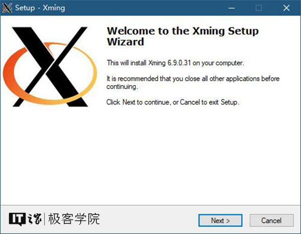

在安装的过程中，保持它默认的安装选项不变即可：

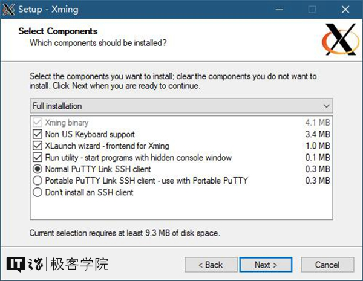

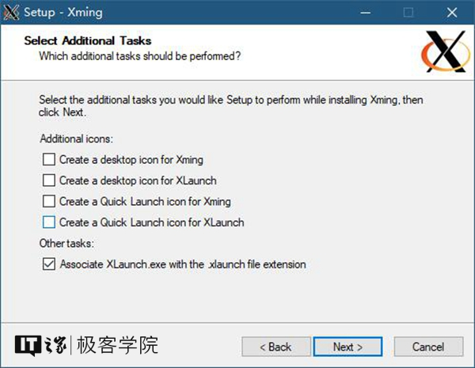

安装完成后，你将在开始菜单-最近添加中找到它（包括XLaunch和Xming）。

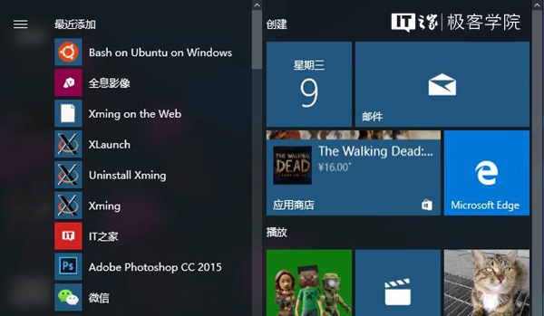

点击XLaunch，选择Xming以何种形式显示Linux图形程序的窗口（多窗口、单窗口、全屏或是不包含标题栏的单窗口），然后点击下一步按钮；

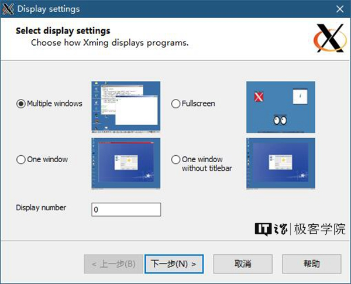

保持该选项不变，点击下一步按钮；

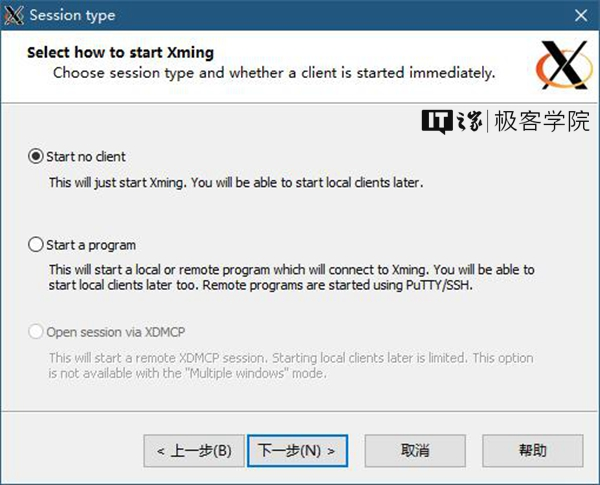

保持该选项不变，点击下一步按钮；

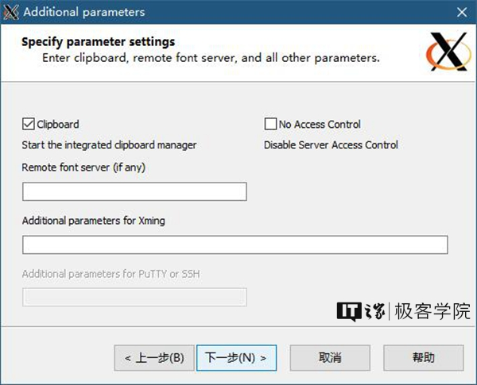

点击完成按钮；

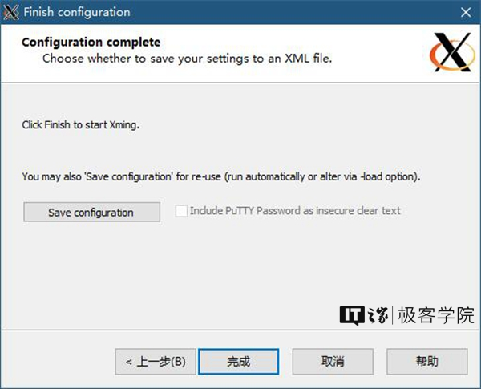

回到Linux子系统的命令行界面，输入以下命令：
DISPLAY=:0 gimp

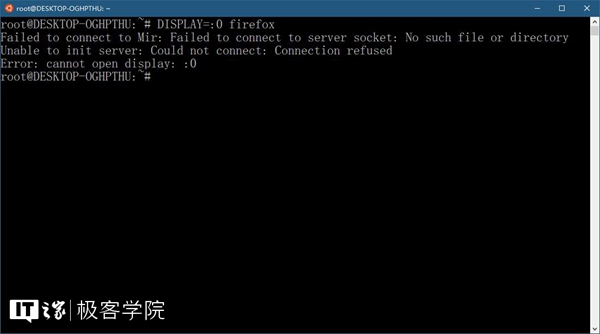

回车，GIMP即可以启动和运行。

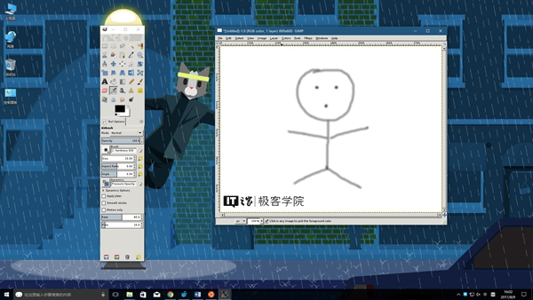

同理，若想在Linux子系统中运行Linux版火狐浏览器，则可以通过以下命令来安装它：
sudo apt-get update
作用：更新源
sudo apt-get install firefox
作用：安装火狐浏览器
然后，再通过以下命令来运行它：
DISPLAY=:0 firefox
需要注意的是，在Linux子系统中运行图形化程序之前，请保持Xming服务处于开启状态。
如果你在尝试运行Linux的某款图形化程序时，看到了如下的错误提示：

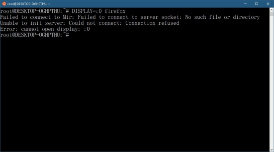

则说明Xming服务未开启，此时不要惊慌，在开始菜单中找到XLaunch，再次运行并配置即可。
好了，开开心心地玩儿去吧~以上就是本次教程的全部内容，更多常识科普、实用教程，敬请关注IT之家学院。