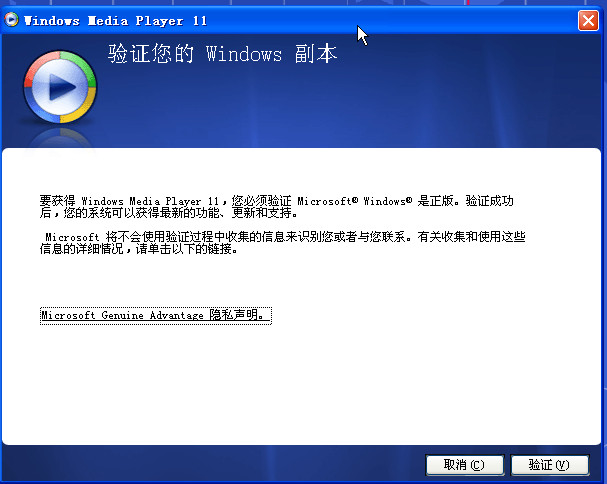
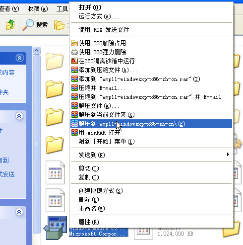

现在windows media player微软官方最新的版本是 windows media player 11,但是我们很多XP系统都是盗版系统
如果直接双击安装 wmp11-windowsxp-x86-zh-cn.exe 的话可能就会提示:

这时我们就无法安装WMV11了，这里西西教大家一种不用验证安装的办法。
只要你电脑上有winrar 就可以了，下面一步来教大家如何安装吧：
1、我们在安装了winrar的机器上在  wmp11-windowsxp-x86-zh-cn.exe 右击一下可以选择解压到

然后在 wmp11-windowsxp-x86-zh-cn 文件夹里
1， umdf.exe
2， wmdbexport.exe
3， wmfdist11.exe
4， wmp11.exe
从上面顺序分别双击运行可执行文件时，其中一个运行完毕后会询问你重启计算机，可以钩选选择不重启，然后继续运行下一个，如果碰到双击后出现闪一下没有进行运行安装，这说明你系统中已经有了这个程序，所以继续运行下一个。
一切完成后，就是重启计算机，登陆windows后，双击打开系统的media player11播放器，就会看到程序会启动安装界

