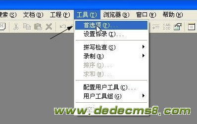
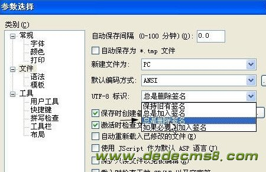

Unicode规范中有一个BOM的概念。BOM——Byte Order Mark，就是字节序标记。在这里找到一段关于BOM的说明：
在UCS 编码中有一个叫做"ZERO WIDTH NO-BREAK SPACE"的字符，它的编码是FEFF。而FFFE在UCS中是不存在的字符，所以不应该出现在实际传输中。UCS规范建议我们在传输字节流前，先传输 字符"ZERO WIDTH NO-BREAK SPACE"。这样如果接收者收到FEFF，就表明这个字节流是Big-Endian的；如果收到FFFE，就表明这个字节流是Little- Endian的。因此字符"ZERO WIDTH NO-BREAK SPACE"又被称作BOM。
UTF-8不需要BOM来表明字节顺序，但可以用BOM来表明编码方式。字符"ZERO WIDTH NO-BREAK SPACE"的UTF-8编码是EF BB BF。所以如果接收者收到以EF BB BF开头的字节流，就知道这是UTF-8编码了。
Windows就是使用BOM来标记文本文件的编码方式的。
另外unicode网站的FAQ-BOM详细介绍了BOM。官方的自然权威，不过是英文的，看起来比较费劲。
UTF- 8编码的文件中，BOM占三个字节。如果用记事本把一个文本文件另存为UTF-8编码方式的话，用UE打开这个文件，切换到十六进制编辑状态就可以看到开 头的FFFE了。这是个标识UTF-8编码文件的好办法，软件通过BOM来识别这个文件是否是UTF-8编码，很多软件还要求读入的文件必须带BOM。可 是，还是有很多软件不能识别BOM。我在研究Firefox的时候就知道，在Firefox早期的版本里，扩展是不能有BOM的，不过Firefox 1.5以后的版本已经开始支持BOM了。现在又发现，PHP也不支持BOM。
PHP在设计时就没有考虑BOM的问题，也就是说他不会忽略 UTF-8编码的文件开头BOM的那三个字符。由于必须在<?或者<?php后面的代码才会作为PHP代码执行，所以这三个字符将会直接输 出。如果遇到header(),session(),cookie()等问题，将会导致乱码或显示白屏等问题.
下面附上editplus去BOM头的方法
EditPlus编辑UTF-8文件时删除BOM方法
编辑器调整为UTF8编码格式后，保存的文件前面会多出一串隐藏的字符（也即是BOM），用于编辑器识别这个文件是否是以UTF8编码。一般的文本文件会忽略这一串隐藏的字符，但对于PHP等文件会解析这一串字符，这样会导致出错。
运行Editplus，点击工具，选择首选项，如下图：

选中文件，UTF-8标识选择 总是删除签名，如下图：

 

然后对PHP文件编辑和保存后的PHP文件就是不带BOM的了
BOM定义了JavaScript可以进行操作的浏览器的各个功能部件的接口，提供访问文档各个功能部件（如窗口本身、屏幕功能部件、浏览历史记录等）的 途径以及操作方法。遗憾的是，BOM只是JavaScript脚本实现的一部分，没有任何相关的标准，每种浏览器都有自己的BOM实现，这可以说是BOM 的软肋所在。 

通常情况下浏览器特定的JavaScript扩展都被看作BOM的一部分，主要包括： 
·关闭、移动浏览器及调整浏览器窗口大小； 
·弹出新的浏览器窗口； 
·提供浏览器详细信息的定位对象； 
·提供载入到浏览器窗口的文档详细信息的定位对象； 
·提供用户屏幕分辨率详细信息的屏幕对象； 
·提供对cookie的支持； 
·加入ActiveXObject类扩展BOM，通过JavaScript实例化ActiveX对象。 
BOM有一些事实上的标准，如窗口对象、导航对象等，但每种浏览器都为这些对象定义或扩展了属性及方法。 

