固态硬盘虽然价格偏高，但是读写速度快，很多人只追求速度，纷纷买了全新固态硬盘安装系统，现在最新的系统是win10，如果在uefi电脑上用固态硬盘安装win10，那么速度将有质的提升，那么全新固态硬盘怎么安装win10系统呢？由于固态硬盘是全新的，一般需要用U盘，考虑到新款电脑都支持uefi，下面系统城小编以uefi安装方法为例跟大家介绍ssd安装win10教程。

### 安装须知：
1、uefi安装win10系统需要电脑支持UEFI模式，而且系统必须是win10 64位系统，比如win10 64位专业版镜像
2、本文介绍的是uefi pe下格盘全新安装ghost win10，如果要安装非ghost原版win10，查看：uefi gpt模式安装win10官方系统教程
3、固态硬盘安装系统需要4k对齐，本文介绍方法，通过DiskGenius分区，只需勾选“对齐分区”，2048和4096扇区都是4k对齐，原版win10安装时使用自带的分区工具分区默认就是4k对齐

### 相关教程：
怎么看win10是不是全新安装
怎么看主板是否支持UEFI模式
怎么用大白菜安装win10系统(Legacy模式)
怎么用wepe装win10系统(uefi安装，支持大于4G镜像)

### 一、安装准备
1、支持UEFI启动的电脑，8G容量U盘
2、系统镜像下载：ghost win10 64位极速安全版V2017.08
3、uefi启动u盘：uefi启动u盘制作方法

### 二、启动设置
电脑设置UEFI启动的方法
U盘装系统启动热键大全
如果你的BIOS里有这些选项请设置如下，启动按Del、F1、F2等按键进BIOS：
Secure Boot 设置为Disabled【禁用启动安全检查，这个最重要】
OS Optimized设置为Others或Disabled【系统类型设置】
CSM(Compatibility Support Module) Support设置为Yes或Enabled
UEFI/Legacy Boot选项选择成Both
UEFI/Legacy Boot Priority选择成UEFI First

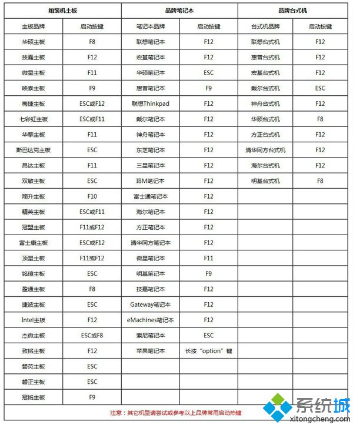

### 三、全新固态硬盘安装win10步骤如下
1、制作好uefi pe启动U盘之后，将win10 64位系统iso镜像直接复制到U盘gho目录下；

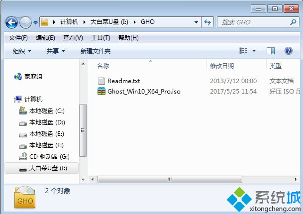

2、在装有固态硬盘的电脑上插入U盘，为了发挥固态盘的速度，首先要进BIOS开启硬盘AHCI模式，以技嘉主板为例子，启动电脑时按Del进入BIOS界面，切换到Peripherals界面，选择SATA Mode Selection回车，选择AHCI回车，按F10保存重启，其他主板查看：bios怎么开启ahci模式；

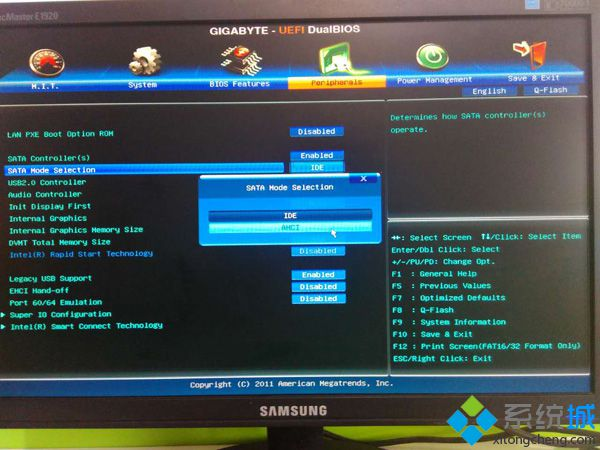

3、重启之后不停按F12或F11或Esc等快捷键，不同电脑启动键不同，技嘉主板是F12，在弹出的启动项选择框中，选择识别到的U盘选项，如果有带UEFI的启动项，要选择uefi的项，回车从uefi引导启动；

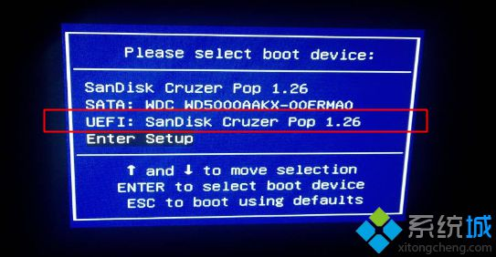

4、由于制作方式不同，有些uefi pe启动盘会直接进入pe系统，有些会先显示pe主菜单，如果显示下面这个界面，选择【02】回车运行win8PEx64正式版；

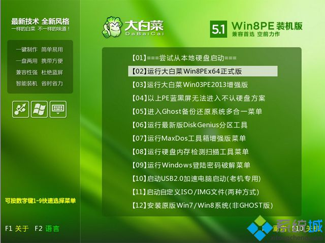

5、进入pe系统之后，双击桌面上的【DG分区工具】，右键选择固态硬盘，一般是带有SSD字样的项，点击【快速分区】；

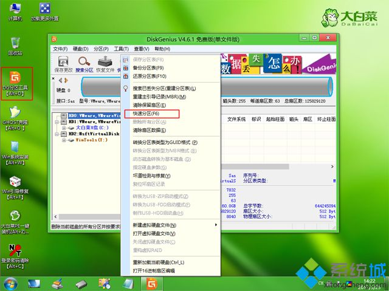

6、分区表类型选择【GUID】，也就是GPT，然后设置分区数目，分区数目自定，设置系统盘的大小，建议50G以上，固态硬盘勾选【对齐分区到此扇区】，扇区数默认即可4k对齐，确定；

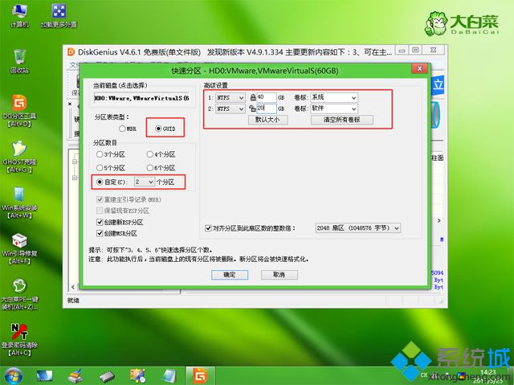

7、之后执行固态硬盘分区以及格式化过程，分区之后如图所示，gpt分区表会有ESP、MSR两个额外分区；

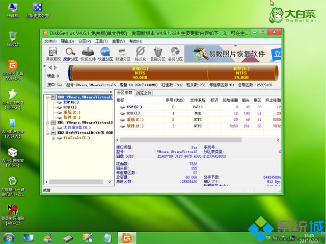

8、接着双击打开【大白菜PE一键装机】，GHO WIM ISO映像路径选择win10 x64 iso文件，然后点击下拉框，安装工具会自动提取到win10.gho文件，选择win10.gho文件；

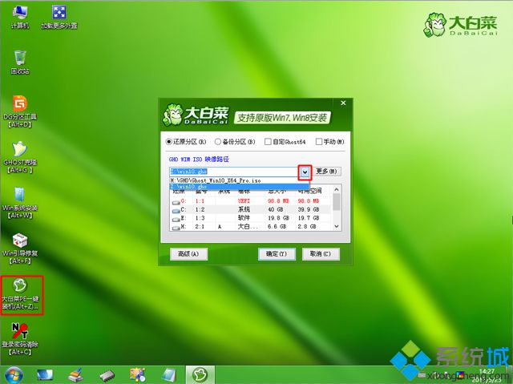

9、接着选择【还原分区】，选择系统安装位置，一般是C盘，如果不是C盘，根据卷标【系统】或硬盘大小来选择，点击确定；

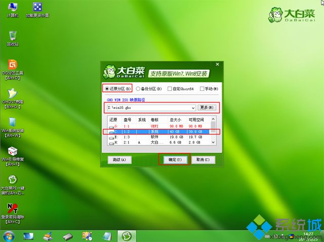

10、弹出这个对话框，勾选完成后重启、引导修复这些选项，点击是执行下一步操作；

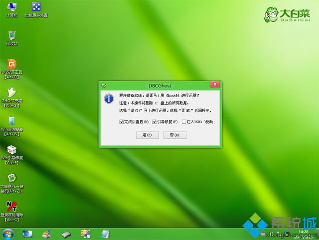

11、转到这个界面，执行win10系统安装到C盘的部署过程，等待进度条执行完成，一般2-5分钟左右；

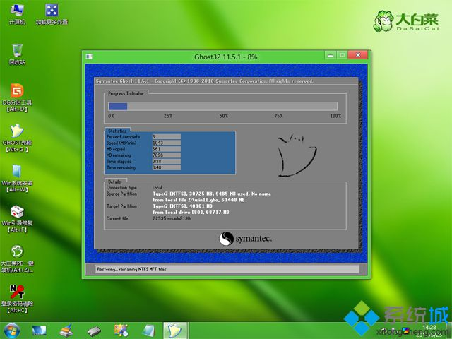

12、操作完成后，会提示电脑即将重启，默认是10秒后自动重启，或者点击是重启电脑；

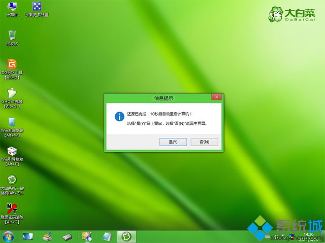

13、此时拔出U盘，不拔除也可以，会自动进入这个界面，继续执行win10系统组件安装、驱动安装和系统配置过程；

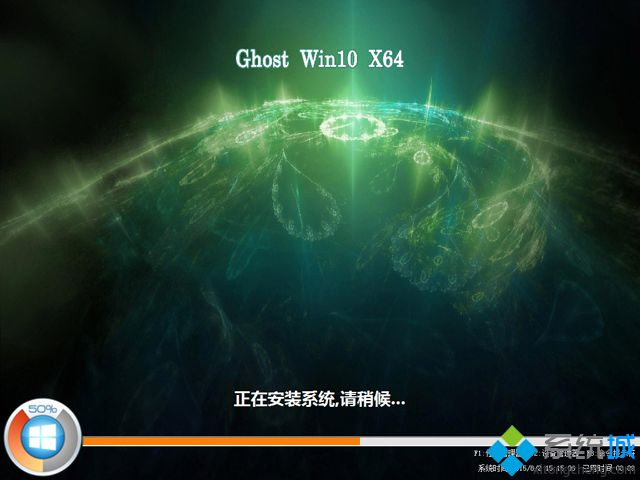

14、整个安装过程需要5-10分钟，在启动进入win10桌面之后，固态硬盘就装上win10系统了。

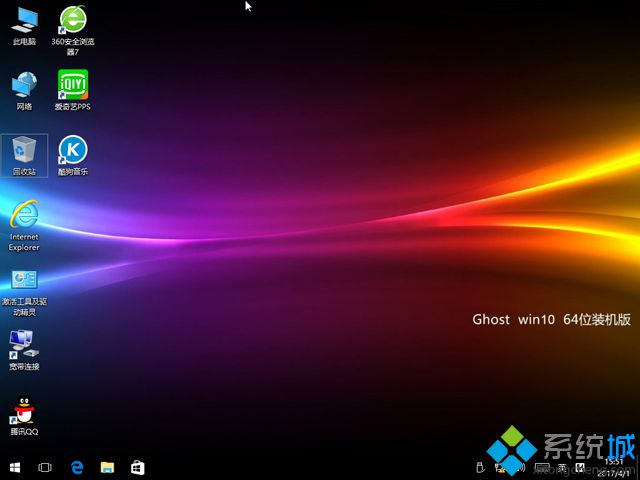

全新固态硬盘安装win10系统的方法就为大家介绍到这边，如果你打算在ssd固态硬盘上安装win10系统，可以按照这个方法来操作。