速读摘要

说它特殊，是因为这是日本导演是枝裕和继《小偷家族》戛纳夺魁后的首部作品，也是他离开本土文化语境、迈向国际合拍的试水之作。因为得知母亲将出版回忆录，路米尔才带着丈夫女儿回到巴黎娘家。而在这部《真相》中，母亲法比安、女婿汉克、已故女演员莎拉和"小莎拉"玛侬四人，都是要么将戏中角色延续到生活，要么为了专注表演而忘却现实。那个"七年等一回"的科幻设定，正好映射了法比安在母亲角色上的失职，以及路米尔对母爱与关注的渴求。

原文约 2303  字  | 图片 37 张 | 建议阅读 5 分钟 | [评价反馈](https://static.app.yinxiang.com/embedded-web/clipper/#/Evaluating?d=2020-04-01&nu=bdc17e55-1007-45cb-be54-628e3d96917e&fr=myyxbj&ud=58b471&v=2&sig=B392F338D0382405527C6CF3D80028AE)

##  法国双影后vs是枝裕和，看完我立马get到了“真相”

原创 有部电影 [有部电影]()**
今天咱们来聊一部特殊的法国电影，也是第76届威尼斯电影节的开幕片——**《真相》。**

.jpg)

之所以说它特殊，是因为这是日本导演是枝裕和继《小偷家族》戛纳夺魁后的首部作品，也是他离开本土文化语境、迈向国际合拍的试水之作。

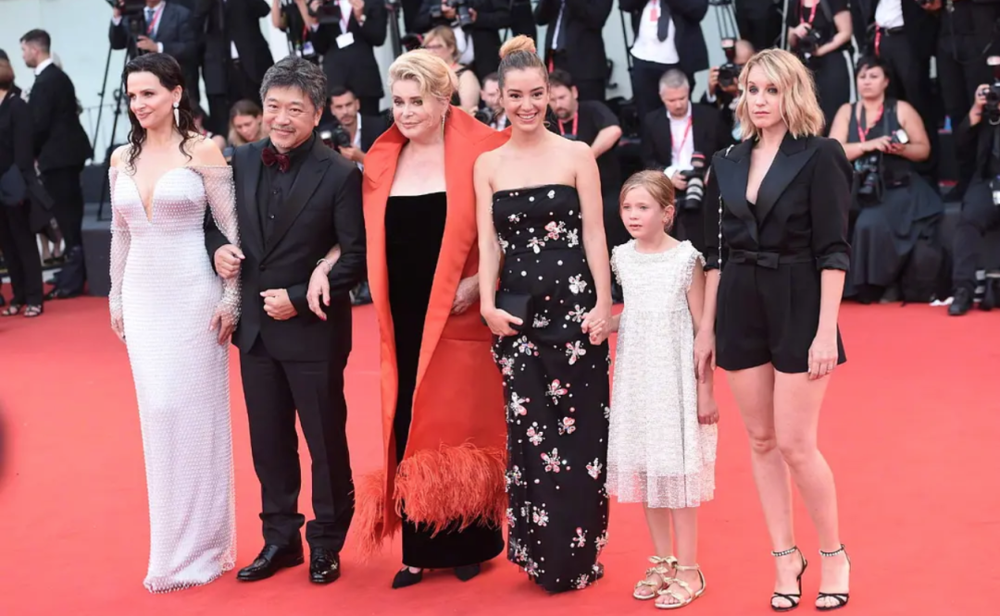

影片的卡司阵容十分华丽——

女主由凯瑟琳·德纳芙和朱丽叶·比诺什两位法国影后担纲，她们在片中饰演一对母女；

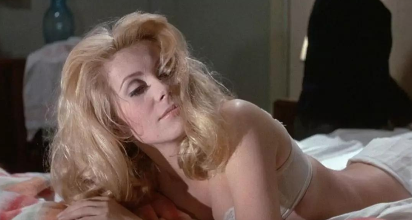

男主则是即将开拍《爱在》系列第四部的伊桑·霍克，他演的是朱丽叶·比诺什的丈夫。

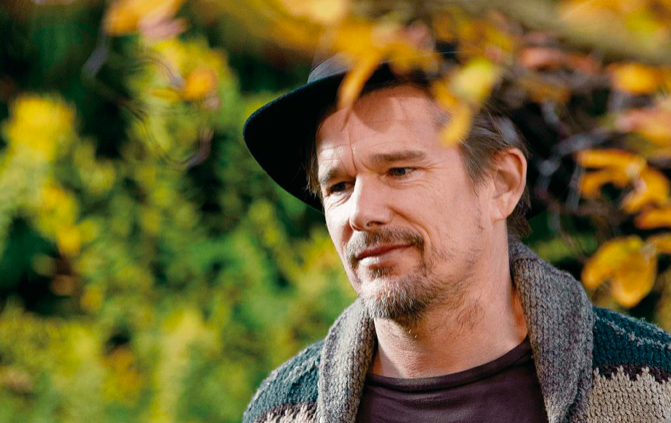

这样一部星光熠熠的作品，在上映后迎来了两极化的口碑评价——

有人说它是是枝裕和的水准之作，也有人认为南橘北枳、水土不服，甚至说它是一部自我重复的作品。

正因为存在争议，《真相》目前在豆瓣上只有7.2分，相比导演的其他旧作逊色不少。

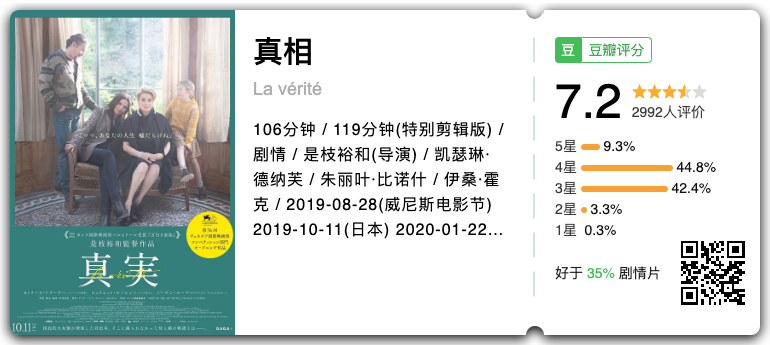

但它真如评分显示的那么不尽人意吗？其实并不尽然。

影片取材自是枝裕和执笔的舞台剧《斗篷》，主角是一对同在演艺圈工作、却又彼此疏离的母女。

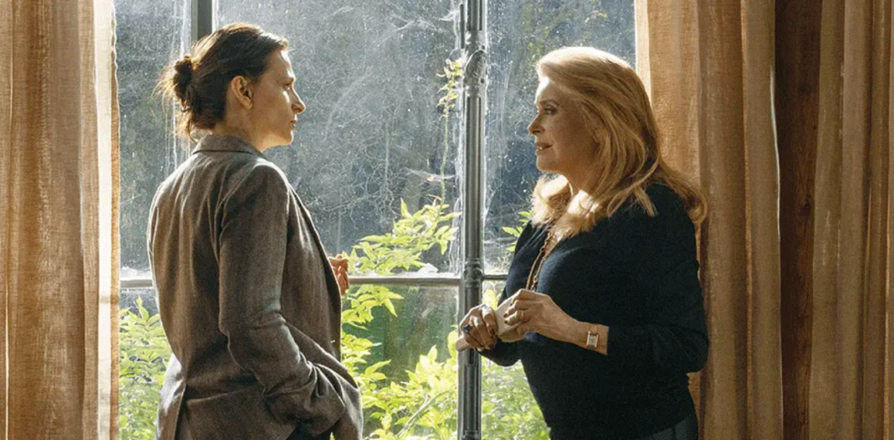

德纳芙饰演的母亲法比安是一位影坛巨星，多次摘得有“法国奥斯卡”之称的凯撒奖桂冠，年逾七十不肯退休，对表演事业充满热情。

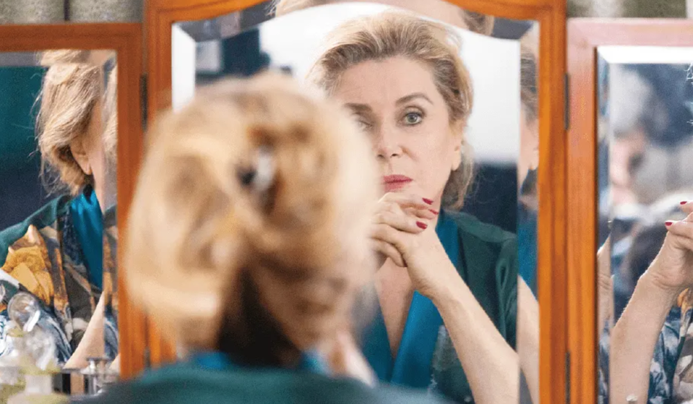

但在银幕之外，她为人刻薄虚荣、劈腿情史丰富、疏于照顾家庭……

总而言之，她既不是一位好情人，也不是一位好母亲。

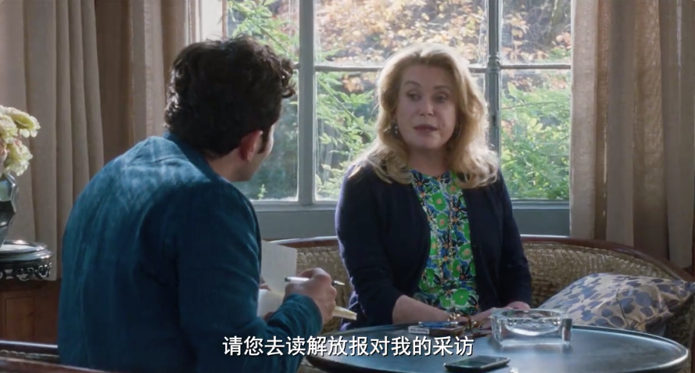

而比诺什饰演的路米尔，是一位影视编剧，也是法比安的独生女。

由于父母过早离婚、母女矛盾重重，她成年后便远赴纽约生活，与美剧演员汉克结婚，生下了女儿夏洛特。

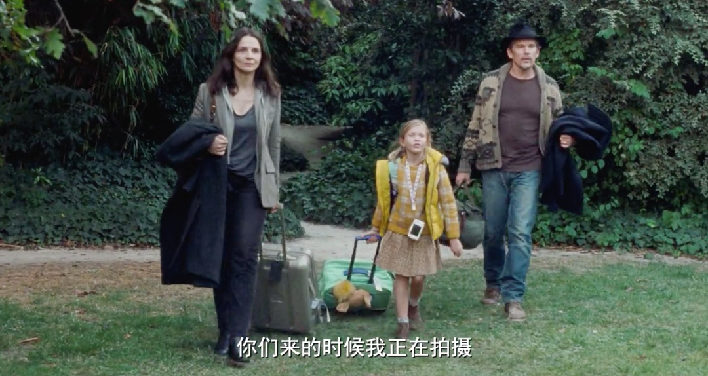

近来，因为得知母亲将出版回忆录，路米尔才带着丈夫女儿回到巴黎娘家。

她表面上以庆祝为名，但到达后的当晚就迫不及待地要来样书，连夜挑出了所有虚构部分。

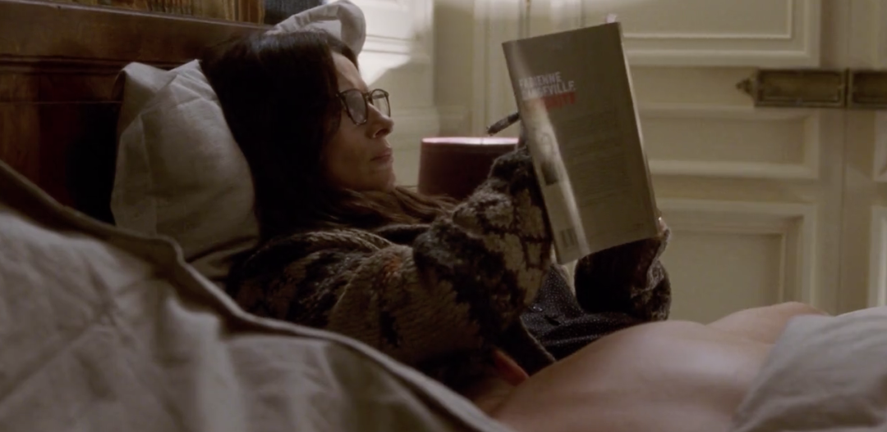

正如路米尔预料，母亲的这本自传里谎话连篇，不仅塑造出母女情深的假象，还对因她而死的闺蜜莎拉只字未提。

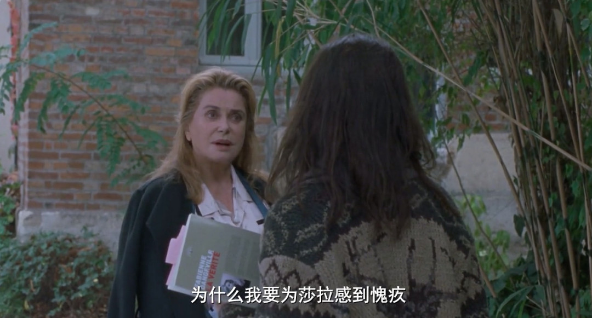

与此同时，法比安还刚接演了一部讲述母女关系的科幻片，《关于我母亲的回忆》。

影片讲的是未来世界中，一位患有绝症的母亲为了活命，只能长期在太空中生活，每隔七年回地球看一次女儿。

随着时光流逝，女儿不断长大衰老，变得雪鬓霜鬟、步履蹒跚；而母亲却始终如记忆中一般，容颜永驻。

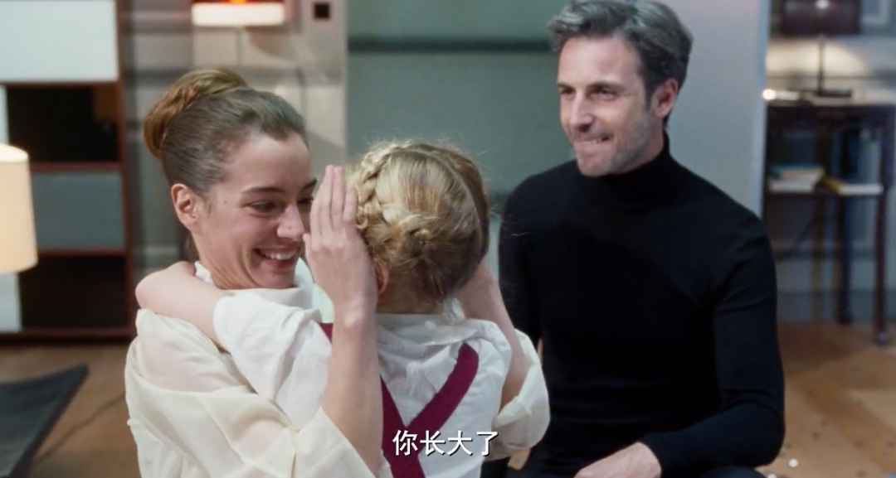

她在片中出演配角，也就是老年版的女儿。

而饰演母亲的，是当红花旦玛侬。她因为长相酷似传奇女演员莎拉（也就是法比安曾经的闺蜜），一直被法国观众寄予厚望。

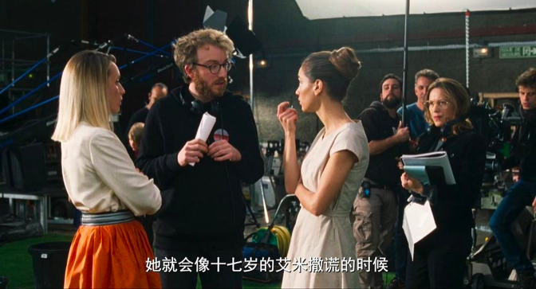

正因如此，法比安对玛侬存有诸多挑剔：

不是嫌她排面大、给自己加戏，就是觉得她卖弄演技不真诚，甚至连养猫这件事，也成为对方为人狡诈、野心勃勃的佐证。

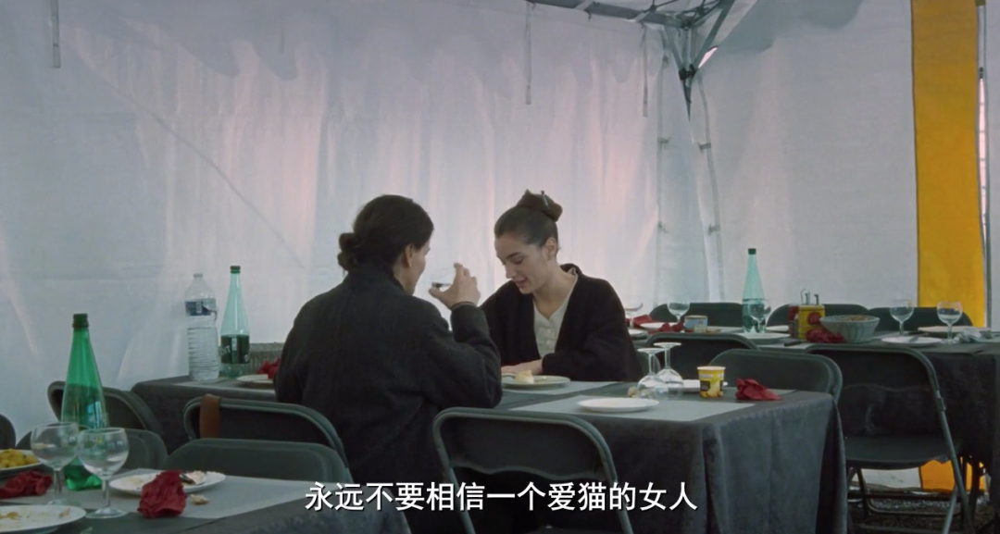

而同样身在片场的路米尔，却渐渐从玛侬身上，找回了一段有关莎拉的封存记忆——

当时由于母亲忙着拍戏、无暇顾及家里，经常是莎拉带着路米尔去片场玩耍，或者陪她参加校园舞台剧的演出。

甚至可以说，相比法比安本人，莎拉更像是陪伴她成长的母亲。

后来有一次，就在莎拉专心为新电影做准备时，法比安却通过潜规则抢走角色，还摘得了影后桂冠，闺蜜俩为此爆发了激烈争吵。

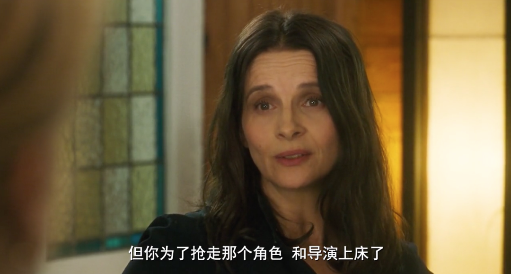

没过多久，莎拉在酒后跳海身亡。

这一度让年幼的路米尔痛苦自责，留下了不可磨灭的童年阴影。

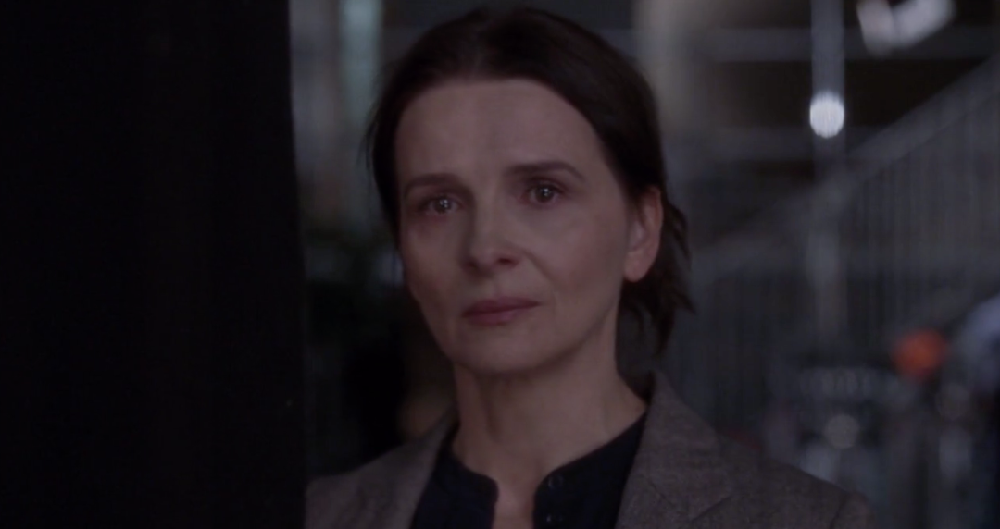

而在见到酷似莎拉的玛侬后，路米尔多年来对母亲的怨恨和不满，全都被唤起。

在当天晚上的家宴上，她忍不住旧事重提，掀起了一场母女撕X的家庭大戏。

整体看下来，这部《真相》虽然将故事背景挪到了法国巴黎，但仍然是一部打着是枝裕和烙印、描绘家庭琐碎与细腻情感的作品。

从影像基调上来看，它既延续了导演惯有的含蓄内敛，又融入了法式的优雅和明亮，并以纪录片式的镜头将这个温情安静的故事娓娓道来。

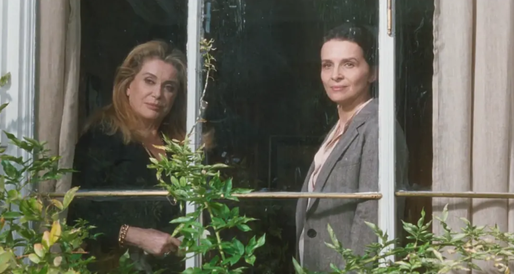

从文本层面来看，它一方面承接原版舞台剧的命题，探讨的是以戏为生的演员职业，如何模糊了生活与艺术的虚实界限。

这种不疯魔不成活式的探讨，跟咱们之前聊过的德国影片《壳中裂缝》主题有些相似。

那部电影讲的是一位天资平庸的表演系女学生，为了演好舞台剧，不惜打破现实边界、将戏中人设代入到生活里，一度在崩溃自残的边缘来回试探。

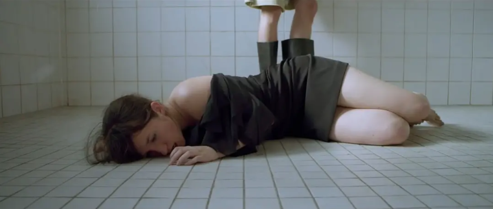

而在这部《真相》中，母亲法比安、女婿汉克、已故女演员莎拉和“小莎拉”玛侬四人，都是要么将戏中角色延续到生活，要么为了专注表演而忘却现实。

比如汉克，明明是因为酗酒成瘾不得不戒，却为了在众人面前挽尊，谎称自己是在争取一个重要角色。

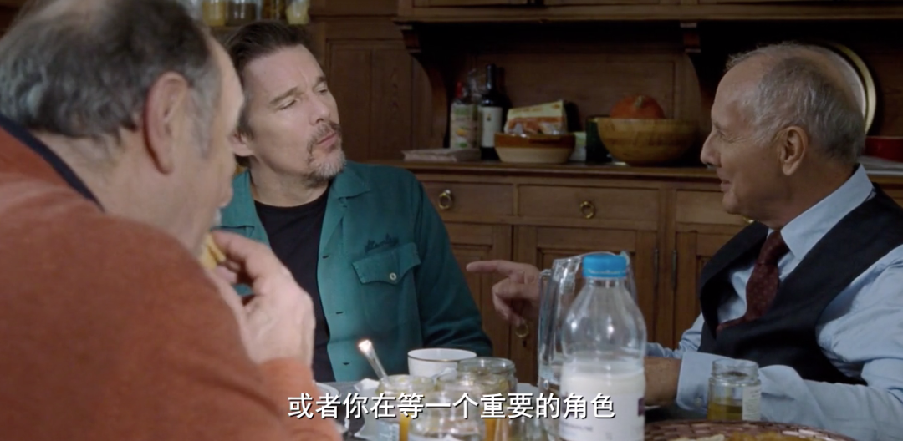

比如法比安，为了将饱满情绪留到镜头前，宁愿在现实中保持疏离孤立，甚至伤害女儿、背叛朋友。

在她看来，只有那些本职工作失败、演不好戏的演员们，才会将注意力放在慈善公益、政治活动，以及自己的日常生活中。

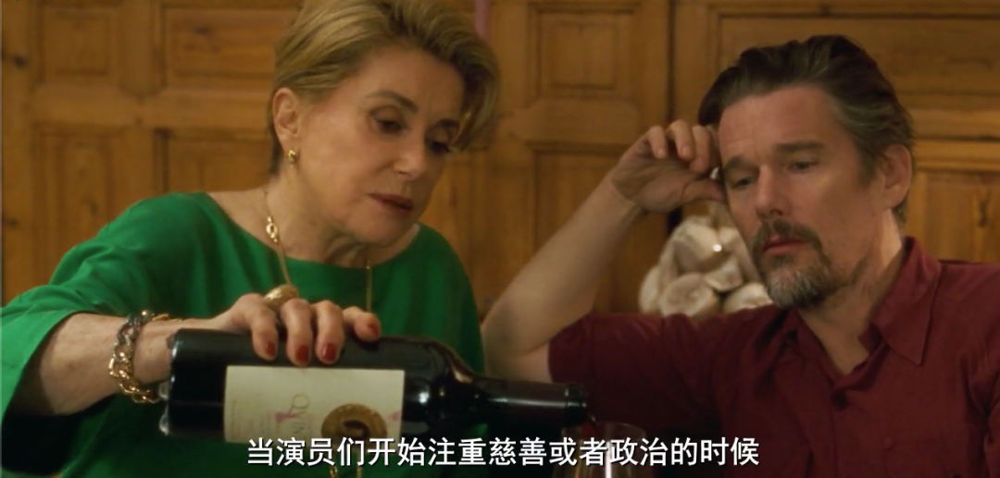

而另一方面，透过影片的“戏中戏”，我们不难看出《真相》延续了是枝裕和一贯钟情的创作母题——**缺席的母（父）爱。**

那个“七年等一回”的科幻设定，正好映射了法比安在母亲角色上的失职，以及路米尔对母爱与关注的渴求。

所以她才会对法比安说，“你也在太空船上度过了一些时间”。

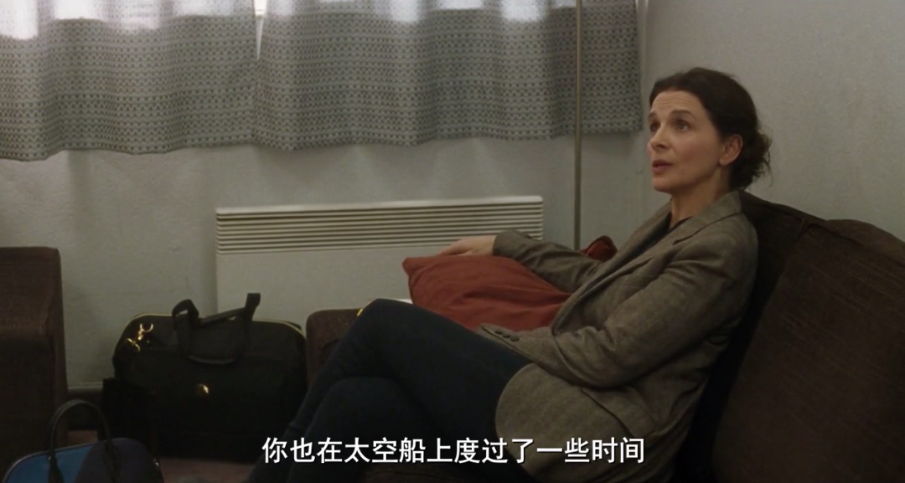

在得知法比安出版新书后，她特地以“人生赢家”的姿态拖家带口地回到巴黎，除了想揭穿自传里的谎言外，还想让对方感受到嫉妒与挫败。

但谁知，母亲压根看不上这位美剧演员女婿，言辞间无时无刻不透着轻视与高冷。

直到拍摄《关于我母亲的记忆》的过程中，法比安通过扮演“女儿”的角色体验身份转换，才终于了解到女儿的心境，母女俩产生了和解的契机。

就像片名所暗示的，法比安虽然不是个称职的母亲，却也一直以自己的方式关注着女儿成长。

她会跑去学校偷看女儿的舞台剧，为女儿接演儿童奇幻电影，甚至对莎拉产生了嫉妒之心。

此前，在是枝裕和的电影作品中，这类“缺席”大多发生在父亲身上。

比如《步履不停》中，总是远离家庭、独处一室的父亲；《如父如子》中，让妻子“丧偶式育儿”的父亲；《无人知晓》中，集体缺席孩子人生的父亲；《海街日记》中，一开场就举办葬礼的父亲……

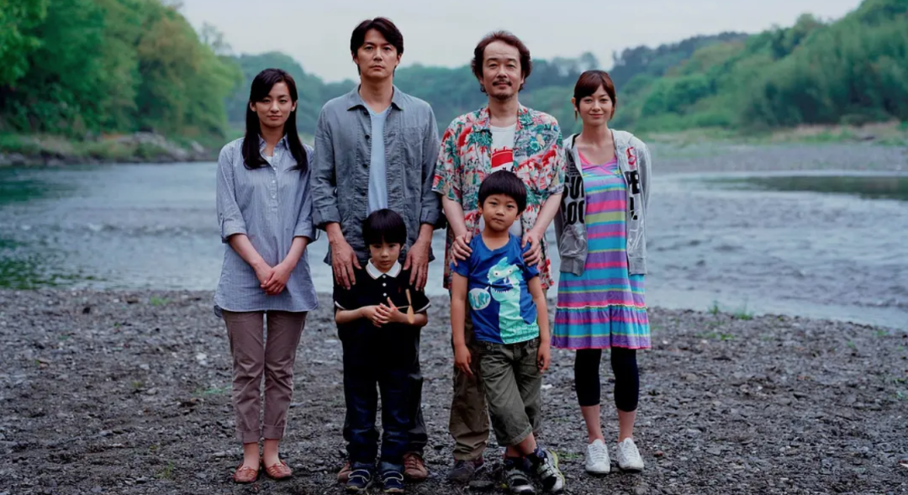

这种缺席，既与是枝裕和的成长经历有关，也与二战后日本社会的父权崩坏，所造就的父子至亲间的疏离有关。

而相比以上作品，《真相》只是聚焦家庭的分崩离析、艺术与现实的界限矛盾，却缺少了社会文化层面上的支撑，显得相对单薄了不少。

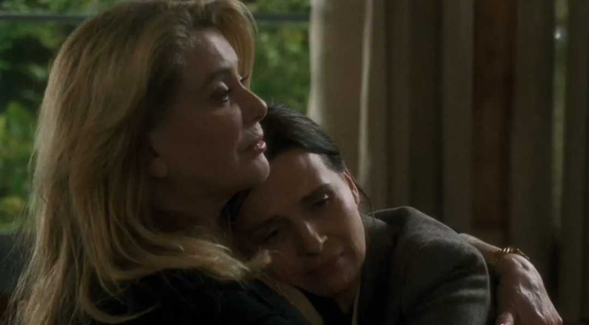

与此同时，应该看到导演做出了不少“东西合璧”的尝试——比如通过日常化的家庭料理场景，为影片增添不一样的亲密情感氛围；比如以日式家庭片的缓慢节奏，来呈现法国家庭的生活日常等。

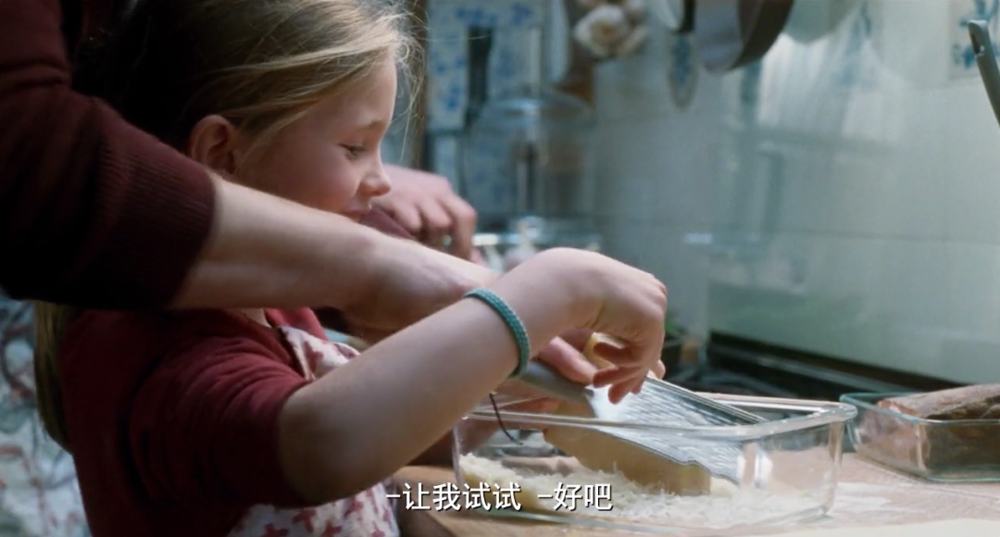

**总体而言，这部跨越文化语境的合拍电影，虽然与导演的几部代表作略有差距，但它绝对算得上有诚意、有亮点，也不乏解读空间。**

**更何况，敢于跳出自己的舒适区，这本身就是一种值得我们肯定的尝试。与其质疑导演在法国拍片是否水土不服，不如期待他在这次的尝试后，又会给我们带来怎样精彩的作品。**

也许是国内最认真的电影自媒体
长按扫描二维码关注

**帮忙点个在看呀**

在看