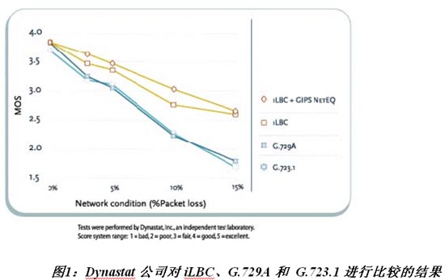
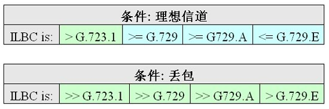

# iLBC － 为未来而设计的编码／译码器
### 引言 

自 VoIP 技术面世以来，业界对现存的低比特率编解码器 (codec) 标准的关注一直不断。影响 VoIP 设备制造和应用开发商的主要问题包括涉及众多专利持有者的复杂知识产权 (IPR) 管理、昂贵的使用许可模式，以及实际 IP 网络的低劣质量。在　2000 年，Global IP Sound (GIPS) 公司决定开发一种能够满足 VoIP 产业需求的 codec，目标是利用 GIPS 内部的专业能力开发一款免授权费 (royalty-free)、专为数据包通信而设计，而且在理想无错情况和丢包情况下都能提供高音质的 codec，并把它引入不同的标准化机构以符合互操作性的要求。这就是 iLBC codec 诞生的缘起。 
### 历史 

目前大多数的语音 codec 都是基于代码激励线性预测 (Code Excited Linear Prediction, CELP) 编码模型的，例如 ITU G.729 和 G.723.1、GSM-EFR 和 3GPP-AMR。CELP 一直都被视为在交换网络中以低比特率电路获得高质量的一种非常成功的方法。这种编码方法具有高效性，主要是由于它利用了连续语音片断之间的互相依赖性，因此 CELP codec 的性能主要取决于前面编码的历史。CELP编码器是基于存储器的，故丢包或延迟所造成的误差会扩散开来，结果是单个丢包会影响到随后多个数据包的质量，这显然是数据包通信的一大缺陷。 
### iLBC 编解码器 

iLBC 是为专为提供稳健的 IP 语音通信而开发的语音 codec，以窄带语音为设计基础，具有 8 kHz 的采样率。iLBC codec 支持两种基本的帧长度：13.3 kbps 比特率下编码帧长度为 30 ms；而 15.2 kbps比特率下编码帧长度则为 20 ms。
采用 iLBC 算法可以获得一个具有丢包响应控制的语音编码系统。iLBC 对每一个数据包的处理都能够独立于其它数据包来进行，是数据包通信的理想选择。即使 IP 丢包和/或延迟现象的恶化，这种 codec 的语音质量下降情况也不会太差。这与基于 CEIP 模型的一般 codec 的行为不同，这类 codec 最先是为交换电路网络或无线网络而设计的，是设计来恢复位错误而非丢包的。 
        丢包现象发生时，语音 codec 的一项相关基准是从单个丢包情况下恢复过来所需的帧/包数量。在 iLBC 的情况中，数量是零。在丢包之后的第一个数据包总仍能按原本安排的被精确解码。 
        iLBC 是一种窄带语音 codec，使用了整个 4kHz 频带，而大多数标准低比特率 codec 只利用从 300 Hz 到 3400 Hz 的频带。这一点对音质的影响是相当明显的。此外，iLBC 语音编码的频谱特性精确模拟了原始信号的特性，其语音比标准低比特率 codec 的更自然清晰。 
        总而言之，iLBC 算法为数据包网络实现了尖端的固定比特率编码，在质量与比特率之间取得了非常出色的平衡。 
### 标准化 
2004 年 4 月，在针对多媒体终端适配器 (multiple terminal adapter, MTA) 和媒体网关发布的 CableLabs PacketCableTM 1.1 音频/视频 codec 规范中，iLBC 被规定为一种强制式 codec。Comcast 公司新媒体开发高级副总裁兼 CableLabs 的 PacketCable 业务部门主席 Steve Craddock 表示：“由于 GIPS iLBC 编码是专门为数据包网络而设计的，所以我们深信该种专业水平的规范，能够为有线运营商提供所需的高性能和音质，让其VoIP 解决方案在客户中赢得优势。” 
        iLBC 在 2002 年 3 月获互联网工程工作小组 (Internet Engineering Task Force,IETF)　认可，成为第一个标准化的语音/音频 codec。现在，iLBC codec 处于 IEIF 标准化过程的最后一个阶段，是 IETF 视听传输工作小组 (Audio Visual Transport Work Group) 的一部分。 

### Codec 性能 
GIPS 公司和一些独立实验室对 codec 的若干性能进行了评测。2002 年，Dynastat 公司对 iLBC 实施了正式的听力测试。2003 年，AT&T 的音质评估实验室 (Voice Quality Assessment Lab, VQA) 也对 iLBC codec 进行了广泛的测试。 
        下图所示为 Dynastat 的评估结果，其根据现有编码标准 G.729A 和 G.723.1 对 iLBC 的 30ms 模式进行了标准测试。结果明显表明，用于实际环境时，iLBC 的性能卓越，即使在恶劣的网络条件下，其固有的数据包网络属性也能提供很高的质量。 
     

            

这些测试还显示了 iLBC 在丢包条件下的性能不仅显着优于目前的标准 codec (G.723.1、G.728、G.729、GSM 等)，而且还等于甚至优于理想信道 (无丢包) 条件下的标准 codec。 
  

             

AT&T 的测试结果也显示，iLBC 中，20 ms 和 30 ms 模式之间没有显着的性能差异；而在丢包情况下，20 ms 模式甚至表现出更好的丢包稳健性。AT&T VQA 实验室也表示，iLBC 在存在背景噪声时的性能十分优秀，可媲美信道无丢包的 G.729.E。 
### 实现方案 

目前，好几家 VoIP 设备及应用生产商都在自己的产品中集成了 iLBC。下面我们列出了在自家商用产品中选用了 iLBC 的部分公司： 
应用/软件电话：Skype、Nortel、Webex、Hotsip、Marratech、Gatelinx、K-Phone、 XTen； 
IP 电话：WorldGate、Grandstream、Pingtel； 
芯片：Audiocodes、TI Telogy、LeadTek、Mindspeed。 
### iLBC 使用许可 

设备和应用生产商一直在寻找高成本效益的方法来满足新的要求，并为市场提供新的功能。在决定是由内部自行开发 iLBC、还是从其它供应商那里获得 iLBC 编码使用授权时，需要对好几个方面进行全面考虑。 
从其它供应商那里获得 iLBC 编码使用授权能够大量节省开发成本；提高质量；加快上市速度；降低风险，并增强灵活性。不过，选择供应商时应该非常谨慎，力求把风险或额外成本降至最低。 
选择供应商的准则包括：
具备应付把 iLBC 移植到定点 DSP 环境时一些极敏感的推行和测试问题的专业能力
对于所选定的平台，在 MIPS、质量、代码大小，以及存储器等方面能满足相关的技术要求。
浮点　(FLP) 到定点　(FIP)　的转换必需在效率、存储器利用率和最重要的音质之间进行权衡。
不良的 iLBC FIP 代码推行将有碍 DSP 的移植。
提供语音 codec 的定点 ANSI C 转换记录，提供 DSP 优化和信号处理技术。
所选定的平台，必须在 iLBC 获授权者中拥有良好的表现记录。 
必需选择一家经验证的 iLBC 供应商，以确保获得及时的成果和高质量的性能。

计算自行开发 iLBC 设计的成本 
为了计算一位经验丰富的设计人员把浮点代码转换为定点 ANSI C 代码、或转换为 DSP 平台所花费的设计时间，我们作出了以下的假设： 
由一位在 codec、FIP 及 DSP 方面具备丰富知识的高级工程师来执行设计任务；“标准” 优化 (大部分代码采用 C 程序，关键部分采用汇编语言)； DSP 转换基于高质 iLBC FIP 代码进行。 
   

          
