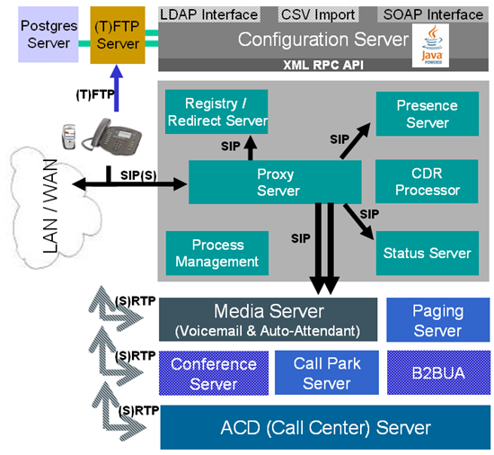
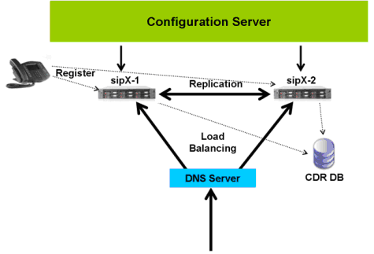

# sipX(sipXecs)简介
### 一、 概述
  sipX的前身是Pingtel公司的sipXchange。sipXchange在1999年推出，是当时行业内第一个采用分布式纯SIP构架的企业级IP PBX系统。Pingtel公司做为IETF sipping组织的重要成员，对SIP标准和发展趋势掌握得比较好，其产品在SIP协议的支持完善性和与其它SIP设备的互通性方面广受业界好评。
   2004年，在看到VoIP开源市场的潜力和Asterisk所取得的影响力后，创建了SIPfoundry开发社区（www.sipfoundry.org），将核心代码sipX PBX以L-GPL形式开源化，并投入重要人力，保持与其商业产品sipXchange的内核同步。sipX虽然进入开源社区比较晚，参与人数也远不如Asterisk，但由于控制层核心是基于商业级产品的基础构建，而且又采用了先进的敏捷开发流程，起点比Asterisk在开源化之初的个人即兴开发产品成熟度高，发展规模快。特别是进入2006年后，在功能特性支持方面明显缩小了与Asterisk的差距。然而，在市场定位方面，不像Asterisk主要应用于100用户以下的中小企业和家庭用户，sipX主要应用于数百用户至一万用户的大中型企业，因此在国内无论是研究人数还是应用规模，sipX都要比Asterisk差许多。
       sipX在系统架构和协议支持方面与Asterisk有显著的不同：呼叫控制协议只支持SIP协议；分布式模块架构。
### 二、 体系结构

              图1 sipX基本体系结构
    如图1所示，sipX由一组服务器群组成，包括三种类型：
1． 配置服务器
      通过HTTP、FTP等协议与其它服务器或外围设备交互，负责WEB方面的配置管理和业务操作。包括配置服务器、FTP服务器和Postgres服务器。
2． 通信服务器
      通过SIP协议与其它服务器或外围设备交互，负责呼叫控制和通信处理。包括认证代理服务器、注册/重定向服务器、Presence服务器、状态服务器和forking代理服务器。
3． 特征服务器
      在通信服务器控制下，实现特定的业务逻辑。这类服务器是以扩展方式纳入sipX架构中的，目前主要包括媒体服务器、会议服务器、Call Park服务器、B2BUA服务器和ACD服务器。
      在sipX中，采用完全的分布式架构，每个服务器为一个独立的软件进程，运行在类Unix环境（如Federa、CentOS、Debian等）下，通过TCP/UDP方式协同工作。这种架构具有以下优点：
1．运行配置灵活：
       所有服务器既可以运行在一台硬件服务器上，又可以单个或一组分别运行在不同的硬件服务器上。
2．性能提升简单：
       可以简单地通过增加硬件服务器，使处理能力得到大幅度提高。
3．信令流与媒体流分离：
      RTP流不经过信令服务器处理，直接端对端的连接，相对于传统IP PBX技术，显著降低了信令服务器的开销。
4．第三方服务器引入方便：
      除了核心服务器外，其它服务器的替代和引入只要遵循标准协议和业务流程，就可以独立引入，而无需整体架构的变更。
5．高可用性（HA）实施难度减低：
        完全分布式的服务器部署方式，使HA技术的引入可以分阶段进行。首先在核心的呼叫控制部分引入简单的单模式有损HA后，然后逐步过渡到复杂的多模式无损HA，最后再遵循类似的技术路线向外围服务器演进。
     注：本文撰写于2006年底，自2007年4月开始，开源版本sipX与商业版本sipXchange合并成sipXecs。目前最新的版本是V3.11，体系架构与上述内容有一定出入。
### 三、 配置服务器
  属于WEB服务器，采用即插即用方式（Auto Provision）配置管理其它服务器模块，还包括外围网关和电话终端。配置管理的过程有两种：通过LDAP接口配置管理已定义模块；通过SOAP接口，向WEB service设备提供配置服务。

  图2 配置服务器提供的服务方式
  考虑到JAVA语言的平台无关性、强大灵活的MVC架构、XML的内在支持和丰富的因特网业务集成包，该服务器完全基于Spring和Tapestry框架实现。
### 四、 媒体服务器
  采用纯软件方式实现各种语音DSP功能，包括播音、录音、DTMF收号、动态语音拼接、语音编码转换等功能。它内部集成了开源openVXI voiceXML 2.0解析器，提供三种基于voiceXML脚本的媒体业务：自动应答、IVR和语音信箱。用户能够在这些脚本的基础上，遵循voiceXML2.0标准，快速定制其它的IVR业务。
### 五、 通信服务器
  提供了丰富的PBX交换功能，包括：
1． Automatic Route Selection
2． Call Authorization
3． Call Forwarding
4． Dial Plan Definition Facility
5． Gateway Route Seletion Facility
6． Hunt Groups
7． Mapping Rules
8． Multi-Site/Multi-Location Phones&Gateway
9． Off-premise extensions
10．Outbound Call Blocking
11．Toll Bypass
12．lTransfers
13．Pard & Retrieve
### 六、 功能特性
1．通信业务
* Transfer (consultative & blind)
   * Call coverage
   * Call hold / retrieve
   * Consultation hold
   * Music on Hold for IETF standards compliant phones (release 3.6)
   * Uploadable music file
   * 3-way conference
   * Call pickup (global and directed call pickup)
   * Call park & retrieve
   * Hunt groups
   * SIP URI dialing
   * CLID (Calling Line Identification)
   * CNIP (Calling party Name Identification Presentation)
   * CLIP (Call Line Identification Presentation)
   * CLIR (Call Line Identification Restriction) (release 3.6)
   * Per gateway CLIP manipulation  (release 3.6)
   * Call waiting / retrieve
   * Do not Disturb (DnD)
   * Forward on busy, no answer, do not disturb
   * Multiple line appearances
   * Multiple calls per line
   * Multiple station appearance
   * Outbound call blocking
   * Click-to-dial (Windows XP)
   * Redial
   * Call history (dialed, received, missed)
   * Auto off-hook / ring down
   * Incoming only
3．用户管理
* Numeric or alpha-numeric User ID
   * User PIN management (UI or TUI)
   * Aliasing facility (numeric and alpha-numeric aliases)
   * Extension and alias uniqueness assurance
   * Granular per user permissions
   * Call permissions:
         o 900 Dialing
         o International Dialing
         o Long Distance Dialing
         o Mobile Dialing
         o Local Dialing
         o Toll Free Dialing
         o Forward Calls External
   * System permissions:
         o User has voicemail inbox
         o User listed in auto-attendant directory
         o User can record system prompts
         o User has superuser access
         o User allowed to change PIN from TUI
   * Custom permissions (release 3.6)
   * Supervisor permission for groups (e.g. Call Center supervisor)
   * SIP password management for security
   * User groups with group properties
   * Per user call forwarding (follow me)
         o  To local extension, PSTN number, or SIP address
         o Parallel or serial ring
         o Allows definition of ring time before trying next number
         o Allows several forwarding destinations
         o Follow-me configuration using user portal
   * Extension pool with automatic assignment
   * Per user Caller ID (CLID) assignment
   * Per user Caller ID blocking
9．系统管理
* Browser based configuration and management
   * LDAP integration (release 3.6)
   * SOAP Web Services interface
   * CSV import of user and device data
   * Integrated backup & restore
   * Scheduled backups
   * Diagnostics
         o Display active registrations
         o Display job status
         o Status of services
         o Snapshot logs for debugging
         o Logging (customizable log levels, message log per service)
   * Domain Aliasing (release 3.6)
   * Support for DNS SRV
   * Automatic restart after power failure
10．设备管理
* Plug & play management of phones
   * Auto-generation of phone config profile
   * Auto-pickup of profile by phone
   * Centralized management of all phone parameters
   * Centralized backup and restore of all phone config
   * Auto-generation of lines by assigning users to devices
   * Device group management & properties
   * Firmware upgrade management
4．拨号计划
* Easy to use GUI based dial plan manipulation
   * Rules based least cost routing
   * Automatic gateway redundancy and failover
   * Specific E911 routing
   * Permission based rules
   * Prefix manipulation
   * Dialplan templating for international dial plans (release 3.6)
   * Built-in support for U.S., German, Swiss, and Polish local dial plans (release 3.6) 
     (Any other local dial plan can be added as a plugin)
   * Specify internal extension length
   * ISN dialing based in ITAD numbers. See freenum.org (release 3.8)
   * Redirector plugins - any imaginable dial rule can be added as a plugin (release 3.8)
5．中继
* Unlimited number of PSTN gateways and trunk lines
   * Supports any SIP compliant gateway (e.g. Cisco, Audiocodes, Mediatrix, Vegastream, Patton, etc.)
   * Gateways can be in any location
   * Gateway selection per dialing rule
   * DID
   * Local DID per gateway (release 3.6) 
   * DNIS
   * CLIP Management (release 3.6) 
         o User CLIP
         o Gateway default CLIP
         o Prefix stripping / appending
   * Per gateway CLIR (release 3.6)
   * Automatic Route Selection (ARS)
   * Least-cost routing (LCR)
   * Automatic failover if unavailable
   * Automatic failover if busy
   * FAX support
* Easy to use GUI based dial plan manipulation
   * Rules based least cost routing
   * Automatic gateway redundancy and failover
   * Specific E911 routing
   * Permission based rules
   * Prefix manipulation
   * Specify internal extension length
### 七、 高可用性支持
从sipX 3.2版开始，支持呼叫控制级的高可用性（包括证代理服务器、注册/重定向服务器、状态服务器）。

图3 HA基本结构
      如图3所示，配置服务器同时管理两个sipX服务器。正常情况下，两台sipX基于DNS SRV记录方式，进行负载均衡，各承担一部分通信流量。在此期间，注册、状态、CDR等信息是相互复制，保持同步，对于外界来说如同一台性能加倍的服务器。虽然按照这种方式，可以使系统架构支持更多的服务器冗余，但对于企业级应用来说两台已经足够了，而且这种方式特别适合具有双归属功能的电话终端或网关设备。
 