# WebRTC之VAD算法
## 语音增强和语音识别系列博文

VAD（Voice Activity Detection）算法的作用是检测语音，在远场语音交互场景中，VAD面临着两个难题：

1.    可以成功检测到最低能量的语音(灵敏度)。

2.    如何在多噪环境下成功检测（漏检率和虚检率）。

漏检反应的是原本是语音但是没有检测出来，而虚检率反应的是不是语音信号而被检测成语音信号的概率。相对而言漏检是不可接受的，而虚检可以通过后端的ASR和NLP算法进一步过滤，但是虚检会带来系统资源利用率上升，随之系统的功耗和发热会进一步增加，而这会上升为可移动和随声携带设备的一个难题。

本文基于WebRTC的AEC算法，WebRTC的VAD模型采用了高斯模型，这一模型应用极其广泛。

## 高斯分布

高斯分布又称为正态分布（Normal distribution/Gaussian distribution）。

若随机变量X服从一个数学期望为μ，标准差为σ^2的高斯分布，则：

X~N(μ，σ^2)

其概率密度函数为：

f(x)=1/(√2π σ) e^(-〖(x-u)〗^2/(2σ^2 ))

高斯在webRTC中的使用：

f(x_k |Z，r_k)=1/√2π e^(-(x_k-u_z )^2/(2σ^2 ))

x_k是选取的特征向量，webRTC中指x_k是六个子带的能量（子带是80~250Hz，250~500Hz，500Hz~1K， 1~2K，2~3K，3~4KHz，变量feature_vector存放的就是子带能量序列），r_k是均值u_z和方差σ的参数结合，这两个参数决定了高斯分布的概率。Z=0情况是计算噪声的概率，Z=1是计算是语音的概率。

这里采用最高频率是4KHz的原因是，webRTC中程序将输入（48KHz，32HKz，16KHz）都下采样到8KHz，这样根据奎斯特频率定理，有用的频谱就是4KHz以下。

当然也可以采用8KHz截止频率，这样就需要自己训练和修改高斯模型的参数了，这个算法我试过，要比基于DNN的方法好用，灵活性大些，体现在参数自适应更新上，举例来说，在夜晚安静家庭场景中，噪声的均值就比较低的，白天周边环境噪声多了时，噪声特征的均值也会随之调整，针对DNN的方法，参数一旦训练完毕，那么适用的场景的就定了，如果要增大适用场景，首先要收集目标场景的数据，标注好的数据重新训练（通常要增加参数数量），这样的过程会导致1.数据收集成本高，2.参数过多计算代价大（VAD一般是一直工作的）。

## Webrtc采用的是GMM模型

等待视频链接地址。

WebRTC算法流程

### 1.设置VAD激进模式

共四种模式，用数字0~3来区分，激进程度与数值大小正相关。

0: Normal，1：low Bitrate， 2：Aggressive；3：Very Aggressive

这些激进模式是和以下参数是息息相关的。
// Mode 0, Quality.
staticconstint16_t kOverHangMax1Q[3] = { 8, 4, 3 };
staticconstint16_t kOverHangMax2Q[3] = { 14, 7, 5 };
staticconstint16_t kLocalThresholdQ[3] = { 24, 21, 24 };
staticconstint16_t kGlobalThresholdQ[3] = { 57, 48, 57 };
// Mode 1, Low bitrate.
staticconstint16_t kOverHangMax1LBR[3] = { 8, 4, 3 };
staticconstint16_t kOverHangMax2LBR[3] = { 14, 7, 5 };
staticconstint16_t kLocalThresholdLBR[3] = { 37, 32, 37 };
staticconstint16_t kGlobalThresholdLBR[3] = { 100, 80, 100 };
// Mode 2, Aggressive.
staticconstint16_t kOverHangMax1AGG[3] = { 6, 3, 2 };
staticconstint16_t kOverHangMax2AGG[3] = { 9, 5, 3 };
staticconstint16_t kLocalThresholdAGG[3] = { 82, 78, 82 };
staticconstint16_t kGlobalThresholdAGG[3] = { 285, 260, 285 };
// Mode 3, Very aggressive.
staticconstint16_t kOverHangMax1VAG[3] = { 6, 3, 2 };
staticconstint16_t kOverHangMax2VAG[3] = { 9, 5, 3 };
staticconstint16_t kLocalThresholdVAG[3] = { 94, 94, 94 };
staticconstint16_t kGlobalThresholdVAG[3] = { 1100, 1050, 1100 };
它们在计算高斯模型概率时用到。

### 2.帧长设置

A）    共有三种帧长可以用到，分别是80/10ms，160/20ms，240/30ms，实际上目前只支持10ms的帧长。

B）    其它采样率的48k，32k，24k，16k会重采样到8k来计算VAD。

       之所以选择上述三种帧长度，是因为语音信号是短时平稳信号，其在10ms~30ms之间可看成平稳信号，高斯马尔科夫等信号处理方法基于的前提是信号是平稳的，在10ms~30ms，平稳信号处理方法是可以使用的。

### 3.高斯模型中特征向量选取

在WebRTC的VAD算法中用到了聚类的思想，只有两个类，一个类是语音，一个类是噪声，对每帧信号都求其是语音和噪声的概率，根据概率进行聚类，当然为了避免一帧带来的误差也有一个统计量判决在算法里，那么问题来了，选择什么样的特征作为高斯分布的输入呢?这关系到聚类结果的准确性，也即VAD性能，毋庸置疑，既然VAD目的是区分噪声和语音，那么噪声信号和语音信号这两种信号它们的什么特征相差最大呢?选择特征相差比较大自然能得到比较好的区分度。

  众所周知，信号的处理分类主要有时域，频域和空域，从空域上看，webRTC的VAD是基于单麦克的，噪声和语音没有空间区分度的概念，在多麦克风场景，确实基于多麦克风的VAD算法，从时域上看，而者都是时变信号，且短时信号变化率比较小，所以推算来推算去只有频域的区分度可能是比较好的。

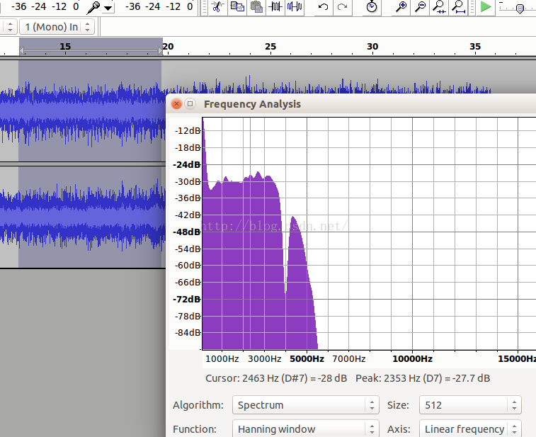

汽车噪声频谱

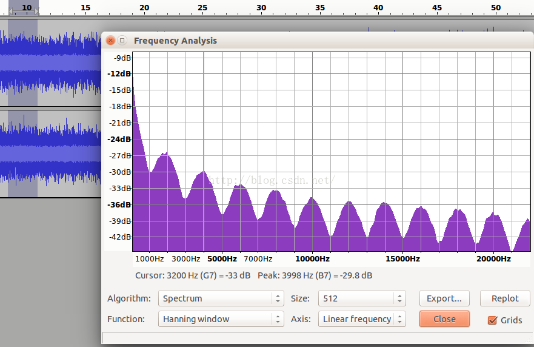

粉红噪声频谱

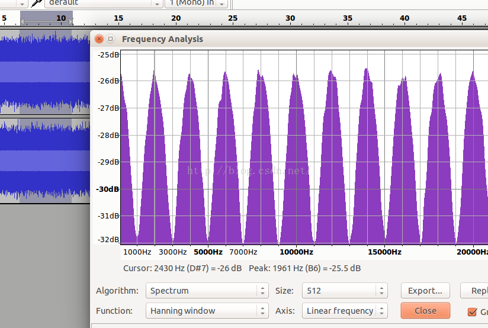

白噪声频谱

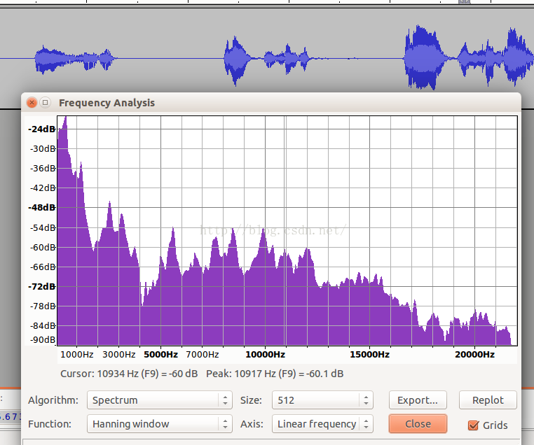

语音声谱

 从以上四个图中，可以看到从频谱来看噪声和语音，它们的频谱差异还是比较大，且以一个个波峰和波谷的形式呈现。

  WebRTC正式基于这一假设，将频谱分成了6个子带。它们是：

    80Hz~250Hz，250Hz~500Hz,500Hz~1K,1K~2K,2K~3K,3K~4K。分别对应于feature[0],feature[1],feature[2],...,feature[5]。

可以看到以1KHz为分界，向下500HZ，250Hz以及170HZ三个段，向上也有三个段，每个段是1KHz，这一频段涵盖了语音中绝大部分的信号能量，且能量越大的子带的区分度越细致。

  我国交流电标准是220V~50Hz，电源50Hz的干扰会混入麦克风采集到的数据中且物理震动也会带来影响，所以取了80Hz以上的信号。

在webRTC计算的函数在filter_bank.c文件中，前面说的基于激活的DNN也可以是基于fbank特征。

### 高通滤波器设计

高通滤波器的作用有两点：1.滤除直流分量，2提升高频成分（人耳对3.5KHz最为敏感）
// High pass filtering, with a cut-off frequency at 80 Hz, if the |data_in| is
// sampled at 500 Hz.
//
// - data_in      [i]   : Input audio data sampled at 500 Hz.
// - data_length  [i]   : Length of input and output data.
// - filter_state [i/o] : State of the filter.
// - data_out     [o]   : Output audio data in the frequency interval
//                        80 - 250 Hz.
staticvoidHighPassFilter(constint16_t* data_in, size_t data_length,
int16_t* filter_state, int16_t* data_out) {
size_t i;
constint16_t* in_ptr = data_in;
int16_t* out_ptr = data_out;
int32_t tmp32 = 0;
// The sum of the absolute values of the impulse response:
// The zero/pole-filter has a max amplification of a single sample of: 1.4546
// Impulse response: 0.4047 -0.6179 -0.0266  0.1993  0.1035  -0.0194
// The all-zero section has a max amplification of a single sample of: 1.6189
// Impulse response: 0.4047 -0.8094  0.4047  0       0        0
// The all-pole section has a max amplification of a single sample of: 1.9931
// Impulse response: 1.0000  0.4734 -0.1189 -0.2187 -0.0627   0.04532
for (i = 0; i < data_length; i++) {
// All-zero section (filter coefficients in Q14).
    tmp32 = kHpZeroCoefs[0] * *in_ptr;
    tmp32 += kHpZeroCoefs[1] * filter_state[0];
    tmp32 += kHpZeroCoefs[2] * filter_state[1];
    filter_state[1] = filter_state[0];
    filter_state[0] = *in_ptr++;
// All-pole section (filter coefficients in Q14).
    tmp32 -= kHpPoleCoefs[1] * filter_state[2];
    tmp32 -= kHpPoleCoefs[2] * filter_state[3];
    filter_state[3] = filter_state[2];
    filter_state[2] = (int16_t) (tmp32 >> 14);
    *out_ptr++ = filter_state[2];
  }
}
WebRTC在设计该滤波器上还是很有技巧的，技巧有二：

1.    定点数计算，指两个方面，一是滤波系数量化，而是计算过程的定点化，高斯模型计算也使用了这一技巧。

2.    舍入技巧，减少运算量。

下面就来看看，这些技巧是如何使用的，首先根据代码的注释可以看出，

全零点和全极点脉冲响应的实际上是浮点数，它们脉冲响应分别是：

0.4047 -0.8094  0.4047  0       0        0

1.0000  0.4734 -0.1189 -0.2187 -0.0627   0.04532

所以可见应该是六阶方程，但是超过3阶后，零点全零，极点数值较小，这时适当增大第三个数值，达到减少计算次数的目的。

量化是按照2的十四次方进行定点化。这是因为最差情况下，零极点的放大倍数不超过两倍，所以16位数可以表示的下来。其零极点绘图如下：

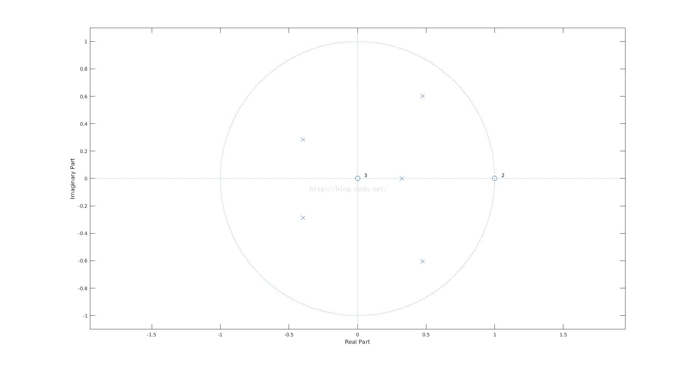

对这两个图的解释就忽略了，能够看懂上述代码和两张图的意义，就可以更改滤波器的特性了，对不要相位信息的，采用IIR比FIR达到相同的增益平坦度需要的阶数要少。关于高通滤波器的设计还有疑问的可以留言共同交流。频响如下：

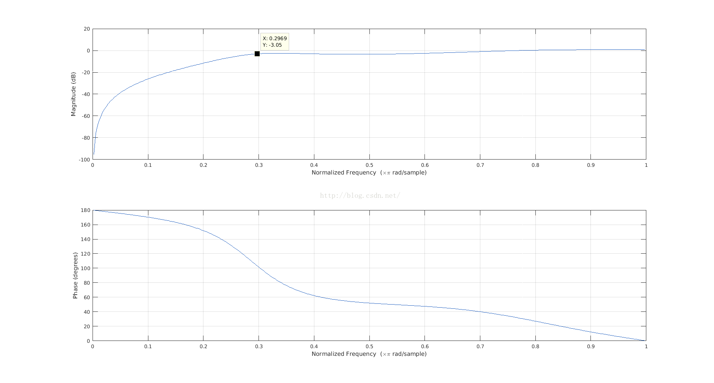

WebRtcVad_CalculateFeatures函数计算每个子带的能量。能量结果存放在features数组里，然后调用GmmProbability计算概率。
intWebRtcVad_CalcVad8khz(VadInstT* inst, constint16_t* speech_frame,
size_t frame_length)
{
int16_t feature_vector[kNumChannels], total_power;
// Get power in the bands
    total_power = WebRtcVad_CalculateFeatures(inst, speech_frame, frame_length,
                                              feature_vector);
// Make a VAD
    inst->vad = GmmProbability(inst, feature_vector, total_power, frame_length);
return inst->vad;
}
计算流程

高斯模型有两个参数H0和H1，它们分表示的是噪声和语音，判决测试使用LRT（likelihood ratio test）。分为全局和局部两种情况。

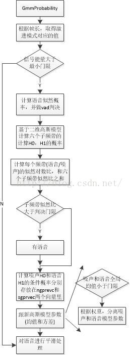

a)高斯概率计算采用的高斯公式如下：

这里其实采用了两个参数高斯分布，但是假设了这两个参数是相互独立的：

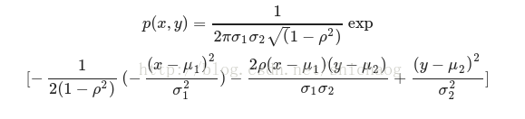

这里要做个简化以减少计算量。将这两个高斯看成是不相关的，

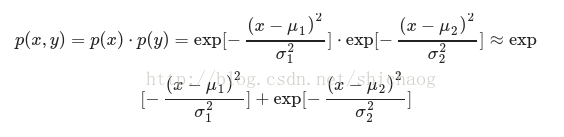

这里可以看到做了三个简化，第一个是把指数前的系数省掉了，这是因为在做似然比检验时，可以消掉，第二个简化是假设这两个高斯分布是不相关的，第三个简化是将乘法近似化简成加法。使用高斯分布这个在kaldi中也有例子，kaldi中基于GMM的语言模型分成三种，第一种是类似这里的独立同分布模型，第二种是互相关对角阵元素非零，第三种是全高斯互相关模型。

用多个高斯来近似一个语音包络这种方法，在插值时也用到，即用多个sinc函数进行分数位插值。

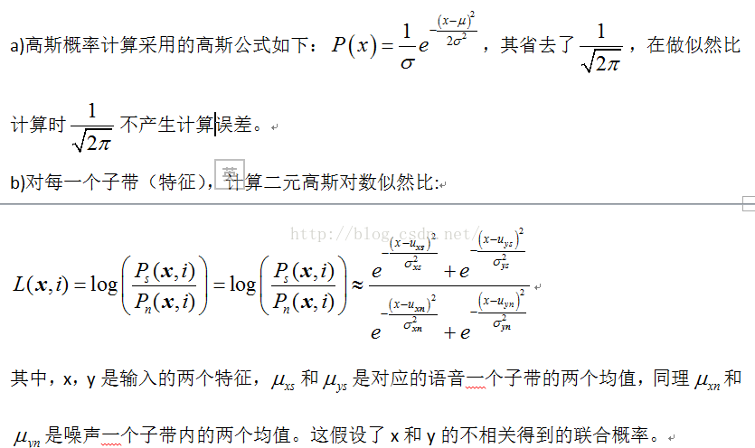

c)对数似然比，分为全局和局部，全局是六个子带之加权之和，而局部是指每一个子带则是局部，所以语音判决会先判断子带，子带判断没有时会判断全局，只要有一方过了，就算有语音，公式表达如下：

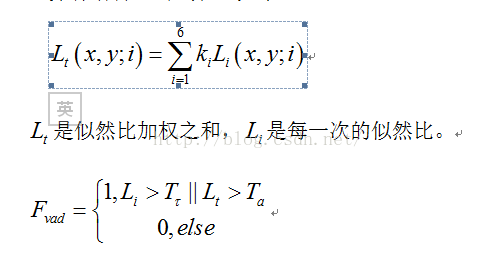

后记：

和判决准则相关的参数在vad_core.c文件，他们是：
// Spectrum Weighting
staticconstint16_t kSpectrumWeight[kNumChannels] = { 6, 8, 10, 12, 14, 16 };
staticconstint16_t kNoiseUpdateConst = 655; // Q15
staticconstint16_t kSpeechUpdateConst = 6554; // Q15
staticconstint16_t kBackEta = 154; // Q8
// Minimum difference between the two models, Q5
staticconstint16_t kMinimumDifference[kNumChannels] = {
544, 544, 576, 576, 576, 576 };
// Upper limit of mean value for speech model, Q7
staticconstint16_t kMaximumSpeech[kNumChannels] = {
11392, 11392, 11520, 11520, 11520, 11520 };
// Minimum value for mean value
staticconstint16_t kMinimumMean[kNumGaussians] = { 640, 768 };
// Upper limit of mean value for noise model, Q7
staticconstint16_t kMaximumNoise[kNumChannels] = {
9216, 9088, 8960, 8832, 8704, 8576 };
// Start values for the Gaussian models, Q7
// Weights for the two Gaussians for the six channels (noise)
staticconstint16_t kNoiseDataWeights[kTableSize] = {
34, 62, 72, 66, 53, 25, 94, 66, 56, 62, 75, 103 };
// Weights for the two Gaussians for the six channels (speech)
staticconstint16_t kSpeechDataWeights[kTableSize] = {
48, 82, 45, 87, 50, 47, 80, 46, 83, 41, 78, 81 };
// Means for the two Gaussians for the six channels (noise)
staticconstint16_t kNoiseDataMeans[kTableSize] = {
6738, 4892, 7065, 6715, 6771, 3369, 7646, 3863, 7820, 7266, 5020, 4362 };
// Means for the two Gaussians for the six channels (speech)
staticconstint16_t kSpeechDataMeans[kTableSize] = {
8306, 10085, 10078, 11823, 11843, 6309, 9473, 9571, 10879, 7581, 8180, 7483
};
// Stds for the two Gaussians for the six channels (noise)
staticconstint16_t kNoiseDataStds[kTableSize] = {
378, 1064, 493, 582, 688, 593, 474, 697, 475, 688, 421, 455 };
// Stds for the two Gaussians for the six channels (speech)
staticconstint16_t kSpeechDataStds[kTableSize] = {
555, 505, 567, 524, 585, 1231, 509, 828, 492, 1540, 1079, 850 };
参数更新

噪声均值更新，WebRtcVad_FindMinimum函数对每个特征，求出100个帧里头的前16个最小值。每个最小值都对应一个age，最大不超过100，超过100则失效，用这个最小值来跟新噪声。

模型参数跟新

跟新噪声均值，语音均值，噪声方差，语音方差，自适应也就体现在这里。

噪声跟新：只在非语音帧进行跟新，

另外：

现在也有基于DNN方法的进行VAD检测的，简单的检测使用两层LSTM外交BN（batch normalization）就可以实现这个功能。