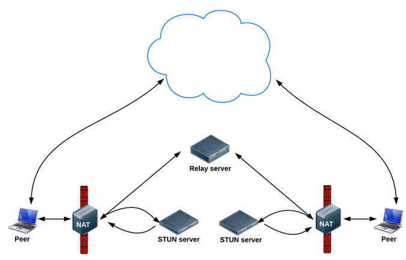
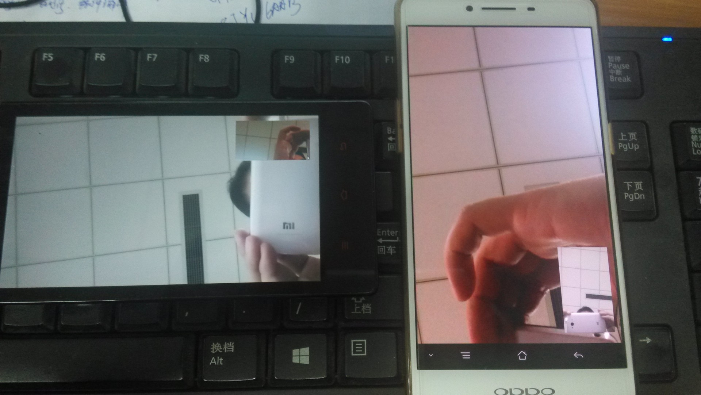
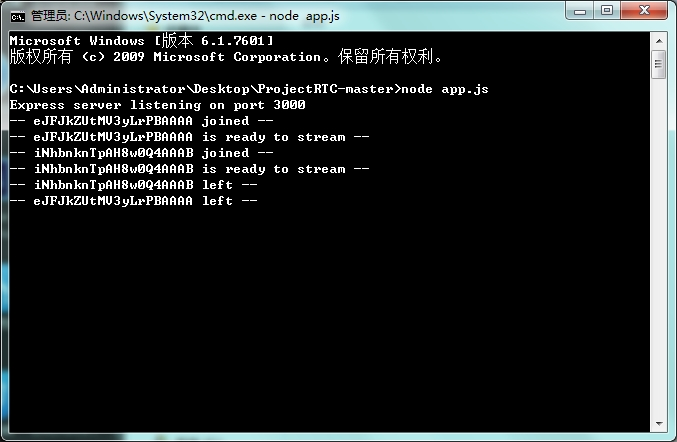

# WebRTC 的 Android 2 Android 实现

2016年11月17日 16:12:04阅读数：24608

版权声明：本文为博主原创文章，转载请注明出处。 https://blog.csdn.net/youmingyu/article/details/53192714

公司让做一个小项目作为入职测试，简单的说就是实现WebRTC的android端互连。boss给提供了一个开源项目作为参考，这个项目是WebRTC的android客户端，可以实现android端连接PC端——在我动手之前我以为自己要建一栋房子，然而最后只是挂了个窗帘，不过至少知道了房子的构造O(∩_∩)O~

## 环境准备

参考项目1：https://github.com/pchab/ProjectRTC

ProjectRTC是一个WebRTC的PC端项目，实现了WebRTC的服务器功能和PC客户端功能，我们拿来当服务器用的，运行需要安装Node.JS。使用方法如下：
安装Node.JS
ProjectRTC根目录下，命令行：npm install
命令行：node app.js （虽然ProjectRTC说明中让输入：npm start，然是打开之后就关不掉了，会自启动的，而且不带任何控制台提示）
参考项目2：https://github.com/pchab/AndroidRTC

AndroidRTC是ProjectRTC的android客户端，下载后直接AndroidStudio打开。AndroidRTC中包含两个moudle，app是主界面，webrtc-client是工具类moudle 。

## 添加WebRTC库

需要去官网下载源码，然后到Linux下编译，最后放到Android项目中并添加依赖和权限（很麻烦的样子，所幸参考项目2已经帮我们配置好了，偷下懒^_^）

## 背景知识

WebRTC被誉为是web长期开源开发的一个新启元，是近年来web开发的最重要创新。WebRTC允许Web开发者在其web应用中添加视频聊天或者点对点数据传输，不需要复杂的代码或者昂贵的配置。目前支持Chrome、Firefox和Opera，后续会支持更多的浏览器，它有能力达到数十亿的设备。

然而，WebRTC一直被误解为仅适合于浏览器。事实上，WebRTC最重要的一个特征是允许本地和web应用间的互操作，自然也可以在Android应用中植入WebRTC 。

WebRTC Android端的大体实现过程如下：（在不考虑播放本地视频的情况下）
连接服务器，并通过服务器打通两个客户端的网络通道。
从摄像头和麦克风获取媒体流 。
将本地媒体流通过网络通道传送给对方的客户端 。
渲染播放接收到的媒体流 。
关键技术

### 核心类PeerConnectionFactory

首先需要初始化PeerConnectionFactory，这是WebRTC的核心工具类，初始化方法如下：

PeerConnectionFactory.initializeAndroidGlobals(    context,//上下文，可自定义监听    initializeAudio,//是否初始化音频，布尔值    initializeVideo,//是否初始化视频，布尔值    videoCodecHwAcceleration,//是否支持硬件加速，布尔值    renderEGLContext);//是否支持硬件渲染，布尔值
然后就可以获得对象：PeerConnectionFactory factory= new PeerConnectionFactory();

获取媒体流

### 第一步：获取视频源videoSource

String frontCameraName = VideoCapturerAndroid.getNameOfFrontFacingDevice();VideoCapturer videoCapturer = VideoCapturerAndroid.create(frontCameraName);VideoSource videoSource = factory.createVideoSource(videoCapturer,videoConstraints);

其中videoConstraints是对视频流的一些限制，按如下方法创建。

MediaConstraints videoConstraints = new MediaConstraints();videoConstraints.mandatory.add(new MediaConstraints.KeyValuePair("maxHeight", Integer.toString(pcParams.videoHeight)));videoConstraints.mandatory.add(new MediaConstraints.KeyValuePair("maxWidth", Integer.toString(pcParams.videoWidth)));videoConstraints.mandatory.add(new MediaConstraints.KeyValuePair("maxFrameRate", Integer.toString(pcParams.videoFps)));videoConstraints.mandatory.add(new MediaConstraints.KeyValuePair("minFrameRate", Integer.toString(pcParams.videoFps)));

### 第二步：获取音频源audioSource

音频源的获取简单许多：

AudioSource audioSource = factory.createAudioSource(new MediaConstraints());

第三步：获得封装VideoTrack/AudioTrack

VideoTrack/AudioTrack 是 VideoSource/AudioSource 的封装，方便他们的播放和传输：

VideoTrack videoTrack = factory.createVideoTrack("ARDAMSv0", videoSource);AudioTrack audioTrack = factory.createAudioTrack("ARDAMSa0", audioSource);

第四步：获取媒体流localMS

其实 VideoTrack/AudioTrack 已经可以播放了，不过我们先不考虑本地播放。那么如果要把他们发送到对方客户端，我们需要把他们添加到媒体流中：

MediaStream localMS=factory.createLocalMediaStream("ARDAMS");localMS.addTrack(videoTrack);localMS.addTrack(audeoTrack);

然后，如果有建立好的连接通道，我们就可以把 localMS 发送出去了。

### 建立连接通道

WebRTC是基于P2P的，但是在连接通道建立好之前，我们仍然需要服务器帮助传递信令，而且需要服务器帮助进行网络穿透。大体需要如下几个步骤。

第一步：创建PeerConnection的对象。

PeerConnection pc = factory.createPeerConnection(    iceServers,//ICE服务器列表    pcConstraints,//MediaConstraints    context);//上下文，可做监听

iceServers 我们下面再说。

pcConstraints是媒体限制，可以添加如下约束：

pcConstraints.mandatory.add(new MediaConstraints.KeyValuePair("OfferToReceiveAudio", "true"));pcConstraints.mandatory.add(new MediaConstraints.KeyValuePair("OfferToReceiveVideo", "true"));pcConstraints.optional.add(new MediaConstraints.KeyValuePair("DtlsSrtpKeyAgreement", "true"));

监听器建议同时实现SdpObserver、PeerConnection.Observer两个接口。

### 第二步：信令交换

建立连接通道时我们需要在WebRTC两个客户端之间进行一些信令交换，我们以A作为发起端，B作为响应端（A call B，假设服务器和A、B已经连接好，并且只提供转发功能，PeerConnection对象为pc ）：
A向B发出一个“init”请求（我觉得这步没有也行）。
B收到后“init”请求后，调用pc.createOffer()方法创建一个包含SDP描述符（包含媒体信息，如分辨率、编解码能力等）的offer信令。
offer信令创建成功后会调用SdpObserver监听中的onCreateSuccess()响应函数，在这里B会通过pc.setLocalDescription将offer信令（SDP描述符）赋给自己的PC对象，同时将offer信令发送给A 。
A收到B的offer信令后，利用pc.setRemoteDescription()方法将B的SDP描述赋给A的PC对象。
A在onCreateSuccess()监听响应函数中调用pc.setLocalDescription将answer信令（SDP描述符）赋给自己的PC对象，同时将answer信令发送给B 。
B收到A的answer信令后，利用pc.setRemoteDescription()方法将A的SDP描述赋给B的PC对象。
这样，A、B之间就完成里了信令交换。

### 第三步：通过ICE框架穿透NAT/防火墙

如果在局域网内，信令交换后就已经可以传递媒体流了，但如果双方不在同一个局域网，就需要进行NAT/防火墙穿透（我是在局域网下测试的，没有穿透，但还是把这方面内容介绍下）。

WebRTC使用ICE框架来保证穿透。ICE全名叫交互式连接建立（Interactive Connectivity Establishment）,一种综合性的NAT/FW穿越技术，它是一种框架，可以整合各种NAT/FW穿越技术如STUN、TURN（Traversal Using Relay NAT 中继NAT实现的穿透）。ICE会先使用STUN，尝试建立一个基于UDP的连接，如果失败了，就会去TCP（先尝试HTTP，然后尝试HTTPS），如果依旧失败ICE就会使用一个中继的TURN服务器。使用STUN服务器穿透的结构如下：

我们可以使用Google的stun服务器：stun:stun.l.google.com:19302（Google嘛，翻墙你懂得，当然如果有精力可以自己搭建一个stun服务器），那么我们怎么把这个地址告诉WebRTC呢，还记得之前的iceServers吗，就是在创建PeerConnection对象的时候需要的参数，iceServers里面存放的就是进行穿透地址变换的服务器地址，添加方法如下(保险起见可以多添加几个服务器地址，如果有的话)：

iceServers.add(new PeerConnection.IceServer("stun:stun.l.google.com:19302"));
1
然后这个stun服务器地址也需要通过信令交换，同样以A、B客户端为例过程如下：
A、B分别创建PC实例pc（配置了穿透服务器地址） 。
当网络候选可用时，PeerConnection.Observer监听会调用onIceCandidate()响应函数并提供IceCandidate（里面包含穿透所需的信息）的对象。在这里，我们可以让A、B将IceCandidate对象的内容发送给对方。
A、B收到对方发来的candidate信令后，利用pc.addIceCandidate()方法将穿透信息赋给各自的PeerConnection对象。
至此，连接通道完全打通，然后我们只需要将之前获取的媒体流localMS赋给pc即可:

pc.addStream(localMS);//也可以先添加，连接通道打通后一样会触发监听响应。
1
在连接通道正常的情况下，对方的PeerConnection.Observer监听就会调用onAddStream()响应函数并提供接收到的媒体流。

### 播放媒体流

WebRTC提供了一种很方便的播放方式：VideoRendererGui，首先设置VideoRendererGui，具体方法如下：

GLSurfaceView videoView = (GLSurfaceView) findViewById(R.id.glview_call);VideoRendererGui.setView(videoView, runnable);//surface准备好后会调用runnable里的run()函数
1
2
然后创建一个VideoRenderer对象，并将其赋给videoTrack：

VideoRenderer renderer = VideoRendererGui.createGui(x, y, width, height);//设置界面videoTrack.addRenderer(renderer);
1
2
WebRTC允许我们实现自己的渲染，我们只需通过VideoRendererGui获取VideoRenderer.Callbacks的对象，渲染后把其作为参数传入到VideoRenderer的构造方法即可。

此外利用VideoRenderer.Callbacks，我们可以动态调整播放界面，如下：

VideoRenderer.Callbacks cbRenderer = VideoRendererGui.create(x, y, width, height, scalingType, mirror);//设置界面videoTrack.addRenderer(new VideoRenderer(cbRenderer ));VideoRendererGui.update(cbRenderer ,x, y, width, height, scalingType);//调整界面

### 信令服务器

信令服务器主要是在客户端打通连接通道前传递信令的，在客户端开启P2P通道后，这个服务器关了也不会影响媒体流传输。

我是用ProjectRTC作为服务器，这个项目里还包括PC客户端的实现，不过我们不用管它们，ProjectRTC项目根目录下的app.js是入口文件，里面设置必要参数，如网口等。我们需要关注的文件是app文件夹下的：socketHandler.js 和 streams.js 文件。

socketHandler.js 是服务器用来和客户端交互的接口，里面的实现网口的监听，每有新的连接接入，都在这里进行存储。通过分析这个文件可以发现，所有连接的socket都存放在sockets对象中，标志是socket.id，socket的收发函数也是在这里定。

streams.js是一个存储的工具类，里面有两个成员：id和name，这个文件用来存放已经准备好打通连接通道的客户端的信息，name是客户端的名字，id是连接对应客户端的socket的id 。

如果我们要实现客户端的信令交互，只需要修改这两个文件即可（实际上基本不用改）。

## 开发历程

说是开发，其实就是学习下而已O(∩_∩)O~

首先拿到题目后，我去查阅相关技术，因为之前并不了解WebRTC，我还以为是个浏览器的插件什么的。看了半天发现只能了解概要，还是先看看demo吧。

将boss提供的参考项目下载，安装，运行——没效果，或者说我看不懂它的效果/(ㄒoㄒ)/~~ 。没办法，开始看代码吧，由于没接触过node.js，所以先看AndroidRTC，幸运的AndroidRTC的代码很少，一个Activity，一个RTC核心类，一个参数类。

很快将代码过了一遍，发现android端的demo异常简陋，打开就是连接服务器，然后获取本地视频，获取本地视频的相关内容很快就理清了，关键是P2P通道的打通很麻烦，由于本人对网络方面知识的匮乏（其实你哪里都匮乏好吧。。），看的云里雾里，只好又回去看别人的技术博客，然后对着代码一点一点梳理。

这期间我总是试着给Android端加个登录界面，但是每每构思到一段就不行了，为什么？因为那时我还没有搞清楚WebRTC是怎么进行信令交互的，浪费不少时间。

期间测试demo时又发现正常了，是我翻墙时发现的，我发现PC客户端只有在我翻墙时才有用，然后打开手机客户端发现可以正常连接通话，不过我没必要去看PC的客户端是怎么回事，这时我已经理清了Android的结构，AndroidRTC的demo是这样的：

在你打开服务器的情况下，打开Android端app，app会首先连接服务器（根据写好的地址），然后服务器发送一个标志给app（这个标志其实是服务器端连接app的socket的id），之后app端会判断：是否有一个callerId，有的话直接开始打通连接通道，没有的话等待，并且获取播放自己的媒体流。

之后我去熟悉了下node.js，本想着自己写个服务器，后来发现node.js虽然简单，但也不是说上来就能写的（倒是上来就能改），所以最后决定看看ProjectRTC的服务器实现。由于这时我已经很了解整个信令的交互过程，所以很快就找到了进行信令转发的代码。然后发现，这个服务器很合适啊，只需要改一点点就可以了。。唉，早看就好了。但是如果没有前面的铺垫估计也不好看。

至此已经对对整个项目了然于胸了，但是也没有时间了/(ㄒoㄒ)/~~，所以最后稍微修改下服务器，让第一个接入的客户端等待，对于第二个接入的客户端，将第一个客户端的id发给它。android端，只需修改几句代码，将接收到的对方id赋值给callerId即可。

### 运行效果

修改后的项目源码：http://download.csdn.net/detail/youmingyu/9711362

## 总结

这次项目感觉不该用这么长时间，主要是自己思路不清晰就胡乱尝试，不但行不通而且浪费时间，然后觉得写博客确实很有帮助，之前还思路混乱，但是在写的过程中就越发清晰了。

还有一些不足之处以后再弥补：
对添加WebRTC库的编译配置过程不清楚，AndroidRTC的demo配好了。
不清楚VideoTrack和AudioTrack怎么开始播放的，没看到类似play的代码。
时间所限，没有看WebRTC的开发文档，里面应该说的很详细。
### 参考
WebRTC Android API
Android之WebRTC介绍
Android WebRTC 音视频开发总结
NAT- STUN和TURN简介