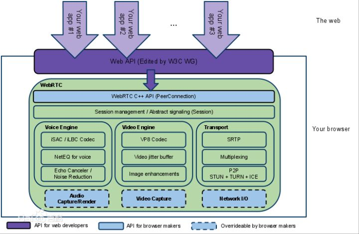

# 为何一直推荐WebRTC？
做为一名音视频行业里的小混混，如果没听说过WebRTC那真是不认识大哥一样没有见识，说的可能有点夸大了，但是确实WebRTC在近几年对音视频实时通讯这个行业带来的颠覆是显而易见的，Google用他自己的魅力+实力征服了很多开发者，小编也是其中之一啦。但是跟随这项技术这么长时间来，他带给我们的确实可以说是行业内顶尖的技术，不说多，单说一个音频的回声消除你说你能搞定？那你确实牛B，小编佩服您这样的牛B人士，有空可以加个微信啥的。。。
WebRTC提供了视频会议的核心技术，包括音视频的采集、编解码、网络传输、显示等功能，并且还支持跨平台：windows，linux，mac，android, iOS等。WebRTC中的任何的一个技术点都可以拿出来列一个专栏进行讨论，这里我们只能简单粗暴的罗列一下喽。

视频相关视频采集---video_capture
源代码在webrtc\modules\video_capture\main目录下，包含接口和各个平台的源代码。
在windows平台上，WebRTC采用的是dshow技术，来实现枚举视频的设备信息和视频数据的采集，这意味着可以支持大多数的视频采集设备；对那些需要单独驱动程序的视频采集卡（比如海康高清卡）就无能为力了。
视频采集支持多种媒体类型，比如I420、YUY2、RGB、UYUY等，并可以进行帧大小和帧率控制。
视频编解码---video_coding
源代码在webrtc\modules\video_coding目录下。
WebRTC采用I420/VP8编解码技术。VP8是google收购ON2后的开源实现，并且也用在WebM项目中。VP8能以更少的数据提供更高质量的视频，特别适合视频会议这样的需求。
视频加密--video_engine_encryption
视频加密是WebRTC的video_engine一部分，相当于视频应用层面的功能，给点对点的视频双方提供了数据上的安全保证，可以防止在Web上视频数据的泄漏。
视频加密在发送端和接收端进行加解密视频数据，密钥由视频双方协商，代价是会影响视频数据处理的性能；也可以不使用视频加密功能，这样在性能上会好些。
视频加密的数据源可能是原始的数据流，也可能是编码后的数据流。估计是编码后的数据流，这样加密代价会小一些，需要进一步研究。
视频媒体文件--media_file
源代码在webrtc\modules\media_file目录下。
该功能是可以用本地文件作为视频源，有点类似虚拟摄像头的功能；支持的格式有Avi。
另外，WebRTC还可以录制音视频到本地文件，比较实用的功能。
视频图像处理--video_processing
源代码在webrtc\modules\video_processing目录下。
视频图像处理针对每一帧的图像进行处理，包括明暗度检测、颜色增强、降噪处理等功能，用来提升视频质量。
视频显示--video_render
源代码在webrtc\modules\video_render目录下。
在windows平台，WebRTC采用direct3d9和directdraw的方式来显示视频，只能这样，必须这样。
网络传输与流控
对于网络视频来讲，数据的传输与控制是核心价值。WebRTC采用的是成熟的RTP/RTCP技术。
音频相关
WebRTC的音频部分，包含设备、编解码(iLIBC/iSAC/G722/PCM16/RED/AVT、NetEQ)、加密、声音文件、声音处理、声音输出、音量控制、音视频同步、网络传输与流控(RTP/RTCP)等功能。
音频设备---audio_device
源代码在webrtc\modules\audio_device\main目录下，包含接口和各个平台的源代码。
在windows平台上，WebRTC采用的是Windows Core Audio和Windows Wave技术来管理音频设备，还提供了一个混音管理器。
利用音频设备，可以实现声音输出，音量控制等功能。
音频编解码---audio_coding
源代码在webrtc\modules\audio_coding目录下。
WebRTC采用iLIBC/iSAC/G722/PCM16/RED/AVT编解码技术。
WebRTC还提供NetEQ功能---抖动缓冲器及丢包补偿模块，能够提高音质，并把延迟减至最小。
另外一个核心功能是基于语音会议的混音处理。
声音加密--voice_engine_encryption
和视频一样，WebRTC也提供声音加密功能。
声音文件
该功能是可以用本地文件作为音频源，支持的格式有Pcm和Wav。
同样，WebRTC也可以录制音频到本地文件。
声音处理--audio_processing
源代码在webrtc\modules\audio_processing目录下。
声音处理针对音频数据进行处理，包括回声消除(AEC)、AECM(AEC Mobile)、自动增益(AGC)、降噪(NS)、静音检测(VAD)处理等功能，用来提升声音质量。
网络传输与流控
和视频一样，WebRTC采用的是成熟的RTP/RTCP技术。

以上列举的主要来源于网络，WebRTC到今年已经5周岁了，代码的更新速度一直非常快速，跟随WebRTC也有两年的时间，从陌生到熟悉，就像谈恋爱一样有甜有苦，如果最后能终成眷属就完美了。如果你是音视频领域刚入行的小伙伴请勇敢的拥抱WebRTC吧，这个技术值得你花时间去研究。