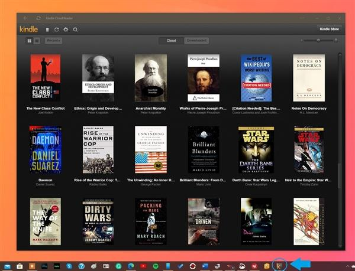

[toc]

# Win10全新官方Kindle APP上线：仅10.43KB

科技微动力 2020-03-04 12:03:59

凭借着独特的阅读器产品，Kindle无疑在电子书市场有着自己的一席之地，但对于Windows系统用户而言，在电脑上使用Kindle却一直问题多多，最大的问题就是缺少一个好用的Kindle客户端。

此前亚马逊曾推出过一个适用于Windows 8 APP，却在2016年被撤回，对了，Kindle还有一个传统的桌面客户端，但也仅仅是勉强能用而已。

近日，**Windows系统的（国际版）Kindle用户有了一个新选择，亚马逊推出了一款Chrome插件Kindle Cloud Reader，效果相当不俗（因为是Chrome插件，自然也兼容微软的Edge浏览器）。**

Kindle Cloud Reader是一个Web程序，**可以固定在任务栏上，还提供了离线阅读、在线购书、黑暗模式、调整字体颜色宽窄、创建注释和书签、书内搜索、单词释义等一系列便捷功能。**值得一提的是，**Kindle Cloud Reader大小仅有10.43KB。**

Kindle Cloud Reader也支持触摸操作，能想到最搭配的Windows设备应该就是设计像书本一样，而且搭载了Windows 10X系统的Surface Neo了。

