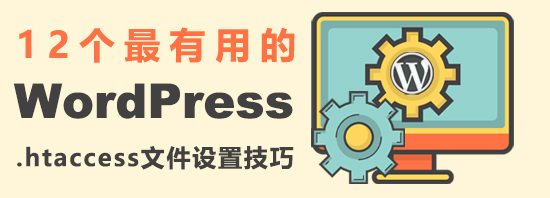
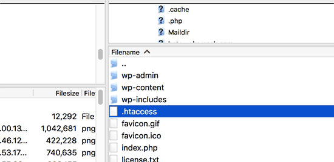
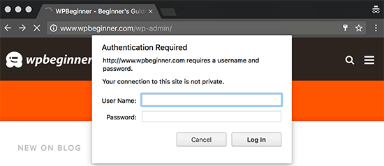
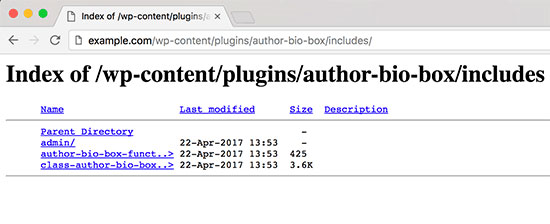

[toc]
摘要

.htaccess文件是Apache服务器中一个非常强大的配置文件，通过它可以做很多事情，比如：实现301/302重定向、自定义404错误页面、改变文件扩展名、允许/阻止特定的用户或者目录的访问、禁止目录列表、配置默认文档等。

.htaccess文件是Apache服务器中一个非常强大的配置文件，通过它可以做很多事情，比如：实现301/302重定向、自定义404错误页面、改变文件扩展名、允许/阻止特定的用户或者目录的访问、禁止目录列表、配置默认文档等。

本文将为您介绍12个在WordPress中最有用的.htaccess文件配置技巧。
### 什么是.htaccess文件

.htaccess文件是Apache服务器的配置文件。通过它可以做很多事情，比如：实现301/302重定向、自定义404错误页面、改变文件扩展名、允许/阻止特定的用户或者目录的访问、禁止目录列表、配置默认文档等。

WordPress就是通过配置.htaccess文件实现伪静态，从而生成SEO友好的URL结构。
### 如何编辑.htaccess文件

.htaccess文件位于您的WordPress网站的根目录中。
您可以通过FTP客户端下载到本地进行编辑。
使用记事本即可进行编辑，保存时一定要注意文件编码正确。
#### **重要提示**
由于.htaccess文件配置错误会导致很多问题发生，所以：
1、很多虚拟主机不允许客户自行修改.htaccess文件文件，所以请先确认您是否有修改.htaccess文件的权限；
2、在自行尝试修改.htaccess文件之前，请先备份.htaccess文件；
#### **1、保护WordPress后台登录**
您可以使用.htaccess文件来保护WordPress后台登录，即设置可以登录后台的IP地址。
只需将该代码复制并粘贴到.htaccess文件中即可：
1. AuthUserFile /dev/null
2. AuthGroupFile /dev/null
3. AuthName "WordPress Admin Access Control"
4. AuthType Basic
5. <LIMIT GET>
6. order deny,allow
7. deny from all
8. # IP地址白名单 公司
9. allow from xx.xx.xx.xxx
10. # IP地址白名单 家里
11. allow from xx.xx.xx.xxx
12. </LIMIT>
不要忘记用自己的IP地址替换xx值。如果您使用多个IP地址访问互联网，可以继续添加。
#### **2、密码保护WordPress下的/wp-admin/文件夹**

您可以使用.htaccess文件为您的WordPress网站下的/wp-admin/文件夹添加额外的密码保护功能。
首先，您需要生成**.htpasswds**文件，您可以通过使用在线.htpasswds生成器轻松创建一个。
然后，将此**.htpasswds**文件上传到可公开访问的Web目录或/ public_html /文件夹之外。
一条好路径是：/home/user/.htpasswds/public_html/wp-admin/passwd/
接下来，创建一个.htaccess文件，并将其上传到/wp-admin/目录中，然后在其中添加以下代码：
1. AuthName "Admins Only"
2. AuthUserFile /home/yourdirectory/.htpasswds/public_html/wp-admin/passwd
3. AuthGroupFile /dev/null
4. AuthType basic
5. require user putyourusernamehere
6. <Files admin-ajax.php>
7. Order allow,deny
8. Allow from all
9. Satisfy any
10. </Files>
重要提示：请勿忘记用.htpasswds文件的文件路径替换AuthUserFile路径并添加您自己的用户名。
#### **3、禁用目录浏览**

禁用目录浏览
许多WordPress安全专家建议禁用目录浏览。
启用目录浏览后，黑客可以查看您的站点的目录和文件结构，以查找易受攻击的文件。
要禁用您网站上的目录浏览，您需要将以下行添加到.htaccess文件中。
1. Options -Indexes
#### **4、禁用某些WordPress目录中的PHP执行**

有时黑客进入WordPress网站并安装一个后门。这些后门文件通常被伪装成核心WordPress文件，并放在/wp-includes/或/wp-content/uploads/文件夹中。

改进WordPress安全性的一个更简单的方法是禁用某些WordPress目录的PHP执行。
您将需要在计算机上创建一个空白的.htaccess文件，然后将以下代码粘贴到其中。
1. <Files *.php>
2. deny from all
3. </Files>
保存文件，然后将其上传到/wp-includes/或/wp-content/uploads/文件夹中。
#### **5、保护WordPress下的wp-config.php配置文件**
您的WordPress网站的目录中最重要的文件可能是根目录下的wp-config.php文件。
因为wp-config.php文件中包含有关网站数据库的链接信息，如果它被黑客拿到了，那么你的数据库就危险了。
要保护您的wp-config.php文件免受非正常的访问，只需将以下代码添加到.htaccess文件中：
1. <files wp-config.php>
2. order allow,deny
3. deny from all
4. </files>
#### **6、通过.htaccess文件实现301重定向**
如果在迫不得已的情况下，你必须要更换域名，或者改变网站的URL结构。
那么，对搜索引擎最友好的方式，就是使用301重定向：告诉您的用户一个内容已经移动到一个新的位置。
相关的.htaccess文件代码如下：
1. #将/oldurl/重定向到http://www.example.com/newurl
2. Redirect 301 /oldurl/ http://www.example.com/newurl
3. #将/category/television/重定向到http://www.example.com/category/tv/
4. Redirect 301 /category/television/ http://www.example.com/category/tv/
#### **7、阻止可疑的IP地址访问网站**
如果你发现有可疑的IP地址访问你的网站，您可以通过.htaccess文件来阻止对应的IP地址访问你的网站。
将以下代码添加到.htaccess文件中：
1. <Limit GET POST>
2. order allow,deny
3. deny from xxx.xxx.xx.x
4. allow from all
5. </Limit>
不要忘记用要阻止的IP地址替换xx。
#### **8、使用.htaccess设置网站图片防盗链**
如果有人复制了你的网站内容，并且没有更改图片地址。
那么，在你网站之外的其他地方访问这些内容的时候，图片也会显示，但是图片是从你的服务器上下载的，并且占用你的带宽。
对于大多数小型网站来说，这不是一个大问题。
但是，此类情况出现的多了，很有可能会使您的WordPress网站出现访问速度缓慢，或者超出带宽限制。
特别是，如果您运行一个受欢迎的网站或网站上有很多照片，那么这可能会成为一个严重的问题。
您可以通过将此代码添加到.htaccess文件来实现图片防盗链功能：
1. #disable hotlinking of images with forbidden or custom image option
2. RewriteEngine on
3. RewriteCond %{HTTP_REFERER} !^$

4. RewriteCond %{HTTP_REFERER} !^http(s)?://(www\.)?[yourdomian.com](http://yourdomian.com/) [NC]

5. RewriteCond %{HTTP_REFERER} !^http(s)?://(www\.)?[baidu.com](http://baidu.com/) [NC]

6. RewriteRule \.(jpg|jpeg|png|gif)$ – [NC,F,L]

如果请求源自[yourdomian.com](http://yourdomian.com/)或[baidu.com](http://baidu.com/)，此代码仅允许显示图像。不要忘记用您自己的域名替换[yourdomian.com](http://yourdomian.com/)。

#### **9、禁止网站服务器通过未经授权的访问**
由于服务器具有电源和控制权，因此保护服务器免受黑客的访问非常重要。
只需将以下代码添加到.htaccess文件中即可：
1. <files ~ "^.*\.([Hh][Tt][Aa])">
2. order allow,deny
3. deny from all
4. satisfy all
5. </files>
#### **10、配置网站上传文件的大小限制**
在WordPress中网站中配置上传文件的大小限制有很多不同的方法。
但是，对于使用共享虚拟主机的用户，这些方法也许不起作用。
那么，你可以尝试通过.htaccess文件来实现。
将以下代码添加到.htaccess文件中：
1. php_value upload_max_filesize 64M
2. php_value post_max_size 64M
3. php_value max_execution_time 300
4. php_value max_input_time 300
此代码只是告诉您的Web服务器使用这些值来增加上传文件的大小限制，以及在WordPress中的最大执行时间。
#### **11、禁用通过xmlrpc.php来的请求**
每个WordPress安装都附带一个名为xmlrpc.php的文件。
此文件允许第三方应用程序连接到您的WordPress网站。
大多数WordPress安全专家建议，如果您没有使用任何第三方应用程序，那么您应该禁用此功能。
有多种方法可以做到这一点，其中之一是将以下代码添加到.htaccess文件中：
1. # Block WordPress xmlrpc.php requests
2. <Files xmlrpc.php>
3. order deny,allow
4. deny from all
5. </Files>
#### **12、阻止对网站中的作者进行扫描**
在暴力攻击中使用的常见技术是在WordPress站点上运行作者扫描，然后尝试破解这些用户名的密码。
您可以通过将以下代码添加到.htaccess文件来阻止此类扫描：
1. # BEGIN block author scans
2. RewriteEngine On
3. RewriteBase /
4. RewriteCond %{QUERY_STRING} (author=\d+) [NC]
5. RewriteRule .* - [F]
6. # END block author scans
--持续更新中--