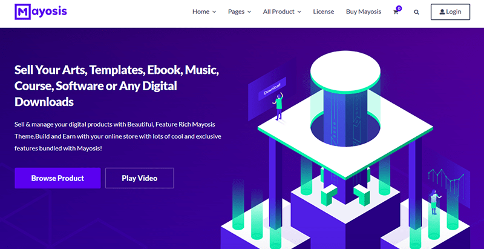
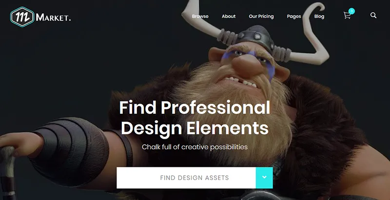
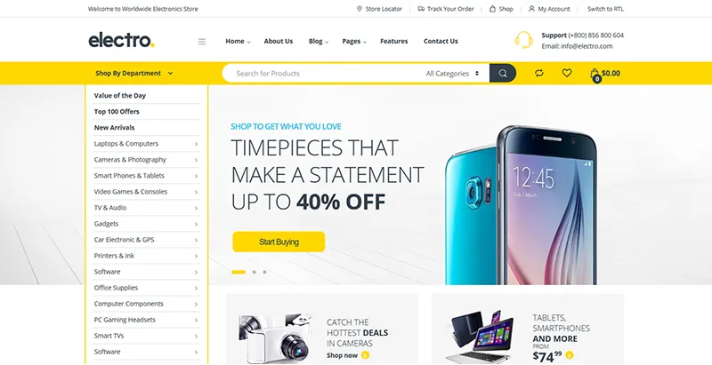
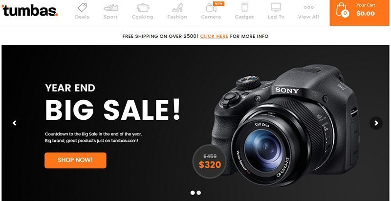
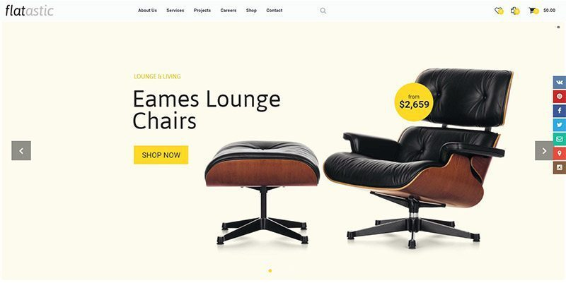

[toc]
# 10 WordPress主题创建数字产品销售网站

- [帕西盖伊](https://zh-cn.blogpascher.com/%E4%BD%9C%E8%80%85/guysalomon "文章由Guy帕西")
- [电子商务](https://zh-cn.blogpascher.com/%E7%B1%BB%E5%88%AB/%E4%B8%BB%E9%A2%98----WordPress%E7%9A%84-2/%E7%94%B5%E5%AD%90%E5%95%86%E5%8A%A1-PRO)

通过这些令人难以置信的优质WordPress主题，销售数字产品将从未如此简单。 借助WordPress和诸如以下的插件，销售数字或数字产品的过程变得非常简单 **易数字下载**，它将与我们在此列表中建议的大多数WordPress主题完美配合。

因此，如果您要创建一个网站以在线销售数字产品，则此列表 [**10最佳高级WordPress主题**](https://1.envato.market/c/470642/275988/4415?u=https://themeforest.net/#) 是要咨询。

但是之前，我们邀请您来发现 **[如何长时间才能建立一个网站](https://zh-cn.blogpascher.com/WordPress%E7%9A%84%E6%95%99%E2%80%8B%E2%80%8B%E7%A8%8B/%E5%A6%82%E4%BD%95%E5%AF%B9%E6%97%B6%E9%97%B4%E6%98%AF%E5%88%B0%E5%88%9B%E5%BB%BA-A-%E7%BD%91%E7%AB%99%E7%9A%84Web).**

然后回到为什么我们在这里。

## 1.Mayosis

如果您想出售诸如教程，音乐，电子书，照片，存档图像，WordPress主题，插件，摘要，软件或数字服务之类的文章，Mayosis专为你。

通过结合WordPress和Easy Digital Downloads插件创建的。 Mayosis让您 [**创建自己的市场**](https://zh-cn.blogpascher.com/%E9%94%80%E5%94%AE%E4%B8%8A%EF%BC%8C%E4%BA%92%E8%81%94%E7%BD%912/%E5%A6%82%E4%BD%95%E9%80%90%E6%AD%A5%E5%88%9B%E5%BB%BA%E4%B8%80%E4%B8%AA%E5%B8%A6%E6%9C%89woocommerce%E6%8C%87%E5%8D%97%E7%9A%84%E5%9C%A8%E7%BA%BF%E5%95%86%E5%BA%97) 可以在有限的程度上与亚马逊，eBay，Etsy，Themeforest或CreativeMarket等巨头竞争，并且只需几个小时即可建立您的网站并销售产品。

插件 [**可视化编辑器**](https://zh-cn.blogpascher.com/%E6%8F%92%E4%BB%B6%EF%BC%8CWordPress%E7%9A%84/%E8%A7%86%E8%A7%89%E6%95%99%E7%A8%8B%E4%BD%9C%E6%9B%B2%E5%AE%B6%E5%9C%A8%E6%B3%95%E5%9B%BD%E5%A6%82%E4%BD%95%E5%88%9B%E5%BB%BA-%E4%B8%80%E4%B8%AA%E9%A1%B5%E9%9D%A2%E7%9A%84Web-PRO) 内置功能使您可以快速而直观地创建网页，而无需获取任何代码。 不仅如此，您还可以创建一个供其他人在前端提交其产品并进行销售的市场。
***
## 2. 音箱

SoundBox是一个响应式WordPress主题，致力于创建可访问可下载产品的网站。 因此非常适合 [**出售音乐，视频，可下载的数字产品**](https://zh-cn.blogpascher.com/%E6%8F%92%E4%BB%B6%EF%BC%8CWordPress%E7%9A%84/%E6%9C%89%E4%BA%9B%E6%8F%92%E4%BB%B6----WordPress%E7%9A%84%E6%8D%A2%E9%9F%B3%E4%B9%90%E5%AE%B6) 等等。

快速，并以最严格的标准编码，它使您可以专注于内容。 特别注重细节，它将突出显示您的每种产品，从而使您可以更好地推广它们。 由于其详细的说明，它的文档仍然是其功能的支柱之一，这将有助于任何人将其掌握。

***
## 3. DGWork

如果您正在寻找可以帮助您的WordPress主题 [**销售数码产品**](https://zh-cn.blogpascher.com/%E9%94%80%E5%94%AE%E4%B8%8A%EF%BC%8C%E4%BA%92%E8%81%94%E7%BD%912/%E5%A6%82%E4%BD%95%E8%AF%B4%E6%9C%8D-A-%E5%AE%A2%E6%88%B7%E5%92%8C%E9%94%80%E5%94%AE%EF%BC%8C%E5%85%B6%E4%BA%A7%E5%93%81%E5%9F%BA%E4%BA%8EInternet) 在您的网站上，DGWork WordPress主题就是一个很好的例子。 它旨在帮助您销售电子书，歌曲，视频和其他可下载产品。

这个非常灵活的WordPress主题具有许多功能，您将在设计合法下载Web平台时使用这些功能。 它具有完全响应和优化的移动布局。 它包括漂亮的图标和图像，可让您在任何屏幕上都能轻松浏览您的网站。

另请参阅 **[8实时聊天WordPress插件，以提高您的销售](https://zh-cn.blogpascher.com/%E6%8F%92%E4%BB%B6%EF%BC%8CWordPress%E7%9A%84/10-----WordPress%E7%9A%84---%E6%8F%92%E4%BB%B6---%E5%85%8D%E8%B4%B9%E4%BB%BB%E5%8A%A0-A-%E5%AE%9E%E6%97%B6%E8%81%8A%E5%A4%A9%E5%92%8C%E5%8D%87%E5%8E%8B---%E4%BD%A0%E9%94%80%E5%94%AE).**

**使用Elementor轻松创建您的网站**

Elementor允许您轻松创建具有专业外观的任何网站设计。 停止支付昂贵的费用，你可以自己做。 **\[免费\]**

[下载](https://elementor.com/?ref=1140&campaign=pubpost)

[TEMPLATES](https://elementor.com/?ref=1140&campaign=pubpostdownload)

它集成了可视化页面个性化工具，可让您控制网站每个元素的行为和外观。 您无需成为专业的Web开发人员就可以创建一个名称值得的网站。

***
## 4. 市场

Market是一个WordPress主题，旨在帮助您创建真实的 [**市场**](https://zh-cn.blogpascher.com/%E6%8F%92%E4%BB%B6%EF%BC%8CWordPress%E7%9A%84/10----%E6%8F%92%E4%BB%B6%E6%8D%A2WordPress%E7%9A%84%E5%8A%A9%E6%8E%A8%E5%99%A8%E6%9C%80%E5%94%AE%E5%90%8E%E7%9A%84---%E4%BD%A0---%E7%BD%91%E7%AB%99)，其在移动设备上的外观将针对促销您的物理或数字产品进行优化。 它具有大量易于使用的工具，并且操作将完全直观。

配备了用户友好的界面和灵活的布局，它将为您提供自定义网站每个部分和详细信息的机会。 您可以使用此WordPress主题以愉悦的方式展示您的产品。 它的代码经过了很好的注释，如果您想使用专业的开发人员，它将在您的网站上带来更多的自定义，这将很有用。

其功能包括：无限的配色方案，强大的控制面板， 非常详细的文档等。

***
## 5\. Multistores

MultiStores是一个丰富多彩的WordPress主题，它与WooCommerce插件无缝集成，可以创建一个电子商务网站。 这是响应式WordPress主题， 无论尺寸大小，它都能在所有屏幕上完美显示。

后者的配置选项面板将为您提供 **[全彩色控制，字体](https://zh-cn.blogpascher.com/WordPress%E7%9A%84-2/%E6%80%8E%E4%B9%88%E5%8A%A0%EF%BC%8C%E6%98%93%E5%AD%97%E4%BD%93%E5%9B%BE%E6%A0%87%E4%B8%8A%EF%BC%8C%E4%BD%A0%E7%9A%84%E4%B8%BB%E9%A2%98----WordPress%E7%9A%84),** 并设计您网站的每个元素。 由于其与 [**WooCommerce**](https://zh-cn.blogpascher.com/%E6%8F%92%E4%BB%B6%EF%BC%8CWordPress%E7%9A%84/10----%E6%8F%92%E4%BB%B6%E5%AF%B9%E6%94%B9%E5%96%84%E5%BB%BA%E8%AE%AE%E6%82%A8%E4%BD%BF%E7%94%A8%E7%BD%91%E4%B8%8A%E5%95%86%E5%BA%97) 您将能够出售您的商品或产品，促销活动和付款处理的管理也将如此。

这个WordPress主题随附了广泛的模板和样式，可让您多次使用它。 它带有一个 **强大的可视页面生成器**，这将使您能够自定义此WordPress主题随附的页面或您要创建的页面。

***
## 6\. 电

顾名思义，此WordPress主题仅用于帮助您 [**销售电子产品**](https://zh-cn.blogpascher.com/WordPress%E7%9A%84%E6%95%99%E2%80%8B%E2%80%8B%E7%A8%8B/8%E7%9A%84%E6%96%B9%E6%B3%95%E5%AF%B9%E5%8D%87%E5%8E%8B%E6%82%A8%E7%9A%84%E9%94%80%E5%94%AE%E4%B8%8A%EF%BC%8CWooCommerce)，例如电视，智能手机，平板电脑，扬声器，简而言之是任何电子产品。  

WordPress主题具有灵活的布局，结合了许多配置选项，使您网站的开发和自定义变得容易。 它基于Bootstrap框架，该框架提供了响应式布局并保证了任何移动设备上的效率。

**你在寻找最好的WordPress主题和插件吗？**

在Envato上下载最好的插件和WordPress主题，轻松创建您的网站。 已超过49.720.000下载量。 **\[EXCLUSIVE\]**

它与WPBakery兼容，它将通过直观的拖放功能帮助您自定义或创建新页面。 和 [**WPML插件将帮助您创建一个多语言网站**](https://zh-cn.blogpascher.com/WordPress%E7%9A%84%E6%95%99%E2%80%8B%E2%80%8B%E7%A8%8B/%E5%A6%82%E4%BD%95%E5%88%9B%E5%BB%BA-A-%E5%8D%9A%E5%AE%A2---%E5%A4%9A%E8%AF%AD%E7%A7%8D%E4%B8%8A%EF%BC%8CWordPress%E7%9A%84).  

***
## 7. Pustaka

与不同的7 **布局模板**无疑，在轻松创建书商网站的过程中，您将找到与自己的志向和品味完美契合的作品。 这是WordPress主题，具有众多功能，可为您的网站带来高级自定义设置。

这是完美的解决方案，它将为您的网站带来极大的灵活性。 它的设计现代，轻巧，干净，并且性能仍然很高。 后端提供结构合理且易于使用的配置选项面板，以帮助您管理和自定义网站的外观。

也发现 **如何设置上WooCommerce交付**

详细文档，快速响应的客户支持以及 **更新是定期免费的**,如果您决定购买此WordPress主题，由于它集成了响应功能，因此可以保证在所有设备和平台上都能出色地显示该主题。

## 8. EmallShop

EmallShop是一个WordPress主题，其主要目的是为您提供轻松创建电子商务网站并最终销售任何类型产品的机会。

其设计基于插件 [**视觉作曲家**](https://zh-cn.blogpascher.com/%E6%8F%92%E4%BB%B6%EF%BC%8CWordPress%E7%9A%84/%E8%A7%86%E8%A7%89%E6%95%99%E7%A8%8B%E4%BD%9C%E6%9B%B2%E5%AE%B6%E5%9C%A8%E6%B3%95%E5%9B%BD%E5%A6%82%E4%BD%95%E5%88%9B%E5%BB%BA-%E4%B8%80%E4%B8%AA%E9%A1%B5%E9%9D%A2%E7%9A%84Web-PRO) 及其配置选项面板。 它带有更多的15演示，使您可以避免所有高级自定义污点，而只关注后者的内容。

在功能方面，它提供了快速响应的布局，支持 [**megamenu**](https://zh-cn.blogpascher.com/%E6%8F%92%E4%BB%B6%EF%BC%8CWordPress%E7%9A%84/8----%E6%8F%92%E4%BB%B6%E6%8D%A2WordPress%E7%9A%84---%E5%8A%A0-A-%E5%B7%A8%E5%9E%8B%E8%8F%9C%E5%8D%95%E4%B8%8A%E6%82%A8%E7%9A%84%E5%8D%9A%E5%AE%A2) 垂直的 [**阿贾克斯下的篮子**](https://zh-cn.blogpascher.com/WordPress%E7%9A%84-2/JavaScript%E7%9A%84%E4%B8%8AWordPress%E7%9A%84%E6%83%85%E5%86%B5%E4%B8%8B%EF%BC%8C%E4%BD%BF%E7%94%A8-dajax)，产品价格过滤器等...。 它的小部件使您可以快速查看：最新产品，最畅销产品，最畅销产品，最受好评的产品等等。

***
## 9\. Tumbas

Tumbas是一个WordPress主题，专门设计用于创建儿童服装，鞋子或配饰的在线商店。 但是，它在创建销售数字产品的电子商务网站方面也是完美的。 它提供了一系列功能和选项，可让您自定义网站的外观。  

它与WooCommerce插件兼容，可帮助您创建功能强大的电子商务网站。 与 [**可视化编辑器插件**](https://1.envato.market/c/470642/275988/4415?u=https://codecanyon.net/item/visual-composer-page-builder-for-wordpress/242431/#) 这样您就可以直观地创建布局页面和模板，而无需触摸代码。

它具有超级响应能力，并且可以在不同的移动设备上良好运行，从而使网站管理员可以创建 [**超现代在线商店**](https://zh-cn.blogpascher.com/WordPress%E7%9A%84%E6%95%99%E2%80%8B%E2%80%8B%E7%A8%8B/%E4%B8%BA%E4%BB%80%E4%B9%88---%E9%80%89%E6%8B%A9---%E6%82%A8----WooCommerce%E5%88%B0%E5%BA%97%E7%94%B5%E5%AD%90%E5%95%86%E5%8A%A1). 此外，它还具有功能强大且直观的控制面板，可以轻松实现后者的定制。

***
## 10\. Flatastic

Flatastic是一个多用途WordPress主题，非常适合创建一个网站来帮助您销售，接受付款和管理互联网上的产品库存。 WordPress主题是许多类型的在线商店的最终解决方案，但是在这里，它将通过强大的专用功能帮助您在线销售数字产品。

使用诸如WPBakery之类的插件，自定义或创建您的页面将是有益的。 它提供了出色的自定义选项，其中包括：

**轻松创建您的在线商店**

免费下载WooCommerce，这是在WordPress上销售物理和数字产品的最佳电子商务插件。 **\[推荐\]**

