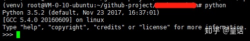

[toc]


# virtualenv venv 创建虚拟环境失败的解决方法

[](https://www.zhihu.com/people/tonghuaroot)

[童话](https://www.zhihu.com/people/tonghuaroot)

tonghuaroot.com ；网络安全爱好者；不是黑客；

## **0x00 前言**

在安装基于Python开发的项目的时候，为了获得更好的体验，常常会通过`virtualenv venv`安装一个虚拟Python执行环境，可以防止项目依赖的Python版本、第三方包的版本与系统当前安装的版本不一致导致的奇葩错误。  
在使用腾讯云的机器测试的时候报了这么一个错误：

```
# 我执行的命令
sudo -H virtualenv venv --python=python3
# 系统报错关键信息
pip._vendor.requests.exceptions.HTTPError: 404 Client Error: Not Found for url: http://mirrors.tencentyun.com/pypi/simple/pkg-resources/
```

这里就简单记录一下该问题的解决方法。

## **0x01 解决方法**

首先说一下报这个错误的原因，像阿里云、腾讯云这类云服务提供商为了增加用户体验（国内采用官方源延迟过高、第三方源用着又不放心），会提供一个自己的PyPI源，但是由于与官方源同步不及时等原因会导致部分资源缺失的情况，比如这里的`http://mirrors.tencentyun.com/pypi/simple/pkg-resources/`。  
那知道错误原因了，相应的解决方法也就明朗了，修改PyPI源为官方源即可（虽然有延迟，但是总比没有强啊！）。

```
vim /root/.pip/pip.conf
[global]
index-url = https://pypi.python.org/simple/
[install]
trusted-host=pypi.python.org
```

修改完`pip`的配置文件，再次创建虚拟环境即可：

```
sudo -H virtualenv venv --python=python3
source venv/bin/activate
```

  



  

## **0x02 坑点**

这里有一个坑点就是一定要确认好`virtualenv`调用的是哪个`pip`，然后找到对应的配置文件修改，因为当前机器上如果装了多个`pip`，改错了配置文件，那也是没啥用了。还有当前用户配置文件、全局配置文件啥的，也要注意下。  
比如我就修改了几个文件，才最终确认的：

```
/root/.pip/pip.conf
~/.pip/pip.conf
/etc/pip.conf
```

## **0x03 后记**

网上搜了几篇文章，才找到靠谱的解答，简单记录下解决问题的过程，希望文章描述的足够清楚，可以帮助到和我遇到同样问题的人。

## **0x04 参考链接**

- [安装tensorflow中 Not Found for url: http://mirrors.aliyun.com/pypi/simple/pkg-resources/ 问题解决](https://link.zhihu.com/?target=https%3A//blog.csdn.net/Tsinghua2MIT/article/details/79945625)

发布于 2018-09-15

[virtualenv](https://www.zhihu.com/topic/19615202)

[计算机科学](https://www.zhihu.com/topic/19580349)

[Python](https://www.zhihu.com/topic/19552832)

### 文章被以下专栏收录

[](https://www.zhihu.com/column/adsec)

## [网络安全大事件](https://www.zhihu.com/column/adsec)

换个角度看世界

[进入专栏](https://www.zhihu.com/column/adsec)

