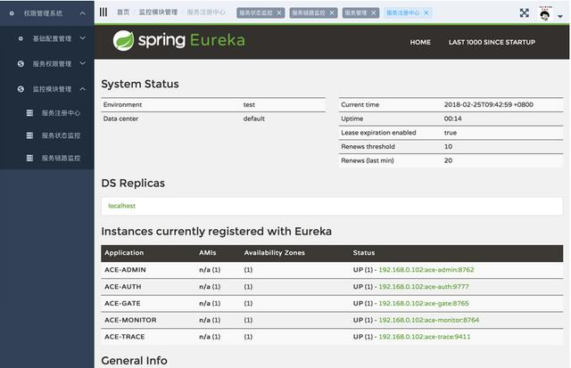
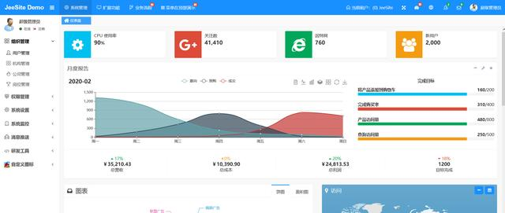
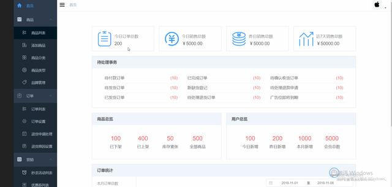
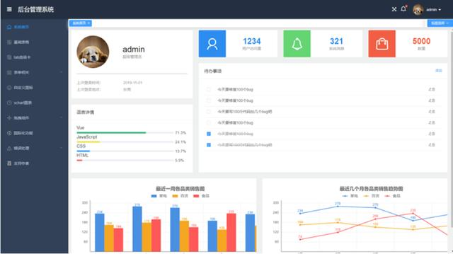
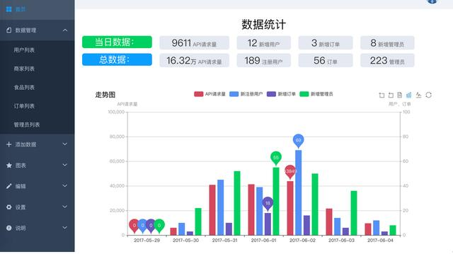
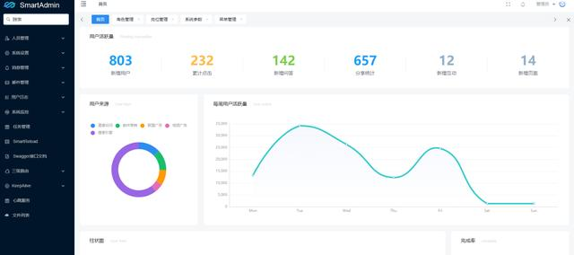
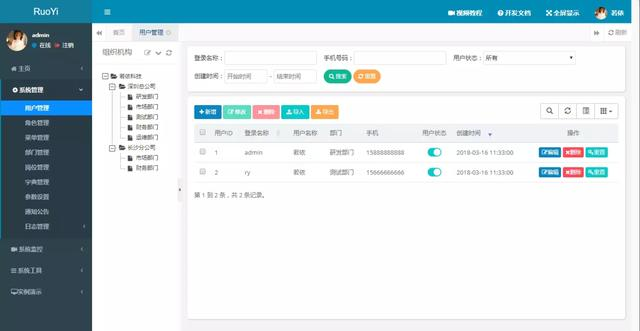
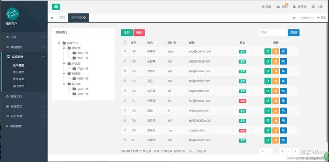

**1\. AG-Admin**

AG-Admin是国内首个基于Spring Cloud微服务化开发平台，具有统一授权、认证后台管理系统，其中包含具备用户管理、资源权限管理、网关API管理等多个模块，支持多业务系统并行开发，可以作为后端服务的开发脚手架。代码简洁，架构清晰，适合学习和直接项目中使用。核心技术采用Eureka、Fegin、Ribbon、Zuul、Hystrix、JWT Token、Mybatis等主要框架和中间件，前端采用vue-element-admin组件。

https://gitee.com/zerglou/ace-security

**2\. JeeSite**

Java快速开发平台，基于 Spring Boot、Spring MVC、Shiro、MyBatis、Beetl、Bootstrap、AdminLTE 在线代码生成功能，采用经典开发模式，让初学者能够更快的入门并投入到团队开发中去。包括核心模块如：组织机构、角色用户、菜单及按钮授权、数据权限、系统参数、内容管理、工作流等。松耦合设计；界面无刷新；一键换肤；众多账号安全设置，密码策略；在线定时任务配置；支持 Spring Cloud 微服务；支持 SAAS 多租户；支持集群部署；支持多数据源；支持读写分离；

https://gitee.com/thinkgem/jeesite4

**3\. mall-admin-web**

mall-admin-web是一个电商后台管理系统的前端项目，基于Vue+Element实现。 主要包括商品管理、订单管理、会员管理、促销管理、运营管理、内容管理、统计报表、财务管理、权限管理、设置等功能。

https://github.com/macrozheng/mall-admin-web

**4\. vue-manage-system**

该方案作为一套多功能的后台框架模板，适用于绝大部分的后台管理系统（Web Management System）开发。基于 vue.js，使用 vue-cli3 脚手架，引用 Element UI 组件库，方便开发快速简洁好看的组件。分离颜色样式，支持手动切换主题色，而且很方便使用自定义主题色。

https://github.com/lin-xin/vue-manage-system

**5\. vue + element-ui**

此项目是 vue + element-ui 构建的后台管理系统，是后台项目node-elm 的管理系统，所有的数据都是从服务器实时获取的真实数据，具有真实的注册、登陆、管理数据、权限验证等功能。

https://github.com/bailicangdu/vue2-manage

**6.Smart Admin**

SmartAdmin是一套互联网企业级的通用型中后台解决方案！使用最前沿的前后台技术栈SpringBoot和Vue，前后端分离，用一套漂亮的代码和一套整洁的代码规范。

https://github.com/smartbooks/SmartAdmin

**7.RuoYi**

于SpringBoot的权限管理系统 易读易懂、界面简洁美观。 核心技术采用Spring、MyBatis、Shiro没有任何其它重度依赖

https://gitee.com/y_project/RuoYi

**8.BootDo**

BootDo主要定位于后台管理系统学习交流，已内置后台管理系统的基础功能和高效的代码生成工具， 包括：系统权限组件、数据权限组件、数据字典组件、核心工具组件、视图操作组件、工作流组件、代码生成等。 前端界面风格采用了结构简单、性能优良、页面美观大气的Twitter Bootstrap页面展示框架。 采用分层设计、双重验证、提交数据安全编码、密码加密、访问验证、数据权限验证。 使用Maven做项目管理，提高项目的易开发性、扩展性。

https://gitee.com/lcg0124/bootdo

