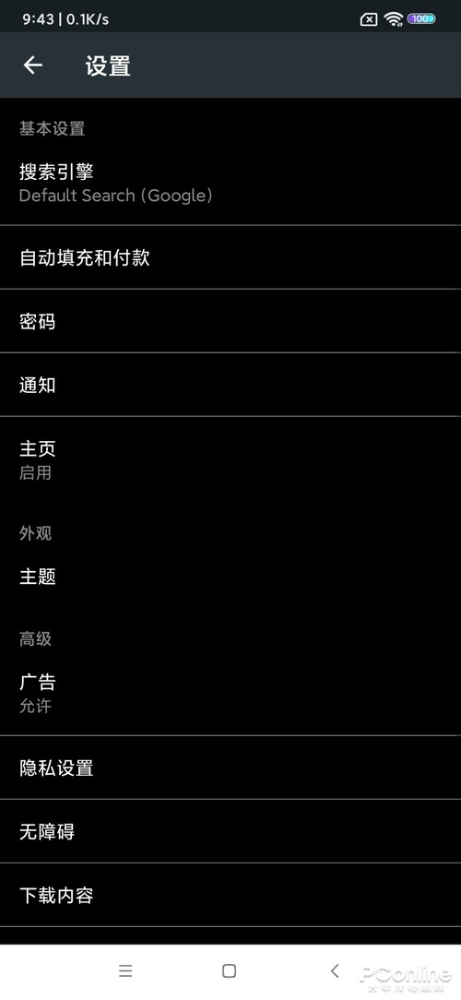

[toc]

# Kiwi浏览器体验手机版Chrome都做不到！Kiwi浏览器体验

*2021-12-12 00:15 出处：PConline原创 作者：[我爱我家](https://www.pconline.com.cn/author/author248.html)*

　　\[PConline 应用\]你手机上用的[浏览器](https://dl.pconline.com.cn/sort/104.html)是哪一款呢？很多朋友电脑用Chrome浏览器，但手机上却不用Chrome，因为手机版Chrome不支持扩展程序！今天小编要介绍一款简单却功能强大的浏览器——Kiwi浏览器，它是一款支持扩展的浏览器，让用户可以通过各种各样的浏览器插件来实现自己想要的附加功能，一起来看看吧。

**　　Kiwi浏览器：https://kiwibrowser.com/**

**
图1  Kiwi浏览器主界面

## **简单界面 支持全黑夜间模式**

　　Kiwi浏览器采用了简单的操作界面，主界面上有主页按钮（新建标签页）、地址栏、标签切换按钮、功能选项按钮及浏览区域所组成。乍看上去，它可是平平无奇的，但是用起来却很丝滑顺手。

　　Kiwi浏览器支持夜间模式，也支持主题模式。在夜间使用时，用户可以切换到夜间模式，这样不仅浏览器框架会变黑，网页也会随之变黑。

**
图2 开启Kiwi浏览器夜间模式

## **基本功能看一看 后台播放视频听一听**

　　先来看看Kiwi浏览器的一些基本功能，第一个要提的就是它自带的广告屏蔽功能，虽然这个功能默认是关闭的，不过当用户把它打开时会发现浏览网页时清净不少。此外，Kiwi浏览器还有自动填表、自定义下载目录、支持多种翻译工具、可以在后台播放视频等功能。其中支持后台播放功能让用户可以听视频音而不必霸占着页面，比较适合听讲座等的场景。此外Kiwi浏览器还拥有不错的页面加载速度。

**
图3 Kiwi浏览器基本功能

## **Kiwi浏览器的最强大功能 支持扩展变身万能浏览器**

　　Kiwi浏览器的最强大功能莫过于支持[谷歌浏览器](https://dl.pconline.com.cn/download/51614.html)扩展，用户可以直接安装谷歌浏览器扩展商店的官方扩展，也可以通过开启开发者模式来加载本地的扩展插件。Kiwi浏览器几乎支持所有的Chrome浏览器插件，这着实让用户惊喜万分。

**
图4 安装本地浏览器扩展

　　说到Kiwi浏览器中必装的浏览器扩展，那当属Tampermonkey或暴力猴了，装了它们，又可以安装各种丰富的JS脚本。你在浏览网页、观看视频、下载网盘文件时，就会更加的得心应手。

**
图5 安装Tampermonkey脚本

## **总结**

　　如何，你喜欢上Kiwi浏览器没？支持扩展的它真是能根据用户的需求来增加附加功能，提升不少的效率，你也不妨试试它呗。

