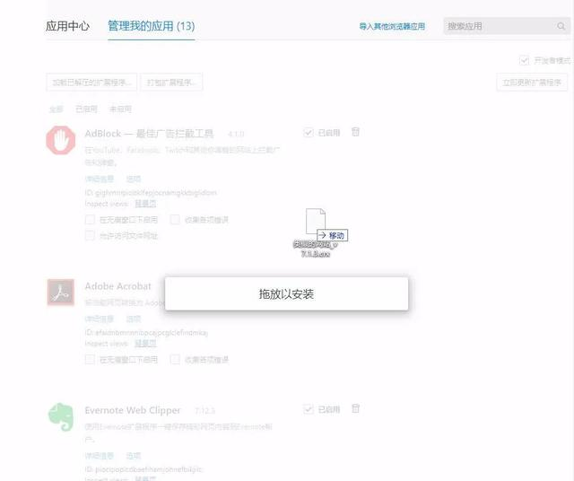
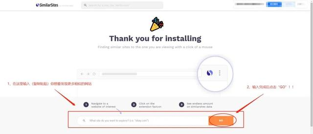
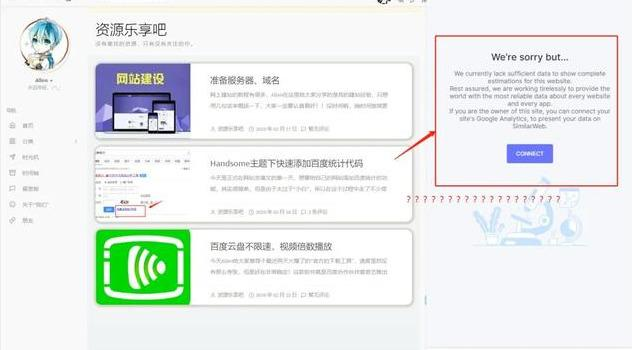

[首页](https://www.toutiao.com/) / [科技](https://www.toutiao.com/ch/news_tech/) / 正文

# 这个谷歌插件太强了，功能无上限，全靠想象力

优搜罗 2020-02-25 11:20:34

Hi，大家好，欢迎来到：无优质，不分享！搜罗君的藏宝阁：优搜罗，关注我们，就可以第一时间接收到我们推送的精品资源啦！

  

今天给大家分享的是一款插件，灰常牛批的插件！！！就像标题说的那样，功能无上限，全靠想象力！！Allen今天正文的内容会很正经，想要不正经~~还是靠大家的想象力喽~

  

**▍SimilarSites（浏览器插件）**

SimilarSites是一个可以让大家发现更多类似网站的浏览器插件，至于它的用途，那简直就太过于广泛，充满了想象空间！！简直就是想象力有多远，它的能力就有多远，功能原理上来讲是无边界的！！

  

**安装方法**

插件的后缀名是.crx，是很纯正的谷歌插件系列，安装方法到处都是，Allen就一句话带过，点击浏览器的设置--扩展应用--把插件拖放进去就OK！！

不懂的去百度叭~

  

**支持的浏览器**

目前插件支持所有拥有谷歌内核的浏览器！！目前国内主流的浏览器几乎全部模仿了谷歌内核，大家无需担心，但是如果你不确定自己的内核是否为谷歌，Allen也教给大家一个小技巧：

1、打开浏览器

2、在网址栏输入chrome://extensions/或chrome://version/

3、如果浏览器打开的界面和下面两个比较类似，则是谷歌内核无疑~

**使用方法**

插件安装好之后，会进入到搜索界面，不知道大家能不能看得懂英文，我在这里为众多粉丝们分析以下是啥意思~

1、这里的意思是输入我们要访问的网址，然后再网站的页面点击右上角的插件图标，然后就可以查看类似网站的信息啦~~

2、但是Allen测试的时候，把吾爱的网址复制粘贴上去却报错了~~所以有点怀疑我的判断，但是又不知道怎么解决~

好在，大家如果直接打开自己想要查找相似网站的页面，点右上角的插件图标，就可以查找相似网站！！

作为一个主打黑科技软件的博主，每天必逛的网站当属大名鼎鼎的吾爱破解网！！那么有没有类似的网站的，这激起了我强烈的好奇心！！

  

想到就干一向是我的作风，我们打开吾爱，点击右上角的插件图标，结果令人震惊！！居然有这么多类似的网站存在！！像著名的GitHub、cnblog啥的就不说了，光是后边的网站，感觉就够玩儿了呀~~（大家不要因为有了这些宝库就把Allen舍弃了呀，好害怕...）

  

**日常皮一下**

大家都知道我们最近建立了一个网站：

但是由于时间不充分，实在分身乏力，所以网站没有好好更新（应该说直接断更了），以后一定会抽时间抽时间更新优质内容呐！！（网站还会像是一个我的记事本，心得感受本的存在，很欢迎小伙伴们来活跃活跃，还可以留言哦~）

好奇心趋势下，Allen小小的调皮了一下，去测试一下发现我们网站的类似网站会怎么样？！

这个结果简直~出乎意料又在情理之中，毕竟我们建站8天，文章也不发什么的，人家怎么去找得到和我类似的网站呐~~~算啦算啦~滚去睡觉~~

  

**▍软件下载**

点赞+转发，然后点我头像私信我“插件”即可获取！记得一定要转发呦！

