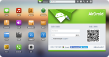
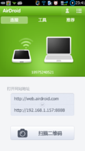
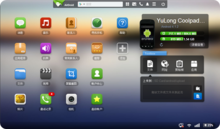

首先，界面友好，

注重细节，完美支持简体中文。

AirDroid的界面看起来很养眼。有一种似曾相识的WebOS风格，页面采用HTML5构建。第一次使用时，先给手机装好客户端。
登录体验很棒，你可以用GoogleID等流行的通行证登录，也可以打开客户端扫描页面上的二维码直接登录。如果你在WIFI环境下，为保障速度，还可以用局域网直连。

类WebOS的界面看起来一目了然，而访问速度也远超我的预料。似乎感觉不到是在远程操作一台手机，而像是一个本地操作系统在WEB中运行一样。你甚至可以用它的来做同屏演示。有关AirDroid的各种便利，我真心希望您亲自体验一下。