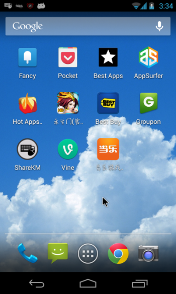
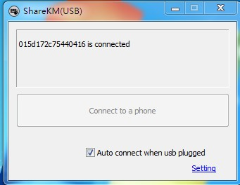
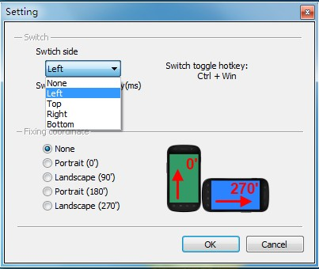
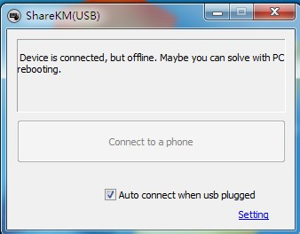
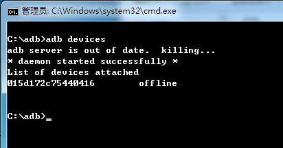
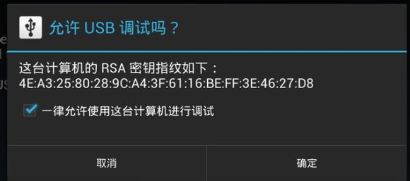

经常使用手机和平板玩游戏的朋友们经常会有这种感觉，玩的多了以后手指指尖会感到一丝丝的麻木和疼痛。尤其像某种变态的要用手指戳来戳去，滑来滑去的游戏，更是让人恨之入骨。

在经历了一番疼痛之后，我偶然发现一款可以让手机使用电脑键盘和鼠标的软件，顿时惊喜异常，测试成功后减轻了不少手指的负担。

这么好用的软件当然要跟大家分享，保护各位的左右手。废话不多说，介绍开始：

这款厉害的软件名字叫做ShareKM(Share Keyboard & Mouse)，系统由两部分组成，电脑端的软件和手机端的软件，软件都非常的mini，电脑端的不过500kb，手机端的也才660kb，下载地址如下

电脑端下载：点击下载
手机端下载：点击下载

首先当然是在电脑和手机或平板上安装软件，这个过程就不再赘述了。

安装完成后找到手机上的软件打开，可以看到有wifi，USB，Bluetooth（蓝牙）三种方式，鉴于大家一般没有wifi和蓝牙功能的用台式机居多，我们在这里只介绍USB模式。

通过数据线连接电脑和手机。在手机上启动软件之后，再在电脑上通过开始菜单，找到ShareKM，点击ShareKM(USB)启动ShareKM电脑端，这时候应该就显示已经连上了，够简单吧

右下角的Setting，可以让你设置鼠标划出电脑屏幕的位置，比如从电脑右边划到最边缘后延伸到手机，或者是其他三个边，都可以的，Delay可以设置为0 ms，这样就没有任何延迟了，从下面的几个选项还能选择相对于屏幕的角度，这样横竖屏切换的时候就不会感到别扭了。

当然一些手机会出现问题，比如虽然手机上已经通过开发者选项选择了USB调试，但有些手机连接电脑后还会有offline的提示，比如我的Nexus4和Nexus7在root后都会出现offline的情况，解决问题的方法也很简单。

进入到adb命令行，输入adb devices，然后回车，就会显示手机的串号了，这时在屏幕上会出现一个对话框，提示是否允许USB调试，如下图，在复选框上打钩，然后就可以连接电脑了。

教程完毕，大家尽情的享用这款软件吧。

