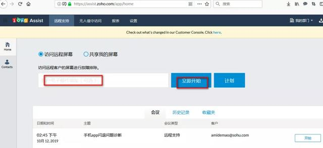

[toc]

# Teamviewer被黑？试试Zoho Assist吧

Zoho云服务 2020-02-24 15:33:19

最近，朋友圈里频繁看到“TeamViewer 被境外黑客组织攻击”的文章，称黑客组织可以访问并控制任何安装了 TeamViewer 的客户端。很多用户都在急切地寻找替代品。如果您有远程诊断的需求，不妨试试Zoho Assist吧。它有免费版和付费版，不仅能共享电脑桌面，还能共享手机屏幕。无需安装客户端，可录制诊断过程，提供免费API，还可嵌入到其它第三方软件工具里。在国外有日立、联合国基金会等知名客户，在国内有一加手机等知名客户。

### **使用简单**

首先在zoho.com/assist注册一个账号。进入产品后，默认选择的是“访问远程屏幕”，输入对方的邮件地址，点击立即开始，等对方加入会议，您就可以连接对方的屏幕，进行问题诊断。
当然您也可以选择“共享我的屏幕”，那么对方就可以一边看您的演示，一边听您的讲解了。

### **稳定可靠**

在给客户做远程支持的过程中，Zoho Assist使用体验比较顺畅，无“不能连接”或“卡顿”等现象，这一点是很多客户看重的。

### **安全**

Zoho Assist提供双因素验证（短信验证或谷歌验证器等）、SSL安全证书，并兼容主流防病毒软件。几秒内即可启动远程诊断，客户无需更改代理或防火墙设置。它通过行业标准的SSL 和 256-位 AES加密协议传输数据，保证数据安全。还采用了数据匿名化技术，可将IP地址、客户邮件地址等个人信息做匿名化处理，保证个人隐私。另外Zoho还遵从GDPR欧盟《通用数据保护条例》，在客户数据的各个接触点从流程、规章、责任人等各方面保证数据安全。

### **国际奖项**

今年已经是Zoho Assist连续第四次获得美国G2 Crowd“远程桌面软件”及“远程支持软件”两项评选的冠军了。参与评选的有119家国内外远程协助类软件，较高的客户满意度让Zoho Assist 夺冠并获得了“客户优选”的称号。以下是它在今年的评选中各个评选维度的得票情况：

  

易用性（94％）

满足业务需求（92％）

购买方便（94％）

设置方便（94％）

客服的质量（90％）

管理员易用性（96％）

