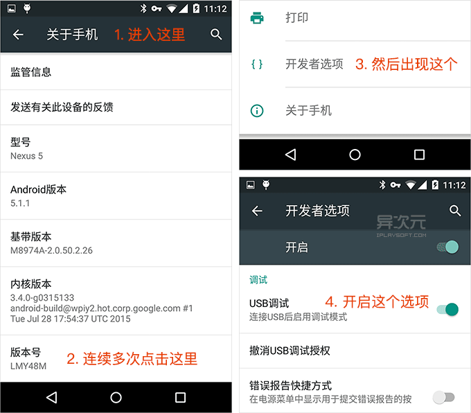
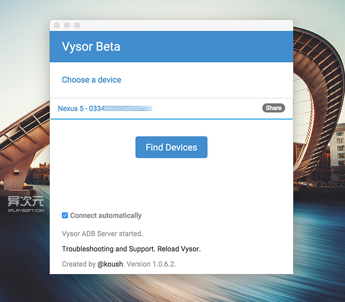
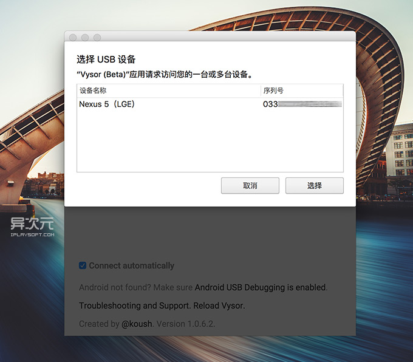
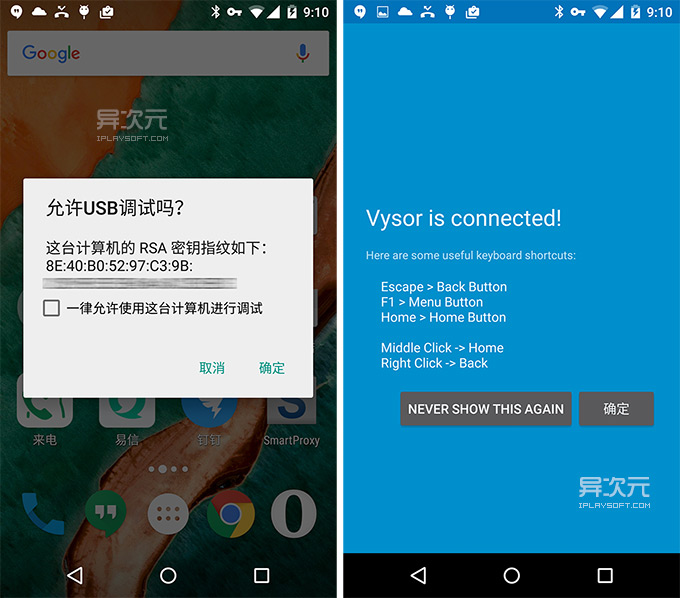
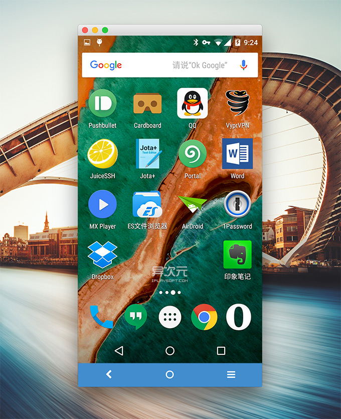
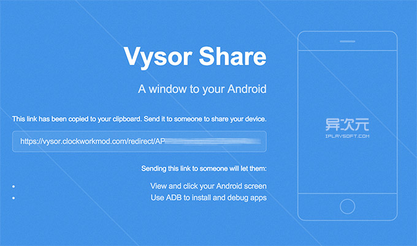

1、下载：由于 Vysor 是一款 Chrome 扩展应用，因此你需要先安装好 Google Chrome 谷歌浏览器，再安装 Vysor 扩展，但下载它们俩均需要先「番·羽·土·啬」才行。(两者的下载地址均位于本文结尾处提供)
2、手机开启 USB 调试模式：这只需设置一次即可，但是必须启用该选项后 Vysor 才能连接到你的手机。在大多数安卓手机上这个选项是被隐藏起来的，你需要进入「设置→关于手机」，找到「版本号」一栏并连续点击它多次，系统就会弹出“开启开发者选项”的消息了。然后找到「设置→开发者选项→USB调试」开启即可。

3、安装 ADB Driver 驱动：如果你在 Windows 系统下使用 Vysor，那么还需要安装一个 ADB Driver 驱动 (Mac 下不需要)，安卓开发者应该很熟悉了。如果你是普通用户，可以下载作者提供的 Universal ADB Driver (通用 ADB 驱动) 安装好即可，实测 Windows 10 系统下可用。
4、将手机通过 USB 数据线连接到电脑，并启动 Vysor。如果界面上没有列出你的手机或平板，这时按下界面上的 Find Device (搜寻设备) 按钮即可刷出来。

之后，在列表中选择的手机名称并按下「选择」键即可连接。Vysor 可以支持一次连接多台 Android 手机或平板设备。

首次连接成功后，手机上会弹出对话框问你是否允许连接 (下图左)，选择是即可。此时 Vysor 会自动在你的手机上安装上 Vysor 的 APP，提示连接成功后(下图右)，我们便可在电脑上看到手机画面了。这时你也可以通过鼠标对手机进行操作，手机也是跟着同步响应的；反之在手机上操作，电脑上的显示也会随之变化。

Vysor 键盘和鼠标对手机进行操作的对应关系如下：鼠标左键 = 手指点击、键盘 Esc / 鼠标右键 = 手机返回键、F1 = 菜单键、键盘 Home 键 / 鼠标中键 = 手机 Home 键。
好了，就是这么简单。之后你就可以在电脑上控制手机做任何爱做的事了 HoHohoho …… 上班玩游戏炒股发短信？启动手机摄像头各种拍？反正随你……

不得不说，对于像小编一样经常需要给手机截屏的，Vysor 真心方便啊！连接后在画面顶部会有小小的工具栏，其中就有个截图的按钮，简直就是神器……
网络远程连接控制 / 给小伙伴共享你手机的控制权
等等！我们都知道因为 Teamviewer QuickSupport 是通过网络连接的，因此可以实现「异地网络远程控制手机」，那么使用 USB 连接的 Vysor 能这样玩么？答案也是可以的！不过实现方式不太一样。
Vysor 提供了名为 Vysor Share 的「网络远程控制共享」功能，准确来说应该是「共享手机的控制权」给网络上的他人远程进行操作。操作方法也很简单，通过 USB 连接成功后，在 Vysor 的手机列表上将会出现一个「Share」(分享) 按钮，点击后即可获得一个私密的 Vysor Share 链接。

你可以将这个 Vysor Share 链接通过 QQ 或邮件发给需要通过网络远程控制你手机的人（当然也可以是你自己啦），然后对方在电脑上 (同样需要安装好 Chrome 浏览器和 Vysor 扩展哦) 点击打开之后，就能开始对手机进行“网络远程”的控制了。
不过由于我自己并没有这方面的需求，加上时间关系 (就是偷懒了 >_<)，所以这里没有实际测试过远程控制的效果如何，有试过的朋友不妨给大家说说。
总结：
目前 Vysor 还处于 Beta 测试阶段，从实际效果看来，画面帧速率还不是很高，快速操作时图像还是有延迟和模糊失真，但是一会就变回清晰了。而除了截图跟网络共享控制之外，其他附加功能也还不多。
不过，尽管还不很完美，但 Vysor 实用性已经很值得一赞了！别忘了它还完全免费且跨平台哦！如果你一直在苦苦寻觅免 ROOT 权限的电脑远程控制手机的 APP，或者需要找一款将 Android 手机画面同步投射/串流到电脑的软件，又或者寻找手机截图利器，Vysor 正正就是你需要的！不得不说，它的本事让我印象深刻……