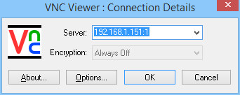
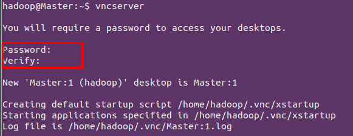
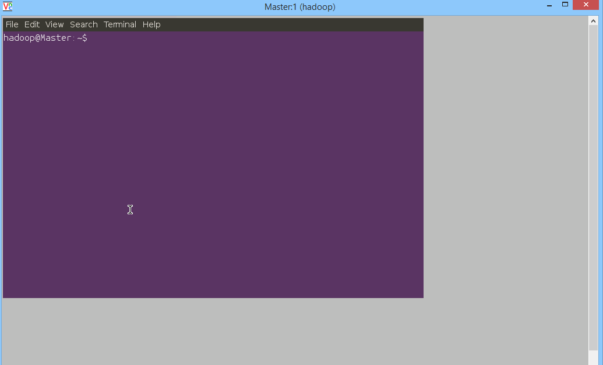
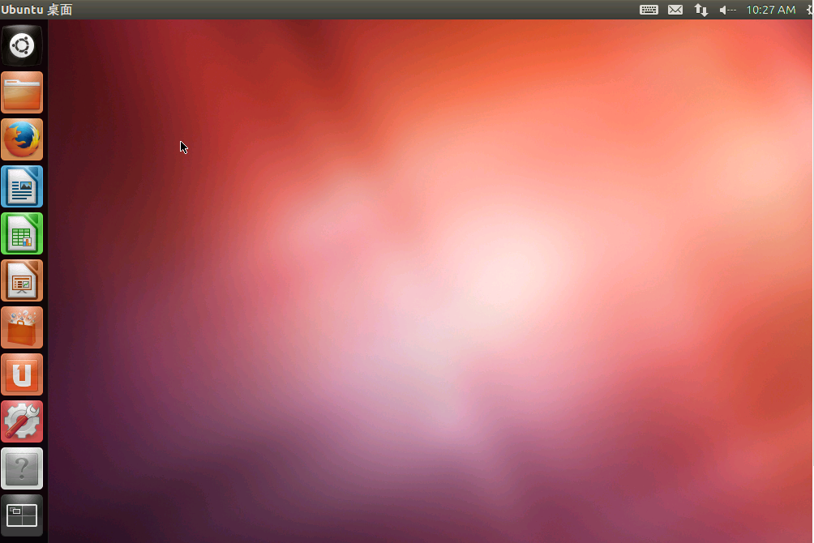
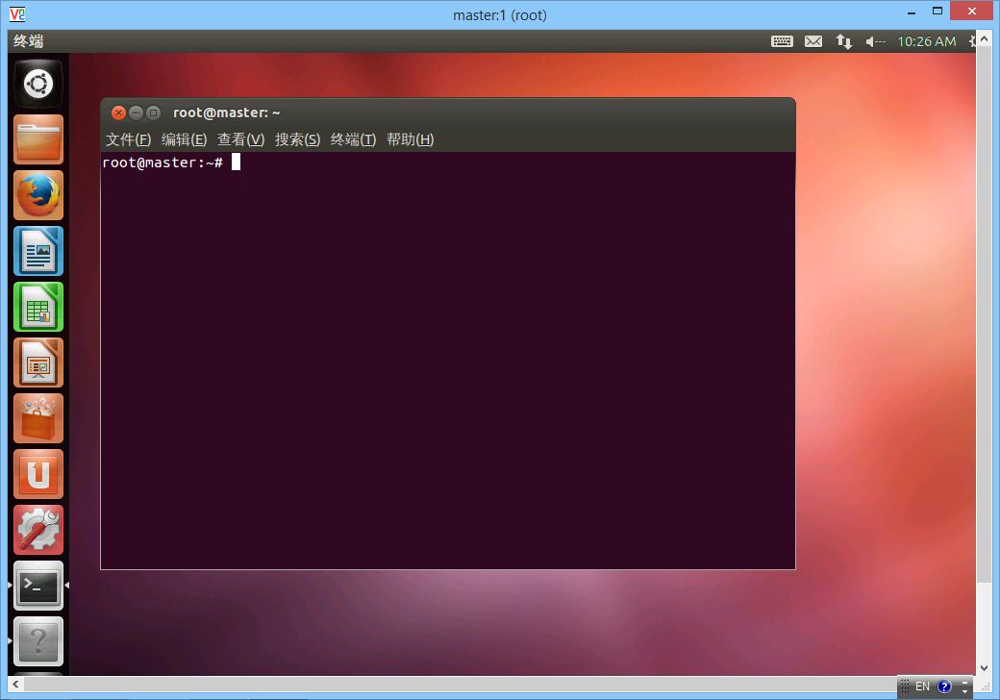

要在windows下图形化访问Ubuntu或其它Linux系统桌面环境有很多方法，我比较喜欢的是使用VNC服务，需要在Ubuntu下安装vncserver和在windows下安装客户端访问工具。 
1. windows下客户端访问工具
对于VNC，客户端访问工具也有不少，比如RealVNC、VNCViewer等，我比较喜欢的是VNCViewer，比较小巧轻量级，使用也十分简单，如下图所示：

后面的:1是分配的桌面号，可以给不同的客户端分配不同的桌面号访问，如果是默认端口这样输入就可以了，如果设置了端口号还需要在IP后面加上端口号访问。 
2. Ubuntu服务端配置
1） 首先安装vncserver服务
$sudo apt-get install vnc4server
2）安装成功后，开启vnc服务
如果你想访问root用户的桌面环境就用sudo vncserver，如果访问当前普通用户的环境就直接vncserver即可，首次启动会要求设置密码，用来在客户端访问时使用，后面可以使用vncpasswd 修改。

启动vnc成功后，会在主目录下产生一个.vnc目录。
3）修改原有xstartup文件以图形化访问
如果不修改xstartup文件就在客户端下访问则会出现下面这样的界面：

也就是只有一个终端窗口没有图形界面，这显然不是我们想要的，那么如何图形化访问呢？这就需要修改vnc的配置文件xstartup。
默认的xstartup文件是这样的:
#!/bin/sh                                                                       
# Uncomment the following two lines for normal desktop:
# unset SESSION_MANAGER
# exec /etc/X11/xinit/xinitrc
[ -x /etc/vnc/xstartup ] && exec /etc/vnc/xstartup
[ -r $HOME/.Xresources ] && xrdb $HOME/.Xresources
xsetroot -solid grey
vncconfig -iconic &
x-terminal-emulator -geometry 80x24+10+10 -ls -title "$VNCDESKTOP Desktop" &
x-window-manager &

我们需要将最后一行“x-window-manager &”改为我们自己的Ubuntu图形界面服务，那么改成什么呢？这就要看你Ubuntu是什么桌面环境了，Ubuntu有gnome、KDE、Unity等桌面环境。
如果是gnome桌面，改成gnome-session &；
如果是KDE桌面，改成startkde &；
如果是Unity桌面，首先去 /usr/share/gnome-session/sessions/下看桌面session的名称，如果是ubuntu-2d，则将最后一行改为：
export STARTUP="/usr/bin/gnome-session --session=ubuntu-2d"
$STARTUP
现在的Ubuntu都是unity桌面，像下面这样：
 

 
修改完成后，如果你已开启了vncserver服务，需要使用vncserver -kill :1（这里是默认的1号桌面，根据自己情况修改）来杀死正在运行的桌面服务，然后重启该服务：vncserver :1生成新的会话，客户端重新连接，就会出现图形界面。
 

 
注：如果没有使用成功，可能是你的Ubuntu没有安装相应的桌面环境，如果是gnome桌面环境，则可按下面方法安装：
(1)安装x－windows的基础 
$sudo apt-get install x-window-system-core（一般都已安装） 
(2)安装登录管理器
$sudo apt-get install gdm （还可以为kdm/xdm） 
(3)安装Ubuntu的桌面
$sudo apt-get install ubuntu-desktop
 