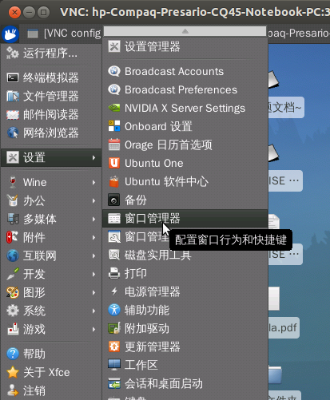
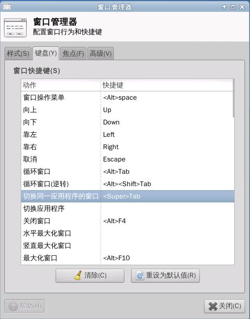

配置vnc远程桌面环境Xfce4的文章见本人另一篇博客：
http://blog.163.com/thinki_cao/blog/static/83944875201303014531803/
        在成功登陆Xfce4远程桌面环境之后发现在终端中Tab键不能自动补齐(但是Ctrl + I 仍然可以用)，查了一下国内关于这个问题的资料非常少，不过功夫不服苦心人，终于在国外的网站上找到解决方法了，下面给出链接：
http://ubuntuforums.org/archive/index.php/t-1771058.html
https://answers.launchpad.net/ubuntu/+source/xfce4/+question/206191
问题的原因是由于Tab键的功能被窗口快捷键占用，从而Tab键不起作用，国外网友的回答如下，英语不好的直接跳过去吧。
In short, you can either edit:
~/.config/xfce4/xfconf/xfce-perchannel-xml/xfce4-keyboard-shortcuts.xml
find the line
<property name="&lt;Super&gt;Tab" type="string" value="switch_window_key"/>
and change it to
<property name="&lt;Super&gt;Tab" type="empty"/>
Or go to "Settings->Window Manager", in the "Keyboard" tab, clear the binding of "Switch wndow for same application -> <Super> Tab"
简单来说解决方法有两种：
        1. 编辑~/.config/xfce4/xfconf/xfce-perchannel-xml/xfce4-keyboard-shortcuts.xml文件，找到下面这行
<property name="&lt;Super&gt;Tab" type="string" value="switch_window_key"/>
修改为
<property name="&lt;Super&gt;Tab" type="empty"/>
然后重启系统之后即可解决
        2. 此法不需要重启系统，可以直接在远程桌面中设置，打开菜单->设置->窗口管理器，或者在终端中输入xfwm4-settings打开（xfwm4就是xfce4 window manger的缩写）

选择键盘，可以看到窗口快捷键中动作一列有“切换同一应用程序的窗口”选项，将该选项的快捷键清除后关闭窗口即可

到此，Xfce4远程桌面的配置完成。