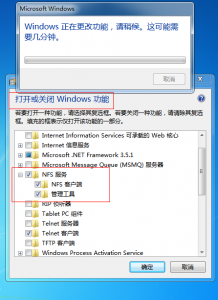
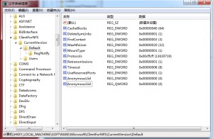
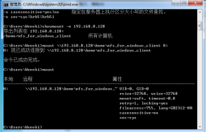
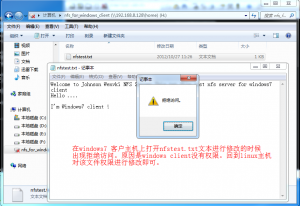
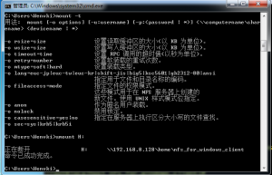

今天不经意在一博客上浏览到一句话“windows7挂载NFS文件系统”，让我震惊了，教科书上或者接触到的NFS文件系统也就只是在类 Linux平台使用的一种网络服务。更没想过要在windows平台下使用Linux中的NFS服务。后来想想，其实这也不奇怪，主要是微软的战略，向 linux兼容也是很正常的，这个就是其中之一的体现。下面就以我本机windows7旗舰版和虚拟主机RHLE6.2系统为例，做个简单的实验。从有些 资料上看到，有些windows7个人版还有一些其他版本在打开和关闭功能里面没有打开NFS选项的功能。见下图：

Open the windows nfs
打开windows系统中的NFS功能
首先在RHEL6系统中安装并启动NFS服务。这里不再赘述，具体方法请查阅前面有关于RHEL下NFS服务器的配置和使用的文章。下面图是RHEL中该实验实时截图
nfs server 配置
确保虚拟主机和物理主机能够通信，windows还是比较强大的，当你使用mount命令出错时，按照提示的错误很快你就可以找到发生错误的所在。 Windows7中挂载Linux中的NFS系统文件，在Windows中打开NFS功能的时候无需重启，也就直接可以挂载Linux系统中的NFS文件 系统。但是不能够在该驱动器上创建和修改文件。解决办法就是让Windows7在挂载NFS的时候将UID和GID改成0即可：
打开注册 表：
HKEY_LOCAL_MACHINE\SOFTWARE\Microsoft\ClientForNFS\CurrentVersion \Default，
增加两项：AnonymousUid，AnonymousGid,如图：

修改注册表
修改windows注册表，重启后mount
mount  \\IP\系统共享文件目录路径 H:(本地磁盘驱动号)

windows7挂载Linux的NFS系统文件
挂载NFS文件系统到windows本地后，无法修改该驱动器上由linux管理员创建的文件，原因是windows nfs client没有修改该文件的权限，到linux主机上修改该文件属性即可。

修改Linux系统NFS文件目录权限

windows客户修改NFS系统中的文件

卸载NFS文件系统
原创作品，转载请注明出处。多谢合作！