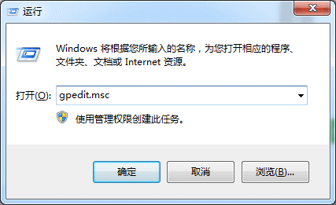
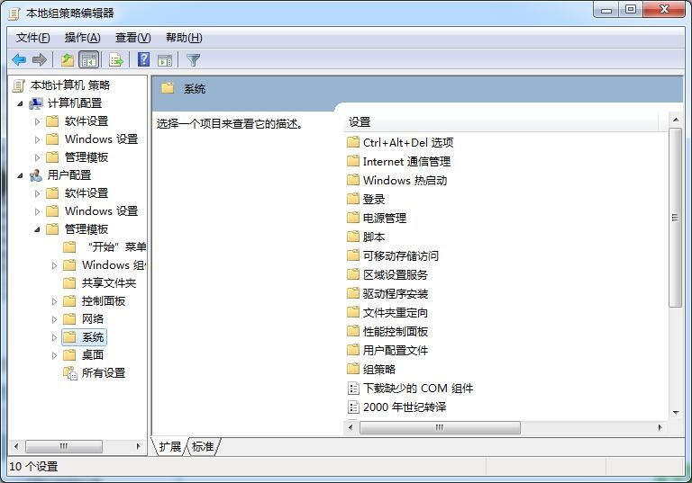
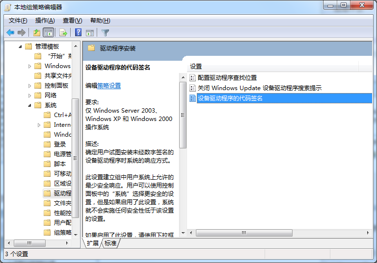
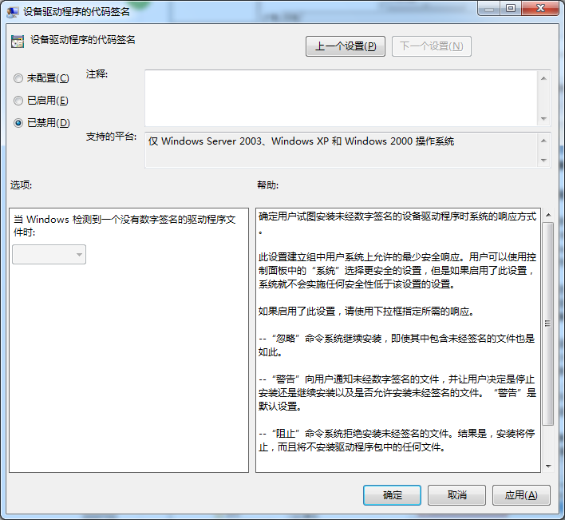
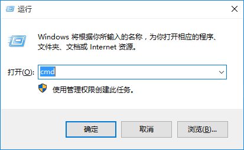
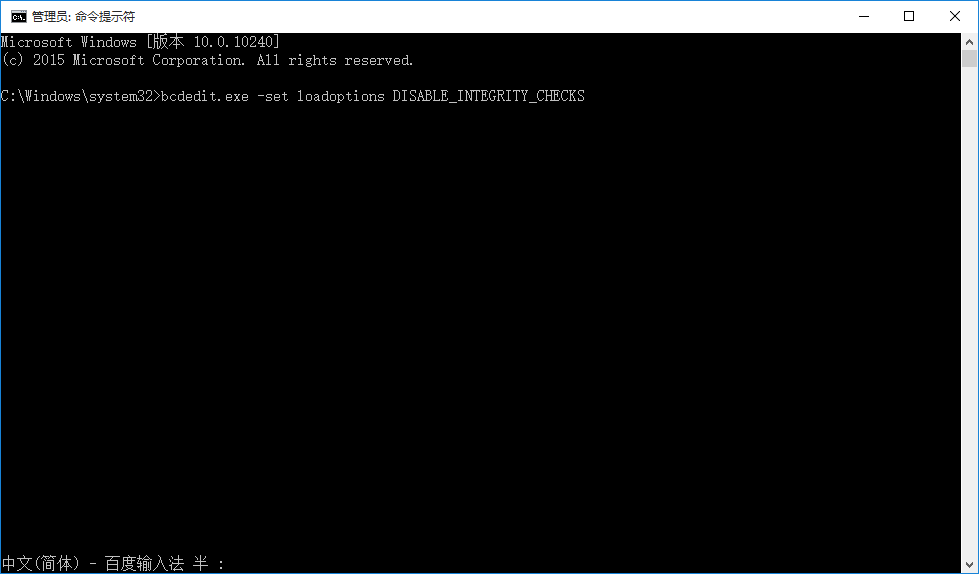
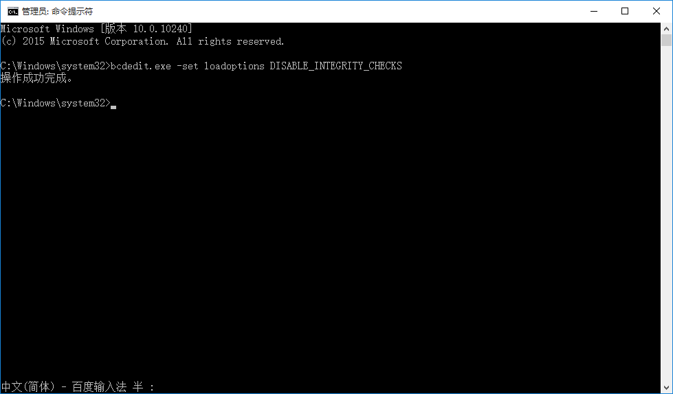
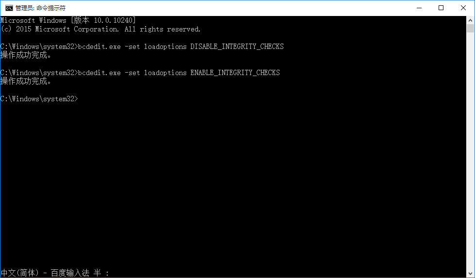

为方便大家使用，我们特别开发了飞傲播放器通用USB DAC驱动程序，只需一次安装，即可支持不同机型的飞傲播放器。
通用驱动采用了全新的图标和安装界面，下面以X7为例，列举详细方法。
## 一、安装USB DAC通用驱动
准备工作：
Win7下需要先更新系统补丁或禁用Windows驱动强制签名，详细教程后附；Win8/Win8.1/Win10可直接安装。
（因为新版驱动证书WIN7默认不识别，而WIN8/WIN10则默认识别，所以Win系统下需要禁用驱动签名，或者更新系统补丁后正常安装，下载地址：
https://www.microsoft.com/en-us/download/details.aspx?id=46148
https://support.microsoft.com/en-us/kb/3033929 

附：Win7下禁用驱动强制签名

这是因为新版驱动的证书为SHA256，WIN7默认是不识别的，需要更新系统补丁后才可识别，所以Win7下安装X7 USB DAC驱动时，需要禁用驱动强制签名，或更新系统补丁后正常安装，补丁下载地址为下载地址：
https://www.microsoft.com/en-us/download/details.aspx?id=46148
https://support.microsoft.com/en-us/kb/3033929

### 方法一：

1、按WIN+R打开运行，输入gpedit.msc并按回车键。

 

2、在组策略编辑器窗口中，依次选择用户配置>>管理模板>>系统>>驱动程序安装，在设置框中用右键点击设备驱动程序的代码签名。

 

 

3、在设备驱动程序的代码签名窗口中，选择已禁用，这样就禁用了驱动程序签名强制。

 

4、建议在安装完想要的驱动后，仍将配置改为已启用，并在选项窗口中选择警告，以保证系统安全。

 

### 方法二：
1、按Win+R组合键打开运行框，输入cmd并按回车键。（以管理员模式打开命令提示符窗口）

 

2、输入以下命令并按回车键：
bcdedit.exe -set loadoptions DISABLE_INTEGRITY_CHECKS
输入命令的时候注意空格。

 

3、提示“操作成功完成。”或“The operation completed successfully.”，即禁用成功。

 

4、建议在安装完想要的驱动后，建议输入并执行下面的命令，以重新打开驱动强制签名。
bcdedit.exe -set loadoptions ENABLE_INTEGRITY_CHECKS

