现在的W7对电脑要求很高，一般用户使用XP系统是足够了。下面介绍如何安装XP系统。

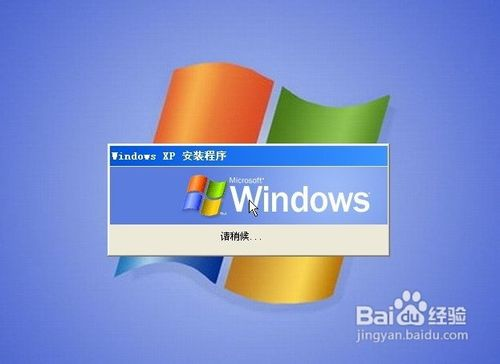

### 方法/步骤
1
找到一个专业制作XP系统的网站进行下载。

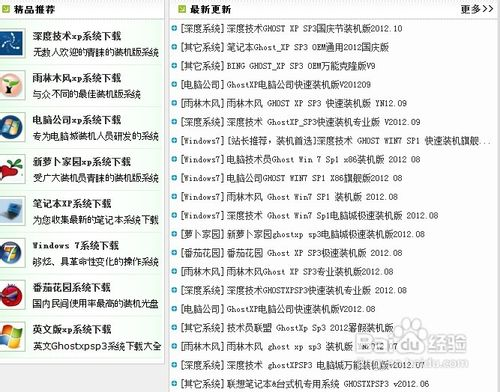

2
选择好XP系统的版本，有旗舰版，电脑版，装机版，专业版等，我们选择一个最近更新的下载。

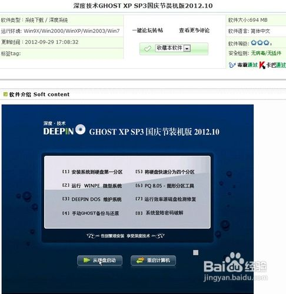

3
版本后面有一些详细的说明以及更新的资料，可以查看下是否合意。

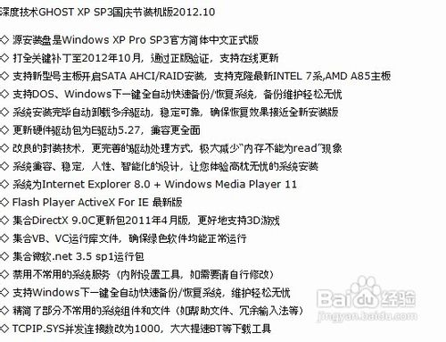

4
然后用迅雷等下载工具下载这个系统到本地电脑保存。

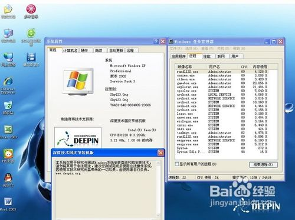

5
下载完毕后，解压得出资料程序。

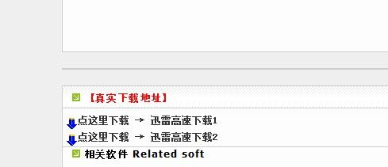

6
我们点击那个自动安装，然后就看到下面。

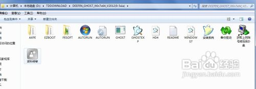

7
看到几个目录，你觉得需要的就用鼠标选择。选择好了就点击1

8
点击1后出现提示框，选择是的。电脑自动搜索到GHOST的GHO的系统程序，自动安装，十分方便。

9
再点击 是  出现提示，是否重启，如果你都办好了，就点击 是 。如果需要操作其他的事情就点击 否 。

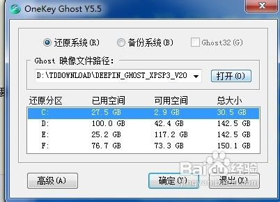

10
电脑重启，自动进入到电脑GHO模式进行恢复刚才下的系统。如图

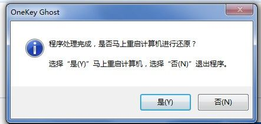

11
安装时的页面是这样的。最上面的百分比到100，就是完成了，OK了。

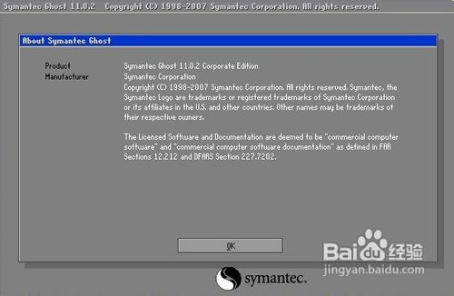

12
我们就可以出去外面边喝茶 边等待电脑自动安装。大约经历10分钟，安装全部都完成。这个时间根据自己电脑的配置来定义。下面是安装好的页面。

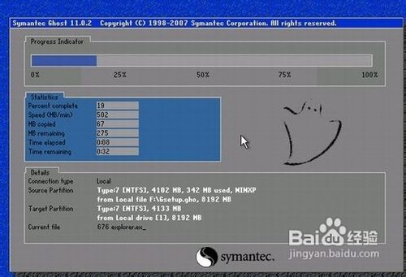

13
可以看到里面的系统版本，点击 我的电脑，反键，最下面有一系列的资料。

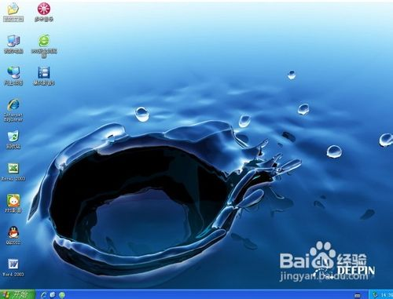

14
这样我们就安装好了一个全新的XP系统。如果是熟练玩家，可以选择手动安装。这样十分的方便跟灵活，选择自己喜欢的系统安装吧。

注意事项
本过程是与作者安装系统封装部署经验，或可作临时安装测试PC硬件之用。请在安装后24小时内删除。若需要长期使用，请购买正版系统及软件。 
本过程是无偿提供，作者仅偶尔对使用者作一些友情帮助，但恕不对造成的损失负责。