**准备教育版邮箱**
我们需要一个临时的教育邮箱来接收申请时发来的验证码，(这个邮箱就是我们的登陆账号,自己复制保存好)，可以通过以下任选一个临时邮箱即可.
http://onedrive.readmail.net/
https://t.odmail.cn/
http://od.obagg.com/
http://xkx.me/
打开以上任一网址获取一个临时邮箱, 复制右上角已有邮箱名，或点击右上角图标->自定义邮箱名
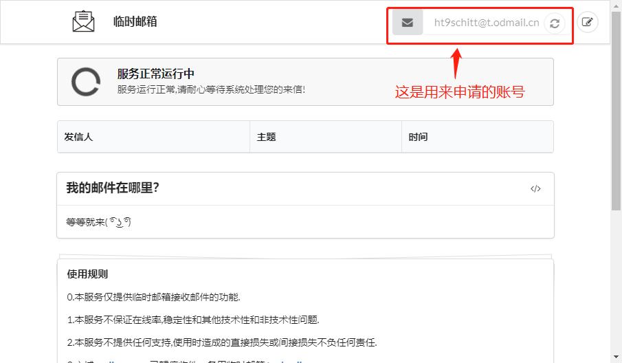

[临时教育邮箱](https://cdn.shawnlin.cn/blog/posts/onedrive/temp_edu_email.png)
注意事项: 保存好账号，记得不要关闭网址，下一步查收验证码还要用到

## 注册OneDrive账号

1.打开申请地址:  https://signup.microsoft.com/signup?sku=student, 填写刚才的临时教育邮箱，点击注册按钮
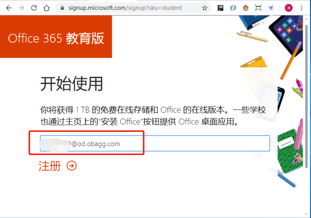

[注册](https://cdn.shawnlin.cn/blog/posts/onedrive/register.png)
2.点击注册按钮后, 跳转到设置用户名，密码，验证码的页面，输入临时邮箱中获取到的验证码，点击开始。
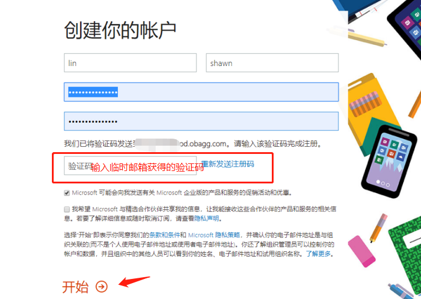
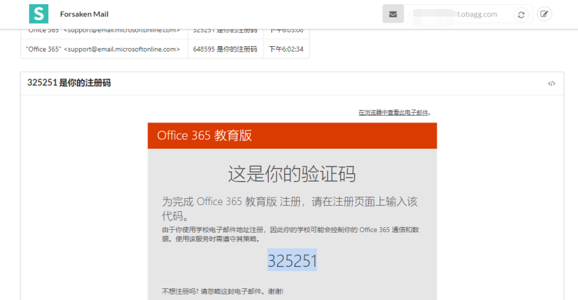

[验证码](https://cdn.shawnlin.cn/blog/posts/onedrive/verification_code.png)
3.点击开始后，会提示你邀请更多人，点击跳过
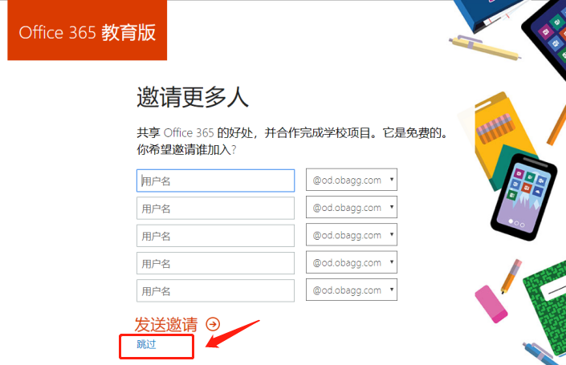

[跳过邀请](https://cdn.shawnlin.cn/blog/posts/onedrive/pass_invite.png)
4.点击跳过后，会进入到Office 365主页面，这个时候OneDrive会保持正在设置状态，等待它设置完成即可。

[等待设置完成](https://cdn.shawnlin.cn/blog/posts/onedrive/is_setting.png)
5.设置完成后，就可以通过网页上传文件，以及分享文件等
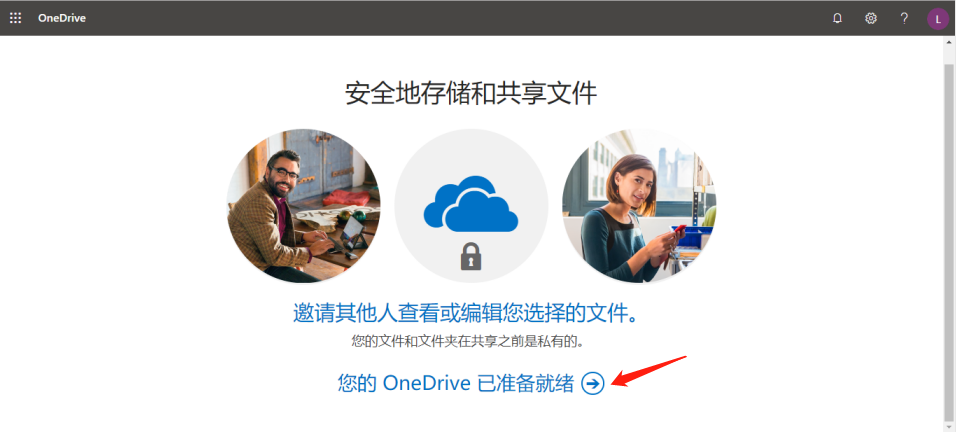

[OneDrive设置完成](https://cdn.shawnlin.cn/blog/posts/onedrive/onedrive_ok.png)
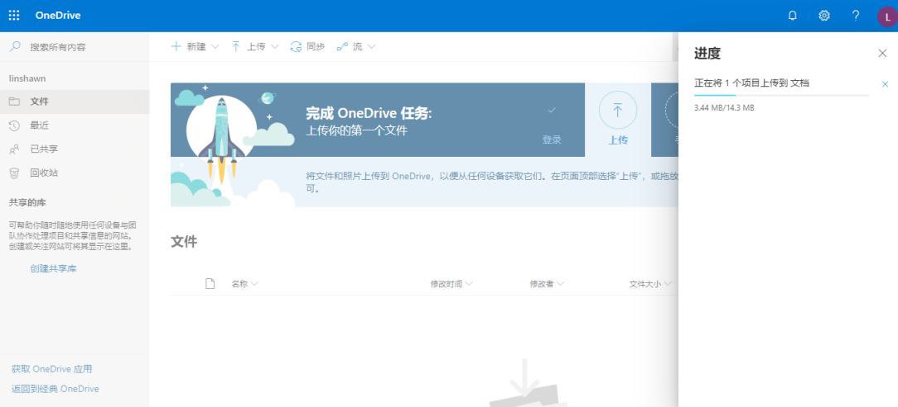

[上传第一个文件](https://cdn.shawnlin.cn/blog/posts/onedrive/upload.png)

## **RaiDrvie网盘映射**

RaiDrive是一款可以将OneDrive映射到本地的工具，使用它，我们就可以像使用本地磁盘一样方便了。

### **官网下载**

官方下载地址: https://www.raidrive.com/Download

### **添加映射**

1.右上角点击Add按钮
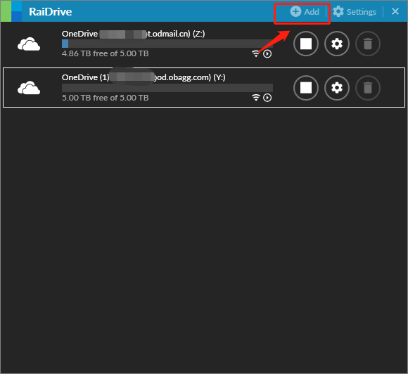
2.选择OneDrive后，点击OK
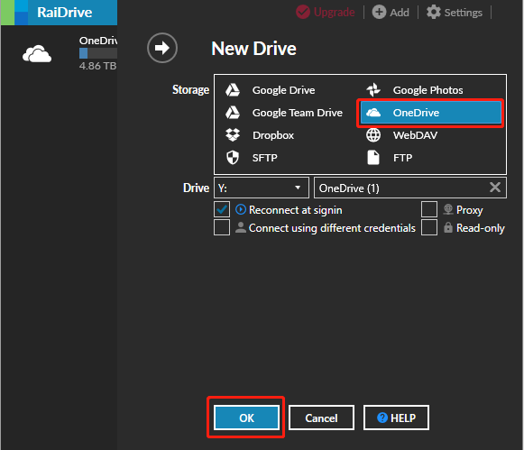
3.输入OneDrive账号密码后, 点击Accept按钮
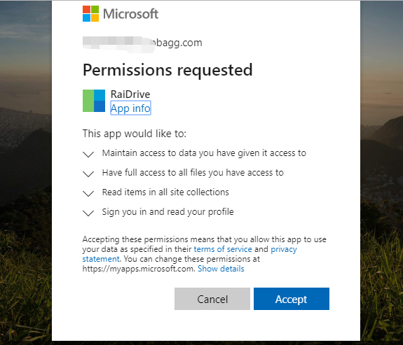
4.映射成功
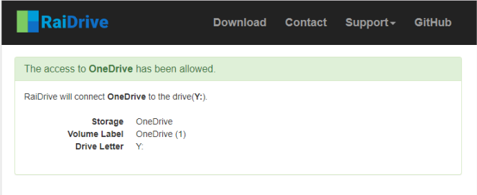

### 打开我的电脑，即可操作网盘

Windows用户打开我的电脑/此电脑，即可在网络位置看到我们刚才映射成功的网盘，之后就可以像操作本地磁盘一样方便的管理文件了
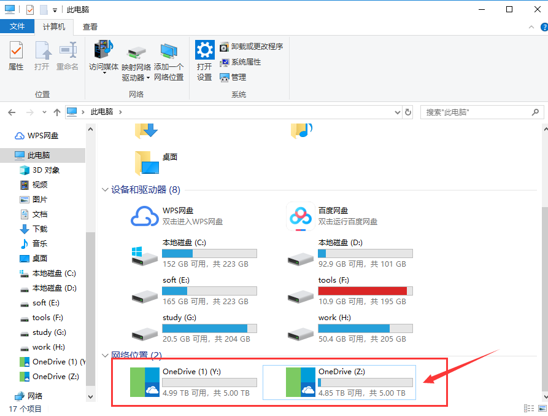