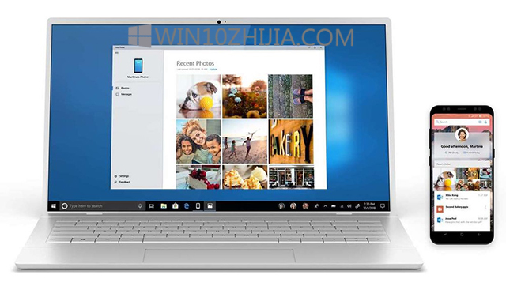
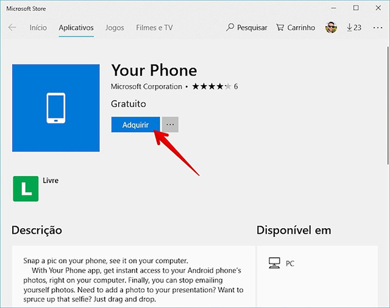
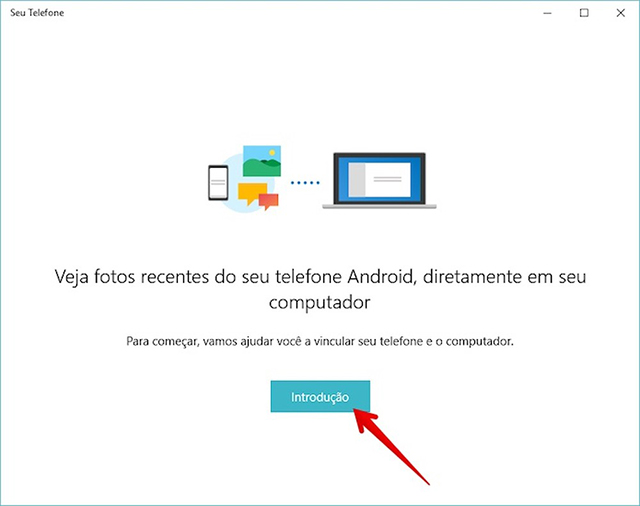
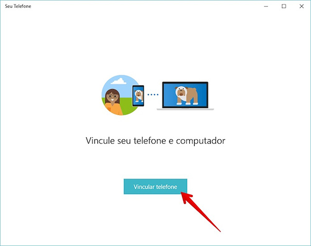
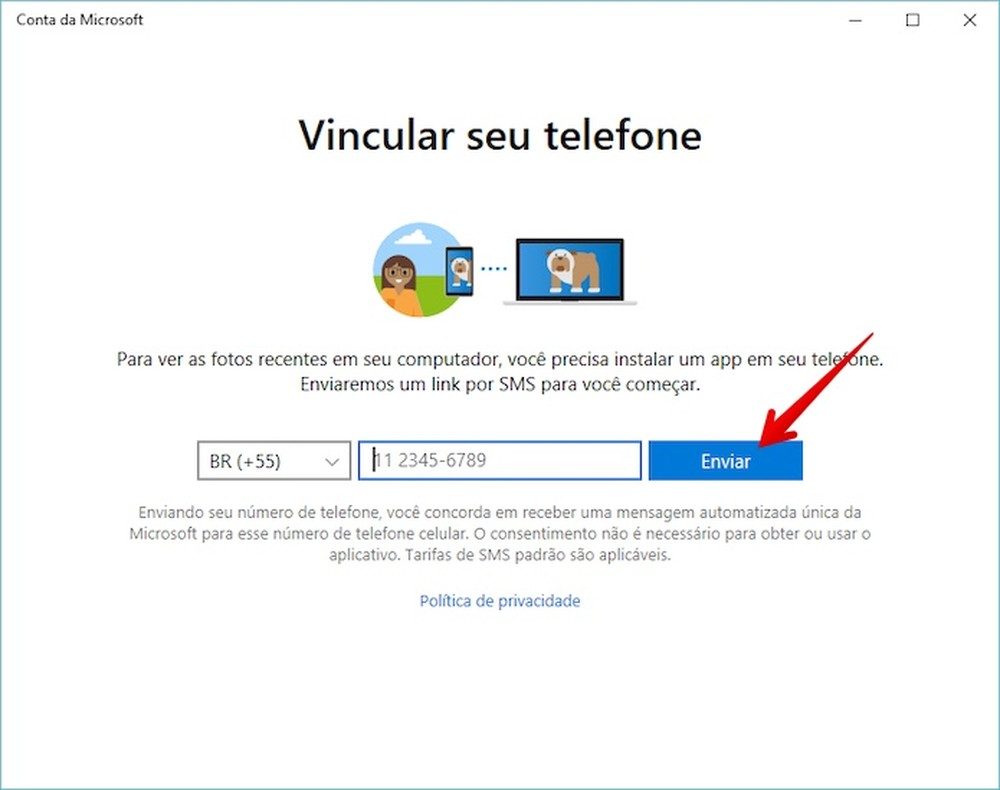
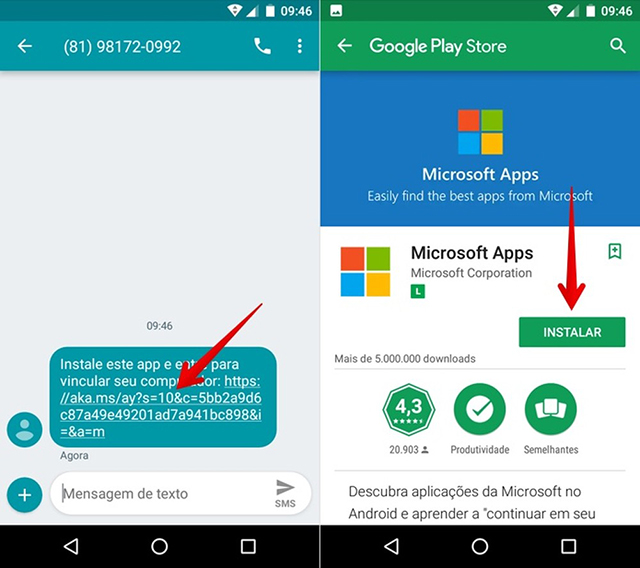
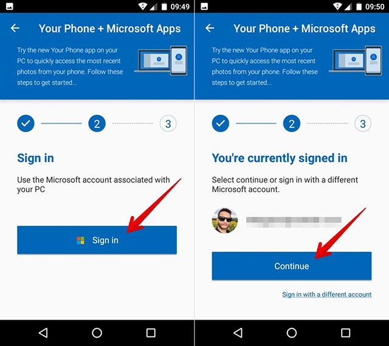
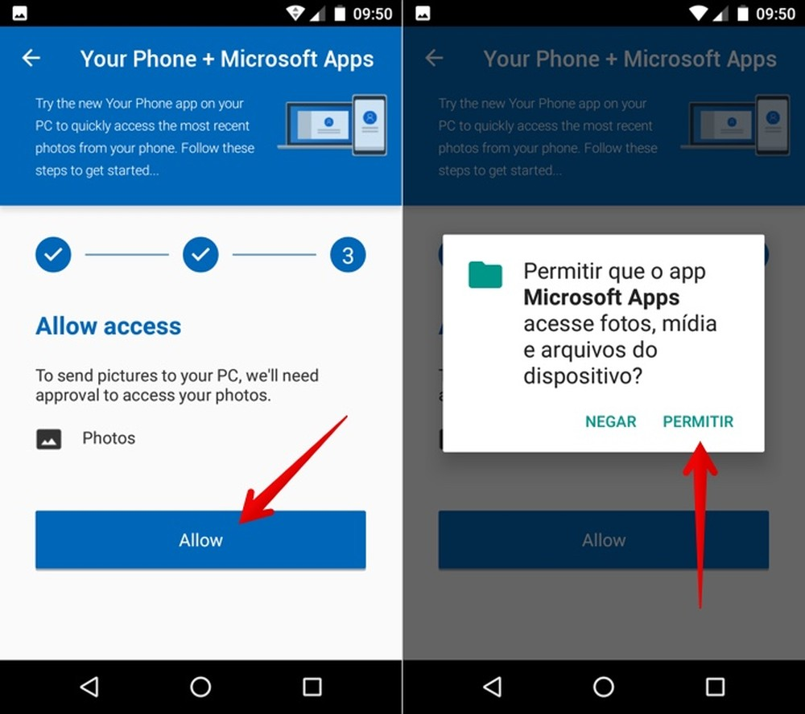
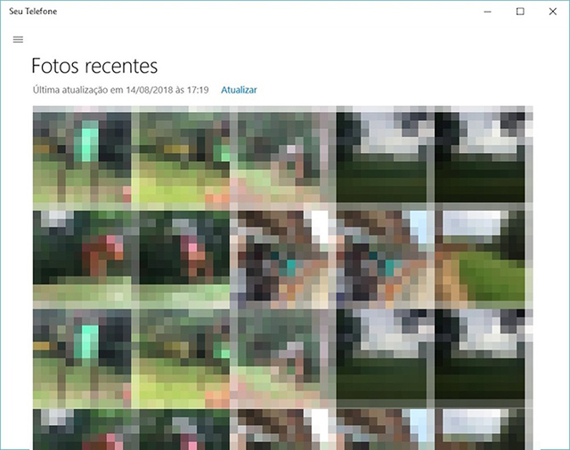

您的手机是新的Microsoft应用程序，可以轻松地在手机和PC之间同步内容。仍处于测试阶段，该工具最初支持Android并仅传输用户的照片。 该应用程序很快就会获得对iPhone（iOS）和同步通知和短信的支持。

在以下教程中，了解如何安装和配置Your Phone应用程序以将Android手机中的照片同步到PC。 该工具仅与运行7.0版Nougat或更高版本的设备兼容。 在您的计算机上，您必须拥有[Win10](http://www.ghost580.com/) April 2018 Update或更高版本。

让[Win10](http://www.ghost580.com/) PC更快的7个技巧

想购买手机，电视等折扣产品吗？ 比较TechTudo

步骤1.转到Your Phone应用程序的下载页面（microsoft.com/en-GB/p/your-phone/9nmpj99vjbwv）。 在Microsoft应用程序商店中，选择“获取”选项并等待安装;

步骤2.安装完成后，在PC上打开Your Phone应用程序并选择“简介”;

步骤3.然后按“链接电话”;

步骤4.现在，使用DDD输入您的电话号码并确认“发送”;

步骤5.在您的手机上，点击SMS收到的链接。 Google Play将会开启。 在其中，点击“安装”并等待下载Microsoft应用程序;

步骤6.安装完成后，打开Microsoft应用程序，然后点击“开始使用”。 如果您参与Microsoft Windows Insider计划，请在下一个屏幕上点击“我已经是内部人员”。 如果没有，请成为一个，然后返回此步骤继续;

步骤7.点击“登录”并登录到您的Microsoft帐户 - 与Windows 10 PC上使用的帐户相同。然后点击“继续”;

步骤8.最后，点击“允许”，让应用访问您的照片;

步骤9.设置完成后，打开PC上的Your Phone应用程序以访问手机上的照片。

准备好了！ 享受使用新的Microsoft Phone应用程序将Android手机中的照片同步到PC的提示。

**关注[win10](http://www.ghost580.com/),Windows10，锁定[（http://www.ghost580.com/windows10/）](http://www.ghost580.com/windows10/)、[Win10之家官网](http://www.ghost580.com/)**