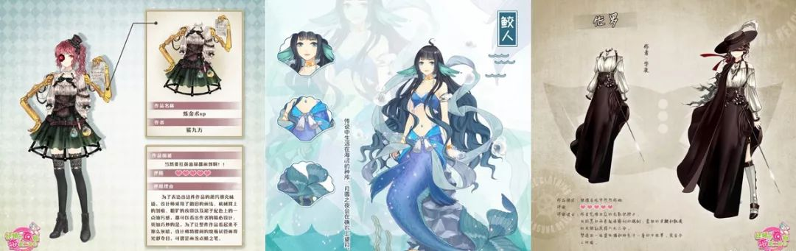
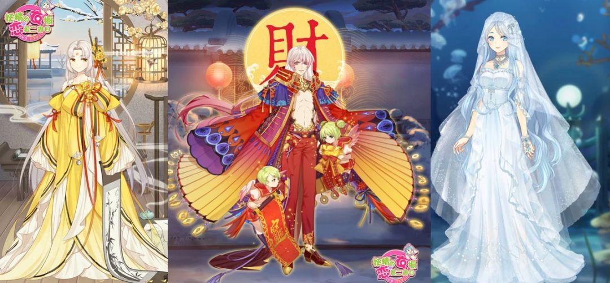

# 「以太猫」不是区块链游戏，这些才是
互联网史上，平台或技术革新时，新风向变动总是从游戏开始的。
文 | Mandy王梦蝶、彬萌
基于用户社群、虚拟商品交易、代币结算等游戏世界本来就存在的东西，“游戏会是区块链应用率先落地的场景”这种说法不绝于耳。
虽然观点横飞、文章众多，我们发现，鲜少有人讲清楚，究竟什么是区块链+游戏，以及这个被打上未来世界标签的游戏幻境，应该长什么样，如何着手搭建。因此我们希望系统地梳理，并输出有判断性的行业观点，供大家参考。
基于此，36氪采访了多位资深游戏从业者。面对区块链的滚滚车轮，有的人蓄力All in，有的人暂且观望，不过有趣的是，在深度探讨后我们发现，开发者们的观点，惊人的一致。
定义区块链游戏
首先，谈谈现状。
我们认为以太坊养猫，xx养狗养猪养大象此类，虽有游戏之名，并无游戏之实。
回归本质，游戏二字对应的是娱乐与体验，养猫这类应用既没有玩的环节，也没有互动体验，你家猫连旅行和吃喝拉撒都不会。
说到底，它是轻博彩的产品，底层是金融逻辑。卡通形象只是给数字资产镶上一层花边，获客逻辑是“薅羊毛”的投机心理，这跟现实世界中游戏玩家追求快感体验，是两种驱动力。
趋利的逻辑无可厚非，作为大生态低成本的获客入口也非常成功，但游戏终归是游戏，所以我们今天想去聚焦的，是有娱乐属性、有游戏价值，真正的区块链+游戏，或者说是下一个世代的游戏形态。
刨除所有神学和形而上的包装，区块链是一种技术。游戏可以建立在已知底层的基础上，是一个Dapp或者Dgame；也可以从零开始，搭建一条全新底层，为开发者提供开放平台。
在此，我们可以定义一下，前者叫区块链游戏，后者叫游戏区块链。
我们先说第一种，区块链游戏。
追着热点，市面上已经出现了第一批区块链应游戏，基于外挂、限量道具超发、场外与跨服交易的安全性等大型游戏长期存在的问题，虚拟资产交易平台成为了游戏+区块链的“创业小风口”。
首先无可否认，现成的用户社群、平台、渠道，确实是高效启动的红利。但是，我们要一个问题： 购买、持有、使用Token一件有门槛的事，游戏用户有意愿这么做吗？
这个问题的背后是：“安全买卖大宝剑”这个“痛点”够痛吗，有痛到用户去花费很高的学习和时间成本用Token吗？你是在基于需求改造项目，还是在生搬硬套，为链而链？
36氪认为：
一款大型游戏无需区块链已是全民爆款，证明它不需要区块链化，如果有人说要做“区块链版王者荣耀”，极大可能是伪概念（但Kill time的小游戏讲的就是另外一个故事了）。
基于区块链的不可篡改+智能合约，游戏生态中版权+交易是一个讲得通且可以快速上链的领域。但是，这只是游戏中的部分环节罢了，对于核心玩家，游戏体验的重要程度远大于交易安全性。因此，本质上，基于现有游戏的虚拟商品交易项目与游戏核心场景割裂，并非生态，前途堪忧。
而如果从头开始，打造一款新的“xx世界”，以Token获客，我们就又要回到前文的问题：投机者和游戏者的驱动力不同，Token持有者能转化为游戏用户吗？
所以，在原有基础上生硬地修修补补，局部改造适应区块链，意义不大，价值也不大。
那么，怎么搭建完整的场景和生态？已经存在的游戏或游戏类型有没有适合被区块链改造的呢？
有。
首先博彩类不在我们今天讨论的范围，带有博彩心理的棋牌类也先按下不表。我们认为有先决机会和用户基础的是养成、经营类，往"大"了说是虚拟世界、第二人生类。
例如36氪曾报道的UGC虚拟物品交易平台妖精购物街（PXC），妖精购物街的非区块链产品已经有2万多设计师+300万玩家用户，且用户90%是女性。核心玩法是玩家在虚拟世界开店，去设计师事务所挑选购买全球设计师上传的稿件，并“生产”服装、经营店铺。
从用户端看，一是女性都有“开店”梦和对自己品味的谜之自信；二是其本质还是流量生意，用户可能会挑到知名设计师爆款，或是通过连锁开店玩得越来越欢乐。
妖精购物街创始人黄俊也表示：有经济流转就有人赚钱，但“玩”是最基础的，赚钱是bonus。
基于这个逻辑，区块链的应用能解决妖精购物街的真实痛点：一是抄袭问题，不可篡改能用于确权，社区审稿或举报可以获得奖励；二是设计师内容评级，每个设计师都会觉得自己是最棒的，采用有奖励的社区用户评级更公平也更高效；三是智能合约的交易结算环节可以保障设计师收入，在现实世界中，因为层层抽成和甲方盘剥，设计师只能拿到不稳定的10%返佣。
所以，一个区块链游戏的存在基础的是：游戏本身合理好玩+区块链解决了游戏过程中存在的“核心痛点”。这样你才有可能教育用户使用Token，和将生态延续下去。

同时我们看到，虽然很多区块链游戏应用暂时做不到去中心化，但能解决去中间化。
在一个良性生态中，无论是游戏本身的开发者还是游戏内的道具、虚拟物品创作者都能够直接与用户接触，社区的贡献者和使用者之间本身的环节是可以淘汰的。
这虽然不是生产关系的颠覆，至少是生产关系的进步。
延伸到现在最受关注的“虚拟世界”，玩法上对标所有Second Life类游戏，逻辑上仍然是虚拟资产交易。
但是，现实的镜像故事是不是听上去不够“性感”？
我们可以试着代入一下《时间规划局》这一电影，假设每个人存在的价值=时间资产=手腕上的一串数字=通过work of time换得，付出劳动赚取数字资产，资产清零你就Game Over，这是不是特别契合区块链世界的生产关系？
是不是也想起《黑镜》的些许情节？在科幻片里的未来世界来临之前，区块链游戏的世界中，是不是可以先构建出一个充满魔幻现实色彩的未来呢？

讲到这我们就要开始说第二种了，游戏区块链。
这可能是游戏的未来形态，也是让所有游戏开发者兴奋摩拳擦掌的原因——在商业世界折叠的一刻，或许，他们可以做出一款有时代烙印、被世人记住的游戏，或许他们能够抓住机会、颠覆大厂格局。
人们总是在讨论以太坊弄几只猫就拥堵了，这是技术问题。技术固然是问题，但从根本上说，以太坊本来就不是给跑游戏设计的。那么，是不是有人有技术能力设计媲美网络游戏实时性、容纳游戏访问量需求的底层呢？
会有。虽然还没有成熟的底层，也已经有从业者在开发的路上。
例如上市公司壹桥股份的全资子公司壕鑫互联将于最近推出了“区块链电竞加速云”壕鑫竞斗云。壕鑫互联董事总经理冯文杰向36氪表示，壕鑫互联想做的是从区块链的硬件、到自行研发更适合跑游戏的链路，到开放sdk、为游戏开发者提供体层，最终建立完整的区块链生态。
底层技术的完全落地听上去还有些遥远，但是其实“开放式”的游戏平台和游戏生态概念并不新鲜。
什么是开放的平台？我们可以对标Taptap或WeGame，开发者可以自己生产、自己上传、自己分发。
对传统游戏生态了然于胸的大佬们自然不会放弃基础建设的肥沃土壤。Game.com（GTC）就是一个在区块链世界中搭建小游戏生态平台的玩家。

徐乐告诉36氪，Game.com要做的是一个完全免费+完全开放的生态平台，不过在此之前，平台方要承担好游戏研发者的角色，开发出爆款内容引爆用户。
36氪认为：TapTap的逻辑，快手的玩法，在去中间化的生态中增加社交性的玩法，这是区块链对游戏生态平台的赋能。
什么是开放生态的游戏？我们可以对标沙盒游戏《我的世界》（Minecraft），提供基础模块，没有关卡、没有复杂规则、玩家可以体会造物主快感。
当然以上只是类比，毕竟，传统游戏没有区块链的不可篡改+智能合约+Token激励。
在这里我们想说的是，很多理念和想法在游戏世界里早就有了，区块链能够提供的，是良性的生态基石。
更关键的是，在这个既付出了真情实感，又付出了真金白银的游戏世界里，有流动性和实际价值的Token大大提高了游戏玩家的迁移成本，赋予了游戏本身源源不断的生命力。
在这个美好的故事里，头部玩家有致富机会，普通玩家也不会两手空空。
此外，游戏玩家是需要画面感和冲击力的，区块链技术带来的变革与过去的技术迭代、设备革新不同，不是画面致胜，也不是玩法颠覆。开发者要做的是设计游戏规则、建立共识机制，只搭建底层，不限制玩法和套路，不预设剧情和关卡，一切都是玩家创造。
游戏区块链最终也是最大的想象，是无开发、无运营、甚至无服务器的完全开放平台。
有意思的是，区块链的理念和架构本来就像一个大型的虚拟游戏，如果在理想的开放生态中，社区中的一切都可以自我优化，区块产生、工作得到证明、交易付出费用，这就是一个永动的游戏。
那么在这个永动的生态里做一款游戏，它是不是也能够永动下去呢？
实际上，平台或技术革新时，第一波红利总是从游戏开始的。毕竟，游戏是让行业裂变和下沉的最好的场景，也是硬件和底层升级的助推器。
更重要的是，娱乐至死是趋利的终极目标，也是人性的本能。
在放大人性的区块链世界里，本来就利用人性的游戏，一定会跑得很快。
最后，从游戏行业历史变迁的角度，36氪想分享几段从业者的话
“早年我们做手游，还是塞班系统、有键盘的时代。后来乔布斯搞了个大屏幕没键盘，懵圈了，大家都在琢磨怎么把游戏搬到苹果上，有人做个模拟的上下左右键，全军覆没，然后来了一个愤怒的小鸟，来了一个捕鱼达人。
捕鱼达人在游戏机厅已经有了，我们为啥看不到这个机会？因为都在盯着传统游戏的模式。
在游戏的世界里，最重要的永远是，打破固有思维。”
“现在中美有7亿玩家，王者荣耀有3亿玩家，已是大众群体。持加密货币的人3000万人，活跃交易的才1000万人，反倒是小众群体。
如果用加密货币玩游戏，还能自由交易游戏数字资产，我们有理由相信游戏可以承担加密货币推广大使的身份。”
特别鸣谢：创世资本CEO丰驰、晨鑫科技董事总经理冯文杰、妖精购物街创始人黄俊、Game.com创始人徐乐、游戏蛮牛CEO崇幕、高手互娱CEO段彬...及各位不愿透露姓名的大佬们。

