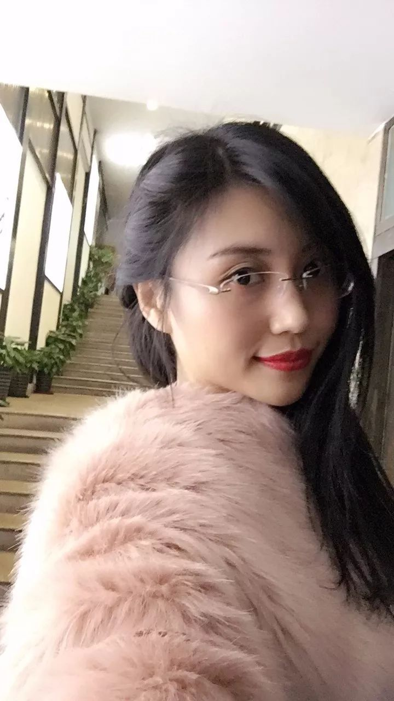
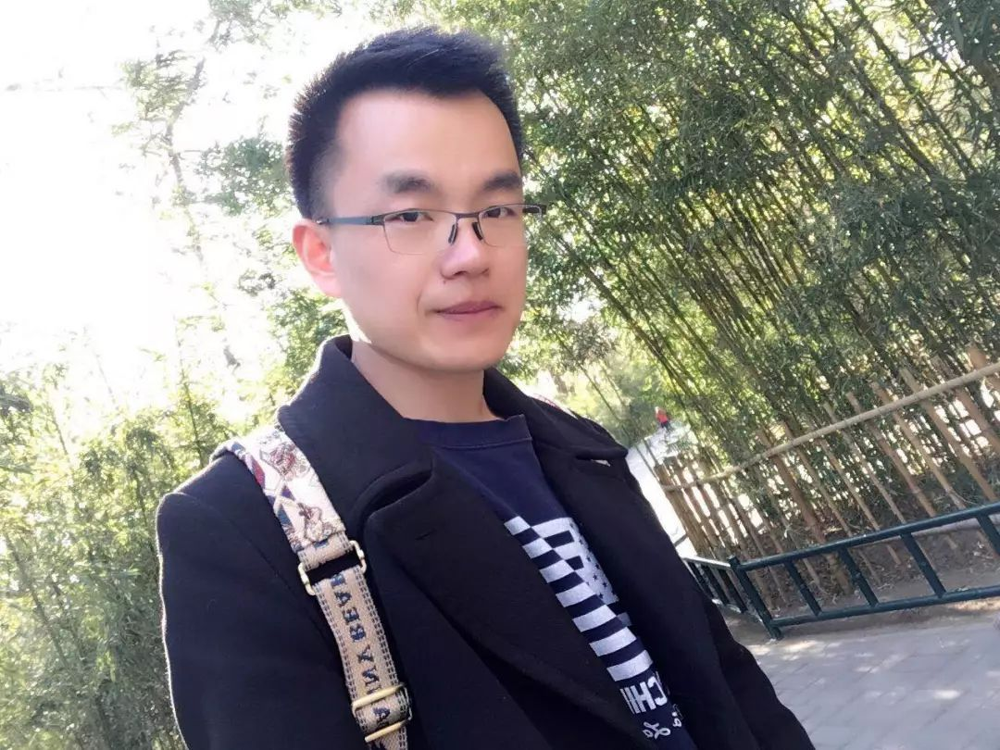
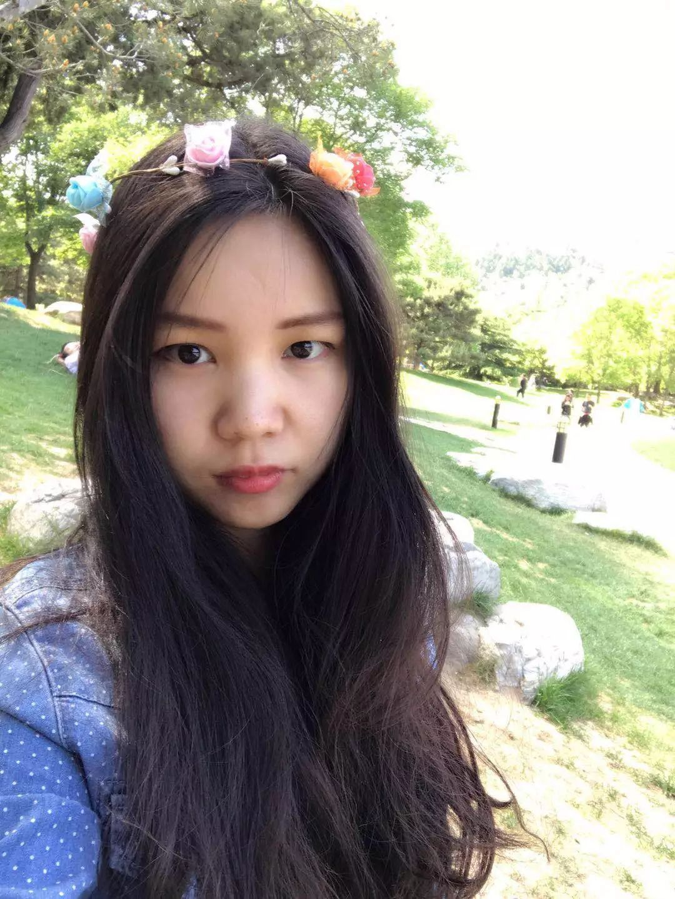
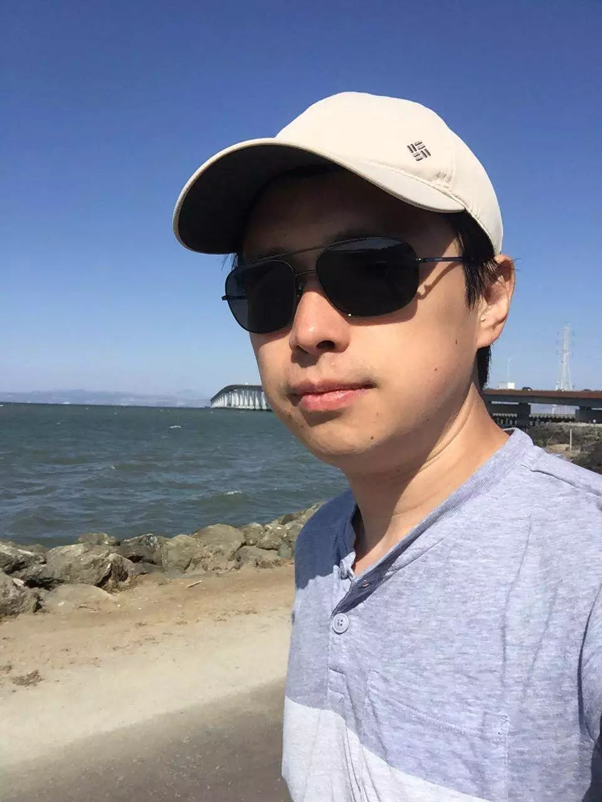
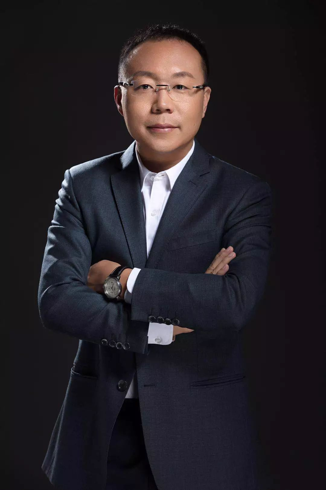

# 与其迷信区块链神教当个韭菜，不如自己来做个决定

2018-03-01 22:32

所有新东西出来时，都会泡沫翻飞，但这也意味着，在新东西面前，人们之间的认知差距也是平的，而非不可跨越的一道鸿沟。

**整理 | 开氪君**

你好，我是开氪君。

刚刚过去的春节假期，“3点钟无眠区块链”微信群拉动起来又一波区块链狂烧。这个号称“1万亿市值社群”，扎堆了创投圈、科技圈、娱乐圈等诸多你叫得上来的名字，从初二开始每日激辩区块链。

大佬们的发言满屏蹿，可到底该怎么看这个“3点钟无眠区块链”群，以及它所引发的所谓区块链焦虑？

开氪君的看法是，与其迷信3点钟，还不如自己去做个决定，到底相不相信区块链。

**做决定的前提是花点功夫去了解。**

从媒体人转型投资人的张泉灵说，最近两年她的思维模式最大的变化是，作为媒体人，她原来说的最多一句话就是“No，我不这么看”“Yes，but”，而今天，她会这么看问题“Yes，and”，她相信，存在即合理，出现必有因。

所有新东西出来时，都会泡沫翻飞，但这也意味着，在新东西面前，人们之间的认知差距也是平的，而非不可跨越的一道鸿沟。

试试以开放的心态来触碰它。没准你就能有机会走在前头。

**话说春节前的2月6日，36氪举办了一场“区块链闭门名师会”上，四位业内导师携手，给出了他多年研究或实践区块链的真知灼见。**参加了现场活动的小伙伴们都有什么收获呢？他们其中的6位，跟开氪君聊了聊他们听完之后的Aha moment。

愿你也能发现属于你的Aha moment。

**@田青青**

**云南青七活态生物科技有限公司、四川双辉医药有限公司法人、总经理**

**“公司就是价值溢出让生存的时间更长。”**

我从事的是中医药行业经营创新的冻干中药“青七”。现在“区块链”这个概念各个行业和媒体都在关注，由于我大学专业是电子商务，互联网行业的朋友推荐我去听了36氪的《区块链闭门名师会》课。

我觉得区块链作为一个新事物，很多人对它有很多误解，老师们的观点纠正了我们很多错误的理解。

虽然我完全是外行，但孙纯宇老师把我们自己理解不了的问题讲通透了，沟通关键一定是深入浅出的。

**印象最深的是曲明老师说：区块链解决的是信用问题。这一言击中了事物的本质****。而且IMI“零跑腿”的项目落地与政府合作这件事的方向做的是很准确的，能创造巨大的社会价值。曲明老师是非常值得敬佩的企业家！**

王彬生老师讲到了比特币价格波动的问题。对于很多投资眼光看待区块链的听众会有很多启发。“合理比合法重要”这样的金句简直适合所有的行业。

张磊老师逆向思考问题的方式是非常理智的。区块链现在太热，但区块链也太新，有很多不完善的地方，潜伏着很多风险。他还提到一句话：“公司就是价值溢出让生存的时间更长。” 这让我深刻的反省了自己的行业、公司生存状况和存在价值，这些都是非常宝贵的收获。

对我最大的帮助是提供了看待事物的方法：要看到机会，也要关注风险；关注未来，也要参与实践。

**@郝胜涛**

**北京好课多教育科技有限公司 大客户经理**

**“从炒币变成了一种对技术的坚信”**

我是从事互联网教育领域的，公司老大开会时提起之前同事有了一个虚拟货币，之后就财务自由了。这引起了我和同事的兴趣。

在上课之前，我对虚拟货币、区块链技术这方面懵懵懂懂，听课后对区块链的来龙去脉以及日后发展认识更清晰了：主要是专业方面的知识的了解让我从炒币变成了一种对技术的坚信。

**对我的影响主要两方面：一方面让我坚定地拥有比特币，另一方面在工作上也是在研讨能不能将区块链等技术运用到教育方面，解决当前互联网解决不了的问题。**

因为当前教育行业有个很大特点就是预收费模式。这种模式会让机构有一个很好的现金流，但同时，对客户来说有很大的跑路风险的问题，还有在培育孩子的成长方面的一些问题区块链都能更好地解决。

**@孔德云**

**36氪研究院研究员**

**“这一段演讲让我悟出了token现阶段最重要的事情是做好生态”**

孙纯宇老师对比较基础的概念，比如挖矿、矿石等讲了一些从基础到深入的内容。第二个曲明老师讲的主要是项目，从项目出发，做公共关系的成分比较多。王彬生老师讲了很多更高维度的事情，从生产关系、生产力解放的维度对在场的人有一种开化明智的作用，**不止是从技术上理解区块链，或者是从项目的角度理解，而是从区块链本质以及他与创业关系的构成，是最值得推荐的。**

之前我对区块链的很多认识一直处于混沌状态。在对生产关系重塑这块，王彬生老师把我点醒了，给我很多启发。

讲到token的出现让每个人都参与进来，股份制公司消失，每个人都成为独立的人，我们不在是被压榨而是成为了资本的拥有者。这一段演讲让我悟出了token现阶段最重要的事情是做好生态，这就是对我最大的启发。

**@张程玮**

**某科技公司创始人**

**“不要期待用区块链去改变世界上任何的东西”**

我专注于公共卫生服务行业，觉得为区块链的出现是互联网的一个升级，而从事公共卫生服务行业的创业者们算跟互联网也存在着交集，所以非常关注互联网出现的这些新兴技术。

36氪区块链名师闭门会上导师们讲授的内容十分真诚，没有官话套话，这点其实很难得。闭门会的导师们精于各个领域，讲授领域全面。本次区块链名师闭门会，帮助我重新梳理了区块链的核心精神以及关于区块链的一些专业名词。在空余时间里，我会通过看书翻阅一些文章来了解区块链，但书中读到的一些知识与线下闭门会活动相比显得不是那么集中，而闭门会恰好起到了汇集领域专业知识的作用。

**我印象最深刻的前百度安全总经理张磊。他们当时结合的是跟非洲做金融汇款服务，实际上是基于原有的成熟线下产业的基础，通过区块链让效率提高、成本优化。**

他说的有句话给我印象蛮深：一是不要期待用区块链去改变世界上任何的东西，二是去跟线下已经做的很成熟的行业结合，并且一定要跟这个线下最大的行业的第一名结合，这样才有机会胜出。

**@智少波**

**B20区块链爱好者联盟发起人，行业投资分析、项目孵化以及区块链优质项目投资，****《区块链闭门名师会》学员**

**“实操者，前瞻性”**

我是电商出身，在2016年初，一位做技术开发研究的朋友告诉我区块链一定是一个大未来。当时我便认为这确实是个机会，于是我同朋友来北京创业，发起了B20区块链爱好者联盟。在区块链闭门名师会中我收获很大，首先四位老师讲述都来自不同的角度，具有一定的前瞻性。从宏观上来说，老师们都是实操者，讲得都是干货。其次，36氪一贯风格就是在选择行业的时候态度有见地，不会随便请一些项目方来冲课程，态度很严肃。

**@沈阿姨**

**互联网公司的技术从业者**

**“对于入门的人是值得来听的”**

这些讲课老师相当不错。一般说来，这类分享会基本上至少有一半是水，如果水货太多我一般就走了。**但是那天每一个演讲者讲得都挺好、挺投入。**

他们确实是把自己对区块链的认知很完整地讲出来了。因为当时区块链还是挺敏感的，很多人都是遮遮掩掩的。没想到这些人讲得挺有真知灼见的，基本上都是干货，绝对物有所值。

中科院城市规划的曲明感觉比较学术。他对于区块链的落地应用，是思考的最多的一个老师。在城市市政管理上如何应用，比方身份证ID之类的内容都讲的比较多、比较透彻。而且他确实在深圳做了这件事情了，比如IMI货币等等。

王彬生比较风趣诙谐，人脉也比较广，是从政府角度看待这些问题的。另外他的想法确实非常前卫，包括他说虚拟货币是要替代基础货币的，将来就不用考虑虚拟货币对人民币升值还是贬值问题，而是应该考虑怎么把人民币换成区块链上的虚拟货币的问题。这种视角都是非常新颖的，一看就是老油条的感觉。

在区块链面前，你和大佬们之间的认知鸿沟是平的。你甚至还有机会，走在他们的前面。

**现在，开氪把闭门会上的四位老师从线下请到了线上，同时又邀请了另外四位业内大咖，打磨成线上专栏《狂热过后：升维解读区块链》，带你走出混沌，收获你的Aha moment。**

开氪专栏《狂热过后：升维解读区块链》将在3月初正式上线，原价**¥299**，限时优惠，仅售**¥199**。开氪正式邀请你，与八位行业大咖同行。

沉淀下来的信仰，才是能戳破泡沫的力量。[返回搜狐，查看更多](https://www.sohu.com/?strategyid=00001&spm=smpc.content.content.2.1583041349774vj5OzsY "点击进入搜狐首页")

声明：该文观点仅代表作者本人，搜狐号系信息发布平台，搜狐仅提供信息存储空间服务。

