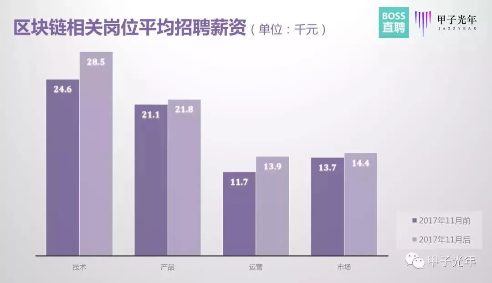
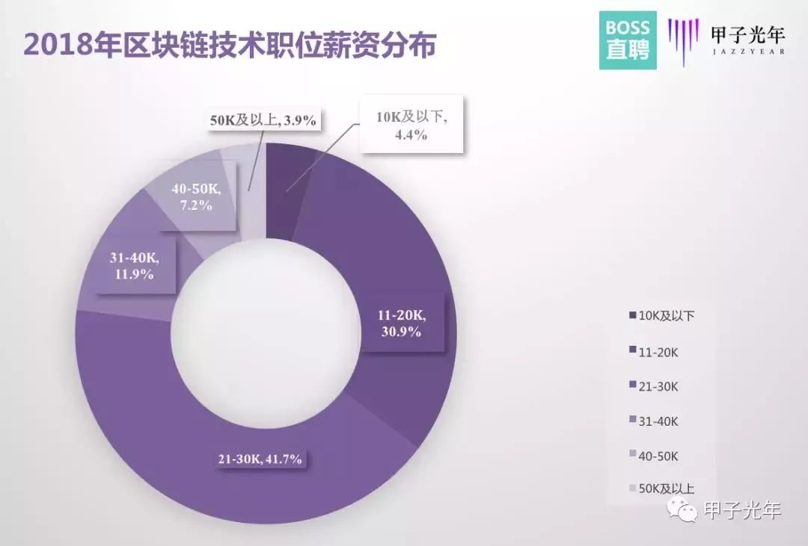
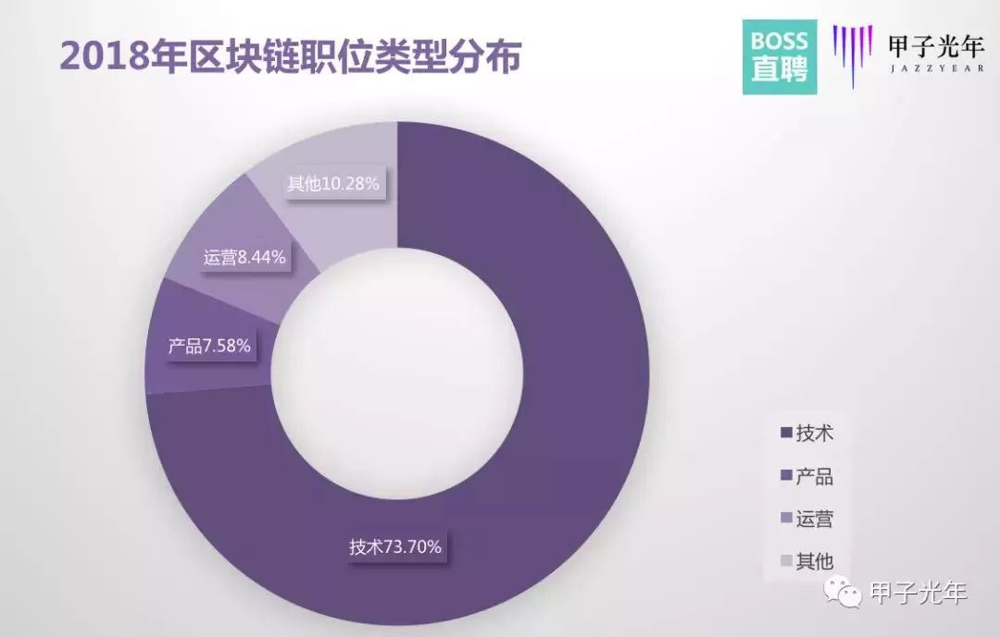
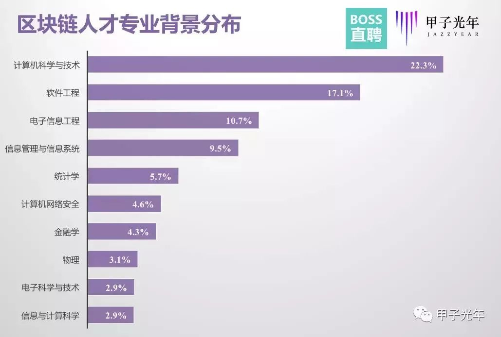

# 惊蛰之变：区块链人才大迁徙
一场没有国界、没有行业边界，横贯技术、资本、应用的人才大迁徙，正在台前与幕后同步上演。
犹如一场，惊蛰时期的雷雨。
2018年开头，冰火两重天。2月初，全球股市大跌，人们蓦然发现离上一场经济危机已过去十年，按周期律，“崩盘”预测不绝于耳；而另一边，加密数字货币和区块链热潮却一枝独秀，让许多急于补课的人度过了一个史上最繁忙春节。 
两极对比，一个“变”字迅速在人群中蔓延：VC、PE、FA、对冲基金、上市公司、学界、工业界的顶尖技术人员、政策制定者都牵涉其中。 
最早被搅动的是VC。从徐小平“不要外传”的“拥抱区块链革命”言论刷爆朋友圈，到红杉、IDG、丹华等顶尖投资机构频频出现在白皮书中，大批VC开始主动或被动地拥抱区块链，不少VC人士干脆自己跳出来做token fund。 
在学界，一些教授，甚至名校计算机系主任进入区块链，轻则做顾问，重则创始人。而年轻的博士们，更是兼职或辍学“跑步入场”。一个玩笑是：朝五道口华清嘉园丢一颗炸弹，北京链圈会瘫痪一半——那里聚集了大量清华博士、硕士、本科、休学者创立的区块链项目。 
工业界亦新闻不断。Twitter前运营和客户服务副总裁Tina Bhatnagar加入Coinbase；Uber联合创始人Garrett Camp发行了自己的数字加密货币；BAT等巨头也在布局区块链，从数据库、分布式系统等领域大力招徕人才。
政策层面，两会期间，贵阳、杭州、成都等多地政府表态“发展区块链”。据「甲子光年」了解，一些国家部委、地方经济部门已开始牵头组织区块链行业协会，或召开各类座谈，积极跟进行业动态。 
不过，与共享经济和AI等往年风口不同，当下这场人才向区块链领域的大转移，更像一次深夜里的夺宝行动：由于政策不明朗，舆论难形成共识，有人高调发声，也有人锦衣夜行，“闷声发大财”。据「甲子光年」了解，在人们已知道的名字之外，还有更多大公司、大人物、及大批量“互联网正规军”正屯兵积粮，潜水的人不可计数。 
一场没有国界、没有行业边界，横贯技术、资本、应用的人才大迁徙，正在台前与幕后同步上演。
白天上山，夜里上链 
VC和FA作为一级市场的资本玩家，是早期社区之外最先被区块链“震到的人”。 
2018年1月中旬，经过七个多小时的飞行，徐涛（化名）坐在了距离北京5253公里的某热带小岛。徐涛本是国内一家投行的资深财务顾问，这次来是参加老友婚礼，顺便在年前休闲一把。
但实际情况大大超出他的预想——“所有人都在谈论区块链”，赴宴的澳洲人和东南亚人硬生生把婚礼变成了一场“区块链峰会”，对人们注意力的侵蚀盖过新郎新娘。虽从去年开始，区块链之名已吹遍创投圈，但这是徐涛第一次切身感受到“shock”。
这场婚礼直接引发他重新审视人生方向。2月5日，徐涛正式入职一家区块链公司。他以火箭般的速度完成了求职、辞职、入职的全流程，一共只花了两个礼拜。
十天多天后，另一个人也经历了一场“区块链shock”。 
梁震宇（化名），国内一家一线投资机构创始人。2018年春节期间，他在日本某高端雪场酒店度假。
按惯例，白天上山滑雪，晚上温泉休闲；但今年，白天滑完雪后，以高端商务人士为主的酒店住客们丝毫无心睡眠，“一到晚上，酒店的人们都连到了一起”，主题还是区块链。
见过不少大风大浪的梁震宇，看到此情此景仍不免惊诧，“还是财富效应吧”，他拿出手机，开始找人给他推荐区块链专家。 
而在二级市场，一些证券分析师亦开始进入区块链领域。
3月1日，连续5年上榜新财富最佳分析师的兴业证券计算机互联网行业首席分析师袁煜明加入火币中国，担任区块链研究院院长。 
当日，袁煜明在朋友圈宣布了这个消息，并附上一篇自述。他提到，这在很多人看来这是一个受到争议的决定——当他把消息告诉团队时，好几人难以入眠，而友商则士气高涨：袁煜明终于转行了！ 
袁煜明是圈内公认的“金领”。按新财富上榜分析师的市价，500万年收入恐怕不在话下，若遇上牛市，甚至可能年入千万。 
袁煜明转行自有其逻辑，他心中对齐的，是他眼中“中国证券行业最成功的人”，刘炽平。 
2004年，身居高盛高位的刘炽平参与操作腾讯上市，发现其巨大潜力，毅然放弃千万年薪，加入饱受质疑的腾讯，终成企鹅帝国二号人物。一位老高盛告诉「甲子光年」，彼时，高盛内部的人，很多人都不敢对刘炽平说“恭喜你”，谁也看不懂，“都以为刘是被高盛fire的”。 
“保持敏锐，发现潜力股，投身其中”，这是袁煜明从刘炽平身上学到的择业准则，而现在，他看到的最大潜力股正是区块链——他愿意为此堵上自己未来十年的职业生涯。
“迁徙者”众。“基金今年会更难募，整体去杠杆，加上数字货币的拦腰一刀……我估计现在没有基金不考虑币和链的问题。”某一线VC创始合伙人告诉「甲子光年」。 
于是，一种进场方式是，在加密数字货币世界复刻一套现有金融市场的玩法。 
目前如火如荼的token fund（数字货币基金）是对“古典VC”的复刻，具体玩法是，募集数字货币或法币，再用数字货币投区块链项目。相比传统基金，这是一个高风险、高回报，最关键的是，退出周期大大缩短的新战场。 
早在去年8月，全球著名风投德丰杰的中国基金德丰杰龙脉就募完了法币的token fund和以太坊token fund，总规模约5亿人民币。此前投资互联网领域，后转投区块链的天使投资人王利杰今年一月透露，“过去一个月赚的钱比过去七年还多”。
对冲基金的玩法则可以直接搬到加密数字货币市场。「甲子光年」今年初碰到一个熟识的传统对冲基金经理，问他有关注区块链吗？对方答“我们都赚了小半年了”。去年年底，银行业巨头摩根士丹利估计，2017年对冲基金在加密数字货币上的投资已超过了20亿美元。
除了以朱啸虎为代表的极端反对派，焦虑中的投资圈可大致分为两类：“主动拥抱派”和“被动拥抱派”。 他们拥抱区块链的道理本质很简单：“投资”作为一个行业，唯一KPI就是回报率。 
“主动拥抱派”如美国对冲基金经理兼风险投资家Bart Stephens所说：“我们实际上就是使用区块链技术来颠覆自己。这个过程多少会有些令人担忧，但如果我们不做，总有人会行动。”
“被动拥抱派”则是因为竞争激烈，传统方式“募不到资、赚不到钱”。据清科研究中心2017年数据，中国VC/PE机构管理资金总量已超过7万亿元，在中国证券投资基金业协会备案的基金管理人约1万余家。而目前的1万多家VC中，有许多是近两年成立的——他们还没有进入第一轮退出期，没有真正经历市场的考验。 
发展到现在，一些投资机构、特别是一级VC已效率很低——这极有可能是以“改变生产关系”为核心的区块链技术要攻破的第一片疆域。一些人的观点是：区块链技术即将真正实现“人人皆VC”和“民主化投资”。
钱是不差的，人从哪儿来？ 
投资圈的入场和ICO的火爆，保证了区块链行业一定时间内的“粮草供给”，进一步促进了做项目的技术人员入场。
但真正有顶尖技术的人总是稀缺的，目前行业内最大的问题是：钱是不差的，人从哪里来？
一个明显的趋势是，怀有技术的年轻精英毕业生正在青睐区块链行业。 
今年一月，硅谷某头部自动驾驶公司人士向「甲子光年」透露：今年清华姚班的人不好招了，因为一些人跑去做区块链了。 
造成“人才迁徙”的最直接原因是：这个行业的确回报诱人。一位矿机公司的HR就在朋友圈感叹：“不断有人离职，没办法，员工工作一段时间就财务自由了，我们也留不住。” 
一位链圈投资人向「甲子光年」透露，在ICO热潮爆发前，中国一家区块链底层技术开发公司曾长期用token发工资。开始是按一毛=1token，锚定法币价值来发，后来是按1块=1token。 
该项目的token在2017年涨到了大几百人民币。前两年入职公司，并屯了较多token的员工已获得数千倍收益，和同一时期入职BAT的程序员相比，这些工程师并不一定是最顶尖的，但现在已经财务自由。就连该项目中的一位HR，也因为手握token，获得了近千万资产。
根据BOSS直聘研究院独家提供给「甲子光年」的数据：2017年11月，区块链领域职位需求发生爆发，比去年同期增长了9.7倍，而同一时期的供给同比增长只有2.3倍，截至2018年2月，专业区块链技术人才供需比仅为0.15，严重的供小于求刺激薪资持续上升。

柱状图标识的值为需求占比，即把2016年6月到2018年2月的所有区块链招聘岗位需求作为分母，个月需求在总需求中的百分比。 
在2017年11月前，技术相关岗位的平均招聘薪资为2.32万元； 11月后，区块链相关岗位的平均招聘薪资达到2.58万元。

虽然绝对值上涨幅不大，但BOSS直聘研究院院长常濛告诉「甲子光年」：3个月内一个岗位的平均薪资如果涨幅超过10%是非常巨大的变化。这3个月期间，区块链岗位的薪酬中位值的涨幅达到14%，最高值涨幅达到108%。

从薪资分布来看，月薪在2万到3万区间的职位占到4成，四分之一的职位超过月薪4万，月薪10万及以上的职位占总体的4.4%。 
如今，即使“无意上车”的暴富案例已无法复制，但手握“技术船票”又愿意冒险的人仍在陆续登上区块链这艘飞船，其中不乏名校博士辍学投身区块链。

在目前区块链行业的人才需求中，技术人才占比最高超过7成，其次为产品和运营。
区块链游戏项目“哈希世界”CEO贾英昊就是一个例子。 
2015年，贾英昊直博进入清华工业工程系。博一暑假，在前往硅谷一家风投公司实习后，他开始对该领域密切关注。2017年12月，贾英昊休学allin区块链，创办“哈希世界”，不到1个半月，已完成三轮融资（第三轮交割尚未完成）。
同样在今年，清华计算机系研究机器学习方向直博学生周峰（化名）也选择休学，目前担任一家区块链公司的CTO。他向「甲子光年」透露，他们正从某头部自动驾驶公司挖一个“姚班”学生，以支持公司一项“秘密计划”。

超过80%的区块链相关职位对求职者的技能要求在3项及以上；技术类人才除了需掌握常用开发语言外（C++,Java,Go），还需要对密码学、共识算法、超级账本、智能合约等有足够了解。

区块链人才的专业背景一计算机相关学科为主。
在技术人员之外，“制度设计者”也是行业急需的，而且更难寻找。区块链的信仰者认为，与蒸汽机、计算机、人工智能等技术驱动力不同，区块链的最大价值不是提高生产力，而是变革生产关系。它可以类比1978年诞生于安徽省凤阳县小岗村的“家庭联产承包责任制”——在原有生产环境不变的条件下，通过改变生产机制，撬动生产力的大量释放。
“最缺的其实不是技术人才（技术长期都缺），而是深刻理解区块链技术又能洞察人性的人。从岗位职能来看，更接近于产品经理和架构设计者。”一位区块链公司CEO告诉「甲子光年」。
松禾远望资本合伙人田鸿飞在转做投资前曾在硅谷从事区块链相关工作，他告诉「甲子光年」，国内的区块链项目尤其缺少懂技术的机制设计者：“在硅谷，绝大多数设计产品的人都是技术、工程背景，对技术吃水很深，创造性更强。而国内，设计模式的人可以略懂技术就直接上岗。”
“价值观正”，也是除专业技术能力外，区块链公司招人的一大考量因素。云象区块链联合创始人俞之贝告诉「甲子光年」， “这个行业离很钱近，投机分子也掺杂其中，我们会严格考量应聘者的价值观和人品。”
对真正相信区块链技术前景的人来说，价值观不是问题，他们本来就不完全是冲着高收入来的。技术“人才迁徙”到区块链的原因之一是，区块链的技术属性对技术开发者更为公平。
互联网时代，做底层协议的人没赚到钱：发明万维网的Tim Berners-Lee，发明关系型数据库的Edgar F.Codd，发明Java的James Gosling获得的财富都极为有限，甚至成就了一批copy别人idea起家的公司。但区块链的新现象是，第一次，像Vitalik这样的底层技术开发者实现了自身的巨大价值。
一批投身区块链的人相信，他们不仅是在做具体的项目和技术，也是在颠覆商业世界的组织模式。
“九死一生淘金客”和“稳赚不赔服务者”
风口之下顺势起飞的，还有为区块链项目提供各类周边服务的组织：交易所、媒体、币值管理者……交易所，无疑是目前行业内最大的利益收割者。
一位资深投资人向「甲子光年」表达了他的无奈：“我发现我们手上那些质量不高的项目最近都想发币了。”可天下没有免费的午餐，发币者紧接着会发现的是，他们需要付出上千万的“上市费”才能真正上市，等到他们的币以K线图的形态突突跳跃的那一天，他们手中所剩的钱已经远远不够做实际业务（或者赚一把个人快钱）了。 
2017年8月8日，被称为“币圈一姐”的何一宣布离开她任职副总裁的一下科技，加盟比特币企业Binance币安，担任CMO&联合创始人兼董事。她在社交媒体上表示：“赶在30岁之前重新出发”。
这次出发，实际上是一次回归。2013年，何一以联合创始人的身份创办比特币交易平台OKCoin，并担任副总裁。2015年底，她跳槽至一下科技，暂时出圈。但到了2017年，“风景还是这边独好”，兜兜转转，一姐又回来了。
顶尖人士对行业的强心剂立竿见影：何一加入币安的消息公布后，币安自家的BNB和新上线的比原币（BTM）交易量暴增，跻身全球前十。
像比特大陆这样的矿机生产商也是一大受益方。仅用4年，比特大陆就实现了与英伟达一样的30亿美元的经营利润——英伟达实现这个目标用了24年。充足的弹药，让他们加速吸纳技术人才，就在3月初，一份比特大陆招募启示显示，他们正在寻找ASIC Flow工程师，北京、上海、新加坡均有职位。 
此外，在刚刚过去的一两个月里，区块链媒体也扎堆出现，部分媒体虽成立不满一月，估值已过亿。 
甚至还有一些水下的衍生服务业也在趁机大捞一笔。 
一位投资人告诉「甲子光年」：“现在ICO项目的白皮书动辄六十万元，还有更贵的可能我不知道。 
所以，一边是越来越多的优秀人才正源源不断迁徙至区块链及周边行业，一边是别有用心的利益收割者和投机失败者搅动行业的局。泥沙俱下、鱼龙混杂，使得人们对区块链的态度形成两极。 
两级分化在今年1月末的达沃斯论坛上直接引起了针锋相对的辩论。 
被誉为“数字经济”之父的达沃斯论坛创始人克劳斯·施瓦布（KlausSchwab）认为，区块链是继蒸汽机、电气化、计算机之后的第四次工业革命的重要成果，预计到 2025 年之前，全球GDP总量的10%将利用区块链技术储存。 
而参会的诺贝尔经济学奖获得者约瑟夫·斯蒂格利茨（Joseph Stiglitz）却表示：比特币对社会没有任何用处——除了规避合法性，它主要用于非法目的，如洗钱和逃税。 
讽刺的是，在区块链这个因“共识”价值观而生的新技术行业中，共识却是极其稀缺的。在「甲子光年」所遇到的任何一个讨论区块链的茶余饭后，我们都没有见过一个桌子上观点完全一致的情况。 
1849年，偏远西部的加利福尼亚河泥沙中发现了金砂。即便在信息不发达的19世纪，这个消息依旧远播海内外，吸引了近三十万从拉丁美洲、 欧洲、大洋洲和亚洲迁徙而来的淘金者。 
人们艰苦跋涉，涌向黄金，不过他们大多空手而归，还有部分人在漫长的路途中客死他乡。而这场淘金热中，赚钱最多的，却是卖铁锹和牛仔裤的人。 
那场淘金热，曾给世界留下了一座不凡的城市——旧金山。巧的是，一百多年后点燃新一波区块链淘金热的早期区块链推崇者密码朋克，也正从旧金山附近的硅谷萌芽。 
历史总是押韵：真正在当下区块链热里淘到金的人，可能是交易所、币值管理者，甚至“代写白皮书”、“攒项目”的“服务者”；而尚在技术突破期的许多项目，则可能是悲壮的淘金人。 
当梁震宇拖着被滑雪消耗的体力和被区块链消耗的脑力从日本回国后，他试图找身边五个他眼中“最专业”的区块链大咖，让他们每人再给他推荐五位专家——结果他拿到的25个名单不带重样的。 
“区块链领域没有专家。”这是梁震宇给「甲子光年」的回答。 
而开篇那位年初“急转弯”投身区块链的徐涛，此前每天手捧咖啡穿梭于CBD和五星酒店的大堂，现在却需要穿梭大半个北京城前往西二旗上班。如今，更大的不确定性已经来临，整个项目即将出海，至于去哪个国家，徐涛现在还不知道。被一把扯出舒适圈的徐涛，开始有点怀疑自己是否过于冲动。
作为第一批开荒、淘金者，徐涛们不时在信仰爆棚和信仰需要充值的状态之间震荡。 
在所有不确定性之中，唯一可以确定的是：无论是物理世界还是数字世界，开荒这件事，永远是一将功成万骨枯。 
在这场十年之后回过头看来不知是会唏嘘还是会赞叹的区块链人才大迁徙中，人们顶着风险、红着双眼、分泌着源源不断的多巴胺，人们没有时间停下来看一眼。正在发生的2018注定又是一个故事之年，悲剧将在他们中诞生，传奇将在他们中诞生，走运的骗子和跌倒的英雄都会在他们中诞生。 
问世间区块链为何物？可能成也token，败也token。

