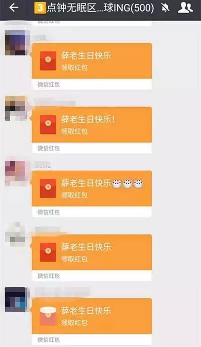
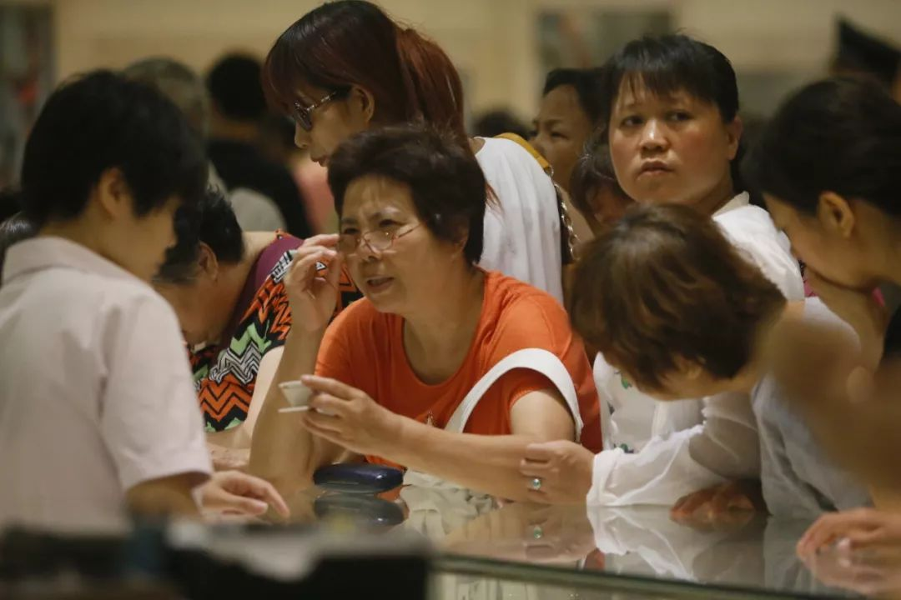

# 揭秘区块链大佬群：凌晨三点钟准时入教

2018-02-28 周天 36氪

币圈对三点钟情有独钟，是因为数字货币交易所大多是7×24小时运行，不像股票交易所早晚都固定开收盘时间。
庄家们最初利用韭菜睡觉的时间大肆砸盘，导致多空对战也集中在后半夜进行，一觉醒来，账上动辄就少了六位数。这样的环境中，没有人敢贪睡一分钟。
文 | 周天
来源 | AI 财经社（ID:aicjnews）

寅时
凌晨三点钟，人类都在干什么？放过去，这是人类生物钟里的睡眠程度最深的一个时间段，而见过洛杉矶凌晨四点模样的传奇球星科比，也未必知道更早的一个小时是何情形。
但到了区块链时代，人类的最后一点时间空白——后半夜——终于也无法幸免了。甚至，币圈人最主要的工作，都被放在了后半夜进行。蔡文胜发朋友圈说：未来一年，睡觉都是浪费时间。
一个选择在凌晨三点钟解读区块链知识的微信群，在春节期间突然名声大噪。在这个被称为区块链第一干货群的微信群里，有红杉资本沈南鹏、360董事长周鸿祎、天使投资人蔡文胜、薛蛮子，甚至还有高晓松、佟丽娅、林允 、韩庚等明星。
跟群成员全明星阵容同样令人惊叹的，是三点钟无眠群出手阔绰，据中国企业家，仅过年放假的这七天，发放的红包总额估计就达100万元以上。
最为密集的一次是2月18日——薛蛮子的生日。当天晚上薛蛮子做完分享后，一阵红包雨持续了近20分钟。

传说中为薛蛮子庆生而下的巨额红包雨。图片来源于网络
发放红包的区区一百万，在大佬们眼中，显然远远无法和欢度春节所浪费掉的生命相提并论。快的打车创始人陈伟星更为激进，他自称从找到区块链那一刻，酒戒了，女朋友也不要了。蔡文胜补充道，“连性生活也没有了”。毕竟，币圈一日，胜过人间一年，这样的节奏，快枪手的性生活也未必容得下。
币圈对后半夜情有独钟，是因为数字货币交易所大多是7×24小时运行，不像股票交易所早晚都固定开收盘时间，一位交易所人士告诉AI财经社，庄家们最初利用韭菜睡觉的时间大肆砸盘，导致多空对战也集中在后半夜进行，一觉醒来，账上动辄就少了六位数，这样的环境中，没有人敢贪睡一分钟。
AI财经社在朋友圈里看到的一则招聘信息也明确要求，候选人必须适应币圈的工作节奏，接受7×24h的考验。
短短数日，三点钟无眠。
玄学区块链
所有这一切，都抵不上陈伟星的个人魅力。陈伟星是制霸三点钟无眠群的KOL，他在2月24日和另一话题人物——金沙江创投董事总经理朱啸虎隔空论战，将这个三点钟无眠群的热度推向高潮。
这场论战缘起于，朱啸虎在朋友圈转发一条雕爷写的关于区块链解毒汤的文章，并表示不要拉他进各种3点钟群，有些风口宁愿错过，否则晚节不保。
这种说法立即引起陈伟星的强硬反驳。陈伟星反问，股权投资的割韭菜方法比币圈高级吗？整个区块链行业的泡沫有全球股市泡沫高吗？朱啸虎则回应称，ICO这种考验人性的模式从来没有成功。
除了旁若无人地嬉笑怒骂，陈伟星靠的是过往投资币安、51信用卡等企业的成功案例，和浑厚的货币经济学功力，从而掌握着群中的话语权，从哈耶克提倡的货币去国家化，到米尔顿的货币主义，再到科斯定理，这样的经济学概念被陈伟星信手拈来。
最终，陈伟星论证，传统货币制度配置资源是失效的，而区块链和虚拟货币，才能更好地配置资源。对于陈伟星来说，有了区块链，已经不需要女朋友了。
在陈伟星看来，区块链是用来创造信用的技术，并不是创造实际财富的工具。它可以让人们选择用最佳的方式登记拆分传递价值，以便于处理客户、股东、劳动者、创造者之间的关系，更加公平且具有激励能力。
一个春节，快的打车创始人、北京化工大学的肄业者，摇身一变成了民间第一经济学家。而群中虽然附和者众多，但真正听懂的人也许不多。要不然，陈伟星也不会一再地感慨，“有必要再给大家补习一下某个经济学知识点”。
在陈伟星掌控议程设置的3点钟无眠群里，谈理想、谈信仰，谈人类社会的运行规律，会受到热烈追捧，而炒币和ICO话题则遭到了严格禁止。如果不合时宜地提出反对态度，就会被驱逐出群，因为扰了大家的清梦。
3点钟无眠区块链群的思考已经成为一种新的玄学。蔡文胜说，区块链的底层架构是数学逻辑，中层思想是哲学思考，最高层是神学信仰。国内区块链最早的倡导者之一、世纪互联数据中心的创始人元道认为，区块链已超越宗教和社会契约，成为人类文明新的信任机制、新的生产信贷模式、新经济的供给侧改革等。
这样的天马行空被另一批人嗤之以鼻孔。
郭宏才，在江湖上更知名的诨号是——宝二爷，在币圈属于早年就发迹的代表人物，他对区块链技术没有兴趣，却通过炒币摇身一变成为了土豪。只是因为在群里说了一句“我反正就是来赚钱的，空聊技术真没啥意思……区块链最大的应用就是炒币”，再一次被群主踢出了群，这是他第二次被踢出群了。被踢出来后，郭宏才心中不服，在另一个群里生闷气，“他们一直不说赚钱，都他妈的太虚了。”
宝二爷说，整个数字货币就是个流量生意，进入币圈，其实就是进入娱乐圈。宝二爷没说的是，币圈何止是成为娱乐圈，区块链正在成为一种新宗教，成为一种寄托了无数空想和野心的乌托邦。
组织
无数个三点钟社群闻风成立，都想傍上三点钟这个中心化的当红IP和一群中心化的大佬：区块链赖以生存的去中心化特性，到了这个圈里似乎并不适用，倒是集体的财富焦虑，率先实现了去中心化传播。
各种真假莫辨的三点钟社群，除了转载三点钟主群里的大佬经典言论之外，这类微信群只有一个特点——通常，会在一天之内把微信规定的500人群聊人数上限迅速占满。
对于一位关注区块链的记者，一天之内被拉入数个区块链社群是家常便饭。一个记者的加群之旅一般是这样的：先是媒体群，群员几乎相同，只有群主不同。之后几天，被拉入的群，群员性质更综合，冠名从“三点钟”到别的都有。而在群里抢到的红包金额，一般能超过一名记者过去几年在其他群的所得。群聊记录则根本看不过来，一小时不看，就有数千条群聊更新。
相信不止我一个人，过了一个“区块链春节”。花儿街日报的创始人林默说，我很怀念那些姑娘们在朋友圈发九张自拍图的时候，总比现在只有区块链好。
忽如一夜春风来，遍地都是区块链。区块链的认知升级，正在借助微信群，以裂变式的速度迅速传播，当初，代表腾讯阵营去袭扰阿里侧翼的拼多多，就是凭借微信群的传播特点，迅速起势。唯一的不同是，众多三点钟李鬼社群的核心驱动因素是人们内心的财富焦虑，而拼多多则依赖人们贪便宜的心理。
而春节这一全国性的人口流动，无疑加速了区块链概念在人群中的病毒式传播。经过一个春节的裂变，区块链进入了一场更高规格和更大规模的狂欢。
蓝港互动创始人、火星财经发起人王峰与陈伟星在三点钟的群里展开了对话。王峰认为，陈伟星在春节期间提高了区块链在互联网精英群体中的进一步关注度，感召了一大批人，但同时也加剧了一大批人的焦虑感。
进不进群，戳中了人们心中巨大不安全感：没有被拉进群的都在怀疑自己是不是地位不够核心，关系不够过硬，于是只要见到带着3点钟字样的群，不管真假就扫码进群，唯恐被“时代”抛下。有些人扮作“先知”，兜售空想，更多人如饥似渴，奔走相告：这是一个不一样的（暴富）机会。

和鬼市一样，对区块链行业的大佬们来说，凌晨三点是他们的工作时间。@视觉中国
无论三点钟群里多么回避赚钱这样的字眼，币圈回避不了的，是对金钱的疯狂追逐。
一种旨在重构生产关系，促进资源精准配置的新技术，却被所有人都视为一夜暴富的大好机会，这正是这项新技术在诞生之初产生巨大泡沫的诡异之处。
“大妈就要进场”
赵长鹏是另一个声震币圈的名字，币圈的造富效应在他身上体现得淋漓尽致，仅仅用时几个月，徒手创办交易所币安的赵长鹏，以十几亿美金的身价，位列福布斯富豪榜，并登上封面，更有业内人士讪笑，福布斯这一次太外行了，中国币圈里面足以上榜的人，何止赵长鹏一人。
财富面前，人人都有一种时不我待的精神。春节放假前一天的深夜，零壹财经主笔孙爽接到一个电话。电话另一头言辞恳切：
快加入我们的区块链公司，这个春节也别回家了；
不来也可以，那你自己创业，我投你；
或者你去加入别的区块链公司。
总之，一定要all in，而且要快！再晚就来不及了！
这大概是区块链领域的写作者所面临的共同遭遇。我也不例外，一次在中关村的采访中，和一位投资人还未聊上几句，对方就已经直接给出口头TS，并拟定了估值，在这位投资人眼中，他要做一个可以影响币价的自媒体。我几次想走，脸上写满了不耐烦，都被对方拖住，最后好不容易借机走向地铁站，对方还是跟了一路。
一次约了一家排名前十的交易所的COO采访，他在凌晨2点钟下班，回家路上拨通我的电话，沟通采访事宜，丝毫未觉得这是一种打扰。在对方的语气中，也未感受到半点疲态。

曾经拯救了黄金市场的中国大妈，正在赶来区块链战场的路上。@视觉中国
我所遭遇的另一位创业者赵五，则专程开着特斯拉来接我吃饭，他手里拿着从上一个创业项目套现的几千多万，却万分心急，他急的是如何能早点结束自己币圈外围的身份。
每天，赵五都热衷于在朋友圈给宝二爷这样的圈中核心点赞，并对他们之间的互动津津乐道，而他甚至以高于北京国贸地段的房租，租下一处远离其潘家园住所的望京普通写字楼，只为和某个大佬的办公室门对门，赵五心里清楚，大佬门庭若市，如果能蹭到流量，也就能分到一杯羹。
选择不回湖北老家过年的赵五，此刻，正在马不停蹄地一边监督外包团队开发APP，一边监督施工队装修办公室。
春节、睡眠乃至性生活，早已被这群逐梦者抛之脑后，他们眼里有的，除了经济学+哲学+密码学的世界观，还有一茬茬的草本植物——韭菜。赵五悄悄跟我说，没时间解释了，经过春节的扩散效应，三四线城市的大妈们就要进场了。

推荐阅读
