# 比特币何时再大涨？什么样的项目适合「区块链+」  

##  区块链行业报告
报告开始前，先聊三个小问题：在这样一个全球掘金、人民网都要开通区块链频道的今天，我们中国人在干嘛？比特币价格下一次大涨会在什么时候？到底什么样的项目适合进行“区块链+”？
文 | 孔德云
### 中国人在干嘛？
首先，目前我国区块链项目只占到了全球的4.6%，相比之下，美国占了36%。由于大环境因素，通过ICO的形式，真正找到落地场景、为Token构建出有活力的流通生态，进而重塑生产关系、解放生产力的全球化组织（企业已被打散，组织一次更适用）大概率不会产生于中国。虽然在此方面，我们与美国不一样、一样、样……但国人的务实精神在此处发挥的淋漓尽致——都在挖矿，都在闷头发大财。你能想象我国掌握了全球75%的算力么？全球排名前五的矿池：蚂蚁矿池、 莱比特矿池 、BTC.com、鱼池、ViaBTC都是中国矿池。世界上首台挖矿专用芯片—ASIC芯片也是我国企业阿瓦隆研发、生产的。另外，我国的节点数也占到了全球第三。在这次全球掘金的大事件中，中国人正在以自己的方式竭力参与。
### 那下一次比特币价格大涨会在什么时候呢？
从比特币历史价格走势来看，能够发现在2013年年末以及2017年年末，比特币与美元汇率都处于井喷式增长阶段，而2013年和2017年又都恰巧是随块产生的比特币减半的关键节点。据此，我们不负责任地预测，随块产生的比特币第三次减少即2021年时，比特币价值很有可能迎来第三次大幅上涨。
### 到底什么样的项目适合进行“区块链+”？
抛开数字货币不谈，区块链行业未来的发展一定是与场景紧密结合的，更多的企业将会参与到Token（通证）经济中。基于Token对生产关系的变革，股份制公司将被替代，每一个实际参与者都会成为生产资本的拥有者，是对生产力的一次极大解放。目前，Token经济中最重要的就是要做好生态建设，使得Token能够很好地流通起来。虽然“区块链+”热情高涨，但真正适用的场景我们认为至少要符合三点：场景中需要一个账本存在（不局限于记录价值）；有真实性诉求；需要形成大规模共识。物联网、分享经济、跨境支付、去中心化投票都是适用场景，每个领域都将产生去中心化的巨头组织。
虽然去中心化组织信任度更高，但中心化组织效率更高，二者有各自的适用场景，适当情况下，也可混合搭配使用。一刀切的为上链而上链将会造成极大的资源浪费，上链需谨慎。
以下为报告简版内容，全版内容请点击阅读原文。
### 区块链是对过往技术的重新组合，是现阶段信息科技创新的高潮
区块链是分布式账本的一种，它既具备了多节点完全冗余的分布式数据库即“去中心化”的特点，又具备了“环环相扣”即“最长链共识”的特色，最终解决的是价值传输的问题2008年，中本聪第一次提出了区块链的概念，其在密码学、分布式存储等技术的基础上，即将创造第五次信息科技创新的高潮。

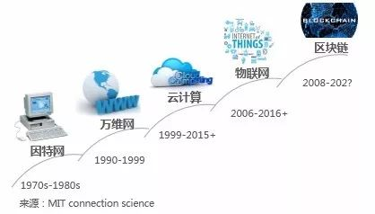

### 基于POW共识的典型交易流程解析
以比特币为代表的数字货币是目前基于区块链技术最成功的应用，区块链技术也得益于比特币得到了更深层次的拓展。以Alice向Bob发送比特币为例，基于POW共识的典型交易流程大致如下：
**第一步**：Alice向区块链网络广播交易请求；
**第二步**：矿工通过查看Alice的账户余额等易进行真实性验证，并将这笔交易同其他未确认交易一同打包，形成一个区块，进行集体确认；

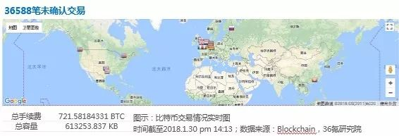

**第三步**：矿工利用大量算力，通过解公式：hN=Hash（A ‖ hN-1 ‖ Nonce）找到所要的哈希值hN。					其中，hN-1为父哈希值即上一次最新产生的区块（以下简称「次最新」区块）的哈希值，hN为本次区块的哈希值。
每一个最新区块之所以能链接到「次最新」区块而非其他区块，主要原因就是每一个「次最新」区块的哈希值也就是父哈希hN-1都是求得最新区块哈希值的hN的必要已知条件，这就是“最长链共识”。对于矿工来说，当最新的哈希值被其他矿工播报并确认后，就没有必要再纠结于此区块，而是尽快以此区块产生的最新哈希值hN作为已知条件，求取下一个区块哈希值hN+1。

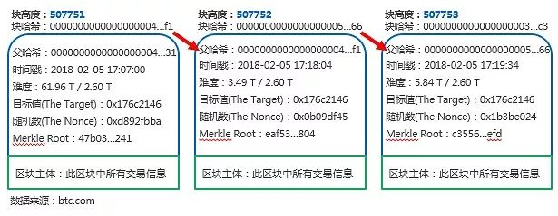

从全网比特币区块挖掘难度和算力变更趋势来看，两者呈正相关关系。矿机芯片也逐步由CPU/GPU，更迭到如今挖矿专用的ASIC芯片。全网算力伴随挖矿难度的提升而不断提升的过程中，虽会造成算力资源的“浪费”，但算力整理也构成了基于POW共识交易网络的安全屏障。

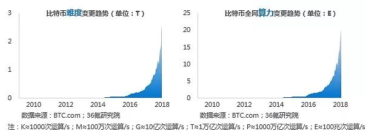

通常情况下，算力越大的矿池最先得到可用哈希值的概率也越大。在「强者通吃」机制下，各大矿池算力争夺激烈、竞争白热化。作为一个重资产的环节，挖矿领域已不再为新进入者提供更多发展空间。目前，更多的选择是通过购买云算力来参与到挖矿环节中。

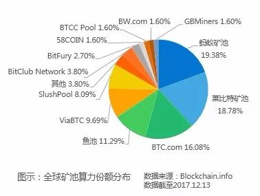

当前，全球排名前五的矿池：蚂蚁矿池、 莱比特矿池 、BTC.com、鱼池、ViaBTC都是中国矿池，中国矿池已占据全网75%以上的算力。
**第四步**：基于POW（Proof of Work）即工作量证明共识机制，其他矿工对第一个计算出可用哈希值的矿工工作量进行确认。工作量证明是所有需要挖矿的币种通用的共识机制，其要求出示一定的证明来表明工作量，对于由小概率事件累计的工作来说，出示结果就等同于证明了工作量。以比特币网络为例，当一个矿工找到合适的哈希值时，其他所有矿工就默认其付出了算力成本。同一时间，其他节点会对账本进行同步。此步骤的动力来自于新的区块在某一节点产生之后，其他节点同步越快，就能越快地开展下一个区块的挖掘。截至2018.1.30，全球比特币网络节点已达11783个，中国828个，占比7.03%，处全球第三。（注：2016年时，未排进前十）

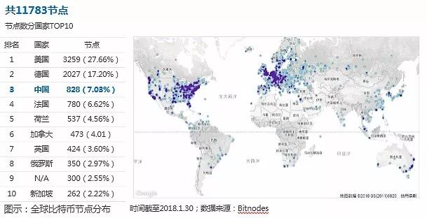

**第五步**：当其他多个节点确认该区块时，最先找到该区块可用哈希值的矿工将得到比特币奖励。通常情况下，我们认为经过6个节点的确认即可验证比特币交易的真实性。该奖励主要包括两部分：随区块产生的比特币+该区块包含交易的所有手续费。
随区块产生的比特币以每四年减半的机制增加：2009年第一个创始块出现时，随块产生了50个比特币；2013年每个区块产生25个比特币；2017年阶段也就是当前，每个区块只产生12.5个比特币；依此类推，到2140年时，随区块产生的比特币将降为0个，总量达到约2100万个，不再增加。

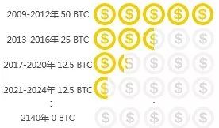

从比特币历史价格来看，能够发现在2013年年末以及2017年年末，比特币与美元汇率都处于井喷式增长阶段，而2013年和2017年又都恰巧是随块产生的比特币减半的关键节点。据此，我们预测，随块产生的比特币第三次减少即2021年时，比特币价值很有可能迎来第三次大幅上涨。

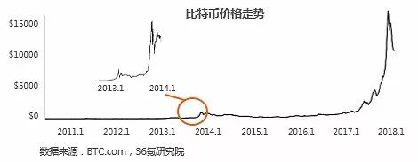

除随区块产生的比特币外，矿工还会额外得到该区块所包含交易的所有手续费。由于比特币区块大小被限制1M以内，因此打包过程中通常按照手续费高低对交易进行排序，以确保能在有限的区块容量内尽可能包含多的手续费，故支付手续费更高的交易能得到更快速的确认。在交易拥堵时，为使交易被尽快确认，手续费曾高达到0.007BTC/KB*。

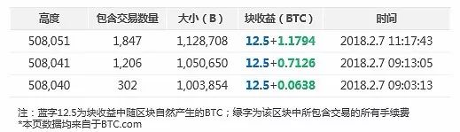

**第六步**，Alice的交易随「同区块」的其他交易一起被连接到区块链上；
**第七步**，Bob收到两个比特币。其中，在第七步中涉及到了区块链交易过程中一个很重要的密码学技术——不对称加密技术。
经过以上七个步骤，即完成了一次基于POW共识机制的价值传输过程。 
### 区块链行业发展三部曲 
回归区块链本身，我们认为区块链的发展可以划分为三个阶段：点对点交易、智能合约和泛区块链应用生态（Token经济）。点对点交易即以矿机算力为依托的去中心化的数字货币（BTC、LTC等）交易；智能合约则基于区块链可追溯、不可篡改的特性，形成了信任基础，使得合约实现自动化、智能化成为可能，其相当于20世纪90年代在因特网上萌生出的万维网、相当于2007年Google开发的开放源码的操作系统Android，都作为基础设施衍生出了多样的应用场景；泛区块链应用生态属于区块链3.0阶段，在这一时期，衍生出了Token（通证），如果区块链是一个价值传输系统，那Token则是区块链网络上的价值载体，区块链对现今商业体系实现颠覆性的最佳方式即通过发行Token并保证其流通性的形式实现各行各业的覆盖。

区块链1.0：回报率为王 
在区块链1.0时代，数字货币的买入卖出是人们参与区块链最主要的形式，该阶段鲜有人关注数字货币的应用价值，更多地关注点在于数字货币的回报率。2017年，比特币投资回报率达181%，全品类数字货币合计回报率更是高达448%，远超房地产、黄金和股票投资。

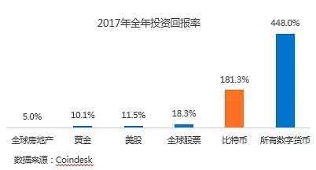

从比特币财富榜可以看出，与现实财富世界类似，比特币同样符合二八定律甚至更两极化：0.6%的钱包地址拥有87.26%的比特币。

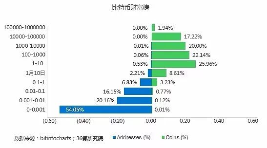

### 区块链2.0：智能合约为上层应用开发提供基础设施支持
在区块链2.0时代，区块链依据可追溯、不可篡改等特性形成了信任基础，为智能合约提供了可信任的执行环境，使得合约实现自动化、智能化成为可能。以太坊则是在区块链上实现智能合约的一种技术手段，支持图灵完备的脚本语言，为开发者在其设置的「操作系统」之上开发任意应用提供了必要的基础设施。

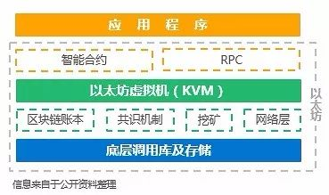

智能合约与传统合约最大的不同之处在于其不受现实社会法律的制约，针对于合约主体在触发合约条款后自动执行协议，而仲裁平台在智能合约中不再对执行结果进行判定而是承担执行之责。在智能合约里，第一步是构建数字身份。数字身份是我们与社会发生泛商业关系时产生的一切数据对我们个人身份的数字化重塑。其作为数字资产与现实身份的映射证明也有着强烈的创投需求。全球范围内，数字身份正在加速落地。
### 区块链3.0：Token经济对商业的颠覆在于其对生产关系的变革
区块链2.0对数字身份、智能合约等基础设施进行了构建，在此基础上，隐藏了底层技术的复杂性，应用开发者可以更多地专注在应用逻辑及商业逻辑层面。也就是进入了区块链3.0时代，标志就是出现了Token。 Token是区块链网络上的价值传输载体，也可以理解为通证或代币。与传统股份制公司不同之处在于，股份制公司以利润为一切衡量基准，而Token则以流通效率为衡量基准，更深一层则是以影响力为衡量基准，影响力越大，则Token的适用生态越强大，进而保证了良好的流通效率。
Token对人类社会最大的作用在于其对生产关系的变革，股份制公司将被替代，每一个实际参与者都成为了生产资本的拥有者。这种新型的生产关系激励着每一个参与者源源不断地贡献自己的生产力，是对生产力的一次极大解放。如果把这种商业活动映射到现实社会的通胀中，只要前者跑赢后者，随时间推移，每个Token的持有者都将获利。
简而言之，目前，Token最重要的是要做好生态建设，首先是要有落地场景。虽然目前“区块链+”热情高涨，但真正适用于做“区块链+”的场景还是很局限的，我们认为至少要符合三点：场景中需要一个账本存在（不局限于记录价值）；有真实性诉求；需要形成大规模共识。
从全球区块链项目数量来看，截至2018.2.2，全球区块链项目合计1286个，中国仅占4.6%，居全球第三位；从项目类型分布维度来看，全球范围和中国均以金融领域居首位、底层技术和基础设施居第二位；辅以文娱、能源、教育等细分场景。 

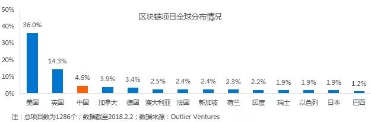

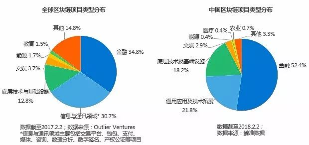

从全球区块链项目融资方式来看，主要存在两种：股权融资和ICO。整个2016年还是以股权融资为主，到2017年Q2，ICO爆发，截至2017年Q3，全球区块链项目已通过ICO募集超过20亿美金。并且有更多的ICO计划真正不断进行。

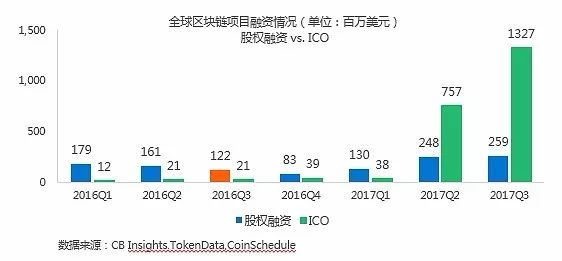

我国的区块链项目成立数量从2013年开始逐年走高，2017年受到政策监管等原因数量出现缩减，但获投数量和平均融资额数年走高；在地域分布方面，区块链项目仍是主要分布于北上广深等一线城市，值得关注的是深圳和杭州，其不但项目数量较多且节点数也处于我国前列；从融资轮次来看，整体仍处于早期，但大公司进行战略投资布局的占比也在逐年走高。

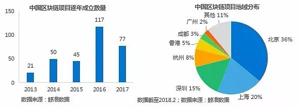

### 区块链项目应用全景图

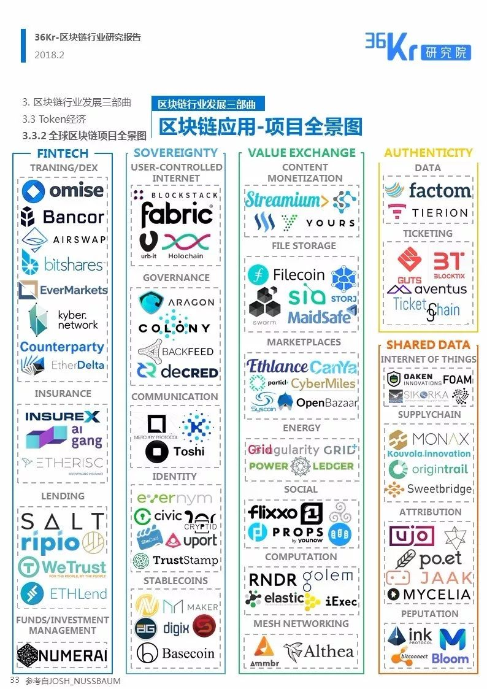

### 区块链行业未来展望
基于比特币交易仍处于快速增长阶段，而区块容量已达到峰值的现状，比特币交易网络堵塞现象将逐步加剧，2018年将是比特币交易手续费持续稳定攀升的一年，区块扩容迫在眉睫。若扩容方案持续受阻，BCH在未来将有机会获得更多的算力支持。
从比特币历史价格来看，在2013年年末以及2017年年末，比特币价格都处于井喷式增长阶段，而2013年和2017年又都恰巧是随块产生的比特币数量减半的关键节点，此现象与现实社会中的通货紧缩类似。据此，我们可以预测，随块产生的比特币第三次减少即2021年，比特币价格很有可能迎来第三次大幅上涨。 
抛开比特币，区块链行业未来的发展将与场景紧密结合，更多的企业将会参与到Token经济中。基于Token对生产关系的变革，股份制公司将被替代，每一个实际参与者都会成为生产资本的拥有者，是对生产力的一次极大解放。目前，Token经济中最重要的是要做好生态建设，使得Token能够很好地流通起来。
虽然“区块链+”热情高涨，但真正适用的场景至少要符合三点：场景中需要一个账本存在；有真实性诉求；需要形成大规模共识。物联网、分享经济、跨境支付、去中心化投票都是适用场景，每个领域都将产生去中心化的巨头组织。去中心化组织信任度更高，但中心化组织效率更高，二者有各自的适用场景，适当情况下，也可混合搭配使用。一刀切的为上链而上链将会造成极大的资源浪费。
