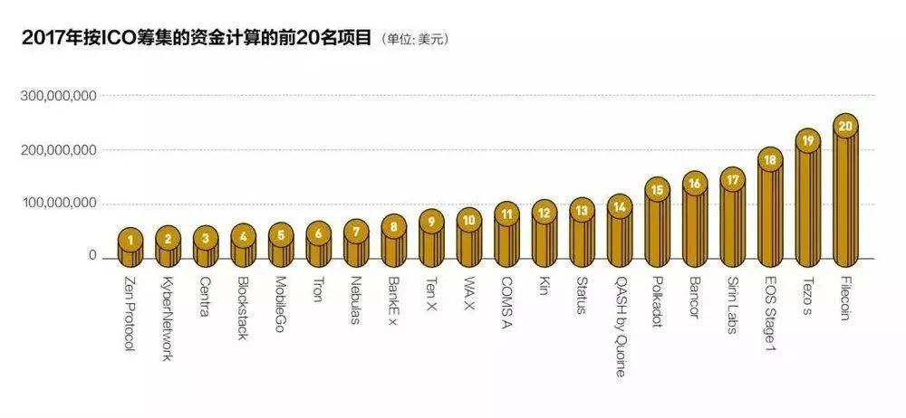

# 海上炒币记

2018-02-27 中国企业家杂志 虎嗅网
虎嗅注：2017年紧急出台的ICO监管政策让国内一部分数字货币交易平台瞬间陷入绝境，一些交易平台的创始人和高管还被限制出境，但以“币安”为代表的一部分非内地注册或创始人有海外背景的交易平台，则顺利出海，境外炒币成了他们的新机会。很多ICO项目方也通过在海外成立基金会、海外路演等形式绕开监管，以募资金。
刘志平（化名）急切地想出去，到境外去，将他的区块链项目团队也带出去。
在2017年9月4日监管风暴来临的前一天，他作为一家实名公链公司的创始人，还以创新代表的身份在跟西部地区的一位副市长探讨业务，但第二天回到北京后，就有经侦人员找上门来，他一度以为自己的牢狱之灾已经不可避免了。
9月4日，央行联合七部委发布《公告》：发行代币形式包括首次代币发行（即ICO）进行融资的活动本质上是一种未经批准非法公开融资行为，要立即停止各类代币发行融资活动，对于已完成代币发行融资的组织和个人应当做出清退等安排。
政策出台后，北京市金融局召集注册地位于北京的数字货币交易平台和已经ICO的创业公司负责人开会，胡君（化名）作为一家交易平台的CEO也参加了。在会上，金融局的一位领导指着台下一百多位参会者说：“因为ICO，因为在座的各位，区块链在中国将倒退5年。”台下，所有人都低头沉默不语。

会后，一些较大的交易平台和ICO项目的创始人及核心高管还被口头传达限制出境。若非如此，恐怕就没有现在风头正劲的币安（Binance）什么事了。币安的创始人之一赵长鹏是加拿大国籍，币安是一个区块链数字资产交易平台，其注册地为香港，团队也分布在全球各地，这使得币安得以领先火币网以及老东家OKCoin一步，率先全面转战海外，然后在短短几个月迅速坐上全球数字货币交易平台的第一把交椅。
随后，有传言称币圈“教父”李笑来已经被北京市金融局请去“喝茶”，甚至有人言之凿凿地称其已经被抓。尽管后来李笑来亲自出来辟谣，但整个圈子早已人心惶惶。
2月5日，业内疯传ARTS联合创始人蒋杰因发行“空气币”（即凭空发行的数字货币）而被抓。两天后，这位1991年出生的前ARTS联合创始人出现在众人面前，他看起来脸色发黄，没刮胡子。他说，已经几天睡不着觉，吃不下饭。之后他表示：将把全部利润拿出来弥补投资者损失，还币圈一个宁静。
2月10日，OKCoin创始人兼CEO徐明星正式辞去公司高管职位，OKCoin的海外业务及旗下OKEX交易所由海外团队全面接手，徐明星本人从此将只负责区块链技术项目OKChain的研发和应用，他以这种近乎自残的方式将自己和ICO切割开来。
“走吧！连自己的人生自由都没法保证，还做什么做？”刘志平觉得，对于已经ICO或想要ICO的区块链项目团队来说，这里已像是不祥之地。

## 币圈与链圈

2017年年底的北京，正是流感最肆虐的时候，龚晓辉（化名）将自己的老婆孩子提前送回了老家，但他自己却没法离开这座城市，已经开始咳嗽的他甚至没时间去医院。他的整个团队和设立在新加坡的基金会已经开始全力运转，以确保在2018年3月底之前能完成全部的ICO工作。“时间真的很紧。”他吸着鼻子说。
龚晓辉一边看着手机上的比特币价格走势一边摇头叹气。在经历了约两个月的下跌之后，比特币以及其他主流数字货币开始重拾升势。对龚晓辉来说，这可不是一个好消息，因为他的区块链项目正处在最后的海外ICO（首次发行代币）冲刺阶段，比特币的价格越高，意味着他发行的代币所能换回的比特币越少。
在几公里之外的东三环一处创业空间里，刘志平此时也正在筹划如何将他的区块链项目和团队带到境外去，他已经开始着手在香港注册一家新公司了，他迫切希望能在一个新的环境重头再来。
严格地说，龚晓辉和刘志平并不是一个圈子里的人，前者属于“链圈”，后者属于“币圈”，他们俩也互不认识，甚至可能从来没有在同一个场合出现过。这两个圈子里的人相互鄙视，已经是一个公开的秘密了。
所谓“币圈”，是指专注于挖矿、炒币甚至发行自己的数字货币筹资的一圈人；而专注于区块链技术的研发、应用，甚至从区块链底层协议编程开始做起的那拨人，业界俗称“链圈”。
曾有人这样比喻：币圈就像是江湖的剑宗，整日刀光剑影，跌宕起伏。链圈则像是江湖的气宗，稳扎稳打，练基本功。龚晓辉认为币圈和链圈的显著区别之一就是币圈普遍都有一个交流社群。不过现在，无论是“链圈”还是“币圈”，他们都有一个共同的目的，那就是出海，到境外去。
而在他们身后，越来越多的人开始涌入这个行业，每一天都有新的区块链创业项目出现，每一天都有新的ICO白皮书面世。在北京、深圳的一些酒店里，关于区块链的论坛或内部交流会一场接一场，有些甚至是被明文禁止的ICO路演。
有悲观者认为区块链会是下一个郁金香泡沫，乐观者却认为其将构建一个全新的数字王国，如预言家KK在《失控》一书中所写到的，人们将犹如蜂巢一样协同工作，社区将取代公司成为新的组织形式。
而在争论声中，更多的普通大众开始关注ICO，即使他们中的大多数看不懂白皮书，分辨不出“空气币”与真正代币的区别，但也奋不顾身地投入其中，这与2015年上半年A股牛市中投资人宁可投错，也怕踏空的心理如此相似。不过与A股的韭菜不同，他们被业内人士称之为“羊群”，即所谓的“一个代币一滴血，十万羊群十万军”。
“当投资收益超过50%时大家就会疯狂，当收益涨到100%的时候，就算是犯罪，很多人可能也会All in进来了。”一位业内人士说道，“不能以一个理性的视角看待一个疯了的行业。”
当中本聪2008年创造出比特币概念时，他或许想不到，由比特币以及基于区块链技术所带来的新认知让世界各地的投资者和投机客为之疯狂。
“它的疯狂在于它是技术创新和资本狂热的叠加。”华创资本合伙人唐大牛说道。2013年比特币的火热让大家开始关注其底层技术区块链，后者指去中心化的、不可篡改的分布式账本。无论是链圈还是币圈的人，他们总喜欢将当前的区块链所处阶段比作是1994年互联网刚兴起时，“它将像互联网一样改变世界。”他们总兴奋地这么跟外行人介绍。
不过这恐怕也是币圈和链圈达成的唯一共识，没人能分得清到底谁是真正的技术信徒，谁是投机者。链圈和币圈是两个世界的人，链圈的人感兴趣的是做成未来的BAT，而币圈的人则更为关心的是每天各类币种的上涨下跌。
一直以来，这两个圈子里的人都相互看不起：链圈里的人认为币圈的人太“假”，以区块链之名行圈钱之实；而币圈的人则认为链圈里的人太“傻”，只知道苦哈哈地写代码。但现在，这两个圈子里的人却出现了一丝融合的迹象。比如，龚晓辉就认为自己是纯正的链圈人，一直以自己坚持做行业和生态为傲。不过现在，他也要发行代币和建立自己的社群了，而这两件事以往都是币圈的人才做的。
转战海外

龚晓辉这次ICO的规模并不大，总共也就打算发行价值大约2000万美元的代币（tokens，虚拟账户名称，即电子化的虚拟货币）。对于ICO的前景，他很乐观。按照现在的市场热度来看，他预计2000万美元的代币一个小时就能被认购完毕。

图片来源：视觉中国
自从“9.4”新政之后，ICO在国内已是被禁止的非法集资行为，龚晓辉也明白这一点，他强调自己所有的ICO项目都是在合规的前提下进行的，负责具体操作的基金会设立在国外，将来的路演也会在国外，投资者也来自国外。为此，他还打算在代币认购阶段屏蔽掉国内的IP地址，以免国内投资者参与。
为了这次ICO，龚晓辉建立了专门的团队，撰写了白皮书，这些都花费不菲。而将来发行的代币在接入海外的各交易平台时，他付出的代价则更大。按照目前的行规，他要付给每个交易平台一定比例的代币，还要交一笔上币费。以接入眼下最火的币安为例，他除了要无偿给后者发行总额5%的代币外，还要额外付出1000万人民币的上币费。
不过，这些都是值得的。他的区块链项目和食品安全有关，计划2018年9月份上线。在此之前，他需要大量的资金来招募人员、购买设备，ICO募集来的资金能解他的燃眉之急。此外，ICO发行的代币可以承担流通支付的功能，在这个项目的生态里不可或缺。
虽然被业内公认为币圈大咖，但刘志平并不认为自己是一个单纯的币圈人。“我可是有具体区块链应用项目的。”他说。
严格来说，刘志平已经“出海”了。“9.4”之后，他发行的代币和其他很多代币一样，也接入了海外的一些交易平台，但是他的项目、团队等“肉身”还在国内。随着国内针对ICO的政策风声越来越紧，他内心深处的不安全感也越来越强烈。他希望自己的项目能够尽快彻底“出海”，自己本人则像圈内知名投资人薛蛮子一样定居国外，“连春节都在国外过算了！”
在项目之前，国内各大交易平台都已经实现了出海。在监管政策出台后，国内最大的两家数字货币交易平台火币网和OKCoin都迅速转移到国外，并都放弃中国网站，上线了国际版网站。火币网转战新加坡，并在香港设立了子公司。OKCoin也通过投资、合作的方式，拿到了多个国家的数字资产交易牌照。
不过，这波交易平台出海潮中最耀眼的明星却不是它们，而是币安。这家2017年才成立的新锐，在落地日本后迅速实现了弯道超车，目前交易量稳居全球第一。
2月1日，币安宣布不再为中国用户服务。OKCoin创始人徐明星将辞去OKCoin CEO职位，并交由海外国际团队负责，他仅负责区块链技术的研发。此消息宣布没多久，2月11日，比特币中国宣布，将旗下BTCC交易平台的股权100%转让给香港一家投资基金，并表示将业务重心转移到BTCC矿池、Mobi数字资产钱包和美元现货交易平台。
这意味着这些交易平台已经完全割裂了同国内的脐带，彻底成为了“海外”的交易平台。
ICO项目方也通过在海外成立基金会的形式进行募资，以绕开监管。此外，海外路演等活动也开始增多。
1月15日，比特币导航信息网站BTC123在日本公海举办了Block Hot For the Future海上区块链峰会。据公开信息，共有2000多人参与，进行了5天百场海内外项目的路演。“轮船路演我们是第一个做的。”BTC123董事长尚小朋介绍称，为了这次活动，旗下的会务组准备了差不多近2个月的时间，主要参与者有政府官员、投行、企业家、项目方、矿池、矿机生产商等，主要是为了让参与方更好的交流。
在5天的轮船航行里，峰会气氛空前高涨，但举办方明确要求话题避开ICO，而主要讨论区块链技术落地的问题，还有一些海外公司介绍自己公司的业务模式等。

不过尚小朋同时也表示，“9.4”政策后更多的区块链项目偏向从海外发起，路演的数量没有减少，但大都去了国外，有不少选择去离中国本土不远的日本公海路演。
据了解，海外公司在中国路演没有受到有关部门的干涉，因此很多公司选择曲线救国，先注册一个海外公司，再去中国路演。
“目前区块链技术的热度、参与人员还是以中国居多，所以把路演集中放在中国是最好的选择。虽然新加坡、瑞士承认比特币的合法地位，但是去瑞士的话本身投资人不多，去那边路演的很少。在中国举办300人、500人会议是很简单的事情，受众群体、宣传力度还是不一样的。”尚小朋表示。
当然，这些在国内的路演都是在私底下进行的，投资者的认购也是“遮遮掩掩”。在普通投资者的层面，虽然目前也可以通过场外交易获得比特币、以太币等主流数字货币，然后进入交易平台购买代币进行交易，但毕竟不能像以前那样肆无忌惮了。总体而言，在国内，监管之前ICO代币发行和交易的疯狂已经不再了。
坐庄者的疯狂

2017年7月份的某个周六深夜，投资者刘明（化名）正要睡去，一阵急促的电话铃响，电话那头是刘明很早认识的一位庄家朋友，此前擅长于炒期货，2017年开始转战币圈。那位庄家朋友提醒他，明天有一只币会涨。刘明很快明白，这位朋友很有可能要拉升这只代币。挂掉电话后，刘明迅速和他的基金合伙人商量买入了这只代币。
之后，刘明一晚上没睡，一直盯着这只币的走势图。到第二天早上7点多钟，走势图呈直线上升，刘明知道，庄家的诱盘已经奏效了，信奉着买涨不买跌的投资人杀了进来，将币价又迅速推高了几倍。刘明看准时机，在高点卖出了所持有的这只代币，一晚上获得了近7倍的收益。
从2017年年初开始，投资者们加速涌入数字货币这个声色场。加密货币市值从年初时177亿美元增长至5728亿美元，翻了32倍。逐利者闻到了金钱的味道，并且发现了一个比炒币更赚钱的方式，那就是参与山寨币的ICO。
“以前资金团的人都在二级市场炒币，后来发现ICO更简单、更暴力，买几个以太币、比特币直接参投某个项目，换来代币，代币一上去，能够拉五倍甚至十倍，而比特币在整个2017年也只涨了十倍，但是有些币涨了上百倍。”链向财经和ICO365的创始人李雄解释称，“投资比特币就像开捷达，投资山寨币就像开跑车、飞机，后者更快、更刺激。”
通常来说，一级市场的投资分为几个阶段，天使、私募、Pre-ICO、ICO。项目从投资者手中募集以太币、比特币等主流币，并按照代币和主流币的一定比例，将项目代币发放给参与的投资人。山寨币的ICO类似于A股的打新股，无论项目好坏，一旦项目上到了交易所，其二级市场总会相对于一级市场给予一定溢价，但与A股不同的是，在币圈没有涨跌幅限制，一夜之间翻倍的事情时有发生。
此外，在给ICO项目进行定价时，其估值并不取决于项目本身，而是参考其他项目的估值。“大家现在所有的都是同一个模板，无论公司好坏估值也没有太大差异化，创始人以前公司做什么，团队是否优秀，行业是否靠谱这些都没有，就完全变成一个产业化运作了。”刘明说。
炒客网COO王小龙也曾在去年9月份之前参与过两个项目的私募投资。“当时市场已经失去了理智，大家都不知道这个东西是什么，直接就把钱投进去。”王小龙回忆道。他在2017年8月参与了一个音乐项目ICO的投资，但那个项目的代币只能在交易所交易，并没有基于以太坊等公链进行开发，无法转出到钱包，后来王小龙才意识到自己投资了一个“空气币”。
尚小朋也曾碰见过一个类似的项目，项目发起人直接跟他说没有必要使用钱包，理由是使用钱包还有可能把币弄丢了。在尚小朋看来，这类项目绝大多数都是传销项目。去年9月之前市场上充斥着这样的空气币和营销币，甚至有些项目白皮书也是完全复制其他项目，只是改了个名字。
龚晓辉混迹链圈多年，他告诉本刊记者，全球真正能做区块链开发的技术人才也就几万人，在中国绝对不超过3000人，这其中还包括很多经培训跨界而来的非专业人才。他认为，目前国内真正的区块链项目不超过100个。“95%以上的项目都是假的。”他说。
有投资人表示，目前市场上95%的代币确实都是空气币，而之所以这些代币不破发，与背后庄家的助推有关。作为行业内从业人士，刘明跟记者透露，现在活跃于行业中的资深庄家很多都来自于原来炒黄金、股票、期货的人，只是换了个投资市场，操作手法都一样。
“因为中国币圈个人玩家是主流，有些币白天可能会跌，晚上庄家则悄悄的把币价拉起来，第二天个人投资者看到币涨了，又会去买，这跟在A股买涨不买跌的方式是一样的。”刘明解释称。
另外一个更巧妙的做法是联合ICO项目发行人一起炒作，主要目的是提高交易活跃度，维持币价不破发。曾负责帮10家项目进行ICO做市的知情人士表示，在币圈做市比A股更为容易。通常来说，即将登陆交易所的项目方找到帮忙做市的机构，并拨给一定的代币交由做市方帮忙护盘，避免破发。
上述知情人士介绍，项目方先定好目标价，然后做市方配合释放利好、整体环境以及资金进行操作。“币圈的深度相较A股市场是比较低的，如果说当时的成交量是100万，单个币价如果是10块钱，那就是1000万资金，就等于每秒钟要打1000万去拉，后面的资金就可以量化了，此外配合释放一些利好消息可以增加拉的程度。”
“在ICO市场没有技术，没有K线图，人人都可以坐庄，只要有大量资金。而且它不受监管，如果在A股市场庄家和上市公司大股东联合做市是违法的，但是在这个市场没有监管。”上述知情人士透露。	
一个没有监管的市场，疯狂是必然的结果，毁灭也是。

### 结束和开始

“你们胆子也太大了。”一位深圳金融办副主任这样跟李雄说。2017年“9.4”政策清退时期，深圳金融办副主任去李雄之前创办的ICO365调研。ICO365创立于2015年，是数字货币的融资服务平台，也是国内当时最早进行币币交易的平台。
金融办副主任之所以如此说，是担忧ICO项目自身的风险。如果帮助ICO项目筹集了币最后不打给平台，或者跑路了，那么平台将承担巨大风险。
实际上，李雄对于2017年以来ICO热潮也感到了一丝隐隐的担忧。“刚创办ICO365的时候，做区块链的还是一帮极客，市场的行为进来以后就变了，泡沫、投机、骗子横行。很多项目一上来就谈几个亿的梦想，冲上来就要钱。”李雄说道。
去年6月ICO融资达到了顶峰，仅ICO365在7月份接的项目就达到了21个。当时这些项目虽然没有出现问题，拿到代币的投资者可以去二级市场进行交易，但是李雄判断，这种疯狂的玩法持续不了多久。“太疯狂了，迟早会出事的，我们得赶紧撤。”
随后，比特币中国、OKCoin等交易所陆续叫停了法币和人民币之间的兑换业务。李雄所在的ICO365在发出通知的当天关闭了交易平台的运营，而由该平台孵化的另外一个项目sosobtc原本的交易行情功能也被关闭。
政策出台后，王小龙选择了退币，他参与了两个项目ICO，总共投资了9000元，当时按照现时交易进行清退，返还回来的资金仅1000元不到。
这个政策出台也让当时刚完成ICO募资的刘志平遭遇了人生中最大的一次危机。面对代币投资者的退币要求，他感到头皮一阵发麻。在和投资者谈判赔偿的过程中，有个别冲动的投资者威胁要绑架他的孩子，还有投资人直接冲到刘志平的办公室疯狂砸东西，要求按照原价赔偿。
“他们天天骂、日夜骂，其他团队还有人被打，我们都绝望了”，之前的ICO募资，刘志平募集了1600个比特币，政策出台后，其中一部分投资人要求按照购买时的人民币价格进行偿还而非原路退回募集的比特币，而那时币价由于政策的出台遭遇雪崩，项目里的1600个比特币都还回去了。“窟窿还填不上，我自己又掏腰包补了点。”
为了补偿中间的差价，刘志平拿出了自己钱包中的160个比特币才把缺口补上。
这次的风波让刘志平身心俱疲，也是他一心想出海的主要动因。“我当时都要跟夫人离婚了，什么都要卖掉。之前几万几万的挣钱，很辛苦，现在要上亿上亿的赔。我除了卖房子还能怎么办？”虽然损失很大，但事后刘志平想来也不心疼。“我保住了我的人身自由，我最在乎的是这个。”
对于这次“一刀切”式的监管治理，他至今耿耿于怀。这之后，他也将公司的发展方向往技术服务提供商方面转移。
刘志平以为一切在国内都结束了，但没想到这却是另一种开始：ICO发行没有绝迹，只是转移到了国外；代币交易没有停止，只是转移到了地下。而在此期间，区块链在中国持续升温。
1月中旬，真格基金创始人徐小平内部分享的一份关于区块链的言论迅速在朋友圈发酵，财富刺激所带来的兴奋感战胜了对于监管等未知风险的恐惧，即使现阶段区块链技术仍不成熟，“9.4”以来监管政策越来越严，ICO破发的项目越来越多。
华商基业商级合伙人霍然是美国人工智能与运筹学博士，他一年的时间一半在美国，一半在中国。他发现，虽然区块链在两国的发展都很火热，甚至中国还略微胜出，但两者的气质却不太一样，中国的从业者和投资者们明显要更功利一些。
在春节前的一个区块链内部论坛上，他准备了一个100多页的PPT，想给台下的参会者好好讲讲区块链的意义和逻辑。在翻到如何进行数字货币投资那页时，他想节约时间略过去不讲，但台下的听众不干了。在嘈杂声中，有人大声喊道：“我们就想知道这个！”这让他在台上尴尬不已。

### 曲终人未散

眼下，国内的区块链创业者们依然可以绕道海外发行代币，机构投资者和普通投资者依然可以曲线投资代币。一切都表明，ICO曲终人未散。
2月5日，有消息称监管叫停ICO后，很多境内人士转向境外平台网站继续参与虚拟货币交易，考虑到境内投资者转向境外平台参与交易面临种种风险，下一步央行将对虚拟货币境外交易平台网站采取监管措施。
“‘9.4’之前我们是从门缝里来看这个房间里的人，后来政策出台之后，房间的灯灭了，什么都看不着了。”一位接近币圈的投资人私下表示。田军也指出，和外界的想象不一样，此前国内的交易平台对于平台上的数字货币交易还是有一些规范措施的，比如每天都会向金融局上报当天的交易数据，用户在取现时会有一些严格的条件以及其他风控措施。“但现在，黑灯瞎火的，真的是什么规矩都没了。”他说。
在采访中，一位已经在海外成功进行ICO的区块链项目创始人表示不方便谈论更多。当被问及媒体的相关报道是否会影响到这些数字货币的行情时，他反而笑了。“你想得太多了！”他说，“无论你们说它好还是说它坏，都不重要。”他认为，媒体的报道，哪怕是负面报道，都会让更多的人关注ICO和代币，而只要接触到它，就不可能抗拒它的诱惑。“因为这是人性！”他说。
“9.4”之后，尚小鹏发现参加项目路演的投资者群体也发生了变化。“之前中国99%都是小散户投资，现在只有80%是小散，还有20%是机构，这种变化在2018年还在持续。这些机构一方面是基金，另一方面是各地的圈内联盟。”
另一个有意思的现象是，2017年11月到12月，比特币价格暴涨，大家开始抱团投资，出现了很多代投机构，区块链的产业联盟，以及很多区块链的投资基金，未来可能各个项目的发展会以机构投资为主，散户会逐渐减少。
在币圈内，经常会听到2018年比特币会反弹到10万美元的声音，而对于未来，尚小鹏也是乐观的，他认为2018年会有更多人参与进来。
刚刚过去的狗年春节，在“1万亿市值社群”的500人群里聚集了一帮风险投资大佬和科技圈人士，如真格基金创始人徐小平、天使投资人薛蛮子、百合网创始人慕岩、隆领资本创始人蔡文胜等，也有一些怀揣着好奇心的演艺界人士——汪峰、高晓松、于正、佟丽娅、秦岚、胡可、胡海泉、韩庚等。
从大年初二（2月17日）以来，他们每天在群里热火朝天地讨论区块链、比特币和ICO的未来，乐此不疲。而国内的科技巨头BAT，小米、华为、网易等在这个领域都早已布局。
尽管摩根大通首席执行官杰米·戴蒙的警告还在耳旁：比特币喧嚣之势堪比当年的“郁金香泡沫”。比特币截至1月24日跌破1万美元，甚至人民日报一周内两次发文为炒币降温，但投资者对此仍趋之若鹜。
刚刚经历过一场生死劫的刘志平则对此一笑而过，“你看币安现在风头一时无两，但这才几个月，暂时的风光算啥。君不见几年前的比特币中国和火币网多牛逼，现在还不是（一场浮云）。”